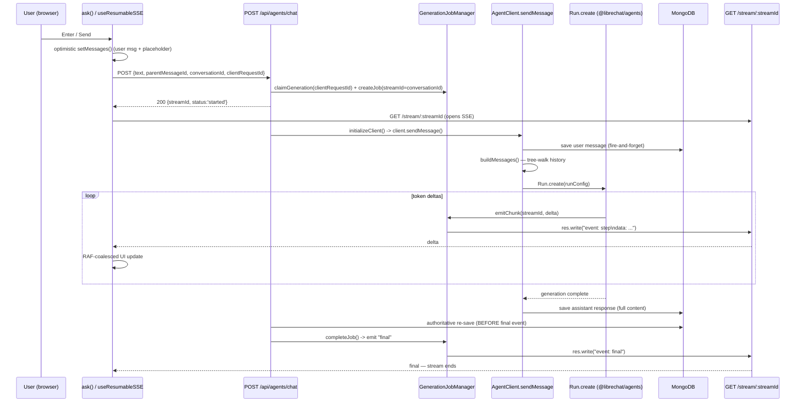
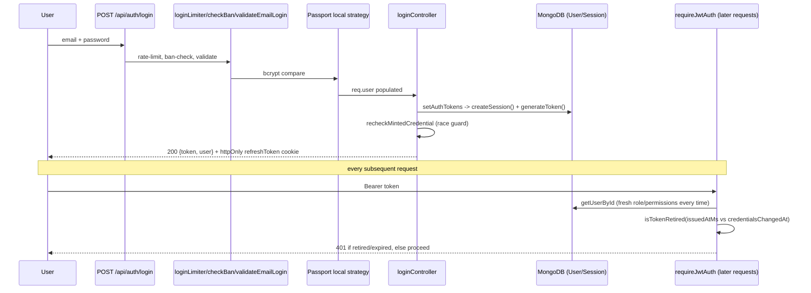
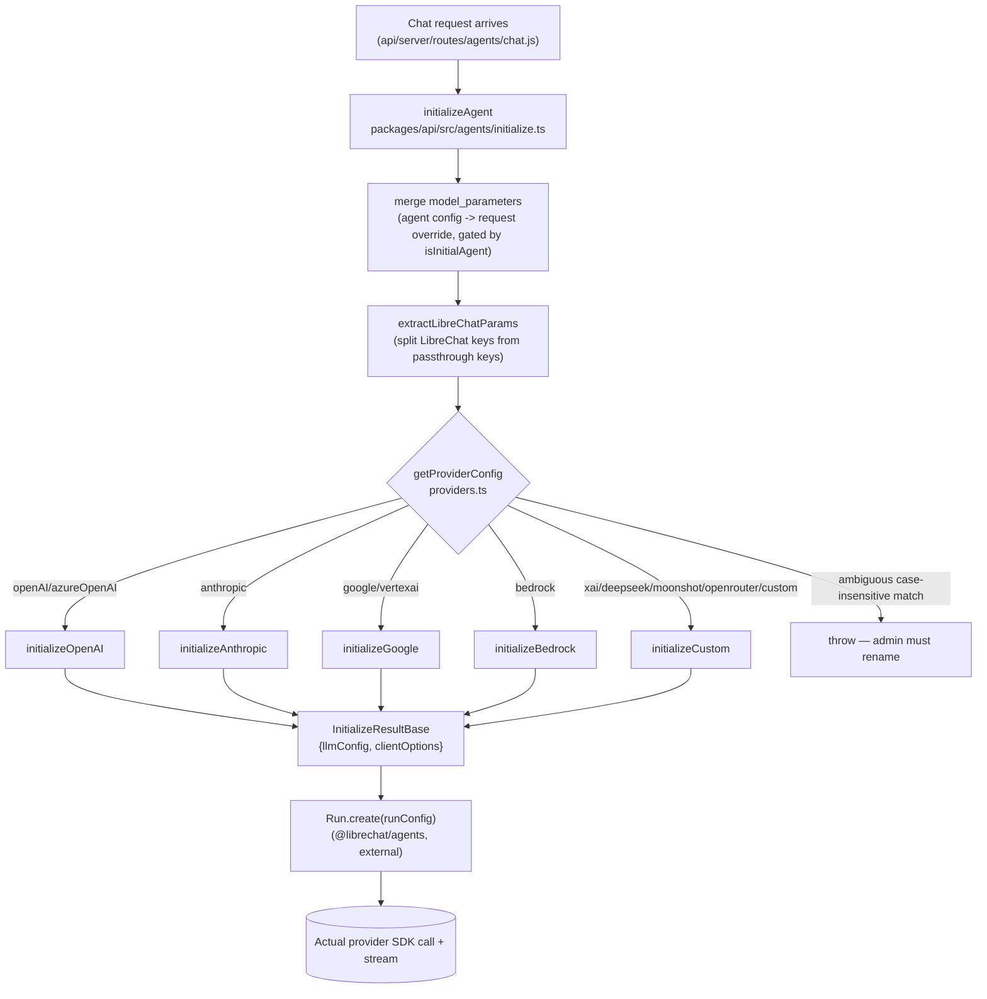
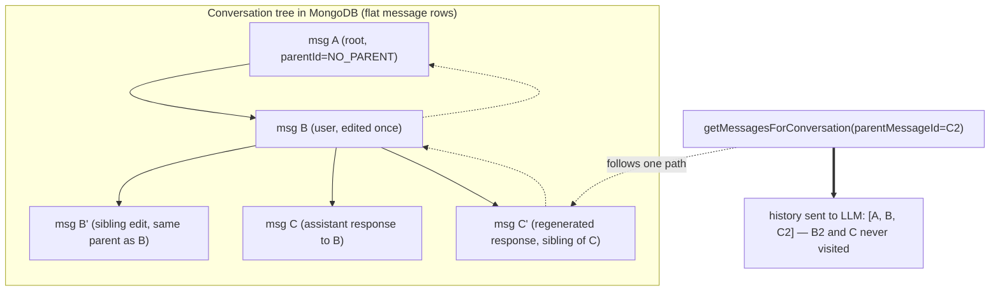
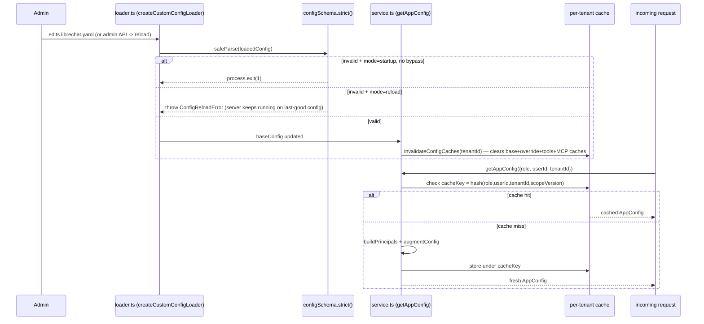
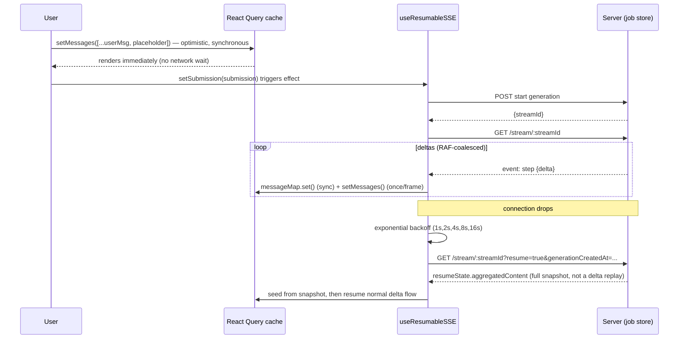

# CRITICAL_FLOWS.md

> A deep-dive companion to `PROJECT_MAP.md`. Where that document tells you *what exists*, this one tells you *how it actually runs* — six flows, traced through real code, with the reasoning behind the non-obvious decisions and the places people get bitten.
>
> Same caveat as `PROJECT_MAP.md`: this is the **Eleven-Chat fork**, not upstream LibreChat. The single biggest thing to internalize before reading further — **generation is decoupled from the HTTP connection**. Starting a chat response (`POST`) and watching it stream (`GET` SSE) are two separate requests against a durable server-side job (`GenerationJobManager`). The browser can disconnect, reconnect, or even close entirely, and the LLM call keeps running server-side. This single architectural choice explains half the "why" in Flow 1 and Flow 6 below. Upstream LibreChat's classic "one POST holds the SSE stream open" model still exists in this codebase, but only for the legacy Assistants API endpoint — not the path you'll touch 95% of the time.

---

## Flow 1: Message Lifecycle (Most Important)

### Why this flow is shaped the way it is

Classic chat apps hold the HTTP connection open for the duration of generation: if the tab closes, the response dies with it. This fork explicitly rejected that tradeoff — a generation is a durable server-side **job** (`GenerationJobManager`), and the SSE connection is just *one possible subscriber* to that job's event stream. That buys you: survive a network blip, survive a tab close, allow multiple tabs to watch the same generation, and let the Stop button and reconnect-resume share one mechanism (both are "attach/detach from a job"). The cost is complexity — you now have an explicit job lifecycle (`claimGeneration` → `createJob` → `subscribe`/`emitChunk` → `completeJob`/`abortJob`) instead of "the request handler returns when it's done."

### Step-by-step walkthrough

**1. Frontend submit.** Enter key or Send click both funnel into the same path:

```js
// client/src/hooks/Input/useTextarea.ts:296-297
submitButtonRef.current?.click();
```

The composer is a real `<form>`; submitting it runs `submitComposerText` → `submitFromComposer` (`client/src/components/Chat/Input/submit.ts:16-31`), a small router that sends plain text to `submitMessage` (`client/src/hooks/Messages/useSubmitMessage.ts`), which forwards straight into **`ask()`** — the actual workhorse, `client/src/hooks/Chat/useChatFunctions.ts:345-915`. Inside `ask()`:

- Builds the optimistic user message (`currentMsg`) with a **client-generated UUID** as `messageId` — this is what lets the UI render the sent message before the server has ever seen it.
- Resolves `parentMessageId` via `getAppendParentMessageId()` — defaults to the current leaf of whichever branch is on screen (see Flow 4 for what "branch" means here).
- Builds an assistant placeholder (`initialResponse`, id = `${userMessageId}_` — the trailing underscore is a deliberate "not a real server id yet" marker).
- Packages everything into a `TSubmission`:

```js
// useChatFunctions.ts:844-877 (abridged)
const submission: TSubmission = {
  conversation: { ...conversation, conversationId },
  endpointOption,              // { endpoint, endpointType, agent_id/model, ... }
  userMessage: { ...currentMsg, responseMessageId, overrideParentMessageId },
  messages: submissionMessages,
  initialResponse,
  clientRequestId,              // idempotency key — survives retries
  ...
};
```

- Renders optimistically, *then* kicks off the network: `setMessages([...submissionMessages, currentMsg, initialResponse]); setSubmission(submission);` — other hooks react to the `submission` atom changing; nothing network-related happens before the UI already shows the sent message.

**2. The actual network call(s).** `packages/data-provider/src/createPayload.ts` builds the wire payload (`text`, `messageId`, `parentMessageId`, `conversationId`, `endpoint`, `agent_id`/`model`, plus `clientRequestId`, `isRegenerate`, `editedContent`, etc.) against `EndpointURLs[agents] = ${apiBaseUrl()}/api/agents/chat`.

Whether this is "one POST that *is* the stream" or "POST then separate GET stream" depends on the endpoint (`client/src/hooks/SSE/useAdaptiveSSE.ts:19-41`):
- **Assistants endpoint (legacy)**: one `sse.js`-backed connection — the POST *is* the stream (`useSSE.ts`).
- **Agents endpoint (the path you'll actually work on)**: two calls —
  1. `POST /api/agents/chat/:endpoint` — plain `fetch`, returns `{ streamId, conversationId, status: 'started' }` almost immediately.
  2. `GET /api/agents/chat/stream/:streamId` — this is the real SSE connection, opened once `streamId` comes back.

This separation is explicit in the code's own doc comment: *"Navigation away does NOT abort the generation"* (`useResumableSSE.ts:884-892`).

**3. Backend: route → controller → client construction.**

```js
// api/server/routes/agents/chat.js:81-118
const controller = async (req, res, next) => {
  await AgentController(req, res, next, initializeClient, addTitle);
};
router.post('/', controller);
router.post('/:endpoint', controller);   // ephemeral agents
```

`AgentController` is an import alias — the real export is `ResumableAgentController` (`api/server/controllers/agents/request.js`, ~3700 lines). Its job:
1. Idempotency — claims `clientRequestId` via `GenerationJobManager.claimGeneration` so a retried POST (e.g. from the frontend's own network-retry loop, Flow 6 §5) attaches to the *same* job instead of starting (and billing) a second generation.
2. Creates the durable job: `GenerationJobManager.createJob(streamId, userId, conversationId, {...})` — **`streamId === conversationId`**.
3. Responds to the POST immediately with `{streamId, conversationId, status:'started'}` — this is what the frontend's `transport.start()` is waiting on.
4. **Only after responding** does it call `initializeClient(...)` (`api/server/services/Endpoints/agents/initialize.js`), passing `signal: job.abortController.signal` — this is the thread that ties the Stop button all the way down to the LLM SDK call.
5. `initializeClient` resolves the agent graph and calls `initializeAgent` (`packages/api/src/agents/initialize.ts:1166`, from `@librechat/api`) once per agent — this is where provider selection actually happens (see Flow 3).
6. Builds the request-scoped `AgentClient` (`api/server/controllers/agents/client.js`, extends `BaseClient`).
7. `client.sendMessage(text, messageOptions)` is called — this is where history gets assembled (step 4 below) and the model actually gets invoked.

**4. Prompt construction / history inclusion.** `client.sendMessage` → `buildMessages` (`client.js:2364-2399`) → the tree-walk:

```js
// api/app/clients/BaseClient.js:1499-1549 (static getMessagesForConversation)
let currentMessageId = parentMessageId;
while (currentMessageId) {
  const message = messagesById.get(currentMessageId);
  if (!message) break;
  orderedMessages.push(shouldMap ? mapMethod(resolved) : resolved);
  if (checkpoint) break;                 // stop early at a saved summary
  currentMessageId = message.parentMessageId === Constants.NO_PARENT ? null : message.parentMessageId;
}
orderedMessages.reverse();
```

`loadHistory` fetches **every** message row for the conversation from Mongo (`db.getMessages({conversationId, user})` — not pre-filtered), and this walk picks out the single root→leaf path by following `parentMessageId` backward from the target leaf. See Flow 4 for the full explanation of why this is a tree, not a list, and what happens at the token-budget boundary.

**5. The provider call and streaming back.** `createRun` (`packages/api/src/agents/run.ts:2129`) assembles the `@librechat/agents` run config and calls:

```ts
// packages/api/src/agents/run.ts:3145
const run = await Run.create(runConfig);
```

Events from the graph (`ON_MESSAGE_DELTA`, `ON_REASONING_DELTA`, tool-call events, …) flow through `api/server/controllers/agents/callbacks.js`, which picks the transport:

```js
// callbacks.js:265-271
async function emitEvent(res, streamId, eventData, expectedCreatedAt) {
  if (streamId) {
    await GenerationJobManager.emitChunk(streamId, eventData, { expectedCreatedAt });
  } else {
    sendEvent(res, eventData);   // legacy direct-write, Assistants path only
  }
}
```

`emitChunk` fans the event out to every live subscriber of that job. The actual `res.write` for the GET-stream route's subscribers:

```js
// api/server/routes/agents/index.js:292-308
const writeEvent = (event, options = {}) => {
  const eventName = options.eventName ?? 'message';
  res.write(`event: ${eventName}\ndata: ${JSON.stringify(event)}\n\n`);
  if (typeof res.flush === 'function') res.flush();
  return true;
};
result = await GenerationJobManager.subscribe(streamId, writeEvent, onDone, onError, {...});
```

Real event *types* the frontend switches on: `open`, `created`, `step` (token deltas), `content`, `text`, `attachment`, `context_usage`, `token_usage`, `pending_action` (human-in-the-loop tool approval pause), `sync` (resume snapshot), `title`, `final`, `error`, `abort`.

**6. Message persistence — three save points, none of them per-token:**

| When | Where | What |
|---|---|---|
| Turn start, fire-and-forget | `BaseClient.js:936-942` | User message upserted (`savedMessageIds` tracks it) |
| After the model call resolves | `BaseClient.js:1271-1276` | Assistant response upserted (full content, one write) |
| **Immediately before the `final` SSE event is emitted** | `request.js:3048-3134` | Authoritative re-save of both messages — "Save user message BEFORE sending final event to avoid race condition where client refetch happens before database is updated" (code comment, verbatim) |

All three are **upserts keyed by `messageId`** (`Message.findOneAndUpdate(..., {upsert:true, new:true})`, `packages/data-schemas/src/methods/message.ts:1134`), so the controller-level re-save never creates a duplicate — it just overwrites with the authoritative final state.

Because generation is decoupled from the connection, there's a fourth, defensive save: if every SSE subscriber disconnects while the run is still in flight, a snapshot is written so a page reload doesn't show nothing —

```js
// request.js:1925-1952
job.emitter.on('allSubscribersLeft', async (aggregatedContent) => {
  if (partialResponseSaved || !aggregatedContent?.length) return;
  partialResponseSaved = true;
  // ...upserts a partialMessage with unfinished: true...
});
```

— the run itself is **not** torn down by this; it keeps generating, and the real final save (the controller-level one above) still happens and overwrites this placeholder.

**7. Mid-stream error handling.** This does **not** go through the generic `ErrorController` (that's for ordinary HTTP routes) — the agents path's own `catch` around `client.sendMessage(...)` handles it:

```js
// request.js:3395-3436 (abridged)
} catch (error) {
  if (job.abortController.signal.aborted || error.message?.includes('abort')) {
    // Stop button — already handled by abortJob, nothing more to do here.
  } else {
    const generationError = error.message || 'Generation failed';
    await GenerationJobManager.completeJob(streamId, generationError, jobCreatedAt, {
      beforeErrorPublication: () => saveErrorTurn(req, { conversationId, errorText: generationError, ... }),
    });
  }
}
```

The critical ordering: `completeJob`'s `beforeErrorPublication` hook **saves the error turn to Mongo before telling any subscriber the generation failed** — so a client that refetches on seeing the `error` event finds the same error row already persisted, not a race. The saved row is a real assistant message with `error: true, unfinished: false`, parented onto the user's message, so a reload shows "this failed," not a silent gap.

### Sequence diagram



### Files to touch to modify this flow

| Want to change… | Touch |
|---|---|
| What happens on Send / the optimistic render | `client/src/hooks/Chat/useChatFunctions.ts` (`ask()`) |
| The wire payload shape | `packages/data-provider/src/createPayload.ts` |
| Which endpoints use resumable vs. legacy SSE | `client/src/hooks/SSE/useAdaptiveSSE.ts` |
| Route/middleware chain for chat | `api/server/routes/agents/chat.js` |
| Core controller logic (job claim, save timing, error handling) | `api/server/controllers/agents/request.js` |
| Provider/model resolution | `packages/api/src/agents/initialize.ts` (see Flow 3) |
| History assembly | `api/app/clients/BaseClient.js` (`getMessagesForConversation`, `loadHistory`) |
| SSE event emission on the server | `api/server/controllers/agents/callbacks.js`, `api/server/routes/agents/index.js` |
| The durable job abstraction itself | `packages/api/src/stream/GenerationJobManager.ts` |
| Client-side stream handling | `client/src/hooks/SSE/useResumableSSE.ts`, `useStepHandler.ts` |

### Gotchas

- **The HTTP response to the POST tells you nothing about success or failure of the generation.** It only confirms the job was created. Don't add logic that assumes a 200 from `POST /api/agents/chat` means the AI responded — you have to watch the SSE stream (or poll job status) for that.
- **A dropped connection is not an error.** If you're debugging "why didn't my error handler fire," check whether you're looking at a genuine `client.sendMessage` exception vs. just a subscriber disconnecting (`allSubscribersLeft`) — these are two completely different code paths with different save behavior.
- **`AgentController` is not the function you think it is.** The name in `chat.js` is an import alias for `ResumableAgentController`. Don't go looking for a function literally named `AgentController` elsewhere.
- **Message saves are upserts by `messageId`, not inserts.** If you add a new save point, make sure you're reusing the existing `messageId`, or you'll create a duplicate row instead of updating the one the client already has reference to.
- **The controller-level re-save before `final` is there specifically to beat a race** (client refetch seeing stale data). If you ever refactor save timing, preserve the invariant that the DB write happens *before* the terminal SSE event, not after.

---

## Flow 2: Authentication & Authorization

### Why it's shaped this way

The JWT access token deliberately carries **no role or permissions** — only `{id, username, provider, email, issuedAtMs}`. Every authenticated request re-fetches the user (and thus their current role) from Mongo. This trades a small amount of DB load for a real security property: revoke a user's admin role, and their *very next* request reflects it — there's no 15-minute window where a stale JWT claim keeps granting old permissions. The flip side, called out explicitly in the root `AGENTS.md`, is that this makes the per-request user-document cache security-critical: any code that mutates a user document must invalidate that cache, or a burst of requests can serve a stale `req.user` for the cache's TTL.

### Local login flow, step by step

**Route** (`api/server/routes/auth.js:70-80`):
```js
router.post('/login', middleware.logHeaders, middleware.requireSameOrigin, middleware.loginLimiter,
  middleware.checkBan, middleware.validateEmailLogin,
  ldapAuth ? middleware.requireLdapAuth : middleware.requireLocalAuth,
  setBalanceConfig, loginController);
```
Note the middleware chain order: rate-limit and ban-check happen *before* the password is even checked, and the auth strategy itself (`requireLocalAuth` → Passport local strategy, bcrypt compare) runs before the controller ever sees the request — by the time `loginController` executes, `req.user` is already populated or the request never got this far.

**Controller** (`api/server/controllers/auth/LoginController.js` — thin wiring over `createLoginController` from `packages/api/src/auth/login.ts`). The real logic, with a genuinely subtle race-condition guard:

```ts
// packages/api/src/auth/login.ts:52-111 (abridged)
return async (req, res) => {
  if (req.user.twoFactorEnabled) {
    const tempToken = deps.generate2FATempToken(req.user._id);
    if (await wasPasswordRevokedDuringLogin(req.user)) return refuseRevokedLogin(res, req.user);
    return res.status(200).json({ twoFAPending: true, tempToken });
  }
  ...
  const token = await deps.setAuthTokens(loginUser._id, res, null, req);
  const revoked = await recheckMintedCredential(
    () => wasPasswordRevokedDuringLogin(loginUser),
    () => withdrawLoginSession(res, loginUser),
  );
  if (revoked) { await withdrawLoginSession(res, loginUser); return refuseRevokedLogin(res, loginUser); }
  return res.status(200).send({ token, user });
};
```

**Why the "was it revoked during login" re-check exists:** between the password strategy validating credentials and the response actually being sent, another request could have reset this user's password (e.g. an admin force-reset, or the user themself from another tab). Without this check, you'd hand out a valid session for credentials that were just invalidated. `setAuthTokens` already minted a session by this point, so if the recheck fails, the code must explicitly *withdraw* it (`withdrawLoginSession`) rather than just refusing to return it — otherwise a valid-but-unreturned session would sit in the DB.

**Token minting** (`packages/data-schemas/src/methods/user.ts:781-801`):
```ts
async function generateToken(user, expiresIn) {
  return await signPayload({
    payload: {
      id: user._id, username: user.username, provider: user.provider, email: user.email,
      /** `iat` is whole seconds, too coarse to order this token against a password reset
       * that lands in the same second. `isTokenRetired` reads this claim to settle that exactly. */
      issuedAtMs: Date.now(),
    },
    secret: process.env.JWT_SECRET,
    expirationTime: (expiresIn ?? DEFAULT_SESSION_EXPIRY) / 1000,
  });
}
```
**This `issuedAtMs` comment is worth internalizing**: standard JWT `iat` has one-second resolution. If a password reset and a token mint can happen within the same wall-clock second (entirely plausible under load or in tests), ordering by `iat` alone can't tell you which happened first. The fork adds a millisecond-resolution custom claim specifically so the token-retirement check is correct at that boundary.

**Cookie issuance** (`api/server/services/AuthService.js:705-746`, `setAuthTokens`):
```js
const session = session?._id ? session : (await createSession(userId, {expiresIn})).session;
const token = await generateToken(user, sessionExpiry);
res.cookie('refreshToken', refreshToken, { httpOnly: true, secure: shouldUseSecureCookie(), sameSite: 'strict', expires: ... });
res.cookie('token_provider', 'librechat', { ...same options... });
```
The access token is returned in the JSON body (held in memory/localStorage client-side); the refresh token **never leaves as anything but an `httpOnly` cookie** — JS on the page can't read it, which is the standard XSS mitigation for refresh tokens.

### JWT verification on every request

`api/strategies/jwtStrategy.js:28-82` — Passport JWT strategy, run via the `requireJwtAuth` middleware on protected routes:

```js
async (req, payload, done) => {
  const user = await runAsSystem(() => getUserById(payload?.id, '-password -__v -totpSecret -backupCodes +agentTriggerDeletionStartedAt'));
  if (user?.agentTriggerDeletionStartedAt != null) {
    return done(null, false, { message: 'Account deletion is in progress', code: 'ACCOUNT_DELETION_IN_PROGRESS' });
  }
  if (user) {
    return await continueAfterBearerRetirement(user, { issuedAt: payload?.iat, issuedAtMs: payload?.issuedAtMs },
      'jwt', payload?.id, done, (msg) => logger.warn(msg),
      async () => { user.id = user._id.toString(); done(null, user); },
      isTokenRetired);
  }
  done(null, false);
}
```

This is the mechanism that makes "no role in the JWT" work: **every single request does a fresh DB lookup** (`getUserById`) and runs `isTokenRetired` against the live `credentialsChangedAt` field — a password reset instantly invalidates every outstanding access token, not just the refresh token.

### Role-based access control — two separate systems, both real

1. **Category-level capabilities** — `role.permissions.<CATEGORY>.<FLAG>` (e.g. `AGENTS.CREATE`, `MCP_SERVERS.USE`) checked via `hasCapability`/`requireCapability` (`api/server/middleware/roles/capabilities.js`, wired through `capabilityContextMiddleware` which **must run before any route calls `hasCapability`** — it's deliberately *not* re-exported from the general middleware barrel to force call sites to import it directly and notice the ordering dependency).
2. **Per-resource ACL bitmask** — `canAccessResource({resourceType, requiredPermission})` (`api/server/middleware/accessResources/canAccessResource.js`), where `requiredPermission` is `1=view, 2=edit, 4=delete, 8=share`, checked against the `aclEntry` collection via `PermissionService.checkPermission`. This is for object-level grants (e.g. "can this specific user view this specific agent"), not category-wide toggles.
3. **Blunt admin gate** — `checkAdmin` (`api/server/middleware/roles/admin.js`) is a plain `req.user.role !== SystemRoles.ADMIN` check, used directly on `/api/admin/*` routes — no bitmask, no capability lookup, just a string comparison.

### OAuth (Google) flow

`api/strategies/googleStrategy.js` — notably thin:
```js
const getGoogleConfig = (callbackURL) => ({ clientID: process.env.GOOGLE_CLIENT_ID, clientSecret: process.env.GOOGLE_CLIENT_SECRET, callbackURL, proxy: true });
const googleStrategy = (stateOptions) => new GoogleStrategy({ ...getGoogleConfig(...), store: createOAuthStateStore({...stateOptions, provider:'google'}) }, googleLogin);
```
`googleLogin` is `socialLogin('google', getProfileDetails)` — a shared factory (`api/strategies/socialLogin.js`) used by every social provider, so adding a 6th OAuth provider is "write a `getProfileDetails` mapper + config object," not "write a new login handler." The `store: createOAuthStateStore(...)` is the CSRF-state storage for the OAuth handshake — this is why `express-session` gets mounted (only for social/OIDC/SAML routes, per `PROJECT_MAP.md` §6), not for the main JWT-based API.

### Sequence diagram



### Files to touch

| Want to change… | Touch |
|---|---|
| Login middleware chain / rate limits | `api/server/routes/auth.js`, `api/server/middleware/limiters/loginLimiter.js` |
| Login business logic | `packages/api/src/auth/login.ts` |
| Token lifetime / claims | `packages/data-schemas/src/methods/user.ts` (`generateToken`), env vars `SESSION_EXPIRY`/`REFRESH_TOKEN_EXPIRY` |
| Cookie flags | `api/server/services/AuthService.js` (`setAuthTokens`) |
| Add a new OAuth provider | `api/strategies/<provider>Strategy.js` + `socialLogin.js` factory + `api/server/socialLogins.js` registration |
| Category-level permission flags | `packages/data-schemas/src/schema/role.ts` (`rolePermissionsSchema`) + `api/server/middleware/roles/capabilities.js` |
| Per-resource ACL | `api/server/middleware/accessResources/canAccessResource.js`, `aclEntry` schema |
| Admin-only gate | `api/server/middleware/roles/admin.js` |

### Gotchas

- **`capabilityContextMiddleware` is excluded from the middleware barrel on purpose.** If you `require('~/server/middleware')` and expect `hasCapability` to just work without the context middleware having run, it won't — you have to import `roles/capabilities.js` directly and verify the middleware chain includes it.
- **A password reset doesn't just invalidate the refresh token — it invalidates every outstanding access token too**, via the `credentialsChangedAt`/`issuedAtMs` check on *every* request. If you're debugging "why am I logged out everywhere after changing my password," this is why — it's intentional.
- **The JWT has no role in it.** Don't add logic on the client that trusts a decoded JWT for authorization decisions — the server never does, and client-side role gating is cosmetic only (always re-check server-side).
- **Any code that mutates a `User` document must invalidate the auth cache** (per `AGENTS.md`) — this is easy to forget on a new admin bulk-update endpoint, and the failure mode (stale cached `req.user` for the cache TTL) is subtle and hard to reproduce in a quick manual test.

---

## Flow 3: Multi-Provider LLM Abstraction

### Why it's shaped this way

Vanilla LibreChat has one client class per provider. This fork replaced that with a **single dispatch table** (`providerConfigMap`) plus one external package (`@librechat/agents`) that does the actual LangGraph-style execution — so "supporting a new provider" became "write one `initialize*` function that returns a config object," not "write a whole new client class with its own streaming/error-handling/history logic." The tradeoff: you now depend on an external package's internals for the actual SDK calls, and the config-building code has accumulated real complexity reconciling provider quirks (see gotchas below) rather than that complexity living inside each provider's own client.

### The abstraction layer: two enums, one dispatch table

```ts
// packages/data-provider/src/schemas.ts
export enum EModelEndpoint { azureOpenAI, openAI, google, anthropic, assistants, azureAssistants, agents, custom, bedrock }
export enum Providers { OPENAI, ANTHROPIC, AZURE, GOOGLE, VERTEXAI, BEDROCK, MISTRALAI, MISTRAL, DEEPSEEK, MOONSHOT, OPENROUTER, XAI }
```
`EModelEndpoint` is what the UI dropdown and `librechat.yaml` talk about; `Providers` is the runtime/SDK identity. They overlap but aren't identical — that's deliberate (Azure *is* OpenAI under the hood; VertexAI *is* Google under the hood; both need a separate `EModelEndpoint`/`Providers` entry because their auth differs even though their wire protocol doesn't).

**The dispatch table itself**, with a doc comment that is required reading before touching it:

```ts
// packages/api/src/endpoints/config/providers.ts:29-50
/**
 * `Providers.VERTEXAI` shares `initializeGoogle` because the runtime distinction
 * is auth-only — the agent flow may resolve `agent.provider` to `vertexai` when
 * a service account is configured, but summarization (and other downstream
 * resolvers) get the same lowercase enum value passed back. Without this
 * mapping `getProviderConfig` throws "Provider vertexai not supported" and
 * summarization falls back to the raw provider, dropping client overrides.
 */
export const providerConfigMap: Record<string, InitializeFn> = {
  [Providers.XAI]: initializeCustom, [Providers.DEEPSEEK]: initializeCustom,
  [Providers.MOONSHOT]: initializeCustom, [Providers.OPENROUTER]: initializeCustom,
  [Providers.VERTEXAI]: initializeGoogle,
  [EModelEndpoint.openAI]: initializeOpenAI, [EModelEndpoint.google]: initializeGoogle,
  [EModelEndpoint.bedrock]: initializeBedrock, [EModelEndpoint.azureOpenAI]: initializeOpenAI,
  [EModelEndpoint.anthropic]: initializeAnthropic,
};
```

This table is a **factory pattern**: each `initialize*` function has the same signature (`InitializeFn = (params: ProviderInitializeParams) => Promise<InitializeResultBase>`) and returns a config object (`llmConfig`/`clientOptions`), never a live client — the actual provider SDK instantiation happens one layer down, inside `@librechat/agents`' `Run.create()`.

### Provider selection at request time

```ts
// packages/api/src/agents/initialize.ts:1514-1536
const { getOptions, overrideProvider, customEndpointConfig } = getProviderConfig({ provider: agent.provider, appConfig });
if (overrideProvider !== agent.provider) agent.provider = overrideProvider;
const options = await getOptions({ runtime: {appConfig, user, requestBody}, endpoint: provider, model_parameters: finalModelOptions, db });
```

`getProviderConfig` (`providers.ts`) does more than a dictionary lookup — it handles the fallback chain for custom/OpenAI-compatible endpoints, including a deliberately **fail-loud** ambiguity case:

```ts
// providers.ts:155-200 (abridged)
if (!getOptions) {
  customEndpointConfig = getCustomEndpointConfig({ endpoint: provider, appConfig });
  if (!customEndpointConfig) throw new Error(`Provider ${provider} not supported`);
  getOptions = initializeCustom;
  overrideProvider = Providers.OPENAI;
}
if (isKnownCustomProvider(overrideProvider) && !customEndpointConfig) {
  // case-insensitive fallback lookup for xAI/DeepSeek/Moonshot/OpenRouter...
  const matches = customEndpoints.filter(e => (e.name ?? '').toLowerCase() === provider.toLowerCase());
  if (matches.length > 1) {
    throw new Error(`Provider ${provider} is ambiguous: multiple custom endpoints match case-insensitively (${matches.map(m=>m.name).join(', ')}). Rename one or use the exact-case provider value.`);
  }
  customEndpointConfig = matches[0] && resolveCustomEndpointSecrets(matches[0]);
}
```

**Why it refuses instead of picking the first match:** two custom endpoints named e.g. `OpenRouter` and `OPENROUTER` could have *different* `baseURL`/`apiKey` — silently picking one would route a user's request through the wrong credential/endpoint with no indication anything went wrong. Throwing forces the ambiguity to be resolved by the admin (rename one), rather than becoming an intermittent, hard-to-reproduce "sometimes my requests go to the wrong backend" bug.

Custom endpoints default to the OpenAI-compatible wire protocol, but can declare `provider: 'anthropic'` to route through the native `/v1/messages` client instead:
```ts
// providers.ts:206-213
if (customEndpointConfig?.provider === EModelEndpoint.anthropic) {
  overrideProvider = Providers.ANTHROPIC;
}
```

A single chat turn can re-enter `getProviderConfig` multiple times — once for the primary response, again for title generation, again for an activity label — each potentially resolving to a *different* provider (e.g. a cheap model for titles, the user's chosen model for the response).

### Model parameters (temperature, max_tokens, etc.)

Parameters merge in a specific, order-sensitive way before being split into "LibreChat-only" vs. "pass straight to the provider SDK":

```ts
// packages/api/src/agents/initialize.ts:1495-1501
const _modelOptions = structuredClone(Object.assign(
  { model: agent.model },
  agent.model_parameters ?? { model: agent.model },             // persisted agent config
  isInitialAgent === true ? endpointOption?.model_parameters : {}, // per-request override, ONLY for the top-level agent
));
const { resendFiles, maxContextTokens, imageDetail, modelOptions } = extractLibreChatParams(_modelOptions);
```

**Why `endpointOption?.model_parameters` is gated on `isInitialAgent === true`:** a nested sub-agent (one agent delegating to another mid-run) should use *its own* persisted configuration, not have the top-level HTTP request's per-call overrides (e.g. a one-off temperature tweak the user made in the UI for this message) leak into every sub-agent it invokes. Only the agent that's directly answering this specific HTTP request gets the request-level override.

**The actual temperature/max_tokens split** (`packages/api/src/utils/llm.ts:20-53`, `extractLibreChatParams`):
```ts
export function extractLibreChatParams(options) {
  const modelOptions = { ...options };
  const resendFiles = (delete modelOptions.resendFiles, options.resendFiles) ?? librechat.resendFiles.default;
  const maxContextTokens = (delete modelOptions.maxContextTokens, options.maxContextTokens);
  // ...promptPrefix, fileTokenLimit, modelLabel, imageDetail similarly extracted...
  return { modelOptions, maxContextTokens, resendFiles, /* ... */ };
}
```
Everything LibreChat-specific (`resendFiles`, `maxContextTokens`, `promptPrefix`, `fileTokenLimit`, `modelLabel`, `imageDetail`) is explicitly deleted out of the object; **whatever's left in `modelOptions` is passed through verbatim to the provider SDK** — this is how `temperature`, `max_tokens`, `top_p`, etc. reach OpenAI/Anthropic/etc. without LibreChat needing to know every provider's parameter name. Azure-specific parameter add/drop rules layer on top (`packages/api/src/endpoints/openai/parameters.ts`), keyed by the model's configured Azure group.

### Handling different response formats

This is where the external `@librechat/agents` package earns its keep — it normalizes the actual SDK response/stream shapes internally. What this codebase *does* own is usage-metadata reconciliation, because providers disagree on cache-token accounting:

```ts
// packages/api/src/agents/usage.ts (referenced; exact lines per earlier research)
// cacheSubsetProviders: OpenAI/Anthropic/Google report input_tokens INCLUDING cached tokens (subset accounting)
// Bedrock reports them ADDITIVELY (cache tokens are extra, on top of input_tokens)
// Vertex AI undercounts output_tokens by omitting thoughtsTokenCount (documented workaround, issue #13006)
```
This is the single source of truth both the live client-side usage display and the actual billing path (`computeUsageCostUSD`) read from — the code comment is explicit that *the client must not re-derive pricing from base rates*, specifically so the number shown live never drifts from what's actually charged.

### Where to add a new LLM provider

- **A new OpenAI-wire-compatible provider** (most third-party APIs): usually zero code — add it as a `custom` endpoint entry in `librechat.yaml` with a `baseURL`. Only becomes code if it needs the `isKnownCustomProvider` case-insensitive-lookup treatment (`packages/api/src/endpoints/config/providers.ts`).
- **A genuinely new wire protocol**: write `packages/api/src/endpoints/<provider>/initialize.ts` (and `llm.ts`/`helpers.ts` as needed, following the `anthropic/`/`google/` pattern), register it in `providerConfigMap`, and add the enum value to `Providers`/`EModelEndpoint` in `packages/data-provider/src/schemas.ts`. You will also need `@librechat/agents` itself to understand the new provider's wire format for the actual streaming call — that's outside this repo, in the external package.

### Sequence diagram



### Files to touch

| Want to change… | Touch |
|---|---|
| The endpoint/provider vocabulary | `packages/data-provider/src/schemas.ts` |
| Provider dispatch | `packages/api/src/endpoints/config/providers.ts` (`providerConfigMap`, `getProviderConfig`) |
| A specific provider's config-building | `packages/api/src/endpoints/<provider>/initialize.ts` |
| How request params merge with persisted agent config | `packages/api/src/agents/initialize.ts` (search `model_parameters`) |
| The LibreChat-key/passthrough-key split | `packages/api/src/utils/llm.ts` (`extractLibreChatParams`) |
| Usage/cost normalization across providers | `packages/api/src/agents/usage.ts`, `packages/data-schemas/src/methods/tx.ts` |
| Azure-specific param add/drop rules | `packages/api/src/endpoints/openai/parameters.ts` |

### Gotchas

- **`providerConfigMap`'s VertexAI-shares-Google mapping is load-bearing, not a shortcut.** Removing it breaks summarization/title generation specifically (they re-resolve the provider from a lowercase enum value), not just the obvious path — a naive "clean this up" refactor will pass a quick manual test and then break a background feature.
- **The case-insensitive custom-endpoint fallback throws on ambiguity instead of picking one.** If you're adding tooling/scripts that programmatically create custom endpoints, don't create two whose names differ only by case — it's a hard runtime error, not a warning.
- **`model_parameters` merge order matters for sub-agents.** If you're debugging "why didn't my UI's temperature slider affect this sub-agent's response," the answer is: it's not supposed to — only the top-level agent answering the HTTP request gets `endpointOption.model_parameters`.
- **Don't try to re-derive cost from "reasonable-looking" base rates on the client.** The actual billed amount and the live-displayed amount are required to come from the exact same function (`computeUsageCostUSD`) for a reason — provider-specific cache-accounting quirks (subset vs. additive) make a naive client-side recomputation wrong for Bedrock and inconsistent for Vertex AI.

---

## Flow 4: Conversation & Context Management

### Why a tree, not a list

Every message has a `parentMessageId`; a root message's parent is the sentinel `Constants.NO_PARENT`. Editing a user message or regenerating a response **never rewrites history** — it inserts a new sibling node under the same `parentMessageId` as the message being replaced. The old branch still physically exists in Mongo. This is the design that makes "edit this message" and "regenerate this response" both non-destructive: nothing is ever deleted, and "which version are you looking at" becomes a pure view-state question (which child index, at which level, is currently selected) rather than a data-mutation question.

### The tree-walk algorithm

```js
// api/app/clients/BaseClient.js:1499-1549 (static getMessagesForConversation)
static getMessagesForConversation({ messages, parentMessageId, mapMethod, mapCondition, summary = false }) {
  const orderedMessages = [];
  let currentMessageId = parentMessageId;
  const visitedMessageIds = new Set();
  const messagesById = new Map(messages.map(m => [m.messageId ?? m.id, m]));

  while (currentMessageId) {
    if (visitedMessageIds.has(currentMessageId)) break;        // cycle guard
    const message = messagesById.get(currentMessageId);
    visitedMessageIds.add(currentMessageId);
    if (!message) break;

    const checkpoint = summary ? resolveCheckpointMessage(message) : null;
    orderedMessages.push(shouldMap ? mapMethod(checkpoint ?? message) : (checkpoint ?? message));
    if (checkpoint) break;   // stop early — summary checkpoint found

    currentMessageId = message.parentMessageId === Constants.NO_PARENT ? null : message.parentMessageId;
  }
  orderedMessages.reverse();   // walked leaf->root, reverse to root->leaf
  return orderedMessages;
}
```

In plain terms: index **every** message in the conversation (every branch, every sibling — the full flat row set from Mongo) into a `Map`. Starting from the target leaf, walk backward via `parentMessageId` until the root sentinel. Because you only ever follow one parent pointer per node, siblings created by edits/regenerations at any ancestor level are automatically excluded — the walk only ever sees the single path that was active when the target leaf was created. A `visitedMessageIds` guard stops an infinite loop if `parentMessageId` chains are ever corrupted into a cycle.

`loadHistory` fetches the entire flat row set (`db.getMessages({conversationId, user})`) — **the path selection happens entirely in application code after the fetch, not in the Mongo query.** This is a deliberate simplicity/cost tradeoff: for typical conversation sizes, fetching everything and walking in memory is cheap and simple; it would take a recursive/graph query (or N+1 lookups) to do the walk in Mongo itself.

### Edit vs. regenerate — where the branch actually gets created

Both go through the same send pipeline; the client decides the new node's `parentMessageId`:

- **Regenerate** (`client/src/hooks/Chat/useChatFunctions.ts:598`): `overrideParentMessageId = messageId` (the user message whose response is being redone) — the new assistant response becomes a **new sibling of the old response**, both children of the same user turn.
- **Edit** (`client/src/components/Chat/Messages/Content/EditMessage.tsx:74-77`): uses the edited message's *own, unchanged* `parentMessageId` — the edited user message becomes a **new sibling of the original user message**, both children of whatever came before.

Either way, nothing is deleted — a brand-new sibling node is inserted, and the old branch sits there untouched, reachable only if something points a `parentMessageId` walk at its leaf.

### Active-branch selection — client-only

The server's message list carries no "selected branch" concept. The frontend reconstructs a renderable tree (`packages/data-provider/src/messages.ts`, `buildTree`) assigning each node a `siblingIndex` among same-parent children, then tracks **per-level "which child is showing"** in a Jotai atom family (`siblingIdxFamily`, `client/src/components/Chat/Messages/MultiMessage.tsx`). The `< 2/3 >` arrows (`SiblingSwitch.tsx`) just move that index. When a new child is appended (a fresh send/edit/regenerate), the view auto-follows to it; any other change (background refetch) preserves the user's current position if the node still exists, falling back to "newest" only if it doesn't.

### Token limit management — two layers

**Layer 1 (legacy clients) — pure truncation, no summarization, no error:**
```js
// api/app/clients/BaseClient.js:721-763 (abridged)
while (messages.length > 0 && currentTokenCount < remainingContextTokens) {
  const poppedMessage = messages.pop();           // pops newest-first (array is oldest->newest)
  if (currentTokenCount + poppedMessage.tokenCount <= remainingContextTokens) {
    context.push(poppedMessage);
    currentTokenCount += poppedMessage.tokenCount;
  } else {
    messages.push(poppedMessage);                  // doesn't fit — stop here
    break;
  }
}
return { context: context.reverse(), ... };
```
Walks from the newest message backward, greedily including until the next one would overflow, then stops. **The oldest messages that don't fit are silently dropped** from what's sent to the model — no error, no warning surfaced to the user by this layer.

**Layer 2 (agents endpoint) — summarization-aware, with an explicit viability floor:**
```ts
// packages/api/src/agents/run.ts:1512-1522
/** Below this context budget a summarization cycle cannot make progress...
 * Falling back to plain pruning instead either fits the request or fails
 * fast with the actionable `empty_messages` token-budget breakdown. */
const MIN_SUMMARIZATION_CONTEXT_TOKENS = 1024;

function computeEffectiveMaxContextTokens(reserveRatio, baseContextTokens, maxContextTokens) {
  if (reserveRatio == null || reserveRatio <= 0 || reserveRatio >= 1 || baseContextTokens == null) return maxContextTokens;
  const ratioComputed = Math.max(1024, Math.round(baseContextTokens * (1 - reserveRatio)));
  return Math.min(maxContextTokens ?? ratioComputed, ratioComputed);
}
```
`reserveRatio` (default 0.05, "reduced from 0.10 alongside the introduction of summarization") carves headroom out of the model's raw context window. If the resulting effective budget is below the 1024-token floor, summarization is force-disabled for that run — a context window too small to fit a summary of old turns plus new turns can't make progress, so the code refuses to even attempt it rather than looping.

**How a summary re-enters the tree-walk:** when `summary: true`, the walk calls `resolveCheckpointMessage` on each node and **stops the moment it finds a message carrying a usable summary content part** (`packages/api/src/agents/compaction.ts`, `isUsableSummaryPart` — explicitly rejects summaries still in progress, failed, or missing a final boundary, so a crashed summarization round is never used as a checkpoint). History sent to the model becomes: `[synthetic summary turn] + [every real message after the checkpoint]` — pre-checkpoint turns are never walked at all, not even loaded into the prompt.

### Conversation branching/forking

`POST /api/convos/fork` → `forkConversation` (`api/server/utils/import/fork.js`) — **duplicates full message documents; never reparents the originals.** Three modes select *which subset* of the tree to clone:
- `DIRECT_PATH` — just the single path to the target (same tree-walk as Flow 1/above).
- `INCLUDE_BRANCHES` — direct path **plus every sibling along that path**, excluding the target's descendants.
- `TARGET_LEVEL` (default) — direct path, siblings, **and all descendants at the target's level** (a BFS level-walk, deliberately broader than the single-path walk, because forking wants to preserve sibling branches).

Cloning mints a fresh `messageId` (uuid) for every cloned message and remaps `parentMessageId` through an id-mapping so internal structure survives under new ids; it also nudges `createdAt` forward by 1ms if a clone would otherwise tie-or-precede its new parent (keeps ordering stable). The original conversation is only ever read, never written — all output goes through a brand-new `ImportBatchBuilder` with a fresh `conversationId`.

### Sequence diagram



### Files to touch

| Want to change… | Touch |
|---|---|
| Conversation list query/pagination | `packages/data-schemas/src/methods/conversation.ts` (`getConvosByCursor`), `api/server/routes/convos.js` |
| History tree-walk | `api/app/clients/BaseClient.js` (`getMessagesForConversation`, `loadHistory`) |
| Legacy truncation behavior | `api/app/clients/BaseClient.js` (`getMessagesWithinTokenLimit`) |
| Summarization viability/budget | `packages/api/src/agents/run.ts` (`computeEffectiveMaxContextTokens`, `MIN_SUMMARIZATION_CONTEXT_TOKENS`), `librechat.yaml`'s `summarization` key |
| What counts as a usable summary checkpoint | `packages/api/src/agents/compaction.ts` |
| Fork/duplicate behavior | `api/server/utils/import/fork.js`, `packages/api/src/conversations/lineage.ts` |
| Active-branch UI state | `client/src/components/Chat/Messages/MultiMessage.tsx`, `SiblingSwitch.tsx` |

### Gotchas

- **The entire conversation's messages are fetched every time, not just the active branch.** If a conversation has accumulated many abandoned edit/regenerate branches, `loadHistory` is still pulling all of them from Mongo before the application-level walk discards most of them. This is a real scaling consideration for very heavily-edited conversations.
- **Legacy truncation drops oldest messages with zero signal to the user.** If you're debugging "why did the model forget something from earlier," check whether this conversation is on a legacy (non-agents) endpoint — there's no error, no warning, just silent context loss.
- **A crashed summarization round is correctly ignored — but only because of `isUsableSummaryPart`'s explicit checks.** If you ever touch the summary-checkpoint schema, preserve the `summarizing`/`failed`/missing-`boundary` rejection checks, or a half-written summary could get used as if it were complete, silently corrupting what the model sees as "earlier context."
- **Forking is a real data copy, not a cheap pointer operation.** For a very long conversation, `INCLUDE_BRANCHES` or `TARGET_LEVEL` forks can clone a lot of message documents. Don't assume forking is O(1) or free of write load.
- **"Active branch" is pure client view-state.** If two browser tabs have the same conversation open, each can be looking at a different branch independently — there's no server-side "current branch" to keep in sync, by design.

---

## Flow 5: Configuration System

### Why it's shaped this way

`librechat.yaml` needs to be editable by a non-developer admin and validated strictly enough to fail loudly on a typo, while also supporting **live reload** (an admin tweaking config shouldn't require a server restart) and **per-tenant overrides** (in a multi-tenant deployment, different tenants can see different endpoint sets). That combination — strict validation, hot-reload, per-tenant/per-principal scoping — is why the config system is a cached, dependency-injected *service* rather than a one-shot "read YAML into a global at boot" pattern.

### Parsing and validation

```ts
// packages/api/src/app/loader.ts:266-315 (abridged)
const result = configSchema.strict().safeParse(loadedConfig);
if (!result.success) {
  const message = `Invalid custom config file at ${configPath}:\n${JSON.stringify(result.error, null, 2)}`;
  logger.error(message);
  if (process.env.CONFIG_BYPASS_VALIDATION === 'true') {
    logger.warn('CONFIG_BYPASS_VALIDATION is enabled. Continuing with default configuration despite validation errors.');
    if (mode === 'reload') throw new ConfigReloadError(message, result.error, result.error.errors);
    return null;                      // startup: silently falls back to defaults
  }
  if (mode === 'reload') throw new ConfigReloadError(message, result.error, result.error.errors);
  logger.error('Exiting due to invalid configuration. Set CONFIG_BYPASS_VALIDATION=true to bypass this check.');
  process.exit(1);                     // startup, no bypass: hard exit
}
```

`.strict()` means **an unrecognized key is a validation error**, not silently ignored — a typo'd config key fails loudly instead of quietly doing nothing. The failure *behavior* differs by mode: at **startup**, an invalid config either hard-exits the process or (with `CONFIG_BYPASS_VALIDATION=true`) silently falls back to defaults; on a **live reload**, it throws `ConfigReloadError` instead of ever calling `process.exit` — crashing the whole running server because an admin made a typo while hot-editing config would be far worse than just rejecting that one reload and keeping the last-good config running.

### Loading and per-tenant caching

```ts
// packages/api/src/app/service.ts:479-570 (abridged)
async function getAppConfig(options) {
  const { role, userId, tenantId, refresh, baseOnly, failClosed, resolvedPrincipals } = options;
  const effectiveTenantId = /* resolve from AsyncLocalStorage or param */;
  const baseConfig = await ensureBaseConfig(refresh);        // cached, reloadable
  const scopedBaseConfig = await scopeBaseConfig(baseConfig, effectiveTenantId);
  if (baseOnly) return scopedBaseConfig;

  const principals = resolvedPrincipals ?? await buildPrincipals(role, userId, idOnTheSource).catch(err => {
    if (failClosed) throw err;
    return null;                       // fail OPEN to base config by default
  });
  if (principals === null) return scopedBaseConfig;

  const scopeVersion = createHash('sha256').update(JSON.stringify([/* custom endpoint names+tenants */])).digest('hex');
  const cacheKey = overrideCacheKey(role, userId, tenantId, scopeVersion);
  // ...cached per-cacheKey augmented config...
}
```

This is cached **twice**: once for the base config (shared, invalidated on reload), and once per `{role, userId, tenantId, scopeVersion}` for the tenant/principal-specific augmented view — `scopeVersion` is a hash of the custom-endpoint set, so if an admin adds/removes a custom endpoint, every cached override for that tenant is implicitly invalidated (the hash changes, so old cache entries just stop matching) without needing to explicitly walk and clear them.

**`failClosed` is the security-relevant knob here**: by default, a failure to resolve a user's principals (e.g. a transient DB error) falls back to the base config — available, but potentially missing tenant-specific restrictions. For authorization-sensitive routes, `failClosed: true` makes the same failure *throw* instead, because "silently show the less-restricted base config" is the wrong failure mode when the whole point of the call was to apply tenant-specific restrictions.

### Per-request consumption and live reload

`api/server/middleware/config/app.js` sets `req.config = await getAppConfig(getAppConfigOptionsFromUser(req.user))` on (almost) every request; a stricter `strictConfigMiddleware` variant uses `failClosed: true` for security-sensitive routes. At startup, `api/server/index.js` calls `getAppConfig({baseOnly: true})` before most subsystems initialize. After an admin edits config through the admin API, `invalidateConfigCaches(tenantId)` clears the base cache, the per-tenant override cache, the cached-tools cache, and the MCP config-source cache together — all four, because a config change can affect all four independently (e.g. changing `mcpServers` affects the MCP cache but also potentially the tool cache if tool availability changed).

### What can be configured without touching code

The `configSchema` in `packages/data-provider/src/config.ts` (5500+ lines) is the exhaustive answer — endpoints, MCP servers, rate limits, file-upload limits, registration/social-login toggles, UI/theme, summarization, caching, and dozens of other subsystems. The root `AGENTS.md`'s own rule — "a limit, timeout, toggle or capability introduced in code earns a field on `configSchema`... hard-coded constants and env-only switches need a reason" — means that, in principle, **any new lever added going forward should be YAML-configurable by default**, not a hardcoded constant.

### How env vars and YAML interact

They're not merged by a generic deep-merge — each lives in its own domain. Secrets (API keys, `JWT_SECRET`, DB connection strings) are env-only and read directly via `process.env`. `librechat.yaml` config can *reference* an env var by placeholder (`${ENV_VAR}`, resolved via `extractEnvVariable`) for things like a custom endpoint's API key, or set the literal sentinel string `"user_provided"` to push that decision to a per-user DB-stored key instead (see Flow 3's API-key management). The config file itself does not read raw env vars for its own structural shape — `CONFIG_PATH` (env) decides *where* the YAML lives, `CONFIG_BYPASS_VALIDATION` (env) changes failure behavior, but the YAML's content is not itself overridden field-by-field by env vars.

### Sequence diagram



### Files to touch

| Want to change… | Touch |
|---|---|
| Add a new config option | `packages/data-provider/src/config.ts` (`configSchema`) |
| Parsing/validation behavior | `packages/api/src/app/loader.ts` |
| Caching/per-tenant scoping | `packages/api/src/app/service.ts` (`getAppConfig`, `overrideCacheKey`) |
| Per-request attachment | `api/server/middleware/config/app.js` |
| Cache invalidation on admin edit | `packages/api/src/app/service.ts` / `api/server/services/Config/app.js` (`invalidateConfigCaches`) |
| The example/template admins copy from | `librechat.example.yaml` |

### Gotchas

- **Startup vs. reload failure behavior is genuinely different, not just "more lenient."** An invalid config at startup can hard-exit the process; the same invalid config pushed via a live reload throws instead and keeps the old config running. If you're writing a test for config validation, make sure you're testing the mode you actually care about — they're not interchangeable code paths.
- **`CONFIG_BYPASS_VALIDATION=true` at startup silently returns `null`/defaults — it does not fix your config, it ignores it.** Don't treat "the server started" as "my config is being used" when this flag is set.
- **`.strict()` means a typo'd key is a hard validation error, not a silent no-op.** This is good (catches mistakes) but means copy-pasting a snippet from an older or newer `librechat.example.yaml` that has since renamed a key will fail validation, not partially apply.
- **`scopeVersion`'s cache-busting is a hash of custom-endpoint identity, not a manual invalidation call.** If you add a new field to the config that should also bust per-tenant caches when it changes, check whether it needs to be folded into that hash or handled by an explicit `invalidateConfigCaches` call elsewhere — it won't automatically participate just because it's part of `configSchema`.
- **`failClosed` defaults to `false` (fail open to base config).** Don't assume every config-reading code path fails safe by default for authorization purposes — you may need to explicitly pass `failClosed: true` on a new security-sensitive route.

---

## Flow 6: Frontend State & Data Fetching

### Why it's shaped this way

The chat view needs to feel instantaneous (no spinner on every keystroke-to-send) and needs to survive both a token-by-token stream (hundreds of updates per message) and a dropped network connection — without either janking the UI or losing/duplicating messages. The solution threads through three distinct mechanisms working together: React Query as the single source of truth for both conversations and messages (not a separate store), object-reference stability plus `React.memo` to avoid re-rendering 50 unrelated messages every time one token arrives, and a server-side job snapshot (not a client-tracked byte offset) as the reconnection mechanism.

### Fetching/caching conversations & messages

**Sidebar list** — `useConversationsInfiniteQuery` (`client/src/data-provider/queries.ts:177-248`):
```ts
return useInfiniteQuery({
  queryKey: [isArchived ? QueryKeys.archivedConversations : QueryKeys.allConversations,
    { isArchived, sortBy, sortDirection, tags, search, projectId, ... }],   // the WHOLE filter set is part of the key
  queryFn: async ({ pageParam }) => dataService.listConversations({ ..., cursor: pageParam?.toString() }),
  getNextPageParam: (lastPage) => lastPage?.nextCursor ?? undefined,
  keepPreviousData: true,
  staleTime: 5 * 60 * 1000,
  cacheTime: 30 * 60 * 1000,
});
```
Putting every filter/search/tag combination into the query key means paging one filtered view can never corrupt another's pagination cursor — each distinct view gets its own independent cache entry.

**Active chat's message list** — `useGetMessagesByConvoId` (`client/src/data-provider/Messages/queries.ts:136-238`), not the paginated sibling (`useMessagesInfiniteQuery`, used only by search/browse views):
```ts
return useQuery([QueryKeys.messages, id], async () => {
  if (id === Constants.NEW_CONVO) return messagesAtRequestStart ?? [];
  return await fetchConversationMessages(id);   // + reconciliation with anything written locally mid-fetch
}, { refetchOnWindowFocus: false, refetchOnReconnect: false, refetchOnMount: false, ...config });
```
`ChatView.tsx` overrides `refetchOnMount: true` specifically because "navigation invalidates (not removes) messages now, so a warm conversation renders instantly from cache and reconciles in the background" — the distinction between *invalidate* (stale-but-shown-immediately, refetched silently) and *remove* (blank until refetch completes) is the whole reason switching conversations feels instant.

### Optimistic UI — fully optimistic, zero round-trip wait

```ts
// client/src/hooks/Chat/useChatFunctions.ts:886-906
setMessages([...submissionMessages, currentMsg, initialResponse]);   // written to cache FIRST
askInFlightRef.current = true;
setSubmission(submission);    // THEN the network call is triggered, via effects watching this atom
```
`setMessages` here is a thin wrapper directly over `queryClient.setQueryData` (`client/src/hooks/Chat/useChatHelpers.ts`) — there's no separate optimistic-update layer distinct from the real cache; the optimistic state *is* the cache state until the server confirms otherwise. `getMessageCacheIds` (`client/src/hooks/Chat/cache.ts`) deliberately writes under both the `Constants.NEW_CONVO` placeholder key and the eventual real `conversationId`, so the message list survives the `/c/new` → `/c/<id>` URL change without the user seeing their own just-sent message disappear.

When the server's `created` SSE event arrives confirming the real ids, `createdHandler` (`client/src/hooks/SSE/useEventHandlers.ts`) calls `setMessages` again with the server-confirmed `conversationId`, and *only then* calls `upsertConvoInAllQueries` to add the row to the sidebar — the sidebar update is a direct cache patch, not a refetch, which is why a new conversation appears in the sidebar with no visible network round-trip.

### Stream events → UI updates without re-rendering everything

Two mechanisms combine:

1. **Reference stability.** On every delta, the handler builds a new object only for the one message actually changing; every other message in the array keeps its exact previous object reference:
```ts
// client/src/hooks/SSE/useContentHandler.ts (simplified)
let response = messageMap.get(messageId) ?? (createPlaceholder());
response.content[index] = { type, [type]: part };
setMessages([...otherMessagesUnchanged, response]);
```
2. **Row-level memoization** riding on that reference stability:
```ts
// client/src/components/Chat/Messages/Message.tsx:52
export default React.memo(Message, areMessageRowPropsEqual);
```
Since every message except the one streaming keeps an unchanged `message` prop reference, `React.memo` bails out of re-rendering those rows — only the single actively-streaming `Message` component re-renders per update.

For the richer agents-protocol path, updates are additionally **batched to at most one render per animation frame**:
```ts
// client/src/hooks/SSE/useStepHandler.ts:512-537 (abridged)
const scheduleCoalescedMessagesFlush = (responseMessageId) => {
  pendingDeltaFlushIds.current.add(responseMessageId);
  if (deltaFlushScheduled.current) return;
  deltaFlushScheduled.current = true;
  messageDeltaRaf.current = requestAnimationFrame(() => {
    for (const id of pendingDeltaFlushIds.current) setMessages(mergeResponseMessage(messages, messageMap.current.get(id), id));
  });
};
```
The authoritative in-progress text lives in a plain `Map` ref (`messageMap.current`), updated synchronously on every delta; React only re-renders once per frame no matter how many deltas arrived within it — this is what keeps a fast token stream from overwhelming the renderer.

### SSE reconnection after network loss

`useResumableSSE.ts` — exponential backoff, standard shape:
```ts
const MAX_RETRIES = 5;
const RECONNECT_BASE_DELAY_MS = 1000;
const RECONNECT_MAX_DELAY_MS = 30000;
const getReconnectDelay = (attempt) => Math.min(RECONNECT_BASE_DELAY_MS * 2 ** (attempt - 1), RECONNECT_MAX_DELAY_MS);
// 1s, 2s, 4s, 8s, 16s (capped 30s), 5 attempts
```

**The critical design choice**: resuming is not "replay events from byte offset N" — it's "ask the server's job store for its current authoritative snapshot":
```ts
query.set('resume', 'true');
query.set('generationCreatedAt', String(generationCreatedAt));   // fencing token, not an offset
// server responds with resumeState.aggregatedContent — the FULL content so far, not a delta list
seedLive(countTrailingOutputChars(data.resumeState?.aggregatedContent), resumeSubmission);
```
`generationCreatedAt` fences the resume against the *correct* run — if a different generation started on this conversation in the interim, the stamp won't match and the client knows not to apply stale state. The client doesn't track "how many tokens have I seen" — it just asks "what does the job have accumulated right now," which is simpler and immune to the client/server ever disagreeing about an offset.

**What the user sees while reconnecting: nothing explicit.** There's no "Reconnecting…" banner — the only visible effect is that `isSubmitting`/`showStopButton` stay `true` through the backoff window, so the existing streaming placeholder and Stop button simply persist; from the user's perspective, the assistant just pauses briefly then continues.

After exhausting all 5 retries, it falls back to `fetchStreamStatus(conversationId)` — an out-of-band call straight to the job-store status endpoint — to authoritatively determine whether the generation is still alive before giving up for good.

### Initial POST failure (before any stream starts)

A short retry loop (`START_GENERATION_NETWORK_RETRIES = 3`) handles transient failures/`SERVER_NOT_READY`. If it still fails, the same `errorHandler` used for mid-stream failures runs — and critically, **the optimistically-shown user message is kept, not removed**:
```ts
// useEventHandlers.ts (mergeErrorMessages)
return [...messages, userMessage, errorMessage];   // user message stays; error bubble appended after it
```
The failure surfaces as an inline, error-styled assistant bubble directly under the user's (still-visible) message — no silent swallow, no disappearing message. The user's path back is the existing **Regenerate** button (not a separate "Retry" affordance) — an errored last turn is eligible for regenerate, which re-sends the same request.

### Sequence diagram



### Files to touch

| Want to change… | Touch |
|---|---|
| Conversation list query behavior | `client/src/data-provider/queries.ts` |
| Active chat message fetching | `client/src/data-provider/Messages/queries.ts` |
| Optimistic send behavior | `client/src/hooks/Chat/useChatFunctions.ts`, `useChatHelpers.ts` |
| Sidebar cache patching | `client/src/utils/convos.ts` (`upsertConvoInAllQueries`, etc.) |
| Simple stream-delta handling | `client/src/hooks/SSE/useContentHandler.ts` |
| Agents-protocol stream handling + RAF batching | `client/src/hooks/SSE/useStepHandler.ts`, `steps/text.ts`, `steps/content.ts` |
| Reconnect/backoff behavior | `client/src/hooks/SSE/useResumableSSE.ts` |
| Resumable vs. legacy transport choice | `client/src/hooks/SSE/useAdaptiveSSE.ts` |
| Row-level re-render control | `client/src/components/Chat/Messages/Message.tsx`, `client/src/utils/messages.ts` (`areMessageRowPropsEqual`) |
| Error-turn rendering / retry affordance | `client/src/hooks/SSE/useEventHandlers.ts` (`mergeErrorMessages`, `createErrorMessage`), `HoverButtons.tsx` |

### Gotchas

- **`useGetMessagesByConvoId` is the hook that actually matters for the live chat — not `useMessagesInfiniteQuery`.** If you're trying to change how the active conversation's messages load and you start editing the paginated hook, you're editing the wrong one; that one's for search/browse views only.
- **Reconnection resumes from a server snapshot, not a client-tracked offset.** If you're adding a new kind of streamed content, make sure it's represented correctly in the server's `aggregatedContent` snapshot — the client has no mechanism to "remember where it was" independently; it fully trusts whatever the server hands back on resume.
- **There is no visible "reconnecting" state by design.** If a user reports "the AI paused for a few seconds then kept going," that's probably this backoff loop working as intended, not a bug — don't go looking for a stuck spinner.
- **A failed initial send does not remove the user's message.** If you're testing error handling, don't expect the optimistic message to vanish on failure — check for the appended error bubble and the Regenerate-button-as-retry pattern instead.
- **Object-reference stability is load-bearing for performance, not incidental.** If you refactor the message-handling hooks and start spreading/cloning the *entire* messages array (not just the one changed message) on every delta, you will silently reintroduce a full-list re-render on every token — this won't show up as a bug, just as sluggishness under fast streaming that's easy to miss in casual testing.

---

## Cheat Sheet

| If you want to change… | Look at (file) | Function/symbol |
|---|---|---|
| What happens when the user hits Send | `client/src/hooks/Chat/useChatFunctions.ts` | `ask()` |
| The optimistic message/placeholder shape | `client/src/hooks/Chat/useChatFunctions.ts` | `currentMsg`, `initialResponse` |
| The outgoing chat request payload | `packages/data-provider/src/createPayload.ts` | default export / payload builder |
| Resumable vs. legacy SSE transport choice | `client/src/hooks/SSE/useAdaptiveSSE.ts` | `isAssistantsEndpoint` branch |
| Stream reconnect backoff/timing | `client/src/hooks/SSE/useResumableSSE.ts` | `MAX_RETRIES`, `getReconnectDelay` |
| How streamed tokens get appended to UI | `client/src/hooks/SSE/steps/content.ts` | `updateContent` |
| Why message rows don't all re-render on stream | `client/src/components/Chat/Messages/Message.tsx` | `React.memo(..., areMessageRowPropsEqual)` |
| Chat route + middleware chain | `api/server/routes/agents/chat.js` | router definitions |
| Core chat controller (job claim, save order, errors) | `api/server/controllers/agents/request.js` | `ResumableAgentController` |
| The durable generation-job abstraction | `packages/api/src/stream/GenerationJobManager.ts` | `createJob`, `emitChunk`, `completeJob`, `abortJob` |
| History tree-walk (branches, edits, regenerate) | `api/app/clients/BaseClient.js` | `getMessagesForConversation`, `loadHistory` |
| Legacy context-window truncation | `api/app/clients/BaseClient.js` | `getMessagesWithinTokenLimit` |
| Summarization viability / budget math | `packages/api/src/agents/run.ts` | `computeEffectiveMaxContextTokens`, `MIN_SUMMARIZATION_CONTEXT_TOKENS` |
| What counts as a valid summary checkpoint | `packages/api/src/agents/compaction.ts` | `isUsableSummaryPart` |
| Conversation forking logic | `api/server/utils/import/fork.js` | `forkConversation` |
| Conversation list pagination query | `packages/data-schemas/src/methods/conversation.ts` | `getConvosByCursor` |
| Login logic | `packages/api/src/auth/login.ts` | `createLoginController` |
| JWT minting / claims | `packages/data-schemas/src/methods/user.ts` | `generateToken` |
| JWT verification on every request | `api/strategies/jwtStrategy.js` | `jwtLogin` |
| Token-retirement-on-password-reset | `packages/data-schemas/src/methods/user.ts` / `@librechat/api` | `isTokenRetired` |
| Add a new OAuth provider | `api/strategies/<name>Strategy.js` + `socialLogin.js` | `socialLogin()` factory |
| Category-level permission flags | `packages/data-schemas/src/schema/role.ts` | `rolePermissionsSchema` |
| Per-resource ACL checks | `api/server/middleware/accessResources/canAccessResource.js` | `canAccessResource` |
| Add a new LLM provider | `packages/api/src/endpoints/config/providers.ts` | `providerConfigMap`, `getProviderConfig` |
| A specific provider's config building | `packages/api/src/endpoints/<provider>/initialize.ts` | `initialize<Provider>` |
| temperature/max_tokens pass-through split | `packages/api/src/utils/llm.ts` | `extractLibreChatParams` |
| Cross-provider usage/cost normalization | `packages/api/src/agents/usage.ts`, `packages/data-schemas/src/methods/tx.ts` | `computeUsageCostUSD`, `getMultiplier` |
| Add a new `librechat.yaml` option | `packages/data-provider/src/config.ts` | `configSchema` |
| Config parsing/validation behavior | `packages/api/src/app/loader.ts` | `createCustomConfigLoader` |
| Per-tenant config caching | `packages/api/src/app/service.ts` | `getAppConfig`, `overrideCacheKey` |
| Config cache invalidation on edit | `packages/api/src/app/service.ts` | `invalidateConfigCaches` |
| Sidebar conversation list query | `client/src/data-provider/queries.ts` | `useConversationsInfiniteQuery` |
| Active chat's message query | `client/src/data-provider/Messages/queries.ts` | `useGetMessagesByConvoId` |
| Sidebar cache patch on new conversation | `client/src/utils/convos.ts` | `upsertConvoInAllQueries` |
| Error-turn UI / retry affordance | `client/src/hooks/SSE/useEventHandlers.ts` | `mergeErrorMessages`, `createErrorMessage` |

---

## Where to be extra careful (complex or under-documented areas)

- **`api/server/controllers/agents/request.js` (~3700 lines).** This single file owns job claiming, idempotency, client initialization, save-timing invariants, and error/abort handling for the entire primary chat path. It is the most load-bearing file in the backend and the least decomposed — changes here have a high blast radius, and the save-before-publish ordering invariants (Flow 1 §6) are easy to accidentally violate in a refactor because nothing enforces them structurally; they're preserved by convention and a code comment, not a type system guarantee.
- **`packages/api/src/agents/initialize.ts` and `run.ts`.** These are the files that reconcile this fork's custom logic with the external `@librechat/agents` SDK's expectations. The VertexAI/case-insensitive-provider gotchas (Flow 3) and the summarization-viability math (Flow 4) both live here, both are the product of real bugs that were fixed and then explained in comments — read the comments before changing the surrounding code, they usually exist because a non-obvious prior version was wrong.
- **The job-store abstraction (`packages/api/src/stream/`) and its interaction with `GenerationJobManager`.** Correct behavior here depends on timing/ordering guarantees (subscribe-before-emit races, the `allSubscribersLeft` partial-save path, abort-vs-error distinction) that are hard to unit-test exhaustively and easy to regress without a live reconnect test. If you touch this, test an actual network-drop-and-resume manually, not just unit tests of the individual functions.
- **The tree-walk + summarization-checkpoint interaction (Flow 4).** `getMessagesForConversation`'s `summary` mode and `isUsableSummaryPart`'s rejection conditions are the only thing preventing a half-written summary from silently corrupting what the model sees as history. This logic is not obviously self-documenting from the function signatures alone — the "why" lives in scattered comments across `BaseClient.js` and `compaction.ts`, not in one place.
- **Config caching (`packages/api/src/app/service.ts`).** The interaction between `scopeVersion` hashing, `failClosed`, and the AsyncLocalStorage-based tenant context is dense and multi-tenancy-specific — if your deployment is single-tenant, most of this complexity is dead weight you can mostly ignore, but if you ever need to debug "why is this admin's config change not taking effect for this user," the cache-key composition here is where the answer lives, and it's non-obvious without reading `overrideCacheKey` directly.
- **Frontend SSE handling is split across more files than it looks like it should need** (`useSSE`, `useResumableSSE`, `useAdaptiveSSE`, `useContentHandler`, `useStepHandler`, `steps/*`, `useEventHandlers`) because it's supporting two genuinely different protocols (legacy direct-write vs. resumable job-based) simultaneously. Before changing streaming behavior, confirm which protocol path you're actually in — a fix applied to the wrong one will appear to do nothing for the endpoint you're testing against.
