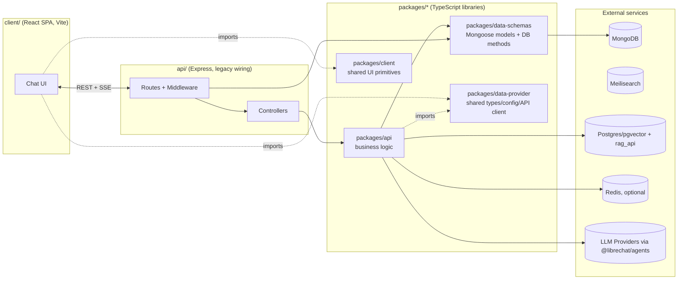
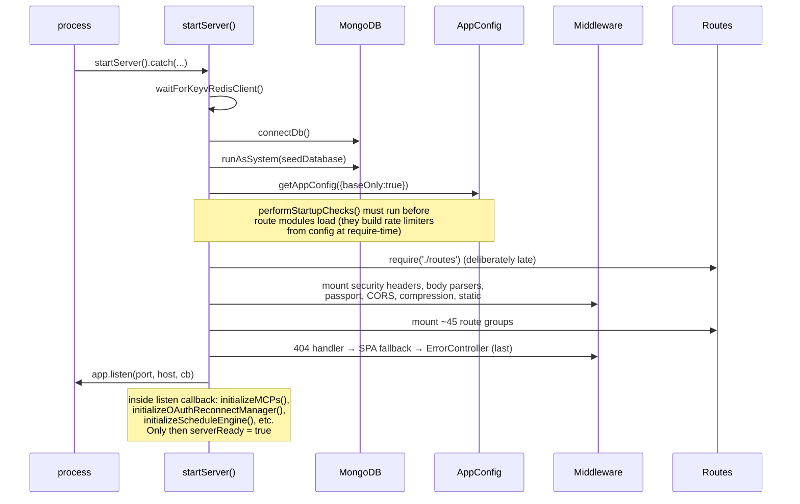
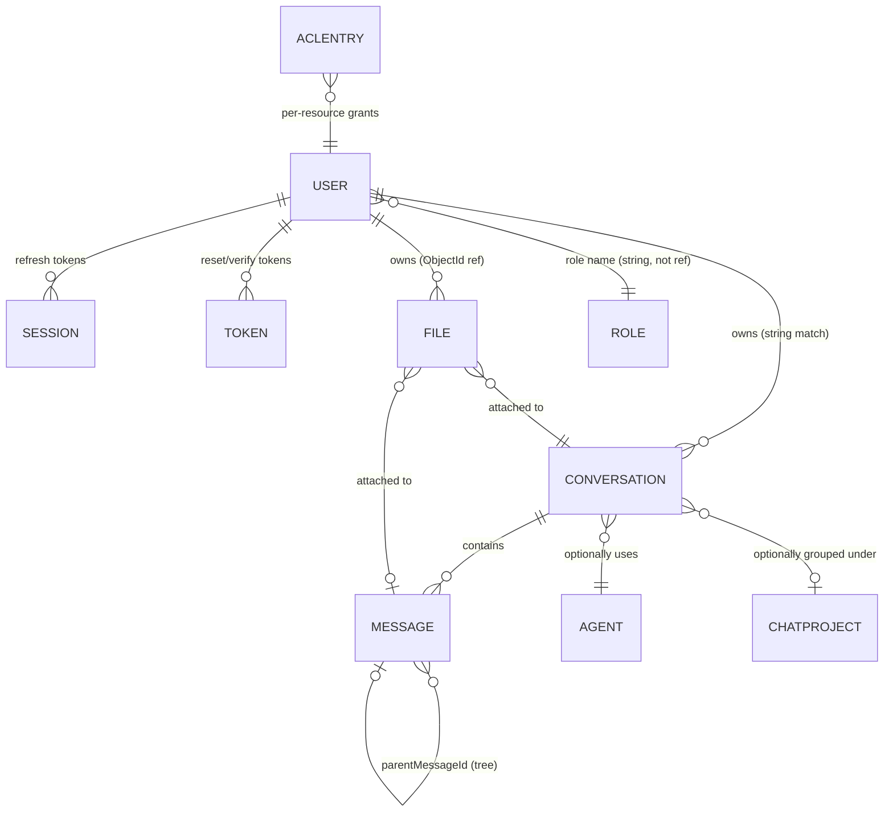
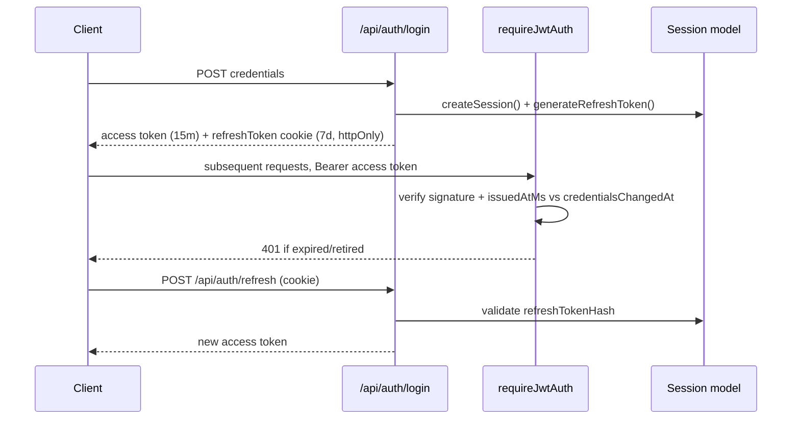
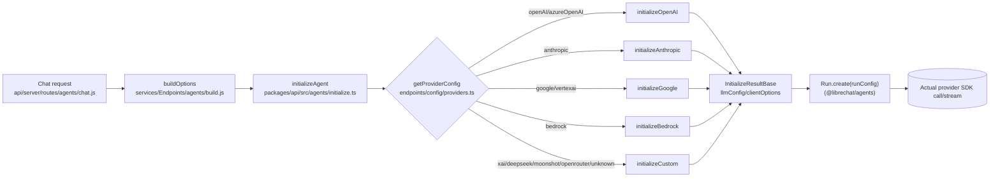
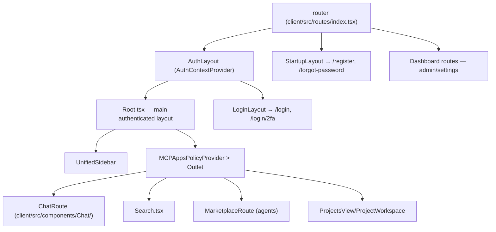

# PROJECT_MAP.md

> Primary architecture reference for a solo developer maintaining a custom fork.
>
> **Important assumption check:** the prompt that produced this document described "LibreChat, just cloned." The repository actually scanned (`/home/user/Eleven-Chat`) is a **heavily modified fork** of [LibreChat-AI/LibreChat](https://github.com/LibreChat-AI/LibreChat) that has diverged substantially from upstream: the chat pipeline is rebuilt around the external `@librechat/agents` package (LangGraph-style `Run`/graph execution), almost everything (including plain single-model chat) routes through an "agents" endpoint via an ephemeral agent, and there are large fork-specific subsystems with no upstream equivalent — a resumable/durable SSE streaming layer (`packages/api/src/stream/`), multi-tenancy, MCP "Apps," skills sync from GitHub, subagents, scheduled agent triggers, and a Langfuse trace fanout service. Everything below describes **this fork as it exists today**, not vanilla upstream LibreChat. Where something is fork-specific vs. likely-still-upstream-shaped, it's called out.

---

## 1. Project Overview

**What it is.** LibreChat (and this fork) is a self-hosted, multi-provider AI chat web application: a single Node/Express backend plus a React SPA that lets a team or individual run a ChatGPT-like UI against OpenAI, Anthropic, Google, Azure, Bedrock, and any OpenAI-compatible endpoint, with per-user conversations, file uploads, RAG, tool use, and now in this fork, user-authored "Agents" (tools + MCP servers + sub-agents) and multi-tenancy.

**Problem it solves:** avoids vendor lock-in to one LLM provider's chat UI, keeps conversation data and files under your own infrastructure, and gives a single consistent interface (and billing/usage ledger) across many model providers and deployment-specific extensions (MCP tools, custom actions, agents).

**High-level architecture:** a **monorepo**, not microservices — one Express process serves both the REST/SSE API and (in production) the built SPA, backed by MongoDB, with optional sidecar services (Meilisearch for search, a Postgres/pgvector + `rag_api` service for RAG, Redis for multi-replica job/state sharing). It is architecturally closer to a modulith: one deployable backend, but internally split into legacy wiring (`api/`) and typed library packages (`packages/*`) that could be extracted later.



### Tech stack breakdown

| Layer | Stack |
|---|---|
| **Frontend** | React 18 (`client/src/main.jsx`, `createRoot`), React Router (`createBrowserRouter`), Vite bundler, Tailwind CSS v4 with a semantic-token theme system, state split across Recoil (legacy) and Jotai (new/in-migration), React Query (`@tanstack/react-query`) for server state |
| **Backend** | Node.js, Express 5, REST + Server-Sent Events (no WebSocket/socket.io for chat); legacy JS wiring in `api/`, real logic in TypeScript under `packages/api` |
| **Database** | MongoDB via Mongoose; all schemas/query methods centralized in `packages/data-schemas` |
| **Authentication** | Local password, JWT access token + DB-backed refresh-token sessions, optional LDAP/SAML/OIDC/OAuth (Google/GitHub/Facebook/Discord/Apple), 2FA (TOTP + backup codes) |
| **Real-time** | Server-Sent Events only, with a custom resumable/durable streaming layer (`packages/api/src/stream/`) backed by an in-memory or Redis job store |
| **Deployment** | Docker (single-stage `Dockerfile` or multi-stage `Dockerfile.multi`), Docker Compose (dev + "deployed" variants), Helm charts, GitHub Actions CI/CD (30+ workflows) |

---

## 2. Directory Structure

### Top-level directories

| Directory | Purpose | Modify? |
|---|---|---|
| `api/` | Legacy Express backend (CommonJS). Routing, middleware wiring, controllers. Per this repo's `AGENTS.md`: wiring only, not business logic. | Yes, but keep logic out — wire into `packages/api` |
| `client/` | React SPA (Vite) | Yes — primary customization surface |
| `packages/api` | **New backend business logic** (TypeScript) | Yes — primary customization surface |
| `packages/data-schemas` | Mongoose schemas + DB query methods | Yes, for data-model changes |
| `packages/data-provider` | Shared types, `librechat.yaml` config schema, API client, query/mutation keys — used by both client and server | Yes, carefully (both sides depend on it) |
| `packages/client` | Shared UI primitives/design system, consumed by `client/` | Yes, prefer extending over copying styles into features |
| `config/` | Root-level admin/CLI Node scripts (user management, balance tools, migrations, i18n tooling) | Occasionally, for ops scripts |
| `e2e/` | Playwright end-to-end tests, including a dedicated `lighthouse/` performance lane | Yes, when adding/changing user-facing flows |
| `docs/` | A few repo-local engineering notes (MCP apps, run files, skills API, tool-approval modes) — not the full docs site | Rarely |
| `helm/` | Kubernetes Helm charts (`librechat/`, `librechat-rag-api/`) | Only for deployment changes |
| `otel/langfuse-fanout/` | Standalone Go service that fans agent traces out to tenant + central Langfuse projects | Rarely — separate Go codebase |
| `redis-config/` | Redis cluster/TLS configs for local dev | Rarely |
| `scripts/` | Dev tooling: import sorter, static-checks runner, i18n sync | Occasionally |
| `search/` | **Proof-of-concept only** — isolated Compose stack (FerretDB/Postgres/ClickHouse) for a future search architecture; explicitly "infra only, no app code" | Don't touch unless working on that PoC |
| `skill/` | Placeholder for shared deployment "skills" (`SKILL.md`), loaded read-only at startup; currently empty | Add skill files here if using this mechanism |
| `src/` | Just one stray OIDC integration test (`src/tests/oidc-integration.test.ts`) | Leave as-is |
| `utils/` | Docker build helper scripts, `update_env.py` | Rarely |
| `graphify-out/` | **Generated** — tracked code-graph artifacts (`graph.json`, `graph.html`, `GRAPH_REPORT.md`) from a `graphify` tool run over this codebase. Machine-local cache files (`manifest.json`, `.graphify_analysis.json`, `cache/`) are gitignored. | **Do not hand-edit** — regenerate via the `graphify` CLI |
| `.devcontainer/`, `.github/`, `.husky/`, `.vscode/` | Tooling config, not app code | Don't touch casually |

### Key subdirectories

**`client/src/`:** `components/` (feature folders, e.g. `Chat/`, `Nav/`, `Messages/`), `routes/` (router config + layouts), `hooks/` (feature-grouped, e.g. `hooks/Chat`, `hooks/SSE`), `store/` (Recoil + Jotai atoms — see §9), `data-provider/` (React Query hooks wrapping `packages/data-provider`), `Providers/` (top-level context providers), `localization/` (i18n JSON).

**`api/`:** `server/` (`index.js` entry, `routes/`, `controllers/`, `middleware/`, `services/`), `strategies/` (Passport strategies), `models/` (thin wrapper calling into `@librechat/data-schemas`), `db/` (Mongoose connection).

**`packages/api/src/`:** `agents/` (the largest subtree — 300+ files implementing the Agents feature, LangGraph `Run` integration, usage/cost accounting), `endpoints/` (per-provider config builders: `openai/`, `anthropic/`, `google/`, `bedrock/`, `custom/`, `config/`), `mcp/` (Model Context Protocol integration, ~35 files), `stream/` (resumable SSE job-store abstraction), `tools/` (built-in tool definitions/registry), `middleware/`, `crypto/`, `utils/`, `skills/` (GitHub-synced skills), `app/` (config loader/service).

**`packages/`** also contains `data-schemas/src/schema/` (every Mongoose schema) and `data-provider/src/config.ts` (the enormous `configSchema`, 5500+ lines) and `src/keys.ts` (React Query key registry).

### Auto-generated / do-not-modify

- `dist/`, `build/` in any package (output of `tsdown`/Vite — **not present until you build**)
- `.turbo/`, `node_modules/` (per-workspace)
- `client/src/localization/languages/*_missing_keys.json`, `config/translations/stores/*` (i18n tooling output)
- `*.d.ts` everywhere except `vite-env.d.ts` (generated TS declarations)
- `api/tsconfig.json` is explicitly gitignored — tooling sometimes auto-creates an empty one that shadows `api/jsconfig.json` and breaks the `~` alias; delete it if it reappears
- `librechat.yaml`/`librechat.yml` (real runtime config — copy from `librechat.example.yaml`, don't commit)
- `graphify-out/cache/`, `.graphify_root`, `.graphify_analysis.json` under `graphify-out/`

---

## 3. Entry Points

### Backend entry point — `api/server/index.js` (~460 lines, CommonJS)

- **Port/host:** `PORT` env (default `3080`), `HOST` env (default `localhost`); `app.listen(port, host, callback)`.
- **Startup sequence** (abridged — see full order below):



- Health endpoints (`/health`, `/livez`, `/readyz`) are registered **before** the main middleware chain; `/readyz` and chat-start/schedule-write middleware gate on the `serverReady` flag, which only flips `true` after every post-listen subsystem initializes.
- `process.on('uncaughtException', ...)` has special-cased suppressions (fetch failures, Meilisearch, provider SDK errors) and a `CONTINUE_ON_UNCAUGHT_EXCEPTION` escape hatch; `unhandledRejection` logs but does not crash (tolerates MCP OAuth reconnect storms).
- `module.exports = app` at the bottom, for supertest-based testing.

### Frontend entry point — `client/src/main.jsx`

- `createRoot` (React 18 API) → `bootstrap()` awaits `initializeI18n()` (best-effort — renders even if i18n fails) → renders `<ApiErrorBoundaryProvider><App /></ApiErrorBoundaryProvider>`.
- **`client/src/App.jsx`** is the real provider stack, nested outside-in: `QueryClientProvider` → `RecoilRoot` → a11y `LiveAnnouncer` → `DeploymentTheme` (theme provider) → Radix `Toast.Provider` → `DndProvider` → `RouterProvider` (React Router, with `useTransitions={false}` — deliberately disabled because Recoil conversation state isn't transition-safe yet).
- Router config: **`client/src/routes/index.tsx`** (`createBrowserRouter`), consumed by `App.jsx`.

### Worker/background entry points

No separate worker process — background work (index sync, file-preview sweeps, agent trigger scheduling, subagent task routing) runs as in-process async jobs kicked off during `api/server/index.js` startup, not as a distinct process/binary. The one exception is `otel/langfuse-fanout/` — a standalone Go service with its own `Dockerfile`, run as a sidecar container, not spawned by the Node process.

---

## 4. API Architecture

**Route definition:** each feature has an `express.Router()` module under `api/server/routes/`, aggregated by a pure pass-through index (`api/server/routes/index.js`, ~45 `require()`s, no logic) and mounted in `api/server/index.js`.

### Main route groups

| Base path | Purpose | File |
|---|---|---|
| `/api/auth` | Login/logout/refresh/2FA/passkeys | `routes/auth.js` |
| `/api/user` | Current-user profile/settings | `routes/user.js` |
| `/api/convos` | Conversations | `routes/convos.js` |
| `/api/messages` | Messages | `routes/messages.js` |
| `/api/agents` | Agents feature + chat streaming | `routes/agents/` |
| `/api/models`, `/api/endpoints` | Available models/providers | `routes/models.js`, `routes/endpoints.js` |
| `/api/files` | File upload/management (async route factory, `routes.files.initialize()`) | `routes/files/` |
| `/api/assistants` | OpenAI/Azure Assistants API (legacy, non-agents path) | `routes/assistants/` |
| `/api/mcp` | MCP server management | `routes/mcp.js` |
| `/api/schedules` | Scheduled agent runs | `routes/schedules.js` |
| `/api/admin/*` | Admin console (config, users, roles, groups, grants, skills, audit log, code environments, Langfuse) | `routes/admin/*.js` |
| `/api/balance`, `/api/keys`, `/api/api-keys` | Token-credit balance, user-provided LLM keys, API-key management | respective files |
| `/oauth` | OAuth provider callbacks | `routes/oauth.js` |
| `*` (catch-all) | SPA fallback | `utils/fallback.js` |

Full list has ~45 groups (search, presets, projects, prompts, skills, categories, roles, banner, memories, permissions, tags, rum, openapi, static image serving, etc.) — see `api/server/routes/index.js` for the authoritative list.

### Middleware chain order

Global chain (in `api/server/index.js`, in this order): request-context (AsyncLocalStorage) → metrics → body parsers (JSON/urlencoded, skipped for RUM) → JSON-parse-error handler → `mongoSanitize()` → CORS → cookie parser → compression → static file serving → telemetry → Passport init + strategy registration (JWT, local, conditionally LDAP/social/SAML/OIDC) → capability-context middleware → **route-level** `preAuthTenantMiddleware` (on auth/config/share routes) → **route-level** auth (`requireJwtAuth`/`optionalJwtAuth`/`requireLocalAuth`/`requireLdapAuth`, applied per-route, not globally) → 404 handler → SPA fallback → telemetry error middleware → `ErrorController` (last, by Express convention for 4-arg error middleware).

Per-route building blocks live under `api/server/middleware/`: validation (`validateMessageReq`, `validateModel`, …), resource ACL (`accessResources/canAccessResource.js` — bitmask: 1=view/2=edit/4=delete/8=share), rate limiters (`middleware/limiters/`, one file per limiter, built on `express-rate-limit` with a shared cache store), role gates (`roles/admin.js`, `roles/capabilities.js`).

### Error handling pattern

Central handler: **`ErrorController`** (`packages/api/src/middleware/error.ts:58-136`), mounted last via its 4-argument signature. Dispatch order: pass-through on no error → OAuth-callback redirect special case → Mongoose `ValidationError` (400) → duplicate-key error (409) → OpenID/MCP auth errors (401/403 with specific codes) → `CustomError` (explicit opt-in: a route that wants to surface a message calls `createCustomError(statusCode, message)`) → tenant-isolation failures get structured logging → **everything else falls back to a bare 500 with no message/stack sent to the client.** Streaming (SSE) errors go through a separate path (`sendError`/`sendResponse` in `api/server/middleware/error.js`) since HTTP headers are already committed once a stream starts.

Supporting policy (`packages/api/src/utils/errors.ts`, documented in root `AGENTS.md`): `getSafeErrorMetadata()` for log-safe `{type, status}`, `getSafeErrorText()` for bounded/secret-redacted log text, `isAbortError()` to distinguish real failures from user-cancelled streams.

---

## 5. Database Models

All schemas live in **`packages/data-schemas/src/schema/`** (TypeScript); `api/models/index.js` is a 29-line wrapper that just calls `createMethods(mongoose, {...})` from `@librechat/data-schemas` — the clearest example of the legacy-wiring-vs-real-logic split in the whole codebase.



| Model | Key fields | Notable indexes | Relationships |
|---|---|---|---|
| **User** (`schema/user.ts`) | `email` (unique per tenant), `password` (bcrypt, `select:false`), `role`, OAuth id fields per provider, `twoFactorEnabled`/`totpSecret`/`backupCodes[]`, legacy embedded `refreshToken[]` | `{email,tenantId}` unique; per-OAuth-provider unique partial indexes | Referenced by string on Conversation/Message; ObjectId ref on File/Session |
| **Conversation** (`schema/convo.ts`) | `conversationId`, `title`, `messages[]` (ObjectId refs), `agent_id`, `subagentThread.*` (parent/child linkage), `tags[]`, `chatProjectId` | TTL on `expiredAt`; unique `{conversationId,user,tenantId}`; many compound cursor-pagination indexes | 1—N Message; N—1 ChatProject; optional 1—1 Agent |
| **Message** (`schema/message.ts`) | `messageId`, `conversationId`, `parentMessageId` (tree), `content[]` (multi-part), `feedback.rating` | TTL; unique `{messageId,user,tenantId}`; `{conversationId,user,createdAt,_id}` (serves sort-free pagination) | N—1 Conversation; self-referential tree |
| **File** (`schema/file.ts`) | `user` (**real** ObjectId ref — one of few), `conversationId`, `file_id`, `status` (pending/ready/failed), `metadata.runFile.*` (code-execution provenance), `expiresAt`/`expiredAt` | TTL; unique partial indexes scoped by file context | N—1 User, Conversation, Message |
| **Session** (`schema/session.ts`) | `refreshTokenHash`, `expiration` (TTL `expires:0`), `user` (ObjectId ref) | unique `{user,refreshTokenHash}` | N—1 User — **current** refresh-token mechanism |
| **Token** (`schema/token.ts`) | `userId`, `email`, `type`, `scope`, `token`, `expiresAt` | TTL; unique sparse on scope | Generic short-lived token store (reset/verify/invite) |
| **Role** (`schema/role.ts`) | `name`, `permissions` (`rolePermissionsSchema` — per-category boolean flags: BOOKMARKS, AGENTS, MCP_SERVERS, SKILLS, SCHEDULES, …) | unique `{name,tenantId}` | Looked up by name from `User.role` (not populated) |
| **Agent** (`schema/agent.ts`) | `id` (string, not `_id`), `name`, `instructions`, `provider`, `model`, `access_level` | — | Referenced by Conversation's `agent_id` |
| **aclEntry** (`schema/aclEntry.ts`) | generic entity/permission-bit rows | — | Backs the bitmask resource-ACL middleware |

Other schemas present (each thinner, see `schema/index.ts` for the full ~45-model barrel): action, assistant, balance, banner, categories, chatProject, codeEnvironment, conversationTag, key, pluginAuth, preset, prompt, promptGroup, passkey, share, skillSyncCredential, skillSyncStatus, transaction, memory, favorite, group, systemGrant, auditLog, config, triggerDelivery, queuedTurn, schedule, scheduleRun, mcpServer, skill, skillFile.

---

## 6. Authentication Flow

### Supported strategies (`api/strategies/`)

| Strategy | File | Notes |
|---|---|---|
| Local (password) | `localStrategy.js` | bcrypt compare, rejects unverified email unless `ALLOW_UNVERIFIED_EMAIL_LOGIN` |
| JWT (bearer) | `jwtStrategy.js` | Verifies against `JWT_SECRET`; rejects tokens issued before a password reset |
| LDAP | `ldapStrategy.js` | Conditional on `LDAP_URL` + `LDAP_USER_SEARCH_BASE` |
| SAML | `samlStrategy.js` | Via `express-session` |
| OpenID Connect | `openidStrategy.js` + `openIdJwtStrategy.js` | Optional token reuse (`OPENID_REUSE_TOKENS`) |
| Social OAuth | `googleStrategy.js`, `githubStrategy.js`, `facebookStrategy.js`, `discordStrategy.js`, `appleStrategy.js` | Gated behind `ALLOW_SOCIAL_LOGIN` |

### JWT structure / expiration

- Access token payload: `{ id, username, provider, email, issuedAtMs }` — **no role/permissions** (re-fetched from DB every request). Signed `jwt.sign(payload, JWT_SECRET, {expiresIn})`. Default **15 minutes** (`SESSION_EXPIRY` env, ms).
- Refresh token: not embedded in the JWT — tracked via the **Session** model, delivered as an `httpOnly`/`secure`/`sameSite:strict` cookie. Default **7 days** (`REFRESH_TOKEN_EXPIRY`).
- Password reset immediately retires all previously issued access tokens (`credentialsChangedAt` vs. `issuedAtMs` check) even before they naturally expire — this is why the root `AGENTS.md` requires invalidating the cached user document on any user mutation.

### Role/permission system

String `role` on User → **Role** document with per-category boolean permission flags, checked via `hasCapability`/`requireCapability` middleware and a separate bitmask **resource-ACL** system (`aclEntry` model + `canAccessResource` middleware: 1=view/2=edit/4=delete/8=share) for per-object grants. **Correction (2026-10, verified via `docs/developer-guide/`):** `checkAdmin` (`api/server/middleware/roles/admin.js`) is defined but called by zero routes — every `/api/admin/*` route actually gates on `requireCapability(SystemCapabilities.ACCESS_ADMIN)` plus finer-grained flags, not a separate blunt gate. See `docs/developer-guide/08-auth-security.md` §5 and `docs/developer-guide/13-architecture-decisions-and-limitations.md`.

### Session management

Primarily **stateless JWT** for the main API — no `express-session` on the normal request path. `express-session` + `passport.session()` are mounted **only** inside OAuth/OIDC/SAML handshakes, backed by a Keyv cache store (Redis if configured), not `connect-mongo`.



---

## 7. LLM Integration Layer

**This is the fork's most heavily rebuilt area.** Almost nothing calls a provider SDK directly from route code — everything funnels through `@librechat/agents` (an external LangGraph-based package).

### Provider abstraction

Two parallel vocabularies, both in `packages/data-provider/src/schemas.ts`:
- `EModelEndpoint` — the user-facing "endpoint" (`openAI`, `azureOpenAI`, `google`, `anthropic`, `bedrock`, `assistants`, `custom`, `agents`).
- `Providers` — the underlying runtime (`OPENAI`, `ANTHROPIC`, `AZURE`, `GOOGLE`, `VERTEXAI`, `BEDROCK`, `MISTRALAI`, `DEEPSEEK`, `MOONSHOT`, `OPENROUTER`, `XAI`).

Per-provider config builders live in `packages/api/src/endpoints/<provider>/` (`openai/`, `anthropic/`, `google/`, `bedrock/`, `custom/` for OpenAI-compatible + xAI/DeepSeek/Moonshot/OpenRouter). None of these instantiate a client directly — they build an `InitializeResultBase` config object.

### Provider selection logic



A single turn can invoke multiple providers (primary model, title generation, activity labels), each re-entering `getProviderConfig`.

### API key management

Two tiers: server/env-level (`process.env.OPENAI_API_KEY`, etc.) or per-user (when config sets the key to the sentinel `"user_provided"`, fetched via `db.getUserKeyValues`). Storage uses three generations of symmetric encryption in `packages/data-schemas/src/crypto/index.ts` — legacy fixed-IV AES-CBC, v2 random-IV AES-CBC, v3 `aes-256-ctr` — all keyed off `CREDS_KEY`/`CREDS_IV`. HTTP surface: `api/server/routes/keys.js` (never returns decrypted values, only expiry).

### Streaming implementation

**SSE, not WebSocket** (no socket.io anywhere in `api/server`). Server sets standard SSE headers and writes `event: ...\ndata: ...\n\n` frames. The fork adds a **resumable/durable streaming layer** (`packages/api/src/stream/`: `GenerationJobManager`, `IJobStore` interface with `InMemoryJobStore`/`RedisJobStore` implementations) so a dropped connection can reconnect mid-generation and replay missed deltas — a correct example of the dependency-injection pattern the repo's `AGENTS.md` asks for. Client side uses the `sse.js` library (not native `EventSource`, to support custom headers/POST) in `client/src/hooks/SSE/`.

### Token counting & cost

Tokenizer: **`ai-tokenizer`** package (not tiktoken), supporting `o200k_base` and `claude` encodings (`packages/api/src/utils/tokenizer.ts`), with chunking to bound BPE cost and a byte-length fallback estimator. Cost table: `packages/data-schemas/src/methods/tx.ts` (`tokenValues` static pricing map, `getMultiplier()` resolves $/token honoring admin overrides → premium tiers → static table → `defaultRate`). `computeUsageCostUSD()` in `packages/api/src/agents/usage.ts` reuses the exact billing path so the number shown to the user matches what's actually charged.

### Plugin/extension & tool system

Four tool categories (`packages/api/src/tools/registry/definitions.ts`): `builtin | mcp | action | custom`.

- **Built-in tools**: DALL-E, image gen, search, calculator, etc. — admin can allow/deny globally.
- **Actions**: OpenAPI-based custom tools per agent.
- **MCP (Model Context Protocol)** — the dominant extension mechanism, `packages/api/src/mcp/` (~35 files). **This is the one area the repo's own `AGENTS.md` explicitly flags as a static-singleton pattern to stop extending** (`MCPManager.getInstance()`/`createInstance()`, with nested `MCPServersRegistry.getInstance()` calls). Declared in `librechat.yaml` via `mcpServers`/`mcpSettings`.
- **Skills**: a newer, separate mechanism syncing skill definitions from GitHub (`packages/api/src/skills/sync/`).
- **Agents (sub-agents)**: the bulk of `packages/api/src/agents/` — user-authored agents with tools/MCP servers/sub-agents attached, built on `@librechat/agents`' LangGraph abstractions.

### `librechat.yaml`

Schema: `packages/data-provider/src/config.ts` — `configSchema` (5500+ lines), covering endpoints, MCP, rate limits, file config, registration, interface/theming, etc. Parsing pipeline: `packages/api/src/app/loader.ts` → `configSchema.strict().safeParse()` (unknown keys rejected) → on failure, process exits at startup or throws on a **live reload** (config can be hot-reloaded without restart). Loaded/cached per-tenant and per-principal in `packages/api/src/app/service.ts` (`getAppConfig()`), attached to every request via `configMiddleware` (`req.config`). `createAppConfigService(deps)` is a proper DI factory — the pattern the repo wants more of, in contrast to the MCP singleton above.

---

## 8. Plugin/Extension System

(See §7 for the mechanics.) Summary: yes, LibreChat has a real extension architecture, built around three composable layers — **built-in tools** (compiled in, admin-toggleable), **MCP servers** (external processes/services exposing tools over the Model Context Protocol, the primary way to add custom capabilities without forking code), and **Agents** (user-authored compositions of model + instructions + tools/MCP servers + sub-agents, persisted as data, not code). Custom per-agent tools without an MCP server can also be added as OpenAPI **Actions**. `librechat.yaml` is the single configuration surface tying built-in tool allow-lists, MCP server definitions, and global policy (`mcpSettings`, `mcpAppSandbox`) together; it's parsed in `packages/api/src/app/loader.ts` and materialized into a cached, tenant-aware `AppConfig` consumed everywhere via `getAppConfig()`/`req.config`.

---

## 9. Frontend Architecture

### Component hierarchy



Router top-level paths also include `/share/:shareId`, `/oauth/success|error`, `/verify`; within `Root`, `/` redirects to `/c/new`, and `/c/:conversationId?` is the chat route.

### State management (Recoil → Jotai migration, in progress)

Per root `AGENTS.md`: new state is always Jotai; conversion unit is one atom plus every file touching it. Confirmed split in `client/src/store/`:
- **Jotai-only**: `codeEnvironmentReconciliation.ts`, `duringRun.ts`, `filesDialog.ts`, `jotai-utils.ts`, `mcp.ts`, `sandbox.ts`, `steer.ts`, `uiScale.ts`, `usage.ts`.
- **Recoil-only**: `artifacts.ts`, `endpoints.ts`, `families.ts`, `language.ts`, `misc.ts`, `preset.ts`, `prompts.ts`, `search.ts`, `settings.ts`, `submission.ts`, `text.ts`, `toast.ts`, `user.ts`, `utils.ts`.
- **Mixed**: `agents.ts`, `ptc.ts` — any *new* state added here must still be Jotai.

`client/src/store/jotai-utils.ts` provides `createStorageAtom`, `createStorageAtomWithEffect`, `createTabIsolatedAtom` (per-tab, no cross-tab sync), `initializeFromStorage` — the sanctioned helpers for persisted atoms.

**Server state**: React Query throughout `client/src/data-provider/`; query/mutation keys centralized in `packages/data-provider/src/keys.ts` (`QueryKeys`, `DynamicQueryKeys`, `MutationKeys` enums).

### Routing structure

See the diagram above; full flattened list in the backend-agnostic research included: chat (`/c/:conversationId?`), search, prompts, skills, insights, projects, agents/marketplace, admin dashboard, auth flows.

### Theming/styling system

Tailwind v4, `client/tailwind.config.cjs` extends a shared preset (`packages/client/tailwind.preset.cjs`) and scans `packages/client` too. **Semantic token system**: `packages/client/src/theme/tokens.css` is the single source of truth for color tokens (`@theme inline` blocks, e.g. `--color-surface-primary`), enforced by a lint rule so undeclared tokens get flagged — this is the mechanism behind `AGENTS.md`'s "avoid raw palette utilities" rule. `DeploymentTheme.tsx` resolves theme precedence: high-contrast mode → `librechat.yaml` `interface.theme` → build-time env colors → user's stored theme (localStorage). Shared primitives (`packages/client/src/components/`) export a large component set (Button, Dialog, DropdownPopup, Composer, DataTable, etc.) — `AGENTS.md` mandates `DropdownPopup` + `Ariakit.MenuButton` for action menus, never Radix `DropdownMenu`, for that specific pattern.

### Build tooling

**Vite** (`client/vite.config.ts`) for the client app — dev proxy to `/api`/`/oauth`, PWA plugin, service-worker healing. `packages/client`, `packages/data-schemas`, `packages/api` all build via **`tsdown`** with no type-check step in the build itself (confirmed in each `package.json`) — hence `AGENTS.md`'s instruction to run `npx tsc --noEmit` manually. `packages/data-provider` is the exception: its build chains `tsdown && tsc -p tsconfig.build.json`, so it does type-check as part of `npm run build:data-provider`.

---

## 10. Build & Development

### Monorepo tooling

npm workspaces (`"workspaces": ["api", "client", "packages/*"]`) + **Turborepo** (`turbo.json`) for build graph/caching. No Lerna/Nx. Dependency chain: `librechat-data-provider` → `@librechat/data-schemas` → `@librechat/api` / `@librechat/client`.

### Running locally

```bash
# install
npm ci   # (Bun is also fully supported via b:* scripts)

# build the typed packages, in dependency order
npm run build:packages     # data-provider → data-schemas → api → client-package

# dev servers
npm run backend:dev        # nodemon on api/server/index.js
npm run frontend:dev       # Vite dev server (cd client && npm run dev)
```

### Building for production

```bash
npm run frontend   # full chain: build:packages + client build
npm run backend    # node api/server/index.js
```
Or build the Docker image directly (`Dockerfile` runs `npm run frontend` inside the image; `Dockerfile.multi` does the equivalent as discrete cacheable stages).

### Environment variables (`.env.example`, ~1480 lines)

Grouped roughly as: server config (port/host/timeouts) → security headers/CSP → logging → Langfuse/OpenTelemetry tracing → **per-provider LLM credentials** (Anthropic, Azure, Bedrock, Google/Vertex, OpenAI, Assistants API) → search → speech-to-text/text-to-speech → code interpreter → RAG (vector DB) → registration/social login (Google/GitHub/Discord/Facebook/Apple/OpenID) → SharePoint/Entra ID → email (Mailgun) → file storage (Firebase/S3/Azure Blob) → shared links → Redis → MCP configuration.

### Docker setup

- `docker-compose.yml` — default dev stack: `api`, `admin-panel`, `mongodb`, `meilisearch`, `vectordb` (pgvector), `rag_api`.
- `deploy-compose.yml` — production-style, adds a dedicated nginx `client` service fronting the API.
- `docker-compose.override.yml.example` — template for local overrides (mount `librechat.yaml`, use a local image, etc.) — never edit `docker-compose.yml` directly.
- `rag.yml` — standalone RAG-only stack. `docker-compose.langfuse-fanout.yml` — optional trace-fanout overlay.

### Testing setup

- **Jest**, per workspace (`api`, `client`, `packages/api`, `packages/data-provider`, `packages/data-schemas`, `config`) — each independently runnable via `npm run test:<workspace>`; `npm run test:all` runs everything (avoid for routine work, per `AGENTS.md`). `packages/data-schemas` uses real `mongodb-memory-server`; `packages/api` has narrow integration-test scripts (`test:cache-integration:*`) for cache/Redis/MCP/stream subsystems.
- **Playwright** E2E under `e2e/` — many configs for different modes (mock backend, a11y, deployed, benchmarks, property-based "bombadil" exploration).
- **Lighthouse performance lane** (`e2e/lighthouse/`) — seeds a disposable Mongo + server, injects an artificial 250ms-per-query DB latency, asserts LCP/CLS/TBT budgets against the chat view. Run via `npm run lighthouse`; required before startup/auth/config/file/message-loading changes per `AGENTS.md`.
- **Static checks**: `npm run static-checks -- --against origin/dev` reproduces CI's lint/format/typecheck/import-sort gate.

---

## 11. Key Files Quick Reference

| File | Why it matters |
|---|---|
| `api/server/index.js` | Backend process entry — startup order, middleware/route mounting, graceful shutdown |
| `api/server/routes/index.js` | Full list of mounted route groups (one line to add a new route module) |
| `api/models/index.js` | Shows the legacy-wiring pattern: 29 lines, delegates everything to `@librechat/data-schemas` |
| `packages/api/src/middleware/error.ts` | Central `ErrorController` — how/when errors reach the client |
| `packages/api/src/utils/errors.ts` | Safe-error-disclosure helpers — read before adding any new thrown error |
| `packages/data-schemas/src/schema/index.ts` | Barrel of every Mongoose model |
| `packages/data-schemas/src/schema/{user,convo,message,file}.ts` | The four core data models |
| `api/strategies/jwtStrategy.js`, `.../localStrategy.js` | Auth strategy entry points |
| `packages/data-schemas/src/methods/user.ts` (`generateToken`) | Where JWTs are actually minted |
| `packages/api/src/crypto/index.ts`, `packages/data-schemas/src/crypto/index.ts` | Key/secret encryption (3 generations — don't add a 4th casually) |
| `packages/data-provider/src/schemas.ts` | `EModelEndpoint`/`Providers` enums — the vocabulary for "which LLM" |
| `packages/api/src/endpoints/config/providers.ts` | The actual provider-dispatch table (`providerConfigMap`) |
| `packages/api/src/agents/initialize.ts` | Where a chat request resolves to a concrete provider config |
| `packages/api/src/agents/usage.ts`, `packages/data-schemas/src/methods/tx.ts` | Token usage normalization + cost/pricing — the billing-critical path |
| `packages/api/src/mcp/MCPManager.ts` | MCP integration entry point — **and the repo's flagged anti-pattern example** |
| `packages/api/src/stream/GenerationJobManager.ts`, `interfaces/IJobStore.ts` | Resumable SSE streaming — the fork's signature feature |
| `packages/data-provider/src/config.ts` | `configSchema` — every `librechat.yaml` option; add new toggles here |
| `packages/api/src/app/service.ts`, `loader.ts` | Config loading/caching/hot-reload pipeline |
| `api/server/middleware/config/app.js` | How `req.config` gets attached per-request |
| `client/src/main.jsx`, `client/src/App.jsx` | Frontend entry + provider stack |
| `client/src/routes/index.tsx`, `Root.tsx` | Router config and main authenticated layout |
| `client/src/store/jotai-utils.ts` | Persisted-atom helpers — use these for any new Jotai state |
| `client/src/store/index.ts` | The Recoil/Jotai barrel — shows the current migration state |
| `packages/data-provider/src/keys.ts` | React Query key registry — add new keys here, not inline |
| `packages/client/src/theme/tokens.css` | Semantic color tokens — the only place to add a new theme color |
| `client/src/hooks/SSE/transport/sse.ts` | Client-side SSE transport (`sse.js`, not native `EventSource`) |
| `AGENTS.md` (repo root) | The fork's own contributor/architecture rules — read before any non-trivial change |
| `CONTEXT.md` | Glossary of fork-specific domain terms (subagent threads, agent event binding, triggers, etc.) |
| `librechat.example.yaml` | Template for the real runtime config |
| `.env.example` | Template for the real `.env` |
| `turbo.json` | Build dependency graph across packages |

### Files most likely to be touched when customizing

- `packages/data-provider/src/config.ts` — add a new config toggle
- `packages/api/src/endpoints/custom/*` — add a new OpenAI-compatible provider
- `packages/api/src/tools/registry/definitions.ts` — add a built-in tool
- `client/src/components/**` + `packages/client/src/components/**` — UI changes
- `client/src/store/**` (new Jotai atoms) and `client/src/data-provider/**` (new React Query hooks)
- `api/server/routes/**` + a matching new module under `packages/api/src/**` for any new backend endpoint
- `client/src/locales/en/translation.json` — new user-facing strings

---

## Assumptions / unresolved areas

- The task prompt assumed vanilla upstream LibreChat; this document describes the actual fork, which has diverged significantly (agents-first pipeline, multi-tenancy, resumable streaming, MCP Apps, subagents, Langfuse fanout). If you specifically need upstream LibreChat's simpler per-endpoint client architecture for comparison, that's a different repository.
- `graphify-out/GRAPH_REPORT.md` (already in this repo, generated by a separate `graphify` CLI run) is a complementary, more exhaustive auto-generated cross-reference (god nodes, import cycles, community clusters) — worth cross-checking against this document for anything not covered here.
- Exact line numbers above were taken from research passes performed just before this document was written; they will drift as the code changes — treat them as "last known location," not a permanent citation.
- The `search/` PoC directory's eventual integration path (if any) into the main app is not yet determined from the code alone.
- Full `packages/data-schemas/src/methods/tx.ts` pricing table contents (beyond the Bedrock excerpt found) were not exhaustively enumerated — check that file directly before relying on specific $/token figures.
