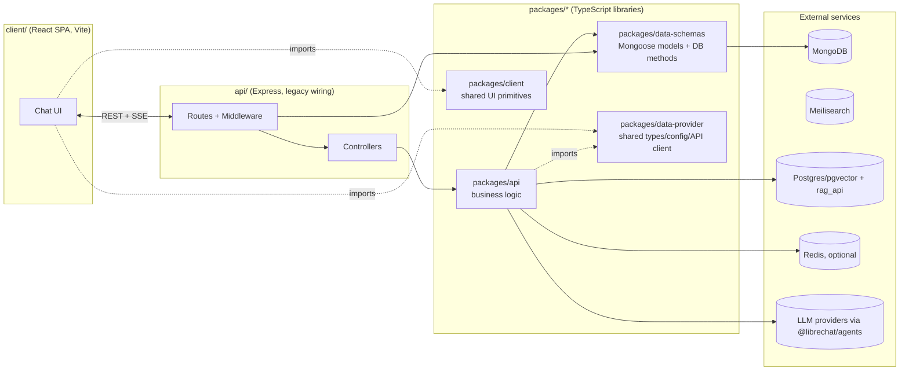

# 00 — Project Overview

> **Audience**: a developer who has never seen this codebase before and needs a first, accurate
> mental model before going deeper. Everything below is evidence-based — see the linked chapters for
> file:line citations; this page intentionally stays at the surface.

## Contents

1. [What this application is](#1-what-this-application-is)
2. [Who uses it, and the main journeys](#2-who-uses-it-and-the-main-journeys)
3. [Technologies and what each one actually does here](#3-technologies-and-what-each-one-actually-does-here)
4. [The major modules](#4-the-major-modules)
5. [How the system starts](#5-how-the-system-starts)
6. [How the pieces talk to each other](#6-how-the-pieces-talk-to-each-other)
7. [Data stores and external dependencies](#7-data-stores-and-external-dependencies)
8. [Implemented vs. planned/experimental](#8-implemented-vs-plannedexperimental)
9. [Orientation: where to look first](#9-orientation-where-to-look-first)
10. [Map of this documentation suite](#10-map-of-this-documentation-suite)

---

## 1. What this application is

**Eleven-Chat** is a self-hosted, multi-provider AI chat web application — a heavily customized fork
of [LibreChat](https://github.com/LibreChat-AI/LibreChat) that has diverged substantially from
upstream. *Verified* (`PROJECT_MAP.md`, cross-checked by this session's research): it is a single
Node.js/Express backend plus a React single-page app that lets a team or individual run a
ChatGPT-like interface against OpenAI, Anthropic, Google, Azure, Bedrock, and any OpenAI-compatible
endpoint, with per-user conversations, file uploads, retrieval-augmented generation (RAG), tool use,
and — specific to this fork — user-authored "Agents" (tools + MCP servers + sub-agents),
scheduled/triggered agent runs, and multi-tenancy.

The single biggest architectural fact to internalize before reading anything else (see
[`../../CRITICAL_FLOWS.md`](../../CRITICAL_FLOWS.md) Flow 1, and [`02-backend.md`](./02-backend.md),
[`09-background-processing.md`](./09-background-processing.md) in this suite for the full depth):
**a chat generation is a durable server-side job, decoupled from the HTTP connection that started
it.** Starting a response (`POST`) and watching it stream (`GET` SSE) are two separate requests
against a job the `GenerationJobManager` owns. The browser can disconnect, reconnect, or close
entirely, and the model call keeps running server-side. Almost every other fork-specific subsystem —
scheduled triggers, subagents, the resumable stream protocol — is built on the same pattern:
register durable intent first, then execute, so a crash never silently loses work.

## 2. Who uses it, and the main journeys

*Verified* capabilities, by what the code actually implements (not aspirational):

- **Chat**: start a conversation, send messages, branch/edit/regenerate, attach files, stream a
  response that survives a dropped connection. See [`03-frontend.md`](./03-frontend.md) §17-18 and
  [`../../CRITICAL_FLOWS.md`](../../CRITICAL_FLOWS.md) Flow 1 and Flow 4.
- **Multi-provider model access**: switch between LLM providers/models per conversation or per
  "Agent," without changing the UI. See [`06-business-logic.md`](./06-business-logic.md) §3.
- **Agents**: build a reusable agent (system prompt + tools + MCP servers + optional sub-agents),
  share it, and converse through it. See [`06-business-logic.md`](./06-business-logic.md) §3 and
  [`07-api-reference.md`](./07-api-reference.md) §5.
- **Scheduled/triggered runs**: an agent can fire on a cron-like schedule or from an external event,
  landing in a real chat conversation with no human present. Default-disabled, opt-in. See
  [`09-background-processing.md`](./09-background-processing.md) §1.
- **Subagents**: a running agent can delegate to a child agent thread, observe its progress, and
  resume once it completes. See [`09-background-processing.md`](./09-background-processing.md) §3.
- **RAG and search**: upload files for retrieval (pgvector-backed), and full-text search across
  messages (Meilisearch-backed, derived index — not the source of truth). See
  [`05-database.md`](./05-database.md) §1 and [`07-api-reference.md`](./07-api-reference.md) §10.
- **Administration**: roles/permissions (ACL), usage/balance tracking per user, banners, skill
  management. See [`06-business-logic.md`](./06-business-logic.md) §4, §8 and
  [`08-auth-security.md`](./08-auth-security.md) §5.

## 3. Technologies and what each one actually does here

| Layer | Stack | Verified role in this app |
|---|---|---|
| Frontend | React 18, Vite, React Router, Tailwind CSS v4, Recoil + Jotai (migration in progress), React Query | Renders the SPA; React Query owns server-state caching; Recoil/Jotai split by state ownership — see [`03-frontend.md`](./03-frontend.md) §6 |
| Backend | Node.js, Express 5 | Serves REST + SSE; `api/` is legacy CommonJS wiring, `packages/api` is the TypeScript business-logic layer — see [`01-architecture.md`](./01-architecture.md) §4 |
| Database | MongoDB via Mongoose | The durable system of record for everything — see [`05-database.md`](./05-database.md) |
| Cache/coordination | Redis (optional, `USE_REDIS`) | Caching, leader election, concurrency limiting, MCP OAuth flow coordination, and the resumable-stream job store — never the sole copy of durable data — see [`04-redis.md`](./04-redis.md) |
| Search | Meilisearch | A derived, rebuildable search index over messages — not a data store of record |
| RAG | Postgres + pgvector, `rag_api` sidecar | Vector storage/retrieval for uploaded-file RAG |
| LLM access | `@librechat/agents` (external package) | Does the actual provider calls and LangGraph-style run execution; this repo supplies durable stores (subagent threads, streaming job store) that plug into it |
| Real-time | Server-Sent Events only | No WebSockets/socket.io for chat — confirmed absent; `ws` is only a transitive dependency of unrelated packages — see [`09-background-processing.md`](./09-background-processing.md) §6 |
| Deployment | Docker, Docker Compose, Helm | See [`12-configuration-deployment.md`](./12-configuration-deployment.md) |

## 4. The major modules

*(Adapted from `../../PROJECT_MAP.md`, re-verified this session — see [`01-architecture.md`](./01-architecture.md) for the full architecture treatment including dependency-direction and runtime-communication diagrams.)*

- **`api/`** — legacy Express wiring (CommonJS): routes, middleware registration, controllers. Per
  [`../../AGENTS.md`](../../AGENTS.md) this should hold wiring, not business logic; `02-backend.md`
  §18 documents real exceptions to that rule as current-state findings, not criticism.
- **`packages/api`** — the TypeScript home for new backend behavior: services, business rules,
  caching, streaming, scheduling, MCP integration.
- **`packages/data-schemas`** — Mongoose schemas and the only sanctioned place for database query
  logic, exposed as `create<Domain>Methods(mongoose, deps)` factories.
- **`packages/data-provider`** — shared types, the `librechat.yaml` config schema, the frontend API
  client, and centralized React Query keys — imported by both `client/` and the backend.
- **`packages/client`** — shared UI primitives/design system consumed by `client/`.
- **`client/`** — the React SPA.
- **`config/`** — root-level operational Node scripts (user management, balance tools, migrations).
- **`e2e/`** — Playwright end-to-end tests, including a dedicated `lighthouse/` performance lane.
- **`docs/`** — a handful of existing repo-local engineering notes (MCP Apps, run files, skills API,
  tool-approval modes) at the repo root, plus **this suite** under `docs/developer-guide/`.
- **`helm/`** — Kubernetes Helm charts.

## 5. How the system starts

*Verified* (see [`02-backend.md`](./02-backend.md) §2 and [`01-architecture.md`](./01-architecture.md)
§11 for the full sequence with line citations): `api/server/index.js` runs an almost entirely
**serial** startup — database connection, configuration load, Passport/session setup, route
mounting, readiness gates, then `listen()`. A small number of steps (search-index sync, orphaned-
preview sweep, skill-sync calls) are deliberately fire-and-forget. On shutdown, a phased, priority-
ordered system (`packages/api/src/app/shutdown.ts`) runs registered `pre-drain` tasks alongside the
HTTP server's close, then `post-drain` tasks, under a 60-second force-exit safety timer — see
[`01-architecture.md`](./01-architecture.md) §11 and
[`09-background-processing.md`](./09-background-processing.md) §5.

Frontend startup is a standard Vite SPA bootstrap (`client/src/main.jsx`) — see
[`03-frontend.md`](./03-frontend.md) §2 for the real provider tree.

## 6. How the pieces talk to each other

- **Client ↔ backend**: REST for everything except active generation; a resumable SSE protocol for
  streaming a response. No WebSockets. See [`01-architecture.md`](./01-architecture.md) §6-7.
- **Backend ↔ Mongo**: the only durable store; every business entity lives here. See
  [`05-database.md`](./05-database.md).
- **Backend ↔ Redis** (optional): cache/coordination only, with a verified in-memory fallback for
  every use case. See [`04-redis.md`](./04-redis.md).
- **Backend ↔ LLM providers**: through the external `@librechat/agents` package.
- **Backend ↔ itself**: scheduled triggers and subagent completions dispatch via a genuine HTTP
  self-loopback onto the same chat route a human request would hit — not an in-process function
  call. See [`09-background-processing.md`](./09-background-processing.md) §1-3.

## 7. Data stores and external dependencies

| Store | Role | Required? |
|---|---|---|
| MongoDB | System of record for every entity | Required |
| Redis | Cache, leader election, concurrency limiting, MCP OAuth coordination, resumable-stream job store | Optional for single-replica; effectively required for multi-replica (see [`04-redis.md`](./04-redis.md) §1, [`13-architecture-decisions-and-limitations.md`](./13-architecture-decisions-and-limitations.md)) |
| Meilisearch | Derived search index | Optional (search feature) |
| Postgres + pgvector / `rag_api` | RAG vector storage | Optional (RAG feature) |
| LLM provider APIs | Model execution | At least one required |

## 8. Implemented vs. planned/experimental

Called out explicitly so a reader doesn't assume more than the code currently does:

- **Scheduled agent triggers**: real, but ship **disabled by default** (opt-in, experimental per its
  own config namespace) — [`09-background-processing.md`](./09-background-processing.md) §1.
- **MCP authority-proof substrate** (`packages/api/src/mcp/authority/`): real code, explicitly
  documented in its own README as additive and **not yet wired into the live path**.
- **Several `CONTEXT.md` domain-language terms** (Turn delivery routing, Event actor
  head/fork/receipt internals, Caller Capability Projection, Warm terminal steer continuation) could
  only be partially traced to code this session, or not traced at all — see
  [`14-glossary.md`](./14-glossary.md) for exactly which, with status labels.
- **Content Security Policy**: a real, working nonce-based implementation exists but ships
  **disabled by default** — [`08-auth-security.md`](./08-auth-security.md) §17.

## 9. Orientation: where to look first

| If you need to... | Start here |
|---|---|
| Understand the whole system before touching anything | This page, then [`01-architecture.md`](./01-architecture.md) |
| Trace a chat message end-to-end | [`../../CRITICAL_FLOWS.md`](../../CRITICAL_FLOWS.md) Flow 1, then [`02-backend.md`](./02-backend.md) / [`03-frontend.md`](./03-frontend.md) |
| Add a backend route or database field | [`10-feature-development.md`](./10-feature-development.md) |
| Know which endpoint does what | [`07-api-reference.md`](./07-api-reference.md) |
| Understand a security control or find a gap | [`08-auth-security.md`](./08-auth-security.md) |
| Decide if Redis is required for your deployment | [`04-redis.md`](./04-redis.md) |
| Understand scheduled runs, subagents, or MCP | [`09-background-processing.md`](./09-background-processing.md) |
| Run or debug tests | [`11-testing-debugging.md`](./11-testing-debugging.md) |
| Configure or deploy the app | [`12-configuration-deployment.md`](./12-configuration-deployment.md) |
| Understand a fork-specific term | [`14-glossary.md`](./14-glossary.md) |
| Know what's risky or unresolved | [`13-architecture-decisions-and-limitations.md`](./13-architecture-decisions-and-limitations.md) |

## 10. Map of this documentation suite

See [`README.md`](./README.md) for the full index, reading order, and quick-start commands.

---

*This page synthesizes `../../PROJECT_MAP.md`, `../../CRITICAL_FLOWS.md`, `../../CONTEXT.md`, and
the 13 other chapters in this suite, all produced from a fresh, evidence-based investigation of this
repository. Where this page simplifies for orientation, the linked chapters carry the file:line
evidence.*
