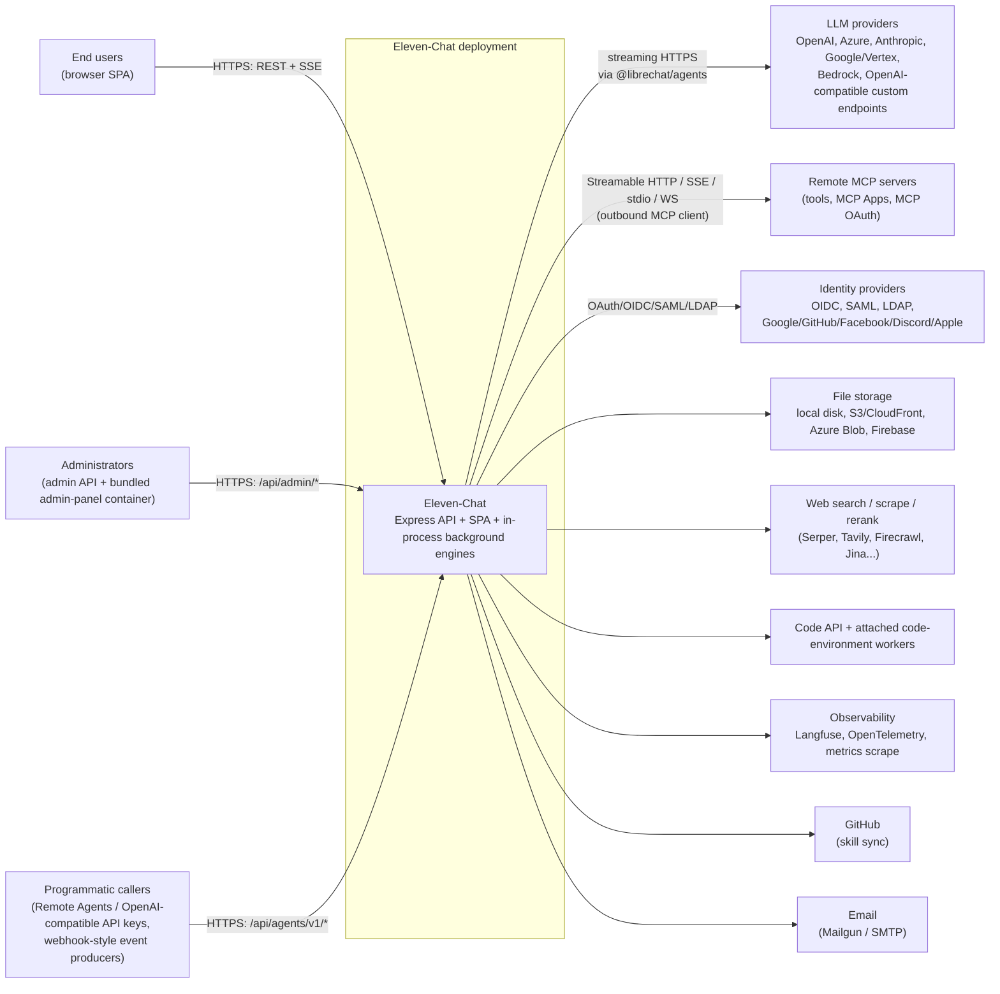
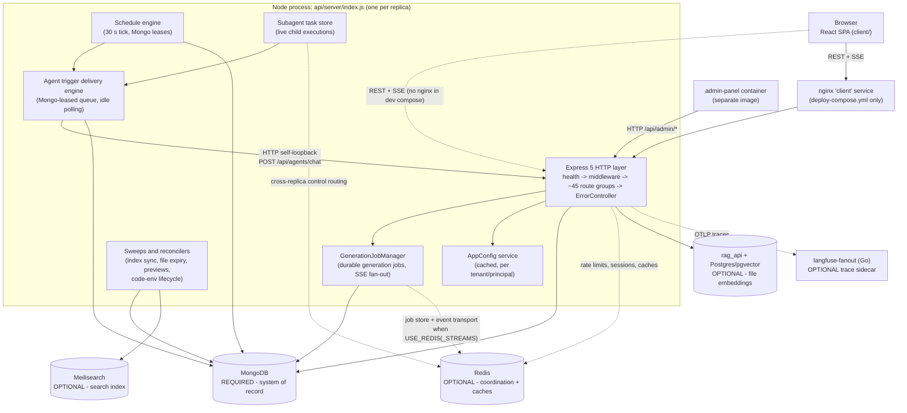
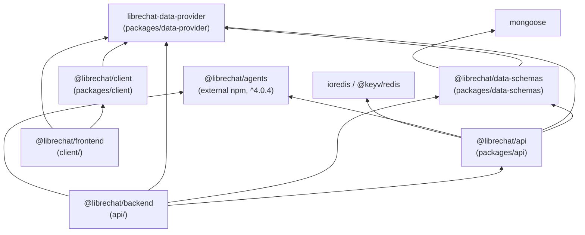
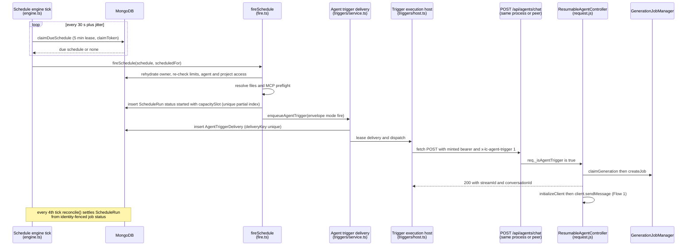
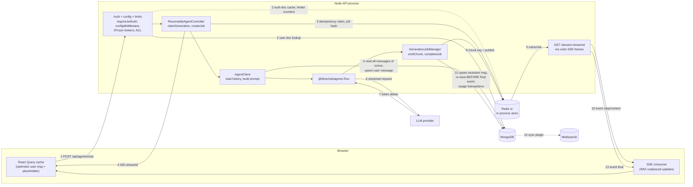
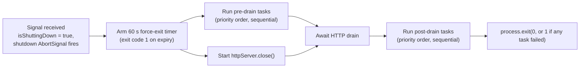

# 01 — System Architecture

> **Audience:** developers maintaining or extending Eleven-Chat (a heavily customized LibreChat
> fork). **Read first:** [00 — Overview](./00-overview.md). **Deeper references:**
> [`PROJECT_MAP.md`](../../PROJECT_MAP.md) (what exists) and
> [`CRITICAL_FLOWS.md`](../../CRITICAL_FLOWS.md) (how six key flows run, with the "why").
>
> **Evidence conventions.** Claims are labeled **Verified** (read in source during the research
> pass behind this guide), **Inferred** (strongly supported but not traced line by line), or
> **Unknown**. File:line citations were taken at commit `f28809c` and will drift; treat them as
> "last known location". Where this page disagrees with `PROJECT_MAP.md` or `CRITICAL_FLOWS.md`,
> this page records the newer reading and says so.

---

## Contents

1. [Architectural style: a modulith](#1-architectural-style-a-modulith)
2. [System context](#2-system-context)
3. [Runtime processes and containers](#3-runtime-processes-and-containers)
4. [Module boundaries and responsibilities](#4-module-boundaries-and-responsibilities)
5. [Dependency direction: compile time vs. runtime](#5-dependency-direction-compile-time-vs-runtime)
6. [Frontend/backend communication](#6-frontendbackend-communication)
7. [Synchronous vs. asynchronous execution](#7-synchronous-vs-asynchronous-execution)
8. [Data ownership and data flow](#8-data-ownership-and-data-flow)
9. [External integrations](#9-external-integrations)
10. [Configuration boundaries](#10-configuration-boundaries)
11. [Startup and shutdown lifecycle](#11-startup-and-shutdown-lifecycle)
12. [Design trade-offs and constraints](#12-design-trade-offs-and-constraints)
13. [Where to go next](#13-where-to-go-next)

---

## 1. Architectural style: a modulith

**Verified.** Eleven-Chat is **one deployable Node/Express backend plus one React SPA**, organized
as an npm-workspaces monorepo (`package.json` workspaces: `api`, `client`, `packages/*`) and
built with Turborepo (`turbo.json`). `PROJECT_MAP.md` §1 calls it a *modulith*, and that label
fits the code better than any layered-pattern name:

| Property | What the code shows | Evidence |
|---|---|---|
| One deployable backend | A single Express process serves REST, SSE, and (in production) the built SPA. Background work runs **inside the same process**; there is no separate worker binary. | `api/server/index.js` (`app.listen`, post-listen subsystem init); `Dockerfile` `CMD ["npm","run","backend"]` |
| Internal modules with build-time boundaries | Typed library packages (`packages/api`, `packages/data-schemas`, `packages/data-provider`, `packages/client`) each have their own `package.json`, build, and test config. The workspace dependency graph has no cycles (see §5). | each `packages/*/package.json`; `turbo.json` |
| Dependency injection at module seams | Modules receive their database methods, caches, and stores from the caller (`createModels(mongoose)`, `createMethods(mongoose, deps)`, `createAppConfigService(deps)`, `IJobStore` implementations chosen by `createStreamServices()`). | `api/models/index.js`, `packages/api/src/app/service.ts:350`, `packages/api/src/stream/createStreamServices.ts` |
| Optional sidecars, not services | Mongo is required. Meilisearch, Postgres/pgvector + `rag_api`, and Redis are optional. The same code runs with or without them. | `docker-compose.yml`, `packages/api/src/cache/cacheConfig.ts` |

**What it is not.** It is not microservices: the sidecars are infrastructure, not business
services, and no business logic runs outside the Node process. The only exception is the
optional Go `otel/langfuse-fanout/` sidecar, which only forwards traces. "MVC",
"Clean", or "Hexagonal" are not good labels either. There is no consistent
controller/service/repository layering: some routes call `packages/data-schemas` methods
directly, some call `packages/api` handler factories, and some still hold orchestration logic
inline (see §4.1). The one place a ports-and-adapters shape clearly shows up is the
**storage/coordination seam** (`IJobStore`/`IEventTransport`, `ServerConfigsRepositoryInterface`,
Keyv cache adapters). It is a local pattern, not the whole system's style.

**The fork's defining shape (Verified, `CRITICAL_FLOWS.md` Flow 1).** Almost every chat turn,
including plain single-model chat, goes through the **agents** endpoint (using an *ephemeral
agent* when the user has not picked a saved one). It runs as a **durable server-side generation
job** that is separate from the HTTP connection that started it. Most of the system's
complexity follows from that one decision.

---

## 2. System context

**In plain language.** People reach the system through three doors. The browser SPA uses
REST plus Server-Sent Events. Administrators use the `/api/admin/*` routes, either through the
SPA's dashboard routes or the separate bundled `admin-panel` container that `docker-compose.yml`
starts. Programmatic callers use API-key-authenticated routes mounted under `/api/agents/v1/*`
(`api/server/routes/agents/index.js:138-152`, before the router-wide `requireJwtAuth`). Every
outbound integration starts from inside the single Eleven-Chat process. In particular, provider
SDK calls happen inside the external `@librechat/agents` package, not in route code
(**Verified**: the only production `Run.create(...)` call is `packages/api/src/agents/run.ts:3145`;
the only direct `openai` SDK imports are the legacy Assistants initializers). The list of
integrations comes from `.env.example` section headings and the call sites cited in §9. The
Code API / attached-environment worker relationship is described in `CONTEXT.md` ("Attached code
environment") and is **Inferred** at the transport level.

---

## 3. Runtime processes and containers

### 3.1 Container view

This adapts the flowchart in `PROJECT_MAP.md` §1. That flowchart was re-verified and is still
accurate. The version below adds the in-process engines and how each sidecar is used.

**In plain language.** Each replica is one Node process (`npm run backend` →
`node api/server/index.js`). Inside it, besides the HTTP layer, several long-lived engines run as
async loops: the generation-job manager, the schedule engine, the agent-trigger delivery engine,
the subagent task store, and assorted sweeps. They all treat **MongoDB as the durable source of
truth**. When **Redis** is configured, the replicas use it to share live state: the job
store/event transport, rate-limit counters, OAuth handshake sessions, and caches. When Redis is
not configured, every one of those has an in-process fallback. A notable detail: background
work such as schedules, subagent completion wakeups, and webhook events does **not** call the
chat engine directly. It **POSTs back to the server's own `/api/agents/chat` route** (§7.3).

### 3.2 Process and sidecar inventory

| Process / container | Required? | Role | What breaks without it | Evidence |
|---|---|---|---|---|
| Node API (`api/server/index.js`) | Yes | All HTTP, SSE, background engines; serves SPA in production | Everything | `package.json` `backend` script; `Dockerfile` |
| MongoDB | **Yes** | System of record for every durable entity, including queues and leases | Process throws at module load if `MONGO_URI` is unset | `api/db/connect.js:6-11` |
| Redis | No | Cross-replica coordination and caches (§8) | Multi-replica correctness (resume on another replica, shared limits, schedule arming) — see [04 — Redis](./04-redis.md) | `packages/api/src/cache/cacheConfig.ts`, `createStreamServices.ts` |
| Meilisearch | No | Full-text conversation/message search index | Search; sync errors are suppressed in the global `uncaughtException` handler | `api/db/indexSync.js`; `packages/data-schemas/src/models/plugins/mongoMeili.ts`; `api/server/index.js:560-641` |
| `rag_api` + Postgres/pgvector | No | File embedding / retrieval for RAG | File-search tool | `RAG_API_URL` in `api/server/services/Files/VectorDB/crud.js` |
| `admin-panel` | No | Separate admin UI image calling the admin API | External admin UI only | `docker-compose.yml`, `deploy-compose.yml` |
| nginx `client` | No | TLS/static front in the production-style compose | — | `deploy-compose.yml` |
| `langfuse-fanout` (Go) | No | Fans agent traces out to tenant + central Langfuse projects | Per-tenant trace fan-out | `otel/langfuse-fanout/`, `docker-compose.langfuse-fanout.yml` |

### 3.3 Alternate entry point: `api/server/experimental.js`

**Verified.** `npm run backend:experimental` starts a **Node `cluster`** primary that forks
`CLUSTER_WORKERS` (default 4) Express workers, "to simulate multi-pod environment"
(`api/server/experimental.js:104,189-190`). It flushes Redis on startup when `USE_REDIS` is set,
uses a 10 s cluster force-exit budget instead of the 60 s coordinator (`CLUSTER_FORCE_EXIT_MS`),
and **deliberately does not arm the schedule engine** (comment at `experimental.js:363`). Treat it
as a multi-process test harness, not the production entry point. Whether it is meant to become one
is **Unknown**.

---

## 4. Module boundaries and responsibilities

The boundary rules come from the root `AGENTS.md`. The "current state" notes come from the
research pass. Read each block as: **owns / depends on / exposes / must not assume**.

### 4.1 `api/` — legacy Express wiring (CommonJS, `@librechat/backend`)

| | |
|---|---|
| **Owns** | Process entry (`api/server/index.js`), middleware ordering, route registration (`api/server/routes/index.js`, ~45 pass-through `require`s), Passport strategy registration (`api/strategies/`), Mongo connection (`api/db/connect.js`), the cache registry (`api/cache/getLogStores.js`), and wiring of `packages/*` factories to concrete dependencies (`api/models/index.js`). |
| **Depends on** | `@librechat/api`, `@librechat/data-schemas`, `librechat-data-provider`, `@librechat/agents` (all declared in `api/package.json`). |
| **Exposes** | HTTP routes only. `module.exports = app` exists for supertest. No package imports `api/`. |
| **Must not assume** | **The rule (AGENTS.md):** `/api` holds wiring, not behavior. A new branch, helper, validation step, or service call belongs in `packages/api`, and the CJS file keeps only requires, route registration, and the call into TS. **Current state (Verified, not the rule):** `api/` is still about 88k non-test lines and holds real logic. Examples: deletion orchestration with retry loops and fencing in `api/server/routes/convos.js:284-456`; multi-strategy auth sequencing in `api/server/middleware/requireJwtAuth.js:91-215`; the 3,679-line `api/server/controllers/agents/request.js` (job claim, save-ordering invariants, error/abort handling); the 6,424-line `api/server/controllers/agents/client.js`; and the history tree-walk in `api/app/clients/BaseClient.js`. The model of the intended shape is `api/server/services/Files/routing.js` ("Wiring only"). Treat existing logic in `api/` as legacy to migrate when touched, not as a precedent. See [13 — Decisions and limitations](./13-architecture-decisions-and-limitations.md#r7-business-logic-living-in-api-cjs). |

### 4.2 `packages/api` — backend behavior (TypeScript, `@librechat/api`)

| | |
|---|---|
| **Owns** | Agents runtime integration (`agents/`: initialize, run, usage, HITL, subagents, triggers, queued turns), provider config builders (`endpoints/`), resumable streaming (`stream/`), MCP (`mcp/`), config loading/caching (`app/loader.ts`, `app/service.ts`), shutdown coordination (`app/shutdown.ts`), cache primitives (`cache/`), schedules (`schedules/`), auth helpers (`auth/`), security headers/CSP/SSRF guards (`security/`, `auth/domain.ts`), error helpers (`utils/errors.ts`, `middleware/error.ts`). About 281k non-test lines. |
| **Depends on** | `@librechat/data-schemas`, `librechat-data-provider`, `@librechat/agents`; infrastructure clients (`ioredis`, `@keyv/redis`) are built in `cache/redisClients.ts`. |
| **Exposes** | Factories and handlers consumed by `api/` (`createUserPreferencesHandler`, `createImportHandler`, `createAppConfigService`, `createStreamServices`, ...), the `GenerationJobManager` singleton, `ErrorController`, and middleware. |
| **Must not assume** | That Redis exists. Every Redis consumer has an in-memory or no-op path (`cacheFactory.ts`; `createStreamServices.ts:105-111`). That it runs in a single process (see the schedule engine's `isTopologySafeToArm`, §7.2). That it may reach for app singletons: AGENTS.md says code here "receives its config, database methods and clients from the caller". **Exception, current state:** `MCPManager.getInstance()` / `MCPServersRegistry.getInstance()` (`packages/api/src/mcp/MCPManager.ts:140,204`) is the static-singleton shape AGENTS.md says to stop extending. Exported signatures should not use Mongoose types. AGENTS.md says that boundary "already leaks", so do not widen it. |

### 4.3 `packages/data-schemas` — persistence contracts (TypeScript, `@librechat/data-schemas`)

| | |
|---|---|
| **Owns** | Every Mongoose schema (`src/schema/`), model registration with tenant-isolation and Meilisearch plugins (`src/models/`), all query/mutation methods (`src/methods/`, composed by `createMethods(mongoose, deps)`), symmetric crypto (`src/crypto/index.ts`), packaged migrations (`src/migrations/`), transaction-support probing (`src/utils/transactions.ts`), and the shared `logger`. |
| **Depends on** | `librechat-data-provider` and `mongoose`. Caches arrive by injection (`CreateMethodsDeps.getCache`), so it never imports Redis. |
| **Exposes** | `createModels`, `createMethods`, types, `runAsSystem`, `logger`, crypto helpers, migration functions. |
| **Must not assume** | That multi-document transactions are available. Standalone Mongo and older DocumentDB may not support them, so callers probe with `getTransactionSupport` (`src/utils/transactions.ts`; `packages/api/src/acl/accessControlService.ts:420-447`). Callers must not treat `null` as a query failure: AGENTS.md reserves `null` for documented absence. `src/methods/prompt.ts` still returns `{ message }` on failure and is named in AGENTS.md as the pattern not to extend. |

### 4.4 `packages/data-provider` — shared contracts (`librechat-data-provider`)

| | |
|---|---|
| **Owns** | `configSchema` (`src/config.ts`, 5,557 lines; every `librechat.yaml` key), the file-config schema (`src/file-config.ts`), endpoint/provider enums (`src/schemas.ts`), ACL bit definitions (`src/accessPermissions.ts`), React Query keys (`src/keys.ts`), and the browser API client (`src/data-service.ts` → `src/api-endpoints.ts` → `src/request.ts`, including token-refresh interceptors). |
| **Depends on** | No workspace packages. It is the root of the graph. |
| **Exposes** | Types, zod schemas, enums, the `dataService` HTTP client, payload builders (`src/createPayload.ts`). |
| **Must not assume** | That it runs on the server. It is bundled into the browser, so it must stay free of Node-only APIs and secrets (**Inferred** from its consumers; `client/` depends on it). It is the only typed package whose build type-checks (`tsdown && tsc -p tsconfig.build.json`). Build it from the root with `npm run build:data-provider`. |

### 4.5 `packages/client` — shared UI primitives (`@librechat/client`)

| | |
|---|---|
| **Owns** | Design-system components (Button, Dialog, `DropdownPopup`, Composer, DataTable, ...), semantic theme tokens (`src/theme/tokens.css`), the Tailwind preset. |
| **Depends on** | `librechat-data-provider` only. |
| **Exposes** | React components and theme utilities consumed by `client/`. |
| **Must not assume** | App state: it must not reach into `client/src/store` (**Inferred**: it cannot import it as a workspace dependency, and AGENTS.md's "pass it in" rule applies). Raw palette colors are banned in favor of semantic tokens. |

### 4.6 `client/` — the React SPA (`@librechat/frontend`)

| | |
|---|---|
| **Owns** | Routes, feature components, Recoil (legacy) and Jotai (new) state, React Query hooks (`client/src/data-provider/`), SSE transports (`client/src/hooks/SSE/`), localization. |
| **Depends on** | `@librechat/client`, `librechat-data-provider`. At runtime it talks to the backend over HTTP only. |
| **Exposes** | Nothing. It is a leaf. |
| **Must not assume** | That the JWT carries a role. Client-side role gating is cosmetic only, because the server re-reads the user on every request (`CRITICAL_FLOWS.md` Flow 2). That a `200` from `POST /api/agents/chat` means the model answered: it only confirms a job was created. That it can re-derive cost from base rates: the displayed and billed cost both come from `computeUsageCostUSD`. That Jotai is scoped: there is no Jotai `<Provider>`, only the implicit default store (`client/src/App.jsx`; `AuthContext.tsx:60-66`). See [03 — Frontend](./03-frontend.md). |

### 4.7 External: `@librechat/agents` (`^4.0.4`)

| | |
|---|---|
| **Owns** | LangGraph-style `Run` execution, provider SDK instantiation and stream normalization, the subagent tool surface (`InMemorySubagentTaskStore` base class). |
| **Depended on by** | `api/` and `packages/api`. |
| **Must not assume** | That this repo controls its internals. Adding a new wire protocol requires changes there (`CRITICAL_FLOWS.md` Flow 3). This repo plugs in through config objects (`InitializeResultBase`) and interfaces (`SubagentThreadTaskStore extends InMemorySubagentTaskStore`, `packages/api/src/agents/subagentThreads.ts:631`). |

---

## 5. Dependency direction: compile time vs. runtime

### 5.1 Compile-time (npm workspace) dependencies

**Verified** from each workspace's `package.json` (dependencies + peerDependencies) and the task
graph in `turbo.json`.

**In plain language.** Arrows point from a consumer to what it imports. `librechat-data-provider`
sits at the bottom and is shared by the browser and the server. The server half builds upward
through `data-schemas` (persistence) to `packages/api` (behavior) to `api/` (wiring). The browser
half is `packages/client` (primitives) to `client/` (app). The two halves meet **only** in
`data-provider`. Neither `client/` nor `packages/client` can import any server package, and no
package imports `api/`. This is also the build order: `npm run build:packages` builds
data-provider, then data-schemas, then api, then client-package (`turbo.json` encodes the
`data-schemas#build` / `api#build` dependencies on `data-provider#build`).

**Allowed direction for new code:** always downward in this graph. A change that would need
`packages/data-schemas` to import `packages/api`, or `packages/api` to import from `api/`, is a
boundary violation. Pass the dependency in instead (AGENTS.md, "Modules take their
dependencies").

### 5.2 Runtime communication

Compile-time imports say nothing about network calls. At runtime the picture is:

| From | To | Mechanism | Notes |
|---|---|---|---|
| Browser (`client/`) | Node API | HTTPS REST (axios via `packages/data-provider/src/request.ts`) and SSE (`sse.js` / authenticated `fetch`) | No WebSockets for chat (§6) |
| Admin-panel container | Node API | HTTP `/api/admin/*` | Separate image |
| Node API | Node API (itself) | **HTTP self-loopback** `POST /api/agents/chat` with a minted bearer token and `x-lc-agent-trigger: 1` | Base URL is `AGENT_TRIGGERS_SELF_URL` or the bound listener address (`packages/api/src/agents/triggers/service.ts:369-379`, `host.ts:628-659`) |
| Node API | MongoDB | Mongoose connection pool (`api/db/connect.js`) | `bufferCommands: false`: fail fast while disconnected |
| Node API | Redis | Two clients: `ioredisClient` (Lua, Streams, pub/sub, limiter, sessions) and `keyvRedisClient` (Keyv caches) (`packages/api/src/cache/redisClients.ts`) | Only when `USE_REDIS=true` |
| Node API | Meilisearch | HTTP, via `indexSync` and the `mongoMeili` model plugin | Only when `MEILI_HOST` + `MEILI_MASTER_KEY` are set |
| Node API | `rag_api` | HTTP (`RAG_API_URL`) | `rag_api` owns the Postgres/pgvector connection |
| Node API | LLM providers | HTTPS streaming inside `@librechat/agents`, with SSRF-safe connect for OpenAI/custom and Anthropic clients (`packages/api/src/auth/agent.ts:196`) | |
| Node API | MCP servers | MCP SDK transports (stdio, Streamable HTTP, SSE, outbound WS) | Static `MCPManager` singleton |
| Node replica | Node replica | Only **indirectly**, through Redis (pub/sub, Streams, leader key) or Mongo (leases) | No direct replica-to-replica RPC exists (**Inferred** from the absence of any such client) |

---

## 6. Frontend/backend communication

**Verified.** Communication is **REST plus Server-Sent Events**. There is no socket.io, and the `ws`
package is only a transitive dependency of provider SDKs and test tooling. No application code
imports it. The only WebSocket usage is LibreChat acting as an *outbound* MCP client
(`docs/mcp-apps.md`).

- **REST:** components call React Query hooks in `client/src/data-provider/`, which call
  `dataService.*` → `api-endpoints.ts` (URL builders) → `request.ts` (axios). `request.ts`
  refreshes the access token before a request when it is near expiry, and retries once after
  refreshing on a 401. `_authenticatedFetch` repeats the same logic for streaming `fetch` paths.
  Query and mutation keys live in `packages/data-provider/src/keys.ts`.
- **Chat streaming (agents endpoint) uses two requests** (`CRITICAL_FLOWS.md` Flow 1):
  1. `POST /api/agents/chat[/:endpoint]` returns `{ streamId, conversationId, status: 'started' }`
     almost immediately (`streamId === conversationId`).
  2. `GET /api/agents/chat/stream/:streamId` is the SSE subscription. On reconnect the client adds
     `resume=true&generationCreatedAt=<fence>` and receives a **full snapshot**
     (`resumeState.aggregatedContent`), not a replay from a byte offset.
- **Legacy Assistants endpoint:** one `sse.js` POST that *is* the stream. The transport is chosen
  per endpoint in `client/src/hooks/SSE/useAdaptiveSSE.ts`.
- **Auth on the wire:** `Authorization: Bearer <access JWT>` on API calls. The refresh token
  travels only as an `httpOnly`, `secure`, `sameSite=strict` cookie (`api/server/services/AuthService.js:705-746`).
  See [08 — Auth & security](./08-auth-security.md).

---

## 7. Synchronous vs. asynchronous execution

### 7.1 Three execution modes

| Mode | Examples | Lifetime bound | Failure surface |
|---|---|---|---|
| **Synchronous request/response** | `GET /api/convos`, `PATCH /api/user/preferences`, admin config writes | The HTTP request | `ErrorController` (`packages/api/src/middleware/error.ts:58-136`) or route-local handling |
| **Detached generation job** (the chat path) | `POST /api/agents/chat` → `GenerationJobManager` job → SSE subscribers | The job, not the connection. It survives tab close, navigation, and reconnect. | Persisted error turn written **before** the terminal `error` event (`completeJob` `beforeErrorPublication`, `request.js:3395-3436`) |
| **Background engines** (in-process loops) | Schedule engine, agent-trigger delivery, queued turns, subagent completion wakeups, sweeps | Process lifetime, with Mongo leases for recovery across processes | Durable rows (`ScheduleRun`, `AgentTriggerDelivery` dead letters, `QueuedTurn` terminal rows) and logs |

The detached job is the reason the POST handler responds *before* it initializes the agent
client. `initializeClient(...)` runs after the response, with `signal: job.abortController.signal`
threaded down to the provider call (`CRITICAL_FLOWS.md` Flow 1, step 3).

### 7.2 Background processing without a broker

**Verified** (full detail in [09 — Background processing](./09-background-processing.md)):

- **No `node-cron`, `bull`/`bullmq`, or `agenda`.** `croner` is used only to compute the next
  occurrence time (`packages/api/src/schedules/cadence.ts`).
- **Schedule engine:** one `setTimeout` loop per process, ticking every 30 s with up to 2 s of
  jitter. It claims due schedules under a 5-minute Mongo lease and reserves generation capacity
  through a **unique partial index** on `ScheduleRun.capacitySlot` rather than a count-then-insert
  (`packages/api/src/schedules/engine.ts`, `fire.ts`, `capacity.ts`;
  `packages/data-schemas/src/schema/scheduleRun.ts:180-186`). It is **disabled by default**
  (`interface.schedules`), and the `SCHEDULES_DISABLED` env kill switch wins over any override.
- **Agent trigger delivery:** one Mongo collection (`AgentTriggerDelivery`) holds queue state,
  leases, retries, ordering lanes, and dead letters. Each replica polls Mongo even when idle,
  starting at 30 s and backing off to 2 minutes (configurable under
  `endpoints.agents.eventDriven.idlePolling`). Delivery is at-least-once with stable idempotency
  identity (`packages/api/src/agents/triggers/README.md`, "Guarantees").
- **Topology guard:** the schedule engine only arms when the job store is Redis-backed or the
  operator sets `SCHEDULES_SINGLE_PROCESS=true` (`isTopologySafeToArm`,
  `packages/api/src/schedules/service.ts:98-100`). With a process-local job store, a peer replica
  could "reconcile" a run it cannot see. If the engine does not arm, schedule write routes return
  503 for the life of the process (`api/server/index.js:516-526`).

### 7.3 Representative sequence: a scheduled run firing into chat

Adapted from the research trace of `packages/api/src/schedules/{engine,fire}.ts`,
`packages/api/src/agents/triggers/{service,host}.ts`, and
`api/server/controllers/agents/request.js:983-1107`. For the human-initiated chat turn, see the
full diagram in [`CRITICAL_FLOWS.md` Flow 1](../../CRITICAL_FLOWS.md#flow-1-message-lifecycle-most-important).

**In plain language.** The engine never runs the agent itself. It wins a Mongo lease on a due
schedule. It then re-checks, *as the schedule owner and right now*, that the run is still allowed:
the owner exists, policy and balance limits still hold, and the agent is still reachable. Only
then does it compete for a global capacity slot, which the database arbitrates with a unique
index. The run is handed to the general trigger queue as a durable row. A delivery host leases
that row and makes an ordinary authenticated HTTP request to the server's own chat route, so a
scheduled turn passes through the same validation, ACL, rate-limiting, and job machinery as a
human message. Settlement happens asynchronously: a later tick reads the job's status and marks
the `ScheduleRun` as succeeded, errored, or interrupted. Subagent completion wakeups and webhook
events (`POST /api/agents/v1/events`) use the same queue and self-loopback path.

---

## 8. Data ownership and data flow

### 8.1 Who owns what

| Store | Owns | Durability | Owner module |
|---|---|---|---|
| **MongoDB** | Users, sessions, conversations, messages, files metadata, agents, ACL entries, roles, config overrides (`config` schema: per-principal `overrides` + `priority`), balances/transactions, schedules and runs, trigger deliveries, queued turns, audit log, bans (`ViolationTypes.BAN` via `keyvMongo`) | **System of record**. Losing it is data loss. | `packages/data-schemas` |
| **Redis** (optional) | Live job hash, Redis Stream chunk log, pub/sub channel per stream, steer queues and receipts, idempotency claims, leader key, rate-limit and concurrency counters, OAuth/OIDC/SAML handshake sessions, violation scores, read-through caches (roles, auth user doc, MCP server configs, tool cache, ...) | **TTL-bounded only**: minutes, at most 24 h (`requiresAction`). Losing it means a dropped live stream, a cache-miss stampede, or a re-election. It never loses a persisted record. | `packages/api/src/cache`, `packages/api/src/stream` |
| Process memory | The same live state when Redis is off; live subagent executors (always) | Lost on restart | `packages/api` |
| Meilisearch | Derived search index of conversations/messages | Rebuildable from Mongo (`indexSync`) | `mongoMeili` plugin |
| Postgres/pgvector (`rag_api`) | File embeddings | Owned by the external `rag_api` service | External |
| Object storage / local disk | File bytes | Per strategy (`api/server/services/Files/strategies.js`) | `api/` + `packages/api` |

**Deliberate exceptions worth knowing (Verified):**

- `FORCED_IN_MEMORY_CACHE_NAMESPACES` defaults to `CONFIG_STORE,APP_CONFIG`, so YAML-derived config
  stays **per container** even with Redis on ("safe for blue/green deployments", `.env.example`).
- `PROMPT_GROUPS_ACCESS` is **never cached** because "a failed shared invalidation cannot fail
  closed" (`api/cache/getLogStores.js`).
- Some locks live in **Mongo, not Redis**, so they survive a Redis flush: skill-sync
  `lockOwner`/`lockExpiresAt` and `openidRefreshFlight.lockExpiresAt`.

### 8.2 How a chat message's data moves

**In plain language.** (1) The browser renders the user's message optimistically, then POSTs.
(2) Middleware authenticates by reading the **user document from Mongo**. The JWT carries no role.
An auth-user-doc cache and the limiter counters live in Redis when it is configured. (3) The
controller claims the request's idempotency key and creates the job in the job store, which is
Redis or in-process memory. (4) The POST returns right away. (5) The agent client loads **every**
message of the conversation from Mongo, walks the `parentMessageId` tree to the active branch, and
upserts the user message. (6–7) `@librechat/agents` streams to and from the provider. (8–10) Each
delta goes into the job store's chunk log and pub/sub channel, then reaches every SSE subscriber,
which may be on a different replica when Redis is used. (11) The assistant message is upserted by
`messageId`, and an **authoritative re-save happens before the `final` event**, so a client refetch
never sees stale data. (12) The Mongo model plugin mirrors the message to Meilisearch when search
is enabled. Within minutes, the Redis job keys expire or are deleted
(`completed` 300 s; chunk stream deleted on completion by default; `RedisJobStore.ts:1830-1849`),
leaving Mongo as the only copy. Details: [05 — Database](./05-database.md),
[04 — Redis](./04-redis.md).

---

## 9. External integrations

| Integration | Entry point in code | Selected by | Notes |
|---|---|---|---|
| LLM providers | `packages/api/src/endpoints/config/providers.ts` (`providerConfigMap`, `getProviderConfig`) → `initialize*` config builders → `Run.create` in `packages/api/src/agents/run.ts` | Agent/endpoint config, `librechat.yaml` `endpoints`, env keys or the `user_provided` sentinel | Provider SDK calls live in `@librechat/agents`. Ambiguous case-insensitive custom endpoint names throw on purpose (`CRITICAL_FLOWS.md` Flow 3). |
| MCP servers | `packages/api/src/mcp/` (`MCPManager`, registry, `tools.ts`, `oauth/`) | `librechat.yaml` `mcpServers`/`mcpSettings`, plus DB-stored MCP servers | Static singleton. Connections use SSRF-safe connect (`mcp/connection.ts`). MCP Apps: `docs/mcp-apps.md`. |
| Meilisearch | `api/db/indexSync.js`, `mongoMeili` plugin | `SEARCH`, `MEILI_HOST`, `MEILI_MASTER_KEY` | Derived index only |
| RAG (`rag_api` + pgvector) | `api/server/services/Files/VectorDB/crud.js` | `RAG_API_URL` | External service owns embeddings |
| OAuth / OIDC / SAML / LDAP | `api/strategies/*`, `api/server/socialLogins.js` | `ALLOW_SOCIAL_LOGIN`, provider env vars, `LDAP_URL` | `express-session` is mounted only for handshakes. Accounts are not auto-linked across providers by email (`socialLogin.js:89-96`). |
| File storage | `api/server/services/Files/strategies.js` | `fileStrategy` config | S3/CloudFront/Mistral OCR logic lives in `packages/api`. Local/Firebase/Azure is still CJS in `api/`. |
| Web search, code execution, speech, email | `.env.example` sections; `librechat.yaml` | Env + YAML | Not traced in depth in this guide |
| Observability | `LANGFUSE_*`, `OTEL_*`, `/metrics` (`METRICS_SECRET`) | Env | `otel/langfuse-fanout/` sidecar for per-tenant fan-out |
| GitHub (skills) | `packages/api/src/skills/sync/` | Admin config | Started fire-and-forget at boot (`initializeGitHubSkillSync`) |

---

## 10. Configuration boundaries

**Verified** (`CRITICAL_FLOWS.md` Flow 5, re-checked; detail in [00 — Overview](./00-overview.md)).

| Layer | Holds | Validated by | Scope | Changes take effect |
|---|---|---|---|---|
| **Environment** (`.env`, about 1,500 lines in `.env.example`) | Secrets (`JWT_SECRET`, `JWT_REFRESH_SECRET`, `CREDS_KEY`/`CREDS_IV`, provider keys), infrastructure (`MONGO_URI`, `REDIS_URI`, `USE_REDIS*`, `MEILI_*`, `RAG_API_URL`), process-level kill switches (`SCHEDULES_DISABLED`, `CSP_ENABLED`, `TRUST_TENANT_HEADER`, `CONFIG_BYPASS_VALIDATION`) | Ad hoc, per call site | Process | Restart |
| **`librechat.yaml`** (`CONFIG_PATH`) | Endpoints, MCP, file config, interface/theme, rate limits, summarization, schedules, agents capabilities, ... | `configSchema.strict().safeParse` (`packages/api/src/app/loader.ts`); unknown keys are errors | Deployment base config | Live reload. An invalid reload throws `ConfigReloadError` and keeps the last good config. An invalid startup config exits unless bypassed. |
| **DB-stored overrides** (`config` collection: `principalType`, `principalId`, `priority`, `overrides`) | Per tenant / role / user / group overrides written through the admin API | Admin config service (`packages/api/src/admin/config.ts`) | Principal | `invalidateConfigCaches(tenantId)` clears the base, override, tool, and MCP caches together |
| **Resolved `AppConfig`** | The merged view attached as `req.config` | `getAppConfig` (`packages/api/src/app/service.ts:479`) | Per request | Override cache TTL 60 s (`DEFAULT_OVERRIDE_CACHE_TTL`) |

Boundary rules:

- **YAML never reads raw env vars for its structure.** It can *reference* them as `${VAR}`
  placeholders, or set the sentinel `"user_provided"` to defer to per-user stored keys.
- **Failure policy is per call site.** `configMiddleware` fails open to the base/tenant config;
  `strictConfigMiddleware` → `resolveStrictAppConfig` uses `failClosed: true`
  (`packages/api/src/app/service.ts:292-296`). Use the strict variant on authorization-sensitive
  routes.
- **New levers belong in `configSchema`** with a default that reproduces today's behavior
  (AGENTS.md). Env-only switches "need a reason". Several existing levers are env-only, for
  example `STREAM_DELTA_COALESCE_MS`, `SCHEDULES_SINGLE_PROCESS`, and `CSP_ENABLED`.

---

## 11. Startup and shutdown lifecycle

### 11.1 Startup (Verified, `api/server/index.js`)

| Phase | Steps (in order) | Blocking? |
|---|---|---|
| Require time | Load credentials and module aliases. `configureFileConfigRegexEngine()` and `configureMessageFilterRegexValidator()` run at module load (`:94-97`). | Yes |
| Infrastructure | `waitForKeyvRedisClient()` (`:173`) → metrics → **`connectDb()`** (`:196`) → code-env lifecycle reconciler (not awaited) → `indexSync()` (fire-and-forget) | Mostly |
| Security headers | `createSecurityHeaders()` registered before any route, so even health checks get them (`:208-211`) | — |
| Seed | `runAsSystem(seedDatabase)`: roles, default roles, categories, system grants, run **serially** (`:225`; `api/models/index.js`). Orphaned-preview sweep is fire-and-forget. | Yes |
| Config | **`getAppConfig({ baseOnly: true })`** (`:233`) | Yes |
| Subsystems | Subagent task routing, background-task shutdown registration, agent event runtime, file storage, deployment plugins → skills (serial). GitHub skill sync and expired-file sweep are not awaited. Then tool-approval hooks, `performStartupChecks`, `updateInterfacePermissions`. | Yes |
| Routes | **`require('./routes')` only now**, because route modules build rate limiters from config at require time (`:276-278`) | Yes |
| HTTP chain | `/health`, `/livez`, `/readyz` first (`:328-335`) → global middleware → ~45 route mounts (`/api/files` is the only `await`ed mount) → `/api` 404 → SPA fallback → `ErrorController` last (`:460-471`) | — |
| Streams | `configureGenerationStreams()`: picks the Redis or in-memory job store and registers two shutdown tasks (`:132-167, 473`) | — |
| Listen | `app.listen(port, host)`. Default `3080`/`localhost`; `PORT=0` is allowed. | — |
| Post-listen | MCP init → OAuth reconnect manager → `checkMigrations()` → agent trigger service (needs the bound address) → schedule engine → **`serverReady = true`** (`:497-528`). Any failure here sets `serverReady=false` and calls `process.exit(1)`, so a half-initialized server never passes readiness. | Gates `/readyz` and chat start |

Two rules fall out of this. Liveness (`/livez`, `/health`) is up as soon as the HTTP server
listens. **Readiness (`/readyz`) is not** up until every post-listen subsystem has initialized.
Helm probes `/health` (`helm/librechat/values.yaml:222-229`), and the CI smoke test polls `/readyz`.
Second, startup is almost entirely a serial `await` chain. The research pass found no `Promise.all`
in the boot sequence (see [13](./13-architecture-decisions-and-limitations.md#r14-serial-startup-chain)).

### 11.2 Shutdown (Verified, `packages/api/src/app/shutdown.ts`)

One coordinator handles `SIGTERM`, `SIGINT`, `SIGQUIT`, and `SIGHUP`. The module comment explains
why: separate `process.on('SIGTERM')` handlers race Node's registration-order dispatch against the
HTTP drain. Modules register named tasks with a **phase** (`pre-drain` | `post-drain`, default
post-drain) and a **priority**.

| Phase | Registered task (priority) | What it does | Source |
|---|---|---|---|
| pre-drain | `generation job manager prepare` (100) | Stop admitting jobs, close SSE streams | `api/server/index.js:140-147` |
| pre-drain | subagent activity stream prepare (100) | Drain live activity publishing | `api/server/services/Endpoints/agents/subagentThreadStore.js:87-91` |
| pre-drain | schedule engine stop | Stop the timer and **await any in-flight tick**, so a claimed occurrence does not lose its loopback POST | `packages/api/src/schedules/engine.ts:691-700` |
| post-drain | `generation job manager` (100) | `GenerationJobManager.destroy({ settlementBudgetMs })`: spend the remaining budget minus a 10 s reserve waiting for detached generations to record provider drain | `api/server/index.js:149-167` |
| post-drain | subagent task store teardown (90) | Cancel locally owned children, wait up to 45 s, flush control receipts (up to 4 retries) | `subagentThreadStore.js:87-107`; `subagentThreads.ts:1140-1221` |

**What "graceful" means here.** Shutdown stops new work and waits, *within a budget*, for
in-flight work to reach a durably persisted terminal state. It does not guarantee every response
finishes. Work that outlives the 60 s timer is force-exited. The next process picks it up through
job-store recovery and the schedule engine's `reconcile()`. The cluster entry point
(`experimental.js`) uses a 10 s primary-imposed budget instead.

---

## 12. Design trade-offs and constraints

A short summary. Each item is expanded with evidence, impact, and severity in
[13 — Architecture decisions and limitations](./13-architecture-decisions-and-limitations.md).

| Decision | What it buys | What it costs | Status |
|---|---|---|---|
| Generation as a durable job, separate from HTTP (`GenerationJobManager`) | Survives network blips and tab close; multi-tab watch; Stop and resume share one mechanism; idempotent retried POSTs | An explicit job lifecycle, ordering invariants (save before `final`), and the largest files in the repo (`GenerationJobManager.ts` 9,785 lines, `request.js` 3,679 lines) | **Explicitly documented** (`CRITICAL_FLOWS.md` Flow 1) |
| Mongo-leased polling queues instead of a broker | One required datastore; recovery across restarts/replicas; works without Redis | Polling latency (30 s ticks; idle backoff up to 2 min), Mongo write load, custom lease/fence code to maintain | **Documented guarantees** (`triggers/README.md`); "why not a broker" is **Inferred** |
| Redis optional everywhere, behind interfaces | Single-container self-hosting stays simple | Multi-replica correctness silently depends on `USE_REDIS`. A failure building the Redis job store degrades to per-process memory. | **Verified** behavior; operational constraint |
| Background work re-enters through HTTP self-loopback | One admission path (auth, ACL, limits, controller) for humans and machines | An extra HTTP hop; the server must be able to reach itself (`AGENT_TRIGGERS_SELF_URL`) | **Verified** mechanism; rationale **Inferred** |
| JWT without role; user re-read every request | Revocation and password resets take effect on the next request | One DB read per request, so the auth user-doc cache is security-critical (invalidate on every user mutation) | **Explicitly documented** (`CRITICAL_FLOWS.md` Flow 2, AGENTS.md) |
| Legacy wiring in `api/`, logic in `packages/api` | Typed, testable, extractable modules | A long-running, partial migration: about 88k lines of CJS remain, some with real logic | **Explicit rule**, partial adoption |

---

## 13. Where to go next

- [00 — Overview](./00-overview.md): setup, configuration surface, deployment
- [02 — Backend](./02-backend.md): middleware chain, routing patterns, error handling
- [03 — Frontend](./03-frontend.md): provider stack, state ownership, SSE client
- [04 — Redis](./04-redis.md): every key, TTL, and fallback
- [05 — Database](./05-database.md): schemas, indexes, transactions, migrations
- [09 — Background processing](./09-background-processing.md): schedules, triggers, subagents, shutdown
- [13 — Architecture decisions and limitations](./13-architecture-decisions-and-limitations.md): rationale, risks, technical debt
- [`PROJECT_MAP.md`](../../PROJECT_MAP.md) and [`CRITICAL_FLOWS.md`](../../CRITICAL_FLOWS.md): the original deep references (see the corrections recorded in doc 13)
