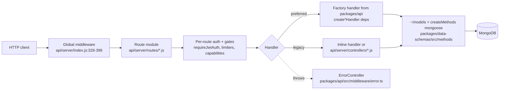
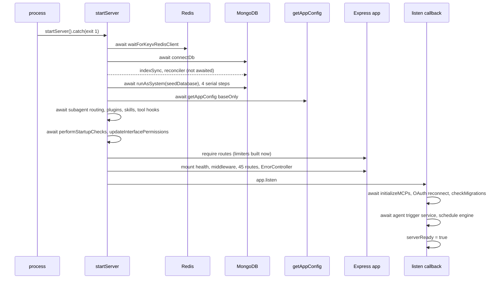
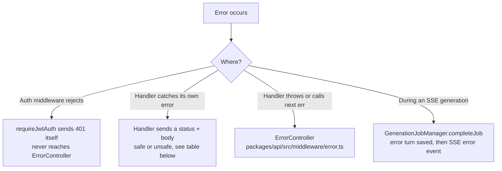
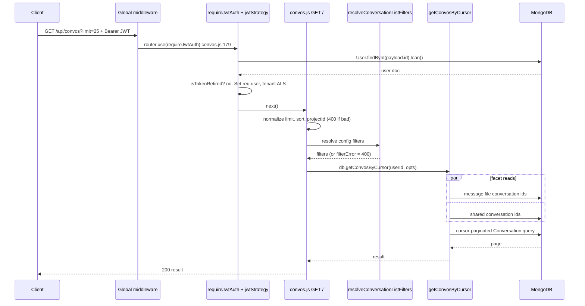
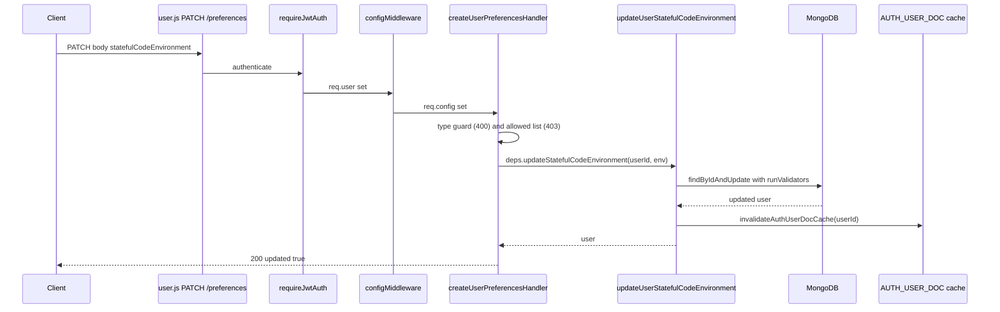
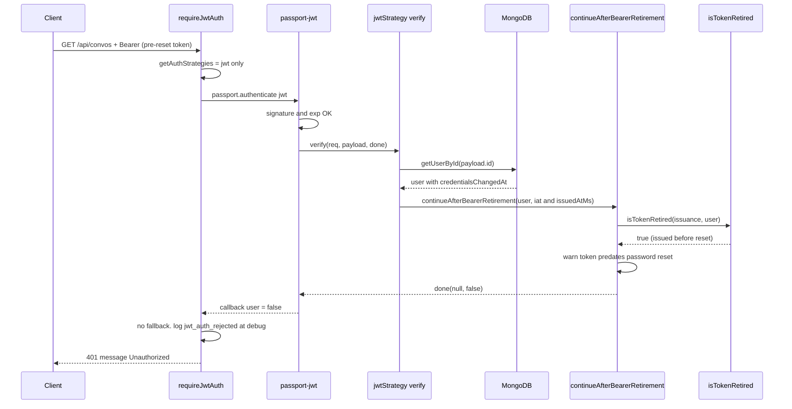

# 02 — Backend Internals

> **Audience:** developers who need to change, debug, or extend the Express backend.
> **Scope:** how a request gets from the socket to MongoDB and back — startup, middleware, routing,
> layering, validation, errors, logging, and the seams to the database, Redis, background work,
> files, and LLM providers.
> **Prerequisites:** [00-overview.md](./00-overview.md) for what the product is, and
> [01-architecture.md](./01-architecture.md) for how the workspaces fit together.
> **Deeper dives elsewhere:** Redis → [04-redis.md](./04-redis.md) · MongoDB →
> [05-database.md](./05-database.md) · endpoint catalog → [07-api-reference.md](./07-api-reference.md)
> · auth and security → [08-auth-security.md](./08-auth-security.md) · background work →
> [09-background-processing.md](./09-background-processing.md) · building a feature end to end →
> [10-feature-development.md](./10-feature-development.md) · tests and debugging →
> [11-testing-debugging.md](./11-testing-debugging.md).
> Source maps: [../../PROJECT_MAP.md](../../PROJECT_MAP.md) (§3, §4) and
> [../../CRITICAL_FLOWS.md](../../CRITICAL_FLOWS.md) (Flow 1 message lifecycle, Flow 2 auth).

**Evidence labels used throughout**

| Label | Meaning |
|---|---|
| **Verified** | Read directly in the source at the cited `file:line`. |
| **Inferred** | Reasoned from adjacent verified code; not read line by line. |
| **Unknown** | Not established. Say so rather than guess. |

Line numbers are from the tree at the time of writing. They drift. If a citation is a few lines
off, search for the quoted identifier.

---

## Contents

1. [The mental model in one picture](#1-the-mental-model-in-one-picture)
2. [Entry point and initialization](#2-entry-point-and-initialization)
3. [The middleware chain](#3-the-middleware-chain)
4. [Routing and endpoint organization](#4-routing-and-endpoint-organization)
5. [Layers: routes, controllers, services, data methods](#5-layers-routes-controllers-services-data-methods)
6. [Request validation](#6-request-validation)
7. [Authentication and authorization in the request path](#7-authentication-and-authorization-in-the-request-path)
8. [Error handling](#8-error-handling)
9. [Logging](#9-logging)
10. [Database access (brief)](#10-database-access-brief)
11. [Redis integration (brief)](#11-redis-integration-brief)
12. [Background work and events (brief)](#12-background-work-and-events-brief)
13. [Files, streaming, and outbound APIs](#13-files-streaming-and-outbound-apis)
14. [Execution trace A: a successful request](#14-execution-trace-a-a-successful-request)
15. [Execution trace B: a failed request](#15-execution-trace-b-a-failed-request)
16. [How to trace any request yourself](#16-how-to-trace-any-request-yourself)
17. [Testing and extension points](#17-testing-and-extension-points)
18. [Findings, corrections, and unknowns](#18-findings-corrections-and-unknowns)

---

## 1. The mental model in one picture

The backend is one Node.js process running Express 5. It is split across three workspaces, and
the split matters more than anything else in this document:

| Workspace | Language | Role | Rule (from root `AGENTS.md`) |
|---|---|---|---|
| `api/` | CommonJS | Legacy Express wiring: `server/index.js`, routes, middleware, some controllers and services | "Wiring, not behavior." New logic does not belong here. |
| `packages/api` (`@librechat/api`) | TypeScript | Real backend behavior: auth gates, handler factories, `ErrorController`, stream job manager, agents runtime, file-storage backends | New backend behavior goes here. Modules receive their dependencies from the caller. |
| `packages/data-schemas` (`@librechat/data-schemas`) | TypeScript | Mongoose schemas, every database method, logger, tenant context | Database contracts live here. |



A useful shorthand when you open any backend file: **"Is this file deciding something, or only
connecting things?"** In `api/` the answer should be "connecting." Section 5 shows where it is
not.

---

## 2. Entry point and initialization

**File:** `api/server/index.js` (644 lines, **Verified**). `PROJECT_MAP.md` §3 calls it "~460
lines". It has grown since.

### What it does

`startServer()` (`index.js:172`) builds the Express app in a strict order: connect to Redis and
Mongo, seed and load config, initialize subsystems, *then* load the route modules, mount the
middleware and routes, and listen. A second phase runs inside the `app.listen` callback. Only after
that phase finishes does `/readyz` report ready.

### Why the order is strict

Rate limiters are built when their modules are `require()`d. They read limits from
`librechat.yaml`. So the route modules must load **after** `performStartupChecks(appConfig)` has
applied config. The code says so directly (**Verified**, `index.js:276-278`):

```js
/* Route modules build their rate limiters as they load, so they load only after the
 * startup checks have applied `rateLimits` from librechat.yaml. */
const routes = require('./routes');
```

You can see the mechanism in any limiter, for example `rateLimit(limiterOptions)` running at
module top level in `api/server/middleware/limiters/emailChangeLimiter.js:38`.

**Consequence for you:** do not `require('./routes')` or any limiter module earlier in startup. A
limiter built before config loads silently uses defaults.

### Startup sequence (Verified, `api/server/index.js`)

| # | Step | Line(s) | Awaited? |
|---|---|---|---|
| 0 | `require('../config/credentials')`, `module-alias` setup | 1, 6 | n/a (require time) |
| 0 | `configureFileConfigRegexEngine()`, `configureMessageFilterRegexValidator()` (ReDoS-safe regex engines) | 94, 97 | require time, before `startServer()` |
| 0 | `rejectChatStartsUntilReady`, `rejectScheduleWritesUntilReady` defined (readiness gates) | 115-130 | n/a |
| 1 | `waitForKeyvRedisClient()` | 173 | yes |
| 2 | `createMetrics(...)`. Warns if `METRICS_SECRET` unset (`/metrics` then 401s everyone) | 174-191 | sync |
| 3 | `connectDb()`, then log `'Connected to MongoDB'` | 196-198 | yes |
| 4 | `startCodeEnvironmentLifecycleReconciler({ mongoose })` | 199 | **no** |
| 5 | `indexSync().catch(...)` (search index sync) | 200-202 | **no**, fire-and-forget |
| 6 | `app.disable('x-powered-by')`, `trust proxy` | 204-205 | sync |
| 7 | `createSecurityHeaders()` (helmet) mounted first so even health checks get headers | 207-211 | sync |
| 8 | Tenant-header security warnings | 213-223 | sync |
| 9 | `runAsSystem(seedDatabase)` | 225 | yes |
| 10 | `runAsSystem(sweepOrphanedPreviews).catch(...)` | 230-232 | **no** |
| 11 | `getAppConfig({ baseOnly: true })`, the canonical YAML config | 233 | yes |
| 12 | `configureSubagentTaskRouting` (awaited), `registerBackgroundTaskShutdown`, `configureAgentEventRuntime`, `warnOnUnreachableDeliveryPaths`, `initializeFileStorage` | 234-240 | first awaited, rest sync |
| 13 | `initializeDeploymentPlugins` → `setPluginHookSource` → `initializeDeploymentSkills` | 244-258 | plugins and skills awaited in series |
| 14 | `initializeGitHubSkillSync(appConfig)`, `startExpiredFileSweep(...)` | 259-260 | **no** |
| 15 | `loadToolApprovalHooks(...)` | 268-270 | yes |
| 16 | `runAsSystem(performStartupChecks → updateInterfacePermissions)` | 271-274 | yes, in series |
| 17 | **`require('./routes')`** (deliberately late) | 278 | sync |
| 18 | Read and patch `index.html` (base href, footer bootstrap, CSP nonce) | 280-326 | — |
| 19 | `/health`, `/livez`, `/readyz` | 328-335 | — |
| 20 | Global middleware chain (§3) | 338-398 | — |
| 21 | 45 `app.use(...)` route mounts | 402-454 | only `routes.files.initialize()` is awaited (435) |
| 22 | `/metrics`, `/api` openapi, `apiNotFound`, SPA fallback, telemetry error MW, `ErrorController` | 456-471 | — |
| 23 | `configureGenerationStreams()` (configures `GenerationJobManager`, registers two shutdown tasks) | 473 (defined 132-167) | sync |
| 24 | `app.listen(port, host, cb)` | 475 | — |
| 25 | **In the listen callback:** `initializeMCPs` → `initializeOAuthReconnectManager` → `checkMigrations` → optional memory diagnostics → `initializeAgentTriggerService` → `initializeScheduleEngine` → `serverReady = true` | 497-528 | each awaited in series |
| 26 | `configureServerTimeouts(server)`, `setupGracefulShutdown(server)` | 536, 544 | — |

`seedDatabase` itself (`api/models/index.js:21-26`) is four awaits in series:
`initializeRoles` → `seedDefaultRoles` → `ensureDefaultCategories` → `seedSystemGrants`.



### Concurrency: almost entirely serial (Verified fact)

Startup is a chain of `await`s, one after another. No `Promise.all` is used for the startup
sequence in `api/server/index.js`. The only `Promise.all` in the file is inside a metrics collector
callback (`index.js:178`), which runs when `/metrics` is scraped, not at boot. The steps that are
*not* awaited (`indexSync`, `startCodeEnvironmentLifecycleReconciler`, `sweepOrphanedPreviews`,
`initializeGitHubSkillSync`, `startExpiredFileSweep`) are "don't block on this" jobs, not
parallel fan-out.

Some adjacent awaited steps have no visible dependency on each other: the four `seedDatabase`
steps, and `initializeDeploymentPlugins` then `initializeDeploymentSkills`. Whether they are safe
to run in parallel is **Unknown**. Their bodies were not traced, and an ordering dependency was
not ruled out. For contrast, the "start independent reads together" pattern that `AGENTS.md`
asks for *is* used in a request path. See `getConvosByCursor` in §14.

### Readiness gates

`serverReady` starts `false` (`index.js:108`). Three things read it:

- `GET /readyz` returns `503 NOT_READY` until it flips (`index.js:330-334`).
- `rejectChatStartsUntilReady` (`index.js:115-125`, mounted on `/api/agents/chat` at 445) returns
  `503 { code: 'SERVER_NOT_READY' }` with `Retry-After: 1` for any `POST` except `/abort`.
- `rejectScheduleWritesUntilReady` (`createScheduleWriteGate`, `packages/api/src/schedules/readiness.ts:40`;
  mounted at `index.js:449`) gates schedule writes on `scheduleEngineState`. If the engine does
  not arm, writes stay refused for the life of the process, and an error is logged at
  `index.js:519-525`.

### Failure behavior

| Failure | What happens | Where |
|---|---|---|
| Any rejection before `app.listen` (`connectDb`, `getAppConfig`, `performStartupChecks`, …) | `logger.error('Failed to start server:')`, `process.exit(1)` | `index.js:555-558` |
| Any rejection in the post-listen block | `serverReady = false`, log, `process.exit(1)`. The comment explains why: otherwise a listening but half-initialized server would pass liveness checks | `index.js:489-533` (try block 497-533) |
| `uncaughtException` | Message-text matches swallow known noise (`abort`, `GoogleGenerativeAI`, `fetch failed` → Meilisearch, `OpenAIError`, anything with `@librechat/agents` in the stack). `CONTINUE_ON_UNCAUGHT_EXCEPTION=true` keeps running. Everything else exits | `index.js:561-615` |
| `unhandledRejection` | Logs and **never** exits (tolerates MCP OAuth reconnect storms) | `index.js:630-641` |

`module.exports = app` (`index.js:644`) exists so supertest can import the app.

### Debugging startup

- Server listening but `/readyz` stays 503: the post-listen block is still running or hung. Look
  for the last of `initializeMCPs`, `checkMigrations`, `initializeAgentTriggerService`,
  `initializeScheduleEngine` in the log. `'Server readiness checks passing.'` marks success.
- Rate limits ignore `librechat.yaml`: something required a limiter module before line 278.
- Process exits right after `Connected to MongoDB`: check `seedDatabase` and `getAppConfig`
  errors. Both are fail-fast.

There is a second entry point, `api/server/experimental.js`, which mirrors this pattern. Per E4 it
calls the same `connectDb()` at `experimental.js:448`. It was not traced further here.

---

## 3. The middleware chain

### Global order (Verified, `api/server/index.js:328-471`)

Express runs middleware in registration order, so this table *is* the order every request sees.

| # | Middleware | Line | Purpose / note |
|---|---|---|---|
| 0 | `createSecurityHeaders()` (helmet) | 207-211 | Registered during startup, before everything below |
| 1 | `GET /health`, `/livez`, `/readyz` | 328-335 | Public, before any other middleware |
| 2 | `requestContextMiddleware` | 338 | Creates the AsyncLocalStorage request context and `req.requestId` (`packages/api/src/middleware/tenant.ts:91`) |
| 3 | `agentStartupIngressMiddleware` on `/api/agents/chat` | 339 | Chat-start instrumentation |
| 4 | `metricsMiddleware` | 340 | Prometheus-style metrics |
| 5 | `noIndex` | 341 | Search-engine opt-out header |
| 6 | `express.json({limit:'3mb'})`, `express.urlencoded(...)`, both wrapped in `excludeRumBodyParser` | 342-343 | `/api/rum` skips body parsing |
| 7 | `handleJsonParseError` | 344 | Turns malformed JSON into a response before routes run |
| 8 | Inline shim making `req.query` writable | 350-357 | Express 5 compatibility for `mongoSanitize` |
| 9 | `mongoSanitize()` | 359 | Strips `$`-prefixed and dotted keys from body, query, params |
| 10 | `cors()` with **no options** | 360 | See finding in §18 and [08-auth-security.md](./08-auth-security.md) |
| 11 | `cookieParser()` | 361 | |
| 12 | `compression()` unless `DISABLE_COMPRESSION` | 363-367 | |
| 13 | `GET /index.html`, `staticCache(dist/fonts/assets)` | 369-372 | |
| 14 | `telemetry.telemetryMiddleware` if enabled | 374-376 | |
| 15 | `agentStartupTelemetryMiddleware` on `/api/agents/chat` | 377 | |
| 16 | `passport.initialize()`, `jwtLogin()`, `passportLogin()` | 384-386 | Registers strategies; does **not** authenticate |
| 17 | LDAP strategy if `LDAP_URL` and `LDAP_USER_SEARCH_BASE` | 389-391 | |
| 18 | `configureSocialLogins(app, appConfig)` if `ALLOW_SOCIAL_LOGIN` | 393-395 | Mounts `express-session` and OAuth strategies |
| 19 | `capabilityContextMiddleware` | 398 | Per-request capability cache. "Must be registered before any route that calls hasCapability" |
| 20 | 45 route mounts, some with `preAuthTenantMiddleware` / `optionalJwtAuth` / readiness gates inline | 402-454 | See §4 |
| 21 | `/metrics` | 456 | |
| 22 | `/api` → `routes.openapi` | 458 | |
| 23 | `/api` → `apiNotFound` | 461 | JSON 404 for unmatched API paths |
| 24 | `createSpaFallback(sendIndexHtml)` | 464 | Serves the SPA for every other path |
| 25 | `telemetry.telemetryErrorMiddleware` if enabled | 467-469 | |
| 26 | `ErrorController` | 471 | Last. Express recognizes it by its 4-argument signature |

### Consequences of this order

**Authentication is per route, never global.** No `app.use(requireJwtAuth)` exists. Each route
module chooses. For example `router.use(requireJwtAuth)` at `api/server/routes/convos.js:179`
protects the whole convos router. In `api/server/routes/user.js:36-56` it is attached per route,
which is how `/api/user/verify` and `/api/user/email/verify` stay public. **If you add a router and
forget `requireJwtAuth`, the routes are public.** No global safety net catches it.

**Rate limits run before authentication on login, and after it elsewhere.**

```js
// api/server/routes/auth.js:70-80 (Verified via CRITICAL_FLOWS.md Flow 2)
router.post('/login', middleware.logHeaders, middleware.requireSameOrigin, middleware.loginLimiter,
  middleware.checkBan, middleware.validateEmailLogin,
  ldapAuth ? middleware.requireLdapAuth : middleware.requireLocalAuth,
  setBalanceConfig, loginController);
```

On `/login`, the limiter and ban check run before any bcrypt comparison. On a JWT-protected router
such as `/api/convos`, `requireJwtAuth` is the first line (`convos.js:179`) with no limiter ahead
of it. An unauthenticated flood therefore pays for JWT verification and a user lookup before
rejection. Whether a reverse proxy limits this upstream is **Unknown**.

**`requestContextMiddleware` runs before auth, `tenantContextMiddleware` runs after.** The first
carries only a request id (`tenant.ts:88-90`: "carries no tenant or user identity, so strict tenant
isolation remains fail-closed"). The second is chained *inside* `requireJwtAuth` once `req.user`
exists (`requireJwtAuth.js:203-210`). Its doc comment says it must never be registered globally
(`tenant.ts:114-129`).

**`capabilityContextMiddleware` must stay ahead of every route.** `hasCapability` and
`requireCapability` live in `api/server/middleware/roles/capabilities.js` and are deliberately left
out of the middleware barrel. The stated reason (`api/server/middleware/roles/index.js:1-11`) is a
circular-require bug: "capabilities.js depends on ~/models, and the middleware barrel … is
frequently required by modules that are themselves loaded while the barrel is still initialising —
creating a circular-require that silently returns an empty exports object. Always import capability
helpers directly."

**Readiness gates sit in front of specific routers**, not globally, so health and read endpoints
keep working during warm-up (`index.js:445,449`).

### Per-route building blocks (`api/server/middleware/`)

The barrel is `api/server/middleware/index.js:1-77`. Main families:

| Family | Examples | Notes |
|---|---|---|
| Auth | `requireJwtAuth`, `optionalJwtAuth`, `requireLocalAuth`, `requireLdapAuth`, `requireSameOrigin`, `requireRumProxyAuth` | §7 |
| Config | `configMiddleware`, `strictConfigMiddleware` (`config/app.js`) | Attach `req.config`. §6 |
| Validation | `validateMessageReq`, `validateModel`, `validateEmailLogin`, `validateRegistration`, `validatePasswordReset`, `createMessageRequestValidation`, `validate/convoAccess.js` | §6 |
| Resource ACL | `accessResources/canAccessResource.js`, `fileAccess.js` | Bitmask 1 view, 2 edit, 4 delete, 8 share |
| Limiters | `limiters/*.js`, one file per limiter | Built on `express-rate-limit` with a shared store (Redis when enabled, see §11) |
| Roles / capabilities | `roles/capabilities.js` (`requireCapability`), `roles/admin.js` (`checkAdmin`, unused, see §18) | |
| Misc | `checkBan`, `uaParser`, `moderateText`, `logHeaders`, `noIndex` | |

---

## 4. Routing and endpoint organization

### How routes are wired

1. **`api/server/routes/index.js`** (93 lines) is a pure pass-through: one `require()` per
   feature and a matching export object. No branching (**Verified**).
2. **`api/server/index.js:402-454`** mounts each export at its base path.
3. **Each `api/server/routes/<feature>.js`** (or `<feature>/index.js`) is an `express.Router()`
   that declares its own auth, limiters, and handlers.

One mount is unusual. `/api/files` is built by an **async factory**:
`app.use('/api/files', await routes.files.initialize())` (`index.js:435`). It is the only awaited
mount, because `initialize()` awaits `createMulterInstance()` (`api/server/routes/files/index.js:27`).

### Route groups

All 45 mounts are in `index.js:402-454`. For request and response shapes per endpoint, see
[07-api-reference.md](./07-api-reference.md).

| Base path | File | Owns | Mount-level extras |
|---|---|---|---|
| `/oauth` | `routes/oauth.js` | OAuth provider callbacks | `preAuthTenantMiddleware` |
| `/api/auth` | `routes/auth.js` | Login, logout, refresh, 2FA, passkeys, password reset | `preAuthTenantMiddleware` |
| `/api/admin/*` | `routes/admin/*.js` (auth, config, code, langfuse, grants, groups, roles, skills, users, audit) | Admin console | Gated per router with `requireCapability(SystemCapabilities.ACCESS_ADMIN, …)` |
| `/api/user` | `routes/user.js` (+ `settings.js`) | Current user profile, preferences, terms, email change, account delete | — |
| `/api/convos` | `routes/convos.js` (861 lines) | List, update, archive, pin, fork, import, delete conversations | — |
| `/api/messages` | `routes/messages.js` | Message CRUD and feedback | — |
| `/api/agents` | `routes/agents/` (`index.js`, `chat.js`, `v1.js`, `actions.js`, `tools.js`, `openai.js`, `responses.js`, `skills.js`, `management.js`) | Agent CRUD, chat start and SSE stream, OpenAI-compatible API | `rejectChatStartsUntilReady` on `/api/agents/chat` |
| `/api/files` | `routes/files/` | Uploads, downloads, images, avatars, speech | Async `initialize()` |
| `/images/` | `routes/static.js` | Static image serving | `createValidateImageRequest(...)` |
| `/api/assistants` | `routes/assistants/` | Legacy OpenAI/Azure Assistants API | — |
| `/api/mcp` | `routes/mcp.js` | MCP server management and OAuth | — |
| `/api/schedules` | `routes/schedules.js` | Scheduled agent runs | `rejectScheduleWritesUntilReady` |
| `/api/config` | `routes/config.js` | Startup config for the SPA | `preAuthTenantMiddleware`, `optionalJwtAuth` |
| `/api/share` | `routes/share.js` | Shared conversation links | `preAuthTenantMiddleware` |
| `/api/skills` | `routes/skills.js` | Skill CRUD and import | — |
| `/api/models`, `/api/endpoints` | `models.js`, `endpoints.js` | Available providers and models | — |
| `/api/balance`, `/api/keys`, `/api/api-keys` | respective files | Credits, user-provided provider keys, API key management | — |
| Others | `search`, `traces`, `presets`, `projects`, `prompts`, `categories`, `roles`, `banner`, `memories`, `permissions` (`accessPermissions.js`), `tags`, `rum`, `insights`, `actions`, `code-environments` | One feature each | — |
| `/metrics` | `metricsRouter` | Metrics, protected by `METRICS_SECRET` | — |
| `/api` (fallthrough) | `openapi.js`, then `apiNotFound` | OpenAPI document, then JSON 404 | — |
| `*` | `api/server/utils/fallback.js` | SPA fallback | — |

### The chat path is different

`POST /api/agents/chat/:endpoint` does not return the AI's answer. It creates a durable job and
replies `{ streamId, conversationId, status: 'started' }`. The client then opens
`GET /api/agents/chat/stream/:streamId` (`api/server/routes/agents/index.js:190`) for SSE.
`AgentController` in `chat.js` is an import alias for `ResumableAgentController` in
`api/server/controllers/agents/request.js`. The full walk-through is
[CRITICAL_FLOWS.md Flow 1](../../CRITICAL_FLOWS.md). It is not repeated here.

---

## 5. Layers: routes, controllers, services, data methods

### The layers that exist

There is no single enforced layering. You will meet four kinds of code on a request path:

| Layer | Where | Typical content |
|---|---|---|
| **Route module** | `api/server/routes/**/*.js` | Router, middleware list, and either an inline `async (req,res)` handler or a handler built from a `packages/api` factory |
| **Controller** | `api/server/controllers/**/*.js` (legacy CJS) or `packages/api/src/**` factories | Request → response mapping |
| **Service** | `api/server/services/**` (CJS wiring and some legacy logic) and `packages/api/src/**` (real logic) | Multi-step operations, provider calls, file storage |
| **Data method ("repository")** | `packages/data-schemas/src/methods/*.ts`, exposed in `api/` as `require('~/models')` | Every Mongoose query |

`~/models` is built in `api/models/index.js:13-19`:

```js
const methods = createMethods(mongoose, {
  matchModelName, findMatchingPattern,
  isExternalSkillId: isDeploymentSkillId,
  getCache: getLogStores,
  getMCPAppMessageBudget: messageBudget.getBudget,
});
```

That is the whole repository layer from `api/`'s point of view: a flat object of functions. It is
built once, with dependencies injected. See [05-database.md](./05-database.md) for what is inside.

### Clean examples (match `AGENTS.md`)

**1. Handler factory with injected dependencies (Verified).**
`packages/api/src/user/preferences.ts:24-74` exports `UserPreferencesHandlerDeps` and
`createUserPreferencesHandler(deps)`. The route wires it in three lines
(`api/server/routes/user.js:31-37`):

```js
const updateUserPreferences = createUserPreferencesHandler({
  updateStatefulCodeEnvironment: updateUserStatefulCodeEnvironment, // from ~/models
});
router.patch('/preferences', requireJwtAuth, configMiddleware, updateUserPreferences);
```

The handler never imports `~/models`. A test can pass a fake function. A second implementation is
a new argument, not a new branch.

**2. Same shape, bigger surface (Verified).** `api/server/routes/skills.js:4-34` imports
`createImportHandler`, `createSkillUploadHandler`, `generateCheckAccess`, and `getStorageMetadata`
from `@librechat/api`. It injects `~/models` functions (`createSkill`, `getSkillById`,
`deleteSkill`, `upsertSkillFile`, `getSkillFileByPath`, `getRoleByName`) and the storage resolver
`getStrategyFunctions` (`skills.js:30`). Factories are built at `skills.js:119` and `:151`.

**3. Pure wiring service (Verified).** `api/server/services/Files/routing.js:1-24` says so in its
own comment: "Wiring only: binds this workspace's agent model to the upload routing implemented in
packages/api." It partially applies `db.getAgent` into three `@librechat/api` functions.

**4. Pure wiring model file (Verified).** `api/models/index.js:1-32`, shown above.

### Exceptions: real behavior living in `api/`

These are findings, not judgments. The code is coherent and commented. It just sits on the other
side of the line `AGENTS.md` draws.

**`api/server/routes/convos.js` (861 lines)** carries deletion orchestration directly in the route
file (**Verified**, line numbers re-checked):

| Function | Line | What it does |
|---|---|---|
| `readGenerationForDeletion` | 284 | Retry loop with backoff, reading job state |
| `retryPostDeleteCancellation` | 301 | Retry loop with backoff, cancelling after delete |
| `confirmAgentGenerationsDrained` | 317 | `Promise.all` over conversation ids, inspects job status, calls `GenerationJobManager.abortJob`, aggregates errors |
| `drainDeletedAgentGenerations` | 391 | Drains generations of deleted conversations |
| `withAgentOwnerDeletionFence` | 417 | Ordering fence so a child task admitted during deletion is caught |
| `deleteOwnerConversationPersistence` | 438 | Multi-step persistence cleanup |

They serve `DELETE /api/convos` (`convos.js:458`) and `DELETE /api/convos/all` (`:594`). The same
file's `GET /` handler (`convos.js:184-235`) also parses query parameters inline rather than
calling a factory.

**`api/server/middleware/requireJwtAuth.js:91-215`** imports its building blocks from
`@librechat/api` (`isTokenRetired`, `createRequiredTwoFactorGate`, `tenantContextMiddleware`,
`getAuthFailureReasonCategory`, `buildSafeAuthLogContext`, `getValidOpenIdReuseUserId`), but the
multi-strategy control flow is written here: `authenticateWithStrategy(index)` (`:167-212`) tries a
strategy and recurses to the next on failure, with three structured log helpers defined inline
(`:110-165`).

**Age correlates with placement.** The same split shows up in file storage (§13) and error
handling (§8): newer subsystems land in `packages/api`, older ones predate the rule.

### Module reference cards

| Module | Public interface | Inputs → outputs | Side effects | Error behavior |
|---|---|---|---|---|
| `api/server/index.js` | `module.exports = app` | env + `librechat.yaml` → listening server | Mongo/Redis connections, seeding, timers, shutdown hooks | Fail-fast `exit(1)` on boot errors (§2) |
| `api/server/routes/index.js` | `{ auth, user, convos, files, … }` | — | none | none |
| `api/models/index.js` | all data methods + `seedDatabase`, `initializeMessageBudget` | — | builds methods at require time | methods throw on DB failure (see [05-database.md](./05-database.md)) |
| `api/server/middleware/requireJwtAuth.js` | `requireJwtAuth(req,res,next)`, `requireRumProxyAuth` | `Authorization: Bearer` (+ OpenID cookies) → `req.user`, `req.authStrategy`, tenant ALS context | one user read per request, structured auth logs | Responds 401 itself; `next(err)` only on a Passport-internal error |
| `api/server/middleware/config/app.js` | `configMiddleware`, `strictConfigMiddleware` | `req.user` → `req.config` | config cache reads | Non-strict falls back to `getAppConfig({ tenantId })`; strict calls `next(err)` |
| `packages/api/src/middleware/error.ts` | `ErrorController`, `createCustomError` | thrown error → HTTP response | logs | Never throws; inner try/catch returns 500 |
| `packages/api/src/utils/errors.ts` | `getSafeErrorMetadata`, `getSafeErrorText`, `isAbortError`, `isOwnedAbortError` | unknown error → safe metadata or text | none | pure |
| `api/server/services/Files/strategies.js` | `getStrategyFunctions(fileSource)` | `FileSources` value → strategy object | none until called | unknown source falls through (see file, `:310-345`) |

---

## 6. Request validation

There is no single validation framework. Validation happens at five layers, in this order.

| Layer | Mechanism | Example | Failure response |
|---|---|---|---|
| 1. Transport | `express.json({limit:'3mb'})` + `handleJsonParseError` | `index.js:342-344` | Error response from `handleJsonParseError` before routing |
| 2. Sanitization | `mongoSanitize()` strips `$` and `.` keys | `index.js:359` | Silent strip, no error |
| 3. Middleware validators | Small CJS functions on specific routes | `validateRegistration.js:3-15` (registration toggle), `validateEmailLogin`, `validateMessageReq`, `validate/convoAccess.js` | Usually 4xx JSON from the middleware |
| 4. In-handler checks | Zod schemas from `packages/api`, TS type guards, inline checks | `agentCreateSchema.parse(req.body)` at `api/server/controllers/agents/v1.js:731` (schema defined `packages/api/src/agents/validation.ts:615`); `isStatefulCodeEnvironment` guard at `preferences.ts:15-17,41`; `isValidProjectFilter` at `convos.js:181-182,199-201` | 400 with a fixed message, or `{ error: 'Invalid request data', details }` for Zod (`v1.js:908-910`) |
| 5. Persistence | Mongoose schema validators and unique indexes | any `runValidators: true` write, e.g. `user.ts:844` | Thrown, then mapped by `ErrorController`: `ValidationError` → 400, duplicate key 11000 → 409 |

File uploads add their own layer: multer's `fileFilter` re-sniffs MIME type and rejects with 415,
and `limits.fileSize` comes from config (`api/server/routes/files/multer.js:86-145`, per E8; see
[08-auth-security.md](./08-auth-security.md)).

**Config-gated authorization is a form of validation here.** `PATCH /api/user/preferences` returns
403 if the value is valid but not allowed by this deployment's
`endpoints.agents.statefulCodeSessions.allowedEnvironments` (`preferences.ts:47-54`). That is why it
needs `configMiddleware` in front of it.

**`configMiddleware` vs `strictConfigMiddleware`** (`api/server/middleware/config/app.js`). The
default variant catches a failure to resolve the user's config and retries with
`getAppConfig({ tenantId })` (`:17-19`). The strict variant has no fallback and calls `next(error)`
(`:28-39`). `user.js` uses strict only for `/email/change` (`user.js:42-48`). Use strict when a
wrong config would be a correctness or security problem.

**Recommended pattern for new code:** define the schema or guard in `packages/api` (or a shared
type in `packages/data-provider`), validate inside the factory handler, and return a stable code or
fixed message. Do not echo the raw validation error text unless it is a Zod issue list you built.

---

## 7. Authentication and authorization in the request path

This section shows only how auth **plugs into** a request. Strategies, tokens, 2FA, OAuth, CSRF,
and SSRF are in [08-auth-security.md](./08-auth-security.md) and
[CRITICAL_FLOWS.md Flow 2](../../CRITICAL_FLOWS.md).

### What `requireJwtAuth` does on success (Verified)

1. `getAuthStrategies(req)` picks `['jwt']`, or `['openidJwt', 'jwt']` when OpenID token reuse is
   on and the cookies match (`requireJwtAuth.js:34-52`).
2. `passport.authenticate(strategy, { session: false }, cb)` runs the strategy
   (`:169`). For `jwt`, that is `api/strategies/jwtStrategy.js:28-82`:
   - Rejects an agent-trigger-scoped token outside its two admission paths (`:37-40`).
   - `getUserById(payload.id, '-password -__v -totpSecret -backupCodes +agentTriggerDeletionStartedAt')`
     inside `runAsSystem` (`:41-46`). `getUserById` is a plain `User.findById(...).lean()`
     (`packages/data-schemas/src/methods/user.ts:586-596`), so this is one Mongo read per request.
   - Rejects users mid-deletion with code `ACCOUNT_DELETION_IN_PROGRESS` (`:47-53`).
   - `continueAfterBearerRetirement(...)` (`packages/api/src/auth/gates.ts:133`) rejects tokens
     issued before a 2FA enrollment or password reset.
3. On success: `req.user`, `req.authStrategy` (`requireJwtAuth.js:200-201`), then a chain of three
   more steps (`:203-210`):
   `requiredTwoFactorGate` → `tenantContextMiddleware` (tenant ALS context) →
   `refreshCloudFrontCookies` → `next()`.

**Why a DB read on every request?** The JWT carries no role. Every request sees the user's current
role and credentials state, so revoking a role or resetting a password takes effect on the next
request. The auth user-document cache (`CacheKeys.AUTH_USER_DOC`, `packages/api/src/auth/userDocCache.ts`)
is referenced by `api/strategies/openIdJwtStrategy.js`, not by `jwtStrategy.js` (**Verified by
grep**, not traced). Code that mutates a user must still invalidate it. For example,
`updateUserStatefulCodeEnvironment` calls `invalidateAuthUserDocCache(userId)` after its write
(`user.ts:846-848`).

### Authorization gates you will attach to routes

| Gate | Granularity | Where |
|---|---|---|
| `requireCapability(SystemCapabilities.X)` / `hasCapability` | System-wide capability from the user's role | `api/server/middleware/roles/capabilities.js` (import directly, not from the barrel) |
| `generateCheckAccess({ permissionType, permissions })` | Role permission category (e.g. `SKILLS.USE`) | `@librechat/api`, used at `skills.js:78` |
| `canAccessResource({ resourceType, requiredPermission })` | One object, ACL bitmask 1/2/4/8 | `api/server/middleware/accessResources/canAccessResource.js` |
| `fileAccess` | One file, via ownership, ACL, or agent grant | `api/server/middleware/accessResources/fileAccess.js` |
| Config-gated checks inside handlers | Deployment policy | e.g. `preferences.ts:47-54` |
| `optionalJwtAuth` | Populates `req.user` if present, never rejects | `/api/config` mount, `index.js:433` |
| `preAuthTenantMiddleware` | Tenant scoping before login | `packages/api/src/middleware/preAuthTenant.ts:38` |

Admin routers use `requireCapability(SystemCapabilities.ACCESS_ADMIN)` plus finer flags. `checkAdmin`
still exists but nothing calls it (§18).

---

## 8. Error handling

### Three error paths, chosen by where the error happens



### `ErrorController` dispatch order (Verified, `packages/api/src/middleware/error.ts:58-136`)

| # | Condition | Response | Lines |
|---|---|---|---|
| 1 | `!err` | `next()` | 65-67 |
| 2 | `AUTH_FAILED` on an `/oauth/.../callback` URL | Redirect to `${DOMAIN_CLIENT}/login?redirect=false&error=…` | 70-78 |
| 3 | Mongoose `ValidationError` | 400 `{ messages, fields }` | 18-29, 80-82 |
| 4 | Mongo duplicate key (`code === 11000`) | 409 `{ messages, fields }` | 9-16, 84-86 |
| 5 | `OpenIDReauthRequiredError` | 401 `{ error: 'invalid_token', message }` (first-party message) | 88-91 |
| 6 | `MCPAuthenticationRejectedError` | `err.statusCode` with `code`, `message`, `retryable`, `connectionRefreshed`. Comment: must not trigger the client's app-JWT retry interceptor | 93-103 |
| 7 | `MCPAuthenticationRefreshError` | `err.statusCode` with `code`, `message`, `retryable` | 105-112 |
| 8 | `CustomError` (has `statusCode` **and** `body`) | `err.statusCode`, `err.body` verbatim | 114-116 |
| 9 | Tenant-isolation failure | Structured log with request id, then falls to 10 | 118-127 |
| 10 | Anything else | `logger.error(...)`, **500 `'An unknown error occurred.'`**, no message, no stack | 128-131 |
| — | Error inside the controller itself | 500 `'Processing error in ErrorController.'` | 132-135 |

**The opt-in for a user-visible message is `createCustomError(statusCode, message)`**
(`error.ts:51-56`). A plain `Error` falls through to step 10 and its message stays in the log. That
is the design: disclosure is explicit.

### Safe diagnostic helpers (Verified, `packages/api/src/utils/errors.ts`)

| Helper | Line | Returns | Use when |
|---|---|---|---|
| `getSafeErrorMetadata(error)` | 18 | `{ type: 'Error' \| 'UnknownError', status? }`. Never message, stack, headers, or body | You must log or report *something* about an error that may echo user or provider content |
| `getSafeErrorText(error)` | 84 | Bounded text (max 2000 chars, `:42`), with URLs cut to `scheme://host/[redacted]` and `Bearer`/`Basic` tokens redacted | A catch-all handler where the error class is unknown. Pass it as **text**, not Winston metadata (see §9) |
| `isAbortError(error)` | 123 | boolean | Telling a user cancel apart from a real failure |
| `isOwnedAbortError(error, signal)` | 152 | boolean | Same, but only if *your* signal caused it (walks `error.cause`) |

### SSE errors take a separate path

Once a stream has started, HTTP headers are already sent, so `ErrorController` cannot help. On the
agents path, `ResumableAgentController` catches around `client.sendMessage(...)` and calls
`GenerationJobManager.completeJob(streamId, error, …, { beforeErrorPublication })`, which saves the
error turn to Mongo **before** emitting the SSE `error` event (`CRITICAL_FLOWS.md` Flow 1 §7). The
legacy direct-write path uses `sendError` in `api/server/middleware/error.js:27`.

### Finding: handlers that forward raw `error.message` (Verified)

`AGENTS.md` says never to forward arbitrary `error.message` to a client. The helpers above are used
in 30+ files in `packages/api/src`, in the newer agents controllers
(`api/server/controllers/agents/{responses,client,resume,openai}.js`), and in the newer
`api/server/services/Files/{Firebase,Azure,Code}` modules. Some older handlers still put
`error.message` straight into the response body. A re-run of the grep found **39 call sites in 12
files**:

| File | Lines | Status and body |
|---|---|---|
| `api/server/controllers/agents/v1.js` (agent CRUD: create, get, update, duplicate, delete, list, avatar, revert) | 916, 1010, 1048, 1428, 1721, 1744, 1907, 2228 | 500 `{ error: error.message }` |
| same | 914, 1719, 2226 | 409 `{ error: error.message }` (app-controlled conflict message, lower risk) |
| `api/server/controllers/assistants/v1.js` | 149, 168, 271, 373 | 500 `{ error: error.message }` |
| `api/server/controllers/assistants/v2.js` | 133, 361 | 500 `{ error: error.message }` |
| `api/server/controllers/mcp.js` | 286 (503 or 500), 364, 482, 512, 598, 677 | `{ message }` or `{ error }` with `error.message` |
| `api/server/controllers/PluginController.js` | 49, 116 | 500 `{ message: error.message }` |
| `api/server/controllers/tools.js` | 67, 100 | 500 `{ message: error.message }` |
| `api/server/controllers/ModelController.js` | 20 | 500 `{ error: error.message }` |
| `api/server/routes/categories.js` | 11 | 500 `{ message, error: error.message }` |
| `api/server/routes/memories.js` | 260, 291, 408, 430 | 500 `{ error: error.message }` |
| `api/server/routes/agents/actions.js` | 82 / 224 | 500 / 400 |
| `api/server/routes/files/files.js` | 92, 160, 346 | 400 `{ message: 'Error in request', error: error.message }` |
| `api/server/routes/assistants/actions.js` | 91 | 400 `{ message: error.message }` |

Example in context, `createAgentHandler` (`api/server/controllers/agents/v1.js:907-917`): Zod errors
are handled safely, a 409 uses `error.message`, and the final fallback sends any other error's
message, which could be a raw driver string.

The gap is concentrated in the legacy Assistants surface and a handful of older feature
controllers, not spread evenly. When you touch one of these handlers, replace the body with a fixed
message or stable code, and log with `getSafeErrorText` or `getSafeErrorMetadata`.

**Positive counter-example:** `GET /api/convos` catches, logs the real error, and sends the fixed
`{ error: 'Error fetching conversations' }` (`convos.js:231-234`). So does
`PATCH /api/user/preferences` (`preferences.ts:69-72`).

Also flagged by `AGENTS.md` itself: `packages/data-schemas/src/methods/prompt.ts` returns
`{ message }` on query failure. Do not extend that pattern.

---

## 9. Logging

**What:** Winston, configured once in `packages/data-schemas/src/config/winston.ts` and imported
everywhere as `const { logger } = require('@librechat/data-schemas')` (**Verified**).

**Levels:** `debug` in development, `warn` otherwise (`winston.ts:32-35`). Console verbosity is
separately controlled by `CONSOLE_LOG_LEVEL` / `DEBUG_CONSOLE`.

**Format pipeline** (`winston.ts:37-44`): `redactFormat()` → timestamp → `errors({stack:true})` →
`stripHeavyErrorFields()` → `splat()` → `requestContextFormat()`. Error-level console lines also go
through `redactMessage` (`:86`).

**Why `getSafeErrorText` says "text, not metadata":** `format.splat()` promotes an object's own
enumerable properties into the log record. If you pass an SDK error as metadata, fields like
`request.url`, `config`, or `response.headers` can land in the log (`errors.ts:68-83`). Passing a
pre-sanitized string avoids this.

**Request correlation:** `requestContextMiddleware` (`packages/api/src/middleware/tenant.ts:91-101`)
sets `req.requestId`, taken from a valid incoming `x-request-id` / `x-correlation-id` header or a
new `randomUUID()`, and runs the request inside `tenantStorage` AsyncLocalStorage. After auth,
`tenantContextMiddleware` adds tenant and user. `requestContextFormat` stamps these onto every log
line. Per E10, the backend does **not** echo the request id in a response header, and the client
does not send one. To correlate one request end to end you must set the header yourself. See
[11-testing-debugging.md](./11-testing-debugging.md).

**Auth logs are structured and deliberately quiet.** `buildSafeAuthLogContext` builds event records
such as `jwt_auth_rejected`, `jwt_auth_fallback_attempt`, `jwt_auth_recovered`
(`requireJwtAuth.js:110-165`). A routine rejection logs at `debug`. A fallback attempt or a
`malformed_jwt` logs at `warn` (`:144-146`).

**Env toggles** (from `.env.example`, per E10): `DEBUG_LOGGING`, `DEBUG_CONSOLE`, `CONSOLE_JSON`,
`CONSOLE_LOG_LEVEL`, `LOG_TO_FILE`, `LIBRECHAT_LOG_DIR`. Files are `error-%DATE%.log` and, with
`DEBUG_LOGGING`, `debug-%DATE%.log`.

---

## 10. Database access (brief)

Full detail: [05-database.md](./05-database.md).

- **Connection:** `api/db/connect.js` (`connectDb`), called at `index.js:196`. `MONGO_URI` is
  required. `bufferCommands: false`, so queries fail fast when disconnected (per E4).
- **Models and methods:** `createModels(mongoose)` and `createMethods(mongoose, deps)` in
  `packages/data-schemas`. `api/` reaches them only through `require('~/models')`.
- **Tenant isolation:** a Mongoose plugin reads the AsyncLocalStorage tenant context. Startup and
  background work wrap calls in `runAsSystem(...)` (e.g. `index.js:225,230,271`) because there is
  no request tenant. Multipart parsers can lose the ALS context, so upload routes call
  `restoreTenantContextFromReq` after multer (`packages/api/src/middleware/tenant.ts:254-261`, used
  at `files/index.js:28,59-70`).
- **Rules for new code** (`AGENTS.md`): put the query in a data-schemas method, keep Mongoose types
  out of `packages/api` signatures, avoid serial reads on request paths, and invalidate the auth
  user cache when you mutate a user.

---

## 11. Redis integration (brief)

Full detail: [04-redis.md](./04-redis.md).

Redis is optional and gated by `USE_REDIS` (and `USE_REDIS_STREAMS` for the job store). Every user
has an in-memory or Mongo fallback. In the request path it matters in four places:

| Use | Where | Effect if Redis is off |
|---|---|---|
| Rate-limit store | `limiterCache` in `packages/api/src/cache/cacheFactory.ts` | Limits are per process, not shared across replicas |
| General caches (roles, config, flows, auth user doc, violations) | `api/cache/getLogStores.js` | In-memory `Keyv` with a 30 s sweep |
| Generation job store and SSE event transport | `packages/api/src/stream/` via `createStreamServices()` | Single-replica only; resume after restart is not reliable |
| OAuth/OIDC sessions | `sessionCache` | `memorystore` in process |

Startup waits on `waitForKeyvRedisClient()` first (`index.js:173`). App config namespaces stay
in-memory per container even with Redis on.

---

## 12. Background work and events (brief)

Full detail: [09-background-processing.md](./09-background-processing.md).

There is no separate worker process and no queue broker. Background work runs inside the API
process and is started from `api/server/index.js`:

| Job | Started at | Mechanism |
|---|---|---|
| Search index sync | `index.js:200` | fire-and-forget |
| Orphaned preview sweep, expired file sweep | `index.js:230, 260` | fire-and-forget |
| Code environment lifecycle reconciler | `index.js:199` | not awaited |
| Agent trigger delivery service | `index.js:508-515` (post-listen) | Mongo-backed queue with leases; dispatches by HTTP loopback to `/api/agents/chat` |
| Schedule engine | `index.js:516` (post-listen) | 30 s polling loop with Mongo leases |
| Generation jobs | `configureGenerationStreams()`, `index.js:473` | `GenerationJobManager` |

Shutdown is coordinated by `setupGracefulShutdown` (`packages/api/src/app/shutdown.ts`). Subsystems
register `pre-drain` and `post-drain` tasks with `registerShutdownTask` (e.g. `index.js:146-166`)
instead of adding their own `SIGTERM` handlers.

Note for request-path code: a scheduled run or subagent wake-up arrives as a normal
`POST /api/agents/chat` with an agent-trigger token. That is why `jwtStrategy.js:11-25,37-40`
limits trigger-scoped tokens to two admission paths.

---

## 13. Files, streaming, and outbound APIs

### File storage: the strategy pattern (Verified, `api/server/services/Files/strategies.js`)

Each storage backend is a factory returning an object with the same slots: `handleFileUpload`,
`saveURL`, `getFileURL`, `deleteFile`, `saveBuffer`, `prepareImagePayload`, `processAvatar`,
`handleImageUpload`, `getDownloadStream` (and sometimes `getDownloadURL`). Callers never branch on
the backend. They call `getStrategyFunctions(fileSource)` (`:310`) and use the slots.

| Factory | Line | Where the real logic lives |
|---|---|---|
| `firebaseStrategy` | 82 | `./Firebase` (CJS, in `api/`) |
| `localStrategy` | 98 | `./Local` (CJS) |
| `s3Strategy` | 114 | `@librechat/api` (TS) |
| `cloudfrontStrategy` | 131 | `@librechat/api`. Reuses S3 storage, swaps URL delivery |
| `azureStrategy` | 148 | `./Azure` (CJS) |
| `vectorStrategy`, `openAIStrategy`, `codeOutputStrategy` | 164, 188, 211 | `./VectorDB`, `./OpenAI`, `./Code`. Most slots `null` |
| `mistralOCRStrategy`, `azureMistralOCRStrategy`, `vertexMistralOCRStrategy`, `documentParserStrategy` | 229, 249, 269, 289 | mostly `@librechat/api` |

Newer backends (S3, CloudFront, OCR) keep their logic in `packages/api`. Older ones (Local,
Firebase, Azure) keep it in `api/`. Add new backends the newer way.

**Upload route chain** (`api/server/routes/files/index.js:20-70`, Verified):
`requireJwtAuth` → `configMiddleware` → `checkBan` → `uaParser` → speech routes (mounted *before*
the upload limiters on purpose, `:30-31`) → a dispatcher that sends `POST /usage` to
`fileUsageLimiter` and other `POST`s through the IP limiter then the user limiter (`:44-57`) →
multer → `restoreTenantContextFromReq` → handler.

### Streaming

The resumable SSE design (job created on POST, separate GET stream, events fanned out by
`GenerationJobManager.emitChunk`) is covered in [CRITICAL_FLOWS.md Flow 1](../../CRITICAL_FLOWS.md)
and [04-redis.md](./04-redis.md). The SSE writer is `writeEvent` in
`api/server/routes/agents/index.js` (Flow 1 cites `:292-308`).

### Outbound LLM calls

**Verified by grep:** route and controller code does not call provider SDKs. The agents path makes
one call into the external `@librechat/agents` package:

```ts
// packages/api/src/agents/run.ts:3145
const run = await Run.create(runConfig);
```

That is the only non-test `Run.create(` in the repo. `require('openai')` appears in `api/server/services/`
only in `Endpoints/assistants/initalize.js` and `Endpoints/azureAssistants/initialize.js`, both on
the legacy Assistants path. Provider selection lives in
`packages/api/src/endpoints/config/providers.ts` (see `CRITICAL_FLOWS.md` Flow 3). Outbound HTTP to
user-configurable hosts goes through the SSRF guards described in
[08-auth-security.md](./08-auth-security.md).

---

## 14. Execution trace A: a successful request

### A1. `GET /api/convos`: list conversations (full trace)

Chosen because it touches every layer, is read-only, and is a model of safe error handling.

**Request**

```http
GET /api/convos?limit=25&sortBy=updatedAt&sortDirection=desc&isArchived=false
Authorization: Bearer <access JWT>
```

**Hop by hop (Verified unless marked)**

| # | Hop | Where | What happens |
|---|---|---|---|
| 1 | Global middleware | `index.js:338-398` | Request id created, body parsing skipped (GET), `mongoSanitize` on query, CORS, cookies, Passport init, capability context |
| 2 | Mount | `index.js:423` | `app.use('/api/convos', routes.convos)` |
| 3 | Auth | `convos.js:179` → `requireJwtAuth.js:91-215` → `jwtStrategy.js:35-81` | One `User.findById` read; token-retirement check; `req.user` set; tenant ALS context entered |
| 4 | Handler parses query | `convos.js:184-207` | `normalizeLimit`, `isEnabled`, `normalizeSortField` (whitelist `CONVERSATION_SORT_FIELDS`, fallback `updatedAt`), `normalizeSortDirection`. `projectId` must be 24-hex or `unassigned` else **400** (`:199-201`) |
| 5 | Config-driven filters | `convos.js:210-216` → `resolveConversationListFilters(req.query, getAppConfig)` (`@librechat/api`) | Resolves date-range, endpoint, `hasFiles`, `sharedOnly` filters. A `filterError` returns **400** |
| 6 | Data method | `convos.js:218-229` → `db.getConvosByCursor(req.user.id, {...})` | `db` is `require('~/models')` |
| 7 | Query build | `packages/data-schemas/src/methods/conversation.ts:3524` | Builds filter list; clamps page size to `MAX_CONVO_PAGE_SIZE` |
| 8 | Parallel facet reads | `conversation.ts:3605-3608` | `Promise.all([getMessageFileConversationIds?, getSharedConversationIds?])`. Comment: "The two facet lookups are independent user-scoped reads, so they start together" |
| 9 | Search branch (only with `search`) | `conversation.ts:3648-3681` | Meilisearch and title match in parallel; message search failure degrades to title matches with a warning |
| 10 | Main query | `conversation.ts` (Inferred: cursor-paginated `Conversation` find) | Invalid cursor logs a warning and starts from the beginning (`:3763`) |
| 11 | Response | `convos.js:230` | **200** with the cursor page object |
| 12 | Failure | `convos.js:231-234` | Logs the real error; **500** `{ "error": "Error fetching conversations" }` |

**Side effects:** none besides logs and metrics. Exact response fields are owned by
`getConvosByCursor` and were not enumerated (see [07-api-reference.md](./07-api-reference.md)).



### A2. `PATCH /api/user/preferences`: a write through a factory handler

Chosen because it is the pattern to copy for new endpoints, and it shows auth-cache invalidation.

**Request**

```http
PATCH /api/user/preferences
Authorization: Bearer <access JWT>
Content-Type: application/json

{ "statefulCodeEnvironment": "conversation" }
```

| # | Hop | Where | Outcome |
|---|---|---|---|
| 1 | Route | `api/server/routes/user.js:37` | `requireJwtAuth, configMiddleware, updateUserPreferences` |
| 2 | Auth | `requireJwtAuth.js` | `req.user` |
| 3 | Config | `config/app.js:5-25` | `req.config = await getAppConfig(getAppConfigOptionsFromUser(req.user))` |
| 4 | Handler | `packages/api/src/user/preferences.ts:34-73` | 401 no user · 400 unknown value · 403 not allowed by deployment · 404 user gone · 200 success · 500 fixed message |
| 5 | Write | `packages/data-schemas/src/methods/user.ts:836-850` | `User.findByIdAndUpdate(..., { $set: { 'personalization.statefulCodeEnvironment': env } }, { new: true, runValidators: true })` |
| 6 | Cache | `user.ts:846-848` | `invalidateAuthUserDocCache(userId)` |
| 7 | Response | `preferences.ts:62-68` | `{ "updated": true, "preferences": { "statefulCodeEnvironment": "conversation" } }` |



### Other traced routes, briefly

- **`GET /api/user`** (`user.js:36` → `UserController.js:104-123`): returns
  `sanitizeUserForResponse(req.user)`. No `configMiddleware` on this route, so it loads config
  itself when `req.config` is missing (`:105`). With S3 storage and a stale avatar URL it signs a
  new URL **and writes it back** with `db.updateUser` (`:108-121`), so this GET can have a write
  side effect. A signing failure is logged and the old avatar is returned.
- **`DELETE /api/convos`** and **`/api/convos/all`** (`convos.js:458, 594`): run the deletion
  orchestration from §5 (drain live generations, fence child tasks, delete persistence, retry
  cancellation).
- **`POST /api/skills/import`** (`skills.js`): JWT, config, skill capability check, upload
  limiters, multer memory storage (`.md`, `.zip`, `.skill`, size from
  `fileConfig.skills.fileSizeLimit` or 50 MB, `skills.js:41-66`), then the
  `createImportHandler` factory (`:119`).

---

## 15. Execution trace B: a failed request

### Retired JWT (issued before a password reset) on a protected route

This exercises the fork's own token-retirement logic. A token with a bad signature or a plain
expiry is rejected inside the `passport-jwt` library before the verify callback runs. That inner
path is library code and is not traced here.

**Request**

```http
GET /api/convos
Authorization: Bearer <JWT with valid signature, iat before credentialsChangedAt>
```

| # | Hop | Where (Verified) | What happens |
|---|---|---|---|
| 1 | Router | `convos.js:179` | `requireJwtAuth` |
| 2 | Strategy choice | `requireJwtAuth.js:34-52` | No OpenID reuse cookie → `['jwt']` |
| 3 | Authenticate | `requireJwtAuth.js:214` → `:169` | `passport.authenticate('jwt', { session:false }, cb)` |
| 4 | Library check | `passport-jwt` | Signature and `exp` valid, so the verify callback runs |
| 5 | Verify callback | `jwtStrategy.js:35-46` | Scope check passes; `getUserById(...)` finds the user |
| 6 | Deletion check | `jwtStrategy.js:47-53` | Not deleting |
| 7 | Retirement gate | `jwtStrategy.js:55-73` → `gates.ts:133-153` | Calls `isTokenRetired(issuance, user)` |
| 8 | Retirement test | `packages/api/src/auth/twoFactor.ts:237-245` | `isTokenIssuedBefore(issuance, user.twoFactorEnrolledAt, false) \|\| isTokenIssuedBefore(issuance, user.credentialsChangedAt, true)` → **true**. `issuedAtMs` (millisecond claim) settles same-second ties |
| 9 | Warn and reject | `gates.ts:145-151` | `warn('[jwtLogin] JwtStrategy => token predates enrollment or password reset: <id>')`, then `done(null, false, undefined)` (no `info` for kind `jwt`) |
| 10 | No fallback | `requireJwtAuth.js:173-181` | `index + 1 === strategies.length` |
| 11 | Structured log | `requireJwtAuth.js:126-147,182` | `jwt_auth_rejected` with `reason_category`, `attempted_strategies`, `final_strategy`, `response_status: 401`. Logged at `debug` (no fallback, not malformed) |
| 12 | Response | `requireJwtAuth.js:183-186` | **401** `{ "message": "Unauthorized" }` |

**What the client learns:** only "Unauthorized". Expiry, bad signature, and retirement look the
same. That is intentional: no internal state leaks. The client's response is to try a refresh,
and the refresh will fail too if the refresh session was revoked by the reset (see
[08-auth-security.md](./08-auth-security.md)).

**What never runs:** the route handler, `ErrorController`, and any DB call beyond the user read.
`requireJwtAuth` sends the 401 itself. It only calls `next(err)` when Passport reports an internal
error (`:170-172`), for example a DB failure inside the verify callback (`jwtStrategy.js:78-79`).
That case reaches `ErrorController` and becomes a bare 500.

**Variants on the same path**

| Condition | Response |
|---|---|
| User is mid-deletion | 401 `{ message: 'Account deletion is in progress', code: 'ACCOUNT_DELETION_IN_PROGRESS' }` (`requireJwtAuth.js:183-186`) |
| Trigger-scoped token on a normal route | 401 `{ message: 'Agent trigger token is not valid for this endpoint' }` (`jwtStrategy.js:37-40`) |
| User id not found | 401 `Unauthorized`, warn log `no user found` (`jwtStrategy.js:74-76`) |
| Valid token but 2FA enrollment required | Handled by `requiredTwoFactorGate` (`requireJwtAuth.js:74-81,203`); exact response **Inferred**, see [08-auth-security.md](./08-auth-security.md) |
| Tenant is the system tenant | 403 from `tenantContextMiddleware` (`tenant.ts:149-155`) |



---

## 16. How to trace any request yourself

This is the method used for the traces above. It works for any endpoint.

1. **Find the mount.** Search `api/server/index.js:402-454` for the path prefix. Note any
   middleware on the mount line (`preAuthTenantMiddleware`, `optionalJwtAuth`, readiness gates).
2. **Find the router.** The mount names `routes.<key>`. Look up `<key>` in
   `api/server/routes/index.js` to get the file.
3. **Read the router's top.** Look for `router.use(...)` lines before the routes. These run for
   every route in the file (e.g. `convos.js:179`, `files/index.js:22-25`, `skills.js:94-96`).
4. **Read the route line.** The middleware list is left to right. The last function is the
   handler.
5. **Follow the handler.**
   - Built by `create*Handler(...)` from `@librechat/api` → open `packages/api/src/**`. Search
     `export function create<Name>` and read the deps object in the route to see which `~/models`
     functions it gets.
   - Imported from `~/server/controllers/...` → legacy controller in `api/server/controllers/`.
   - Inline `async (req, res) => {}` → it is in the route file.
6. **Follow `db.<method>` or an injected dep** to `packages/data-schemas/src/methods/<domain>.ts`.
   Search for `async function <method>`.
7. **Check error exits.** For each `catch`, note what the body contains. If something is thrown
   instead, `ErrorController` (§8) decides the response.
8. **Check side effects.** Look for writes, cache invalidations (`invalidateAuthUserDocCache`),
   `GenerationJobManager` calls, file storage calls, and outbound fetches.
9. **Confirm at runtime.** Run with `DEBUG_LOGGING=true DEBUG_CONSOLE=true`, send the request with
   your own `x-request-id` header, and grep the logs for that id. See
   [11-testing-debugging.md](./11-testing-debugging.md).

---

## 17. Testing and extension points

### Adding a new route: the convention observed today

Verified across `user.js` (preferences), `skills.js` (import/upload), and `Files/routing.js`.

1. **Data method.** Add the query to `packages/data-schemas/src/methods/<model>.ts` and include it
   in what `createMethods(mongoose, …)` returns. It then appears on `require('~/models')`. If it
   mutates a user, call `invalidateAuthUserDocCache`.
2. **Handler factory.** In `packages/api/src/<feature>/`, write
   `create<Thing>Handler(deps)` with a typed deps interface. Validate input, map outcomes to
   statuses, send fixed messages or stable codes, and log with the safe helpers.
3. **Config lever.** If the feature adds a limit, timeout, or toggle, add a field to `configSchema`
   in `packages/data-provider/src/config.ts` with a default that keeps today's behavior.
4. **Route file.** Create `api/server/routes/<feature>.js`: an `express.Router()` that applies
   `requireJwtAuth` (router-level or per route), `configMiddleware` if the handler reads
   `req.config`, limiters from `api/server/middleware/limiters/`, and authorization
   (`requireCapability`, `generateCheckAccess`, or `canAccessResource`). Then wire the factory with
   concrete `~/models` functions. No logic.
5. **Register.** Add `const <feature> = require('./<feature>')` and the export in
   `api/server/routes/index.js`.
6. **Mount.** Add `app.use('/api/<feature>', routes.<feature>)` in `api/server/index.js:402-454`.
   Add `preAuthTenantMiddleware` only if the route is reachable before login.
7. **Shared API surface.** Endpoint definitions, types, and React Query keys go in
   `packages/data-provider` (`keys.ts` for keys). See [10-feature-development.md](./10-feature-development.md).
8. **Tests** (below).
9. **Checks.** `npx tsc --noEmit` in every TS workspace you touched (the `tsdown` build does not
   type-check), focused Jest runs, and `npm run lighthouse` if the change touches startup, auth,
   config, file, or message-loading paths (`AGENTS.md`).

Both styles coexist. Several `convos.js` routes are still inline handlers. **Copy the factory
style for new work.**

### Backend tests

| What | Where | Pattern |
|---|---|---|
| Route tests in `api/` | Next to the route (`presets.test.js`, `memories.test.js`, `skills.test.js`) or in `api/server/routes/__tests__/*.spec.js` | `supertest` against a bare `express()` app. `jest.mock('~/models', …)` and `jest.mock('~/server/middleware', …)` stub auth and config (`api/server/routes/presets.test.js:1-28`) |
| Factory handlers | `packages/api/src/**/<name>.spec.ts` next to the source | e.g. `packages/api/src/user/preferences.spec.ts`. Pass fake deps |
| Data methods | `packages/data-schemas` | `mongodb-memory-server` (`AGENTS.md`) |
| Real Redis / S3 / agents | `packages/api` scripts `test:cache-integration:*`, `test:s3-integration`, `test:agents-integration` | Integration suites |

Run tests from the owning workspace: `npm run test:api`, `npm run test:packages:api`,
`npm run test:packages:data-schemas` (root `package.json:105-109`). Avoid `test:all` for focused
work. Prefer real logic and spies over mocked internals. Details: [11-testing-debugging.md](./11-testing-debugging.md).

### Extension points

| To add | Touch | Notes |
|---|---|---|
| An API endpoint | Steps above | Factory in `packages/api`, wiring in `api/` |
| A file storage backend | New `<name>Strategy()` in `api/server/services/Files/strategies.js`, a new `FileSources` value, a branch in `getStrategyFunctions` (`:310`) | Put upload/download logic in `packages/api`, like S3 |
| An LLM provider | `packages/api/src/endpoints/config/providers.ts` (`providerConfigMap`) | `CRITICAL_FLOWS.md` Flow 3 |
| An OAuth provider | `api/strategies/<provider>Strategy.js` + `socialLogin.js` factory + `api/server/socialLogins.js` | `CRITICAL_FLOWS.md` Flow 2 |
| An admin-gated route | `requireCapability(SystemCapabilities.<FLAG>)` from `roles/capabilities.js`; flag in `packages/data-schemas/src/schema/role.ts` | Not `checkAdmin` |
| A shutdown-aware subsystem | `registerShutdownTask(name, fn, { phase, priority })` | Never add a raw `process.on('SIGTERM')` |
| A user-visible error | Throw `createCustomError(status, message)` or return a stable code | Plain `Error` becomes a bare 500 |

---

## 18. Findings, corrections, and unknowns

### Findings

| # | Finding | Evidence | Suggested direction |
|---|---|---|---|
| F1 | Startup is a serial `await` chain with no parallel fan-out | §2, `index.js:172-544` | Parallelizing needs a dependency check first (Unknown) |
| F2 | 39 handler sites in 12 files put raw `error.message` in responses | §8 table | Replace with fixed messages or codes when touching these files |
| F3 | Real orchestration logic lives in `api/server/routes/convos.js` and `requireJwtAuth.js` | §5 | Candidates to move into `packages/api` as tested units |
| F4 | `checkAdmin` (`api/server/middleware/roles/admin.js`) is exported (`roles/index.js:13-17`) but no route calls it. Admin routers use `requireCapability(SystemCapabilities.ACCESS_ADMIN)` | E2 grep of `api/` | Dead code |
| F5 | `cors()` is mounted with no options (`index.js:360`). `createSecurityHeaders()` is helmet only (`packages/api/src/security/headers.ts:174-181`); no CORS allow-list there | Verified | See [08-auth-security.md](./08-auth-security.md) |
| F6 | JWT-protected routers have no limiter ahead of `requireJwtAuth`, so unauthenticated floods reach the user lookup | §3 | Upstream mitigation Unknown |
| F7 | `GET /api/user` can write (S3 avatar URL refresh) | `UserController.js:108-121` | Be aware when reasoning about idempotency |

### Corrections to earlier documents

- `PROJECT_MAP.md` §3 says `api/server/index.js` is ~460 lines. It is 644.
- `PROJECT_MAP.md` §6 and `CRITICAL_FLOWS.md` Flow 2 describe `checkAdmin` as the gate on
  `/api/admin/*`. It is unused (F4).
- `CRITICAL_FLOWS.md` Flow 2 frames the capabilities barrel exclusion as an ordering reminder. The
  code comment's stated reason is a circular-require bug (§3).
- The E2 research notes describe `api/server/controllers/agents/v1.js` as an "assistants-style"
  controller. It is the **agent CRUD** controller (`createAgentHandler` at `:723` through
  `revertAgentVersionHandler` at `:2052`).
- Several E2 line numbers drifted and are corrected here: `createMulterInstance` is awaited at
  `files/index.js:27`, and the strategy factories are at `strategies.js:82-289`.

### Unknowns (not verified)

- Internals of `performStartupChecks`, `updateInterfacePermissions`, `indexSync`,
  `initializeDeploymentPlugins`, `initializeDeploymentSkills`, `initializeMCPs`. So whether they can
  run in parallel is unknown.
- Whether a reverse proxy in front of the app adds CORS restrictions or pre-auth rate limits.
- The exact field-by-field response shape of `getConvosByCursor`.
- The exact response of `requiredTwoFactorGate` when enrollment is required.
- `passport-jwt`'s own rejection path for bad signatures or expiry (library code).
- `api/server/controllers/mcp.js` and `agents/v1.js` were read only around the cited lines. Other
  disclosure sites that do not match the `error.message` grep may exist.

---

**Next:** [04-redis.md](./04-redis.md) · [05-database.md](./05-database.md) ·
[07-api-reference.md](./07-api-reference.md) · [08-auth-security.md](./08-auth-security.md) ·
[09-background-processing.md](./09-background-processing.md) ·
[10-feature-development.md](./10-feature-development.md) ·
[11-testing-debugging.md](./11-testing-debugging.md) · Back to
[../../PROJECT_MAP.md](../../PROJECT_MAP.md) · [../../CRITICAL_FLOWS.md](../../CRITICAL_FLOWS.md)
