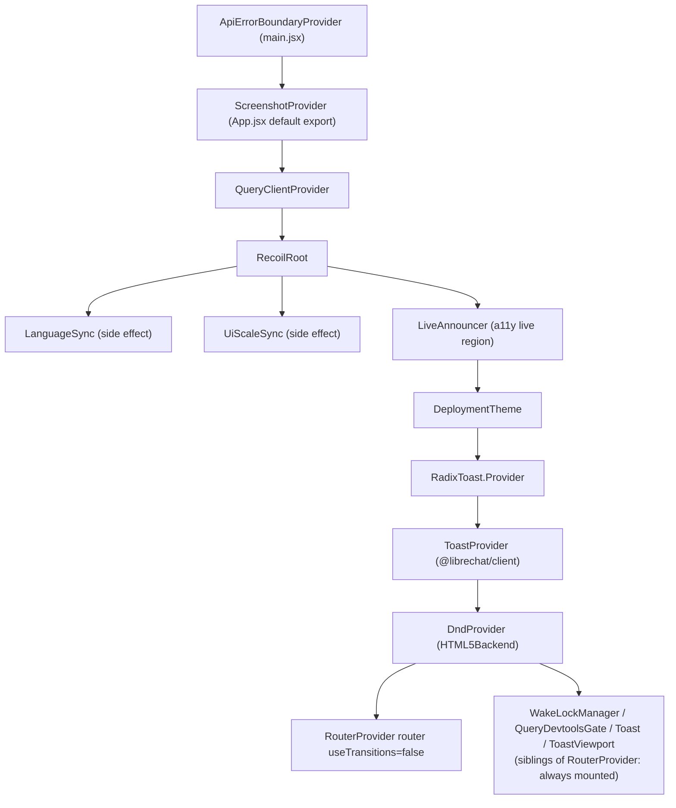
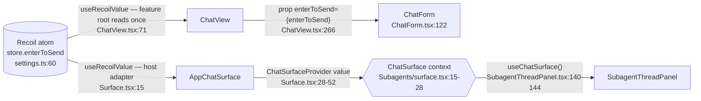

# 03 — Frontend Architecture

> **Audience:** engineers changing anything under `client/` or `packages/client/`, or adding a
> frontend entry point for a backend capability.
> **Prerequisites:** [00 — Overview](./00-overview.md), [01 — Architecture](./01-architecture.md).
> **Related:** [02 — Backend](./02-backend.md) · [07 — API Reference](./07-api-reference.md) ·
> [09 — Background Processing](./09-background-processing.md) ·
> [10 — Feature Development](./10-feature-development.md) ·
> [11 — Testing & Debugging](./11-testing-debugging.md) ·
> [PROJECT_MAP.md §9](../../PROJECT_MAP.md#9-frontend-architecture) ·
> [CRITICAL_FLOWS.md Flow 1 / Flow 6](../../CRITICAL_FLOWS.md#flow-6-frontend-state--data-fetching)

**Evidence labels used throughout**

| Label | Meaning |
|---|---|
| **Verified** | Read directly in source for this document; `file:line` given. |
| **Inferred** | Follows from verified code but was not executed or tested here. |
| **Unknown** | Could not be established from the source read. |

Paths are relative to the repository root unless they start with `~/`, which is the client alias
for `client/src/`.

---

## Contents

1. [Stack at a glance](#1-stack-at-a-glance)
2. [Entry point and bootstrapping](#2-entry-point-and-bootstrapping)
3. [Routing and page composition](#3-routing-and-page-composition)
4. [Component hierarchy](#4-component-hierarchy)
5. [Shared layouts and reusable UI](#5-shared-layouts-and-reusable-ui)
6. [State management and ownership: Recoil vs Jotai](#6-state-management-and-ownership-recoil-vs-jotai)
7. [Server state vs local UI state](#7-server-state-vs-local-ui-state)
8. [API client architecture](#8-api-client-architecture)
9. [Request/response handling and frontend auth](#9-requestresponse-handling-and-frontend-auth)
10. [Forms and validation](#10-forms-and-validation)
11. [Error and loading states](#11-error-and-loading-states)
12. [Real-time updates and streaming](#12-real-time-updates-and-streaming)
13. [Caching and request deduplication](#13-caching-and-request-deduplication)
14. [Styling and design system](#14-styling-and-design-system)
15. [Build and runtime configuration](#15-build-and-runtime-configuration)
16. [Testing strategy](#16-testing-strategy)
17. [Traced flow: API response to rendered UI](#17-traced-flow-api-response-to-rendered-ui)
18. [Traced flow: renaming a conversation](#18-traced-flow-renaming-a-conversation)
19. [Extension points](#19-extension-points)
20. [Corrections to earlier docs and open questions](#20-corrections-to-earlier-docs-and-open-questions)

---

## 1. Stack at a glance

**Verified** from `client/package.json`:

| Concern | Library (declared range) | Line |
|---|---|---|
| UI runtime | `react` `^18.2.0` | `client/package.json:104` |
| Routing | `react-router-dom` `^7.18.2` (data router, `createBrowserRouter`) | `:115` |
| Server state | `@tanstack/react-query` `^4.28.0` (v4 API: `cacheTime`, `keepPreviousData`) | `:64` |
| Legacy client state | `recoil` `^0.7.7` | `:121` |
| New client state | `jotai` `^2.12.5` | `:82` |
| Forms | `react-hook-form` `^7.43.9` | `:111` |
| Menus/popovers | `@ariakit/react` `^0.4.29` | `:32` |
| Toast primitive | `@radix-ui/react-toast` `^1.2.23` | `:61` |
| Drag and drop | `react-dnd` `^16.0.1` | `:106` |
| Styling | `tailwindcss` `^4.3.3` | `:169` |
| Bundler | `vite` `^8.2.2` | `:171` |
| Tests | `jest` `^30.2.0`, `@testing-library/react` `^14.0.0` | `:162`, `:146` |

Three workspaces make up the frontend:

| Workspace | npm name | Role |
|---|---|---|
| `client/` | (the app) | Routes, feature components, hooks, React Query hooks (`client/src/data-provider/`), Recoil/Jotai store. |
| `packages/client/` | `@librechat/client` | App-agnostic UI primitives, theme tokens, a few shared hooks (`useMediaQuery`, `useToast`). |
| `packages/data-provider/` | `librechat-data-provider` | Shared with the backend: URL builders, `dataService`, axios wrapper, `QueryKeys`/`MutationKeys`, types, `configSchema`. |

---

## 2. Entry point and bootstrapping

### 2.1 `main.jsx`

**Verified.** `client/src/main.jsx:1-33` imports polyfills and global CSS (`@librechat/client/style.css`,
`./style.css`, `./mobile.css`, KaTeX), awaits `initializeI18n()`, then renders:

```jsx
<ApiErrorBoundaryProvider>
  <App />
</ApiErrorBoundaryProvider>
```

If i18n initialisation throws, the `.catch` renders the same tree anyway, so a locale failure never
blanks the app (`main.jsx:26-33`).

### 2.2 `App.jsx` provider tree

**Verified** against `client/src/App.jsx:47-88` (outermost first):



| Layer | What it does | Evidence |
|---|---|---|
| `QueryClientProvider` | Creates the React Query client. `networkMode: 'always'` on queries and mutations (so `localhost` works offline); a `QueryCache.onError` forwards any **401** to `ApiErrorBoundaryContext.setError`. | `App.jsx:23-41` |
| `RecoilRoot` | Explicit root for every Recoil atom. | `App.jsx:49` |
| `LanguageSync`, `UiScaleSync` | Render-nothing components that push the stored language / UI scale into the DOM. | `App.jsx:50-51` |
| `LiveAnnouncer` | Screen-reader live-region context (`~/a11y`). | `App.jsx:52` |
| `DeploymentTheme` | Resolves theme precedence: high contrast, then `librechat.yaml` `interface.theme`, then build-time env colours, then the user's stored theme. | `client/src/Providers/DeploymentTheme.tsx`; precedence per [PROJECT_MAP §9](../../PROJECT_MAP.md#themingstyling-system) |
| `RadixToast.Provider` + `ToastProvider` | Radix toast primitive plus `@librechat/client`'s `useToastContext().showToast(...)` API. | `App.jsx:54-55` |
| `DndProvider` | `react-dnd` HTML5 backend for file and list drag/drop. | `App.jsx:56` |
| `RouterProvider` | Mounts the data router with `useTransitions={false}`. | `App.jsx:76` |

**Why `useTransitions={false}`** (**Verified**, comment at `App.jsx:57-75`): a React transition
keeps the *outgoing* route painted until the incoming one finishes rendering, so switching
conversations left the previous transcript visible under the new URL. Fourteen call sites
navigate into `/c/*`; the opt-out is set once on the router rather than at each call site.
The comment also notes that conversation state "still lives in Recoil", which has no
transition-safe reads in this app, and says to revisit "once that state has moved to Jotai".

The default export wraps everything in `ScreenshotProvider` and renders a hidden
`<iframe src="assets/silence.mp3">` (`App.jsx:91-102`).

### 2.3 There is no Jotai `<Provider>`

**Verified.** No runtime file under `client/src` renders Jotai's `<Provider>`. Every
`useAtom`/`useAtomValue`/`useSetAtom` call resolves against Jotai's **implicit default global
store**. The code relies on that, writing to the same store from outside React:

- `client/src/hooks/AuthContext.tsx:63-64`: `getDefaultStore().set(resetChatFilterSessionAtom)` and
  `getDefaultStore().set(resetFacetsAtom)` on logout.
- `client/src/hooks/SSE/useUsageHandler.ts:127` and `client/src/store/usage.ts:232` also call
  `getDefaultStore()`.

Two qualifications, both **Verified**:

1. **Tests do mount a `<Provider>`.** For isolation, test files such as
   `client/src/components/Chat/Messages/__tests__/ScrollButton.spec.tsx:53` render
   `<Provider store={jotaiStore}>`. Production code never does.
2. **One feature makes a scoped store without a Provider.** `MCPAppsPolicyProvider` builds its own
   `createStore()` (`client/src/Providers/MCPAppsPolicyContext.tsx:80`) to hold
   `activeAppViewsAtom`, then hands it out through an ordinary React context and reads and writes it
   imperatively (`activeViewStore.get/set`, `:83-93`). Atoms used through hooks still live in the
   default store.

**What this means for you:** a new Jotai atom is global and shared by every hook instance. Use
`atomFamily` keyed by conversation ID (the pattern in `store/steer.ts`, `store/mcp.ts`) when you need
per-conversation state. Logout cleanup has to reset atoms explicitly, as `AuthContext.tsx:63-64`
does. Nothing scopes them for you.

---

## 3. Routing and page composition

### 3.1 Route table

**Verified** from `client/src/routes/index.tsx:64-206`. The router is
`createBrowserRouter([...], { basename })`.

| Path | Element / loader | Wrapper | Line |
|---|---|---|---|
| `share/:shareId` | `ShareRoute` | none (public) | `:66-68` |
| `oauth/success`, `oauth/error` | `OAuthSuccess`, `OAuthError` | none | `:71-80` |
| `register`, `forgot-password`, `reset-password` | `Registration`, `RequestPasswordReset`, `ResetPassword` | `StartupLayout` | `:85-99` |
| `verify` | `VerifyEmail` | none | `:104-106` |
| *(pathless)* | `AuthLayout` = `AuthContextProvider` + RUM + `ApiErrorWatcher` | — | `:109-110` |
| `login`, `login/2fa`, `login/2fa/setup` | `Login`, `TwoFactorScreen`, `TwoFactorSetupScreen` | `AuthLayout` → `LoginLayout` | `:116-129` |
| `d/*` | `dashboardRoutes`: **legacy-URL redirect shim** (see §20) | `AuthLayout` | `:133`, `routes/Dashboard.tsx:11-24` |
| `/` (index) | `<Navigate to="/c/new" replace>` | `AuthLayout` → `Root` | `:140` |
| `c/:conversationId?` | `ChatRoute` (the main chat screen) | `Root` | `:143-144` |
| `search` | `Search` | `Root` | `:147-148` |
| `prompts`, `prompts/new` | `<Navigate to="/c/new">` (prompts are created from a dialog) | `Root` | `:151-157` |
| `prompts/:promptId` | **lazy** → `InlinePromptsView` | `Root` | `:160-161` |
| `skills`, `skills/new`, `skills/:skillId`, `skills/:skillId/edit` | **lazy** → `SkillsView` | `Root` | `:164-181` |
| `insights` | **lazy** → `~/components/Insights` | `Root` | `:168-169` |
| `projects`, `projects/:projectId` | **lazy** → `ProjectsView`, `ProjectWorkspace` | `Root` | `:184-189` |
| `agents`, `agents/:category` | `MarketplaceRoute` | `Root` | `:192-197` |

`AuthLayout` holds `LoginLayout` and `Root` as **siblings in one `children` array**
(`:111-136`), so both the login screens and the authenticated shell sit inside
`AuthContextProvider`. Every top-level branch sets `errorElement: <RouteErrorBoundary />`.

### 3.2 Lazy routes and `importWithRecovery`

**Verified.** Code-split pages use React Router's `lazy:` field, with the dynamic import wrapped in
`importWithRecovery` (`client/src/lib/assets/lazy.ts:12`):

```ts
// client/src/routes/index.tsx:45-48
const loadInsightsView = () =>
  importWithRecovery(() => import('~/components/Insights')).then((m) => ({
    Component: m.default,
  }));
```

`importWithRecovery` deals with stale chunks after a deploy: an old `index.html` asking for a hashed
chunk that no longer exists. Inside components, `lazyWithRecovery` (`lazy.ts:32`) does the same job
for `React.lazy` (for example `Artifacts` and `SubagentThreadPanel` in
`client/src/components/Chat/Presentation.tsx:22-25`). When recovery still fails,
`RouteErrorBoundary` sees a chunk-load error (`isChunkLoadError`) and shows the `Updating` screen
through `useStaleAssetRecovery` (`client/src/routes/RouteErrorBoundary.tsx:4-7,81`).

### 3.3 Route guarding

**Verified.** There is no loader-level guard. Guarding happens in components:

- `useAuthRedirect` (`client/src/routes/useAuthRedirect.ts:6-31`) waits **300 ms** (so auth state
  can settle) and then, if still unauthenticated,
  `navigate(buildLoginRedirectUrl(pathname, search, hash), { replace: true })`. `ChatRoute`
  calls it at `ChatRoute.tsx:52`.
- `RootLayout` returns `null` while `!isAuthenticated`, and so does `DashboardRoute`
  (`routes/Layouts/Dashboard.tsx:7-9`).

---

## 4. Component hierarchy

### 4.1 Authenticated shell (`Root`)

**Verified**, `client/src/routes/Root.tsx:179-275`:

```
Root (default export)                          Root.tsx:272
└─ ChatSettingsProvider
   └─ RootLayout                               returns null while unauthenticated
      └─ CodeHighlightThrottleContext.Provider Root.tsx:179
         └─ SetConvoProvider
            └─ FileMapContext / AssistantsMapContext / AgentsMapContext
               └─ PromptGroupsProvider
                  ├─ Banner                    Root.tsx:185
                  ├─ UnifiedSidebar            Root.tsx:202
                  ├─ MCPAppsPolicyProvider     Root.tsx:224
                  │  └─ <Outlet />             Root.tsx:229  (route content, e.g. ChatRoute)
                  ├─ MobileDrawerScrim         Root.tsx:240  (conditional)
                  ├─ Settings                  Root.tsx:250
                  ├─ KeyboardShortcutsProvider Root.tsx:251
                  ├─ ReplyNotifications        Root.tsx:252
                  ├─ MessagesRetention         Root.tsx:253
                  └─ TermsAndConditionsModal   Root.tsx:256  (conditional)
```

**Sidebar internals** (**Verified**, `client/src/components/UnifiedSidebar/`): `UnifiedSidebar.tsx`
composes `Sidebar.tsx` (the rail and expanded-panel chrome), `ExpandedPanel.tsx` and
`ConversationsSection.tsx`. The conversation list uses `useConversationsInfiniteQuery` at
`ConversationsSection.tsx:94`. The `mobile/` subfolder holds the drawer variant (`BottomBar`,
`Header`, `Scrim`, `Switcher`, `NewChat`). A conversation row (`components/Conversations/Convo.tsx`)
handles its own inline rename with `RenameForm`.

### 4.2 Chat screen

**Verified.** This corrects E7 and the PROJECT_MAP diagram on one point (see §20):
`Surface.tsx`'s `AppChatSurface` is a **context adapter**, not the chat column. `ChatView` renders
the header, messages and composer, then passes them to `Presentation` as `children`.

```
ChatRoute                                     routes/ChatRoute.tsx
├─ <Spinner role="status"> while endpoints/models load       :344-350
└─ ToolCallsMapProvider                                      :370
   ├─ pending overlay: Spinner, or error text + Retry Button :371-383
   └─ ChatView                                               :386   components/Chat/ChatView.tsx
      └─ AskAnswerHostProvider → ChatFormProvider (react-hook-form)        :185-186
         → ComposerRestoreProvider → QueuedTurnPortalProvider
         → ChatContext.Provider → AddedChatContext.Provider → ApprovalProvider  :187-191
         └─ Presentation                                     :192   components/Chat/Presentation.tsx
            └─ DragDropWrapper                               Presentation.tsx:171
               └─ AppChatSurface  (ChatSurfaceProvider host adapter)        :172
                  └─ EditorProvider → ParentSubagentsProvider
                     └─ SidePanelGroup panel={Artifacts | SubagentThreadPanel}  :181
                        └─ <main role="main">  → {children from ChatView}:
                           └─ TraceSurface                   ChatView.tsx:193
                              ├─ Header                      :198
                              ├─ ProjectBadge (conditional)  :204
                              ├─ content =                   :156-162
                              │    LoadingSpinner | MessagesView | Landing
                              ├─ ConversationStarters (landing only)
                              ├─ ChatForm  (composer)        :260
                              └─ Footer                      :276-279
                  └─ UndockedArtifacts (when the artifacts pane is undocked)
```

`MessagesView` renders `MultiMessage` → `Message` rows. `Message` is `React.memo`'d with
`areMessageRowPropsEqual` (`components/Chat/Messages/Message.tsx:52`), which is what keeps streaming
fast. See [CRITICAL_FLOWS Flow 6](../../CRITICAL_FLOWS.md#stream-events--ui-updates-without-re-rendering-everything).

**Composer internals** (`components/Chat/Input/`, **Verified** by directory listing in E7):
`ChatForm.tsx` is the `<form>` root. Its `useForm<ChatFormValues>` is created in
`ChatView.tsx:91-93` and shared through `ChatFormProvider`. `Composer/` holds the textarea and
toolbar. Alongside it: `Files/` (attachments), `PromptsCommand.tsx` and `SkillsCommand.tsx`
(slash commands), `Mention.tsx`, `SendButton.tsx`, `StopButton.tsx`, `DuringRunSendButton.tsx`
and `TokenUsage/`.

---

## 5. Shared layouts and reusable UI

**Layouts** (**Verified**, `client/src/routes/Layouts/`): `Startup.tsx` (register and password reset),
`Login.tsx` (login and 2FA) and `Dashboard.tsx` (a 12-line auth gate plus `<Outlet/>`). The
authenticated shell is `Root.tsx` (§4.1).

**Primitives** (**Verified**, `packages/client/src/components/`). Among them: `Button`,
`IconButton`, `Dialog`/`OriginalDialog` (`OGDialog*`), `OGDialogTemplate`, `AlertDialog`,
`DropdownPopup`, `Combobox`/`ControlCombobox`, `Select`, `MultiSelect`, `Accordion`, `Composer`,
`DataTable`, `Skeleton`, `EmptyState`, `RetryableError`, `FieldMessage`, `SecretInput`, `InputOTP`,
`Progress`, `Slider`, `Switch` and `HoverCard`. The `Spinner` SVG is in
`packages/client/src/svgs/Spinner.tsx`. Shared hooks include `useMediaQuery`
(`packages/client/src/hooks/useMediaQuery.tsx:16`) and `useToast`.

**Where the line falls** (**Verified** by example, **Inferred** as a rule): a component belongs in
`packages/client` only if it knows nothing about the domain. Once it knows about conversations,
messages, agents or endpoints, it goes in `client/src/components/<Feature>/`, even if it looks
generic. Example: `client/src/components/SidePanel/Agents/AgentPanelSkeleton.tsx` *composes* the
shared `Skeleton` but lives with the agent panel because its shape mirrors `AgentPanel`.

---

## 6. State management and ownership: Recoil vs Jotai

### 6.1 The rule (from `AGENTS.md`, "Client state ownership")

- **New state is always Jotai**, even in a file that already imports Recoil.
- You convert **one atom plus every file that reads or writes it**. Atoms cannot be half-converted.
- **Feature-owned** state (state the feature both writes and reads) → convert to Jotai and keep it
  inside the feature.
- **App-global preferences/shell state** a feature only consumes (`maximizeChatSpace`,
  `showScrollButton`, `enterToSend`, artifact visibility) → **pass it in** through props or a small
  host-supplied context. Do not reach into `~/store`. If a consumer sits outside the feature you are
  changing, leave the atom on Recoil.
- Persisted Jotai atoms use `client/src/store/jotai-utils.ts`.

### 6.2 Seven real Jotai atoms (feature-owned)

All **Verified**.

| # | Atom(s) | File:line | Why it fits Jotai |
|---|---|---|---|
| 1 | `mcpValuesAtomFamily`, `mcpPinnedAtom` | `client/src/store/mcp.ts:17`, `:27` | Per-conversation MCP server choice. Uses `createTabIsolatedStorage` (`:11`) so two tabs don't fight over "last selected servers". |
| 2 | `showFilesDialogAtom`, `filesDialogTriggerAtom` | `client/src/store/filesDialog.ts:5`, `:16` | Plain transient `atom()` for one dialog (and its trigger ref for focus return). |
| 3 | `duringRunActionAtom` | `client/src/store/duringRun.ts:20` | Steer/interrupt behaviour during a run. Persisted, with a one-time legacy-key migration through `initializeFromStorage`. |
| 4 | `escalatingSteerFamily`, `revealedQueuedTurnFamily` | `client/src/store/steer.ts:12`, `:33` | Per-conversation `atomFamily` for queued-turn and steering UI. |
| 5 | `activeSubagentPanel` | `client/src/components/Chat/Subagents/state.ts:329` | Lives *inside* the Subagents feature folder. Read and written in `Presentation.tsx:49-50`. |
| 6 | `pendingApprovalActionFamily` | `client/src/components/Chat/approval/state.ts:13` | Per-conversation tool-approval state, colocated with the approval feature. Read in `ChatView.tsx:75`. |
| 7 | `uiScaleAtom` | `client/src/store/uiScale.ts:35` | `atomWithStorage` with a custom `setItem` (`:18-19`) that applies the scale to the DOM before notifying subscribers. |

Also Jotai: the **live toast state**. `toastState` in `packages/client/src/store.ts:22` is read by
`useToast` (`packages/client/src/hooks/useToast.ts:12`). See §20 for the dead Recoil twin.

### 6.3 Seven real Recoil atoms (still on Recoil today)

All **Verified**.

| # | Atom(s) | File:line | Why it's still Recoil |
|---|---|---|---|
| 1 | `enterToSend`, `maximizeChatSpace`, `showScrollButton` | `client/src/store/settings.ts:60`, `:61`, `:76` | The app-global preferences `AGENTS.md` names. Built with the Recoil helper `atomWithLocalStorage`. |
| 2 | `submission`, `isSubmitting` | `client/src/store/submission.ts:15`, `:20` | The root submission state that drives the SSE effect. See [Flow 6](../../CRITICAL_FLOWS.md#optimistic-ui--fully-optimistic-zero-round-trip-wait). |
| 3 | `messageAttachmentsMap`, `hideBannerHint` | `client/src/store/misc.ts:8`, `:6` | Read from several unrelated surfaces. |
| 4 | `queriesEnabled` | `client/src/store/misc.ts:50` | Gates auth-dependent queries, e.g. `useGetUserQuery` `enabled: ... && queriesEnabled` (`client/src/data-provider/Auth/queries.ts:11,18`). |
| 5 | `user` | `client/src/store/user.ts:4` | Auth user object, `useRecoilState(store.user)` in `AuthContext.tsx:86`. |
| 6 | `ephemeralAgentByConvoId` | `client/src/store/agents.ts:6` | Recoil `atomFamily`. |
| 7 | `ptcTraceByToolCallId` | `client/src/store/ptc.ts:33` | Recoil `atomFamily`, single-purpose. |

> **Correction to PROJECT_MAP.md §9** (**Verified**). PROJECT_MAP lists `store/agents.ts` and
> `store/ptc.ts` as **"Mixed"** (Recoil and Jotai). Both files import only from `recoil`
> (`agents.ts:2`, `ptc.ts:1`) and contain no Jotai atom. They are **pure Recoil today**. The
> `AGENTS.md` rule still applies: the *next* atom added to either file must be Jotai.

### 6.4 Mixed imports say nothing about ownership

**Verified.** `client/src/store/index.ts:1-36` default-exports one flattened object of **Recoil**
modules (`artifacts`, `families`, `endpoints`, `user`, `text`, `toast`, `submission`, `search`,
`prompts`, `preset`, `lang`, `settings`, `misc`, `isTemporary`). It also re-exports, by name, the
modules `agents`, `mcp`, `favorites`, `sandbox`, `ptc` and `usage`, which are a mix of Recoil and
Jotai. So one file commonly holds both:

```ts
// client/src/components/Chat/ChatView.tsx:68-75
const rootSubmission = useRecoilValue(store.submissionByIndex(index));  // Recoil
const enterToSend   = useRecoilValue(store.enterToSend);                // Recoil
const pendingAction = useAtomValue(pendingApprovalActionFamily(...));   // Jotai
```

`Presentation.tsx:34-50` does the same (`useRecoilValue(store.artifactsState)` next to
`useAtomValue(artifactsUndocked)`). Choose by ownership, not by what a file already imports.

### 6.5 The ownership rule in real code: `enterToSend`

**Verified.** `enterToSend` is Recoil shell state (`store/settings.ts:60`). The code reaches it in
three distinct ways:



1. **Owning feature root reads directly.** `ChatView` is the top of the chat feature. It reads
   `useRecoilValue(store.enterToSend)` once (`ChatView.tsx:71`) and passes it to the composer **as a
   prop** (`ChatView.tsx:266` → `ChatForm.tsx:122`). The composer never touches `~/store` for it.
2. **Outside consumer gets it from a host-supplied context.** The Subagents feature
   (`components/Chat/Subagents/`) does not import `store.enterToSend`. Its `SubagentThreadPanel`
   destructures `enterToSend` from `useChatSurface()` (`SubagentThreadPanel.tsx:140-144`) and uses it
   at `:1652` as `submitOnEnter={enterToSend}`.
3. **The host adapter is the one place that reaches into the store.** `AppChatSurface`
   (`components/Chat/Surface.tsx:14-52`) reads `enterToSend`, `maximizeChatSpace` and
   `showScrollButton` from Recoil and publishes them through `ChatSurfaceProvider`. The
   `ChatSurface` interface's doc comment states the purpose: "Reading these through the host instead
   of the app store is what keeps the feature liftable: a second host already exists (the shared
   conversation view)" (`Subagents/surface.tsx:8-14`). `ShareView.tsx:261` mounts the same adapter.

This is the `AGENTS.md` rule ("props or a small host-supplied context") in production. Use it as
the template when a feature needs shell preferences.

### 6.6 `jotai-utils.ts` helpers

**Verified**, `client/src/store/jotai-utils.ts`:

| Helper | Line | Use it for |
|---|---|---|
| `createStorageAtom(key, default)` | `:13` | Persisted atom (`atomWithStorage` with `getOnInit: true`). |
| `createStorageAtomWithEffect(key, default, onWrite)` | `:28` | Persisted atom whose writes also cause a side effect (e.g. DOM). |
| `createTabIsolatedStorage()` | `:54` | `SyncStorage` with no `subscribe`, so no cross-tab sync. |
| `createTabIsolatedAtom(key, default)` | `:102` | Atom built on the above. |
| `initializeFromStorage(key, default, onInit?)` | `:117` | One-shot startup read, e.g. legacy-key migration. |

---

## 7. Server state vs local UI state

| Kind of state | Where it lives | Examples |
|---|---|---|
| **Server state**: anything the API owns | React Query cache only; never copied into Recoil/Jotai | conversations, messages, startup config, agents, presets, files |
| **Shell/preference state** | Recoil today (`~/store`), passed into features | `enterToSend`, `maximizeChatSpace`, `user`, `queriesEnabled` |
| **Feature-owned UI state** | Jotai (new code), colocated with the feature where practical | `activeSubagentPanel`, `pendingApprovalActionFamily`, MCP selection |
| **Form state** | `react-hook-form` | chat composer, login, agent builder |
| **Component-local** | `useState`/`useRef` | rename dialog input (`Rename.tsx:41`) |

**Verified (cited from Flow 6):** the active chat's messages are **only** in the React Query cache
under `[QueryKeys.messages, conversationId]`. Optimistic writes and stream deltas go to that cache
through `setQueryData`. There is no separate message store. Details in
[CRITICAL_FLOWS Flow 6](../../CRITICAL_FLOWS.md#fetchingcaching-conversations--messages);
not repeated here.

---

## 8. API client architecture

### 8.1 The chain

**Verified.** Every ordinary (non-streaming) call follows this path:

```
Component
  → client/src/data-provider/**   React Query hook (useQuery / useMutation / useInfiniteQuery)
    → dataService.<fn>()           packages/data-provider/src/data-service.ts
      → endpoints.<fn>()           packages/data-provider/src/api-endpoints.ts   (URL string)
      → request.<verb>()           packages/data-provider/src/request.ts         (axios wrapper)
        → axios + global interceptors (proactive refresh, 401 retry, 2FA-setup redirect)
          → Express route          api/server/routes/*.js → packages/api handlers
```

`client/src/data-provider/` is organised by domain: `Agents/`, `Auth/`, `Endpoints/`, `Files/`,
`MCP/`, `Messages/`, `Projects/`, `SSE/`, `Skills/` and so on, plus the root-level `queries.ts` and
`mutations.ts`.

### 8.2 Query and mutation keys

**Verified**, `packages/data-provider/src/keys.ts`:

| Export | Line | Shape | Examples |
|---|---|---|---|
| `QueryKeys` | `:1` | string enum (about 90 entries) | `messages`, `allConversations`, `archivedConversations`, `conversation`, `startupConfig`, `agents`, `mcpServers`, `presets` |
| `DynamicQueryKeys` | `:120` | parameterised builders | `agentFiles: (agentId) => ['agentFiles', agentId] as const` (`:121`), `projectFiles: (projectId) => [QueryKeys.projectFiles, projectId] as const` (`:122`) |
| `MutationKeys` | `:128` | string enum (about 60 entries) | `updateFavorites` (`:136`), `updatePinnedOrder` (`:138`), `editArtifact`, `convoPin` |

Hooks build key arrays from these. Minimal real example:

```ts
// client/src/data-provider/queries.ts:42-52
export const useGetPresetsQuery = (config?) =>
  useQuery<TPreset[]>([QueryKeys.presets], () => dataService.getPresets(), {
    staleTime: 1000 * 10,
    refetchOnWindowFocus: false,
    refetchOnReconnect: false,
    refetchOnMount: false,
    ...config,
  });
```

`AGENTS.md` requires new keys to be defined in `keys.ts`, never inline string literals.

### 8.3 Non-axios transports

**Verified.** `request.authenticatedFetch` (`request.ts:430-466`, exported at `:567`) is a
`fetch` wrapper that repeats the axios auth behaviour (proactive refresh, one 401 retry, 2FA-setup
redirect) for callers that need a raw `Response`:

- generation-control POSTs: `client/src/data-provider/SSE/protocol.ts:86`
- uploads: `packages/data-provider/src/upload.ts:187`
- MCP Apps: `client/src/utils/mcpApps.ts:188`

The **SSE stream itself** uses neither. According to `request.ts:401-406`, the stream transport is a
raw `XMLHttpRequest`. Enforcement errors reach the SSE hooks as error events, which hand the body to
`redirectIfTwoFactorSetupPayload` (`:407`).

---

## 9. Request/response handling and frontend auth

### 9.1 Where the token lives

**Verified.** The access JWT exists **only in memory**:

- React state: `const [token, setToken] = useState<string | undefined>()` (`AuthContext.tsx:88`).
- The axios default header: `setTokenHeader(token)` writes
  `axios.defaults.headers.common['Authorization'] = 'Bearer ' + token`
  (`packages/data-provider/src/headers-helpers.ts:7-13`). `AuthContext` calls it at `:115`, `:209`
  (clear) and `:255`.

A grep for `localStorage.setItem(...token...)` across `client/src` finds nothing. **Inferred:** the
long-lived credential is an httpOnly refresh cookie consumed by `POST /api/auth/refresh`, since the
client only ever receives the short-lived bearer token in the refresh response. See
[02 — Backend](./02-backend.md) and [CRITICAL_FLOWS Flow 2](../../CRITICAL_FLOWS.md#flow-2-authentication--authorization).

### 9.2 Proactive refresh (before the request)

**Verified.** The request interceptor (`request.ts:469-475`) calls `refreshBeforeRequest(config.url)`.
That function decodes the JWT's `exp` client-side (`getJwtExpiryMs`, `:342`) and refreshes when
expiry is within `TOKEN_REFRESH_BUFFER_MS` = **2 minutes** (`:74`, check at `:361-377`).

### 9.3 Reactive 401 handling

**Verified**, response interceptor `request.ts:477-554`:

1. **403 carrying a 2FA-setup token**: `redirectToTwoFactorSetupOnce(...)` (`:488-494`).
2. Requests to auth-recovery endpoints (`/api/auth/2fa`, `/logout`, `/refresh`) are not retried
   (`:286-290`, `:496-503`).
3. If the `Authorization` header was cleared (mid-logout), skip, except for the share-page
   carve-out (`:505-517`).
4. **401 not yet retried**: mark it `_retry = true`, `await startAuthRecovery(...)`, then replay the
   original request once with the new token (`:523-539`).
5. Recovery returns no token or throws: `redirectToLoginOnce()` (`:541-549`).

`startAuthRecovery` (`:292-319`) is **single-flight**: concurrent 401s share one `refreshPromise`,
so a burst of failing queries triggers one refresh, not N. On success it dispatches a
`tokenUpdated` window event. `AuthContext` listens for it (`:408-422`) and updates React state and
the header.

### 9.4 `redirectToLoginOnce`: a hard navigation

**Verified**, `request.ts:321-332`. It is guarded by `isAuthRedirectInProgress()`. It dispatches
`AUTH_REDIRECT_EVENT` (`'authRedirectStarted'`, `:71`) and then sets `window.location.href = href`.
This is a **document navigation, not a React Router `navigate`**. **Inferred** purpose: no stale
React tree or query cache survives the bounce to login. `AuthContext` listens for the same event
(`:424-438`) and clears auth state for in-document redirects.

### 9.5 The 401 → `ApiErrorBoundary` path

**Verified.** `App.jsx:34-40` also sends query-level 401s to `ApiErrorBoundaryContext.setError`.
Its consumer, `ApiErrorWatcher` (`client/src/components/Auth/ApiErrorWatcher.tsx:5-15`), is
**effectively a no-op**: it reacts only to `status === 500`, and that branch's body is commented out.
In practice the axios interceptor in §9.3 does all auth recovery.

**Inferred risk:** `new QueryClient(...)` is constructed in `App`'s body (`App.jsx:23`), not inside
`useState`/`useMemo`. `App` consumes `useApiErrorBoundary()` (`:20`), and the provider's `value` is
a fresh object on every state change (`hooks/ApiErrorBoundaryContext.tsx:19`). So a `setError` call
would re-render `App` and hand `QueryClientProvider` a new, empty client. This has not been
exercised here; treat it as a lead, not a confirmed bug.

---

## 10. Forms and validation

**Verified.** Forms use **`react-hook-form` with native `register()` rules and ad-hoc checks**. No
schema resolver is used: there is no `@hookform/resolvers` dependency in `client/package.json` and
no `zodResolver` in `client/src`. `zod` in this repo validates backend config (`configSchema`),
not forms.

**Login form**, `client/src/components/Auth/LoginForm.tsx`:

```tsx
// LoginForm.tsx:26
const { register, handleSubmit, formState: { errors } } = useForm<TLoginUser>();

// LoginForm.tsx:110-116
{...register('email', {
  required: localize('com_auth_email_required'),
  maxLength: { value: 120, message: localize('com_auth_email_max_length') },
  validate: useUsernameLogin ? undefined
    : (value) => validateEmail(value, localize('com_auth_email_pattern')),
})}

// LoginForm.tsx:136-143: minLength comes from server config
{...register('password', {
  required: localize('com_auth_password_required'),
  minLength: { value: startupConfig?.minPasswordLength || 8, message: ... },
  maxLength: { value: 128, message: ... },
})}
```

Errors render through a local `renderError(field)` helper (`:64-67`) as
`<span role="alert" className="text-text-destructive ...">`, and the inputs set `aria-invalid`.
Every message is localized.

**Agent builder**, `client/src/components/SidePanel/Agents/AgentPanel.tsx`: `useForm<AgentForm>`
at `:527`, wrapped in `<FormProvider {...methods}>` (`:978-1068`). The sub-panels (model,
instructions, actions, and so on) read from it with `useFormContext`/`useWatch`. Validation is spread
across those sub-components rather than kept in one schema.

**Chat composer:** `useForm<ChatFormValues>({ defaultValues: { text: '' } })` at
`ChatView.tsx:91-93`, provided by `ChatFormProvider`.

---

## 11. Error and loading states

| Pattern | Where | Real example |
|---|---|---|
| **Full-screen spinner** | `Spinner` from `@librechat/client` | `ChatRoute.tsx:344-350`: `endpointsQuery.isLoading \|\| modelsQuery.isLoading` → centred `<Spinner>` in `role="status" aria-live="polite"`. |
| **Inline error + retry** | local branch | `ChatRoute.tsx:371-383`: `initialConvoQuery.isError && !isFetching` → localized `com_ui_conversation_load_error` + `<Button onClick={() => refetch()}>`. |
| **Skeleton** | `packages/client/src/components/Skeleton.tsx` | `components/SidePanel/Agents/AgentPanelSkeleton.tsx` mirrors the real panel's layout with gray blocks. |
| **Route-level crash** | `routes/RouteErrorBoundary.tsx` | `errorElement` on every top-level branch. Chunk-load errors show `Updating` (`:81`). Others are reported through `reportBoundaryError` (`:91`). |
| **In-chat error codes** | `client/src/components/Messages/Content/Error/registry.ts` | `errorCopy` (`:20`): code → one translation key, e.g. `ErrorTypes.MODERATION → 'com_error_moderation'` (`:21`). `errorRenderers` (`:52`): code → component (`UserKeyError`, `BalanceError`, `AgentError`, `ModelError`, `LimitError`, `ContextError`, `ProviderError`). |
| **Toast** | `useToastContext().showToast({ message, severity, showIcon })` | Rename failure: `Rename.tsx:71-75`. |
| **Retryable/empty primitives** | `RetryableError`, `EmptyState` in `packages/client/src/components/` | Prefer these over hand-rolled panels. |

The error registry is how the frontend meets `AGENTS.md`'s "Service failures and user-facing errors"
contract: the backend sends a **stable code** and the UI maps it to localized copy. Never render a
raw `error.message` from the server. See [07 — API Reference](./07-api-reference.md) for the error
shapes.

---

## 12. Real-time updates and streaming

Kept brief here. [CRITICAL_FLOWS Flow 1](../../CRITICAL_FLOWS.md#flow-1-message-lifecycle-most-important)
and [Flow 6](../../CRITICAL_FLOWS.md#flow-6-frontend-state--data-fetching) cover streaming in depth.

- Sending writes the user message and a placeholder into the React Query cache **first** and then
  sets the Recoil `submission` atom. An effect watching that atom starts the network call
  (`client/src/hooks/Chat/useChatFunctions.ts:886-906`, per Flow 6).
- Stream deltas update a `Map` ref synchronously and flush to the cache **at most once per animation
  frame** (`hooks/SSE/useStepHandler.ts`). Unchanged messages keep their object identity, so the
  memoised `Message` rows skip re-rendering.
- Reconnect uses exponential backoff (1 s to 16 s, 5 tries) and resumes from a **server-side
  job snapshot** (`resume=true&generationCreatedAt=...`), not a client byte offset
  (`hooks/SSE/useResumableSSE.ts`).
- Transport choice (resumable or legacy) is in `hooks/SSE/useAdaptiveSSE.ts`. As §8.3 explains,
  stream auth is handled outside the axios interceptors.

The server-side job store and generation lifecycle are in
[09 — Background Processing](./09-background-processing.md).

---

## 13. Caching and request deduplication

**Verified** behaviours of React Query v4 as configured here:

| Mechanism | Effect | Evidence |
|---|---|---|
| **Key-based dedup** | Components that mount the same key share one in-flight request and one cache entry. | Standard React Query. Keys come from `keys.ts`. |
| **Whole filter set in the key** | Each sidebar view (archived, tags, search, project, sort) has its own entry and cursor, so pages from one view never leak into another. | `queries.ts:195-200` comment; [Flow 6](../../CRITICAL_FLOWS.md#fetchingcaching-conversations--messages) |
| **Stale/cache windows** | Conversation list: `staleTime` 5 min, `cacheTime` 30 min, `keepPreviousData: true`. Presets: `staleTime` 10 s. | `queries.ts:243-245`, `:46` |
| **Focus/reconnect refetch mostly off** | Most hooks set `refetchOnWindowFocus: false` (e.g. `queries.ts:47,77,155,...`). | grep of `queries.ts` |
| **Invalidate vs remove** | Navigation *invalidates* messages, so cached data renders immediately and reconciles in the background. Removing would blank the view. | [Flow 6](../../CRITICAL_FLOWS.md#fetchingcaching-conversations--messages) |
| **Direct patches over refetches** | Mutations patch every cached list containing a conversation (`updateConvoInAllQueries`, `client/src/utils/convos.ts:1737`; `upsertConvoInAllQueries`). | §18 |
| **Shared mutation keys** | `updateFavorites` / `updatePinnedOrder` are keyed so every hook instance's write is visible to the others through the query client. | `keys.ts:136-138` |
| **Single-flight token refresh** | Concurrent 401s share one refresh promise. | `request.ts:292-319` |
| **Auth-gated queries** | `queriesEnabled` (Recoil) disables user queries until auth is ready. | `Auth/queries.ts:11,18` |

---

## 14. Styling and design system

**Verified.**

- **Tailwind v4** (`tailwindcss ^4.3.3`). `client/tailwind.config.cjs:4,16` applies the shared preset
  `packages/client/tailwind.preset.cjs` and scans both `client/src` and `packages/client/src`.
- **Semantic tokens**: `packages/client/src/theme/tokens.css` is the source of truth. It imports
  `defaults.css` (RGB triplets) and declares every colour in one `@theme inline { ... }` block
  (`:22`), e.g. `--color-surface-primary: rgb(var(--surface-primary))`. Per the header comment
  (`:1-20`), `@theme inline` puts the custom property into each utility, so a runtime theme switch
  re-colours the app without regenerating CSS.
- **Lint enforcement**: `eslint.config.mjs` uses `shadcn/no-unknown-classes`,
  `shadcn/require-static-classes` and `shadcn/no-arbitrary-values`, and turns some of them off inside
  primitives (`:258-327`). In practice this enforces `AGENTS.md`'s "no raw palette utilities".
- **Dark mode** is class-based: `.dark { ... }` at `packages/client/src/theme/defaults.css:356`,
  plus `.dark [data-theme-scope]` at `:548`. A high-contrast theme is in `theme/highContrast.css`.
- **Reduced motion**: `client/src/style.css` has 8 `@media (prefers-reduced-motion: reduce)`
  blocks. Components check the same preference with
  `useMediaQuery('(prefers-reduced-motion: reduce)')` (`routes/Root.tsx:94`) to gate the drawer
  transition.
- **Action-menu pattern**: `client/src/components/Chat/Menus/HeaderMenu.tsx` imports
  `DropdownPopup` from `@librechat/client` (`:4`) and renders `<DropdownPopup>` (`:142`) wrapping
  `<Ariakit.MenuButton>` (`:154`). There is **no** Radix `DropdownMenu` in that file. Menu items that
  open dialogs follow the **dialog-item contract**: `hideOnClick: false`, an item `ref`,
  `render: (props) => <button {...props} />` (`hooks/Chat/useChatOptions.tsx:231-241`), and the
  dialog receives `triggerRef` (`useChatOptions.tsx:310`, `Rename.tsx:131`).

> **Residual Radix usage** (**Verified**, see §20): `packages/client/src/components/DropdownMenu.tsx`
> is still exported and is Radix-based (`:3`). `client/src/components/Nav/AccountSettings.tsx:5`
> imports its `DropdownMenuSeparator` and renders it inside an **Ariakit** menu (`:4`). That is a
> separator, not a menu root, but it is the one live Radix-family import found in an app menu.

---

## 15. Build and runtime configuration

**Verified**, `client/vite.config.ts` and `client/package.json:6-19`:

- Dev server on `PORT` or **3090** (`vite.config.ts:56`), proxying `/api` and `/oauth` to the backend
  (`:58-66`).
- Client-exposed env prefixes: `VITE_`, `SCRIPT_`, `DOMAIN_`, `ALLOW_`, `REACT_APP_THEME_`
  (`:71`). Anything else in `.env` is invisible to the browser.
- PWA via `vite-plugin-pwa` (`:7`, `:93`).
- Scripts: `npm run frontend:dev` (root) or `cd client && npm run dev`; `npm run build` (production,
  8 GB heap); `npm run typecheck` (`tsc --noEmit`).
- `packages/client` builds with `tsdown`, which **does not typecheck**. Run `npx tsc --noEmit` in
  each workspace you change (`AGENTS.md`, PROJECT_MAP §9 "Build tooling").
- Most runtime behaviour (theme, endpoints, MCP policy, footer, feature toggles) comes from
  `librechat.yaml` through the startup-config query (`useGetStartupConfig`,
  `client/src/data-provider/Endpoints/queries.ts:56`), not from build-time env. Any new lever
  should get a `configSchema` field (`AGENTS.md`).

---

## 16. Testing strategy

Brief. The full guide is [11 — Testing & Debugging](./11-testing-debugging.md).

- **Jest + Testing Library** in jsdom (`client/jest.config.cjs:6`). Tests are colocated in
  `__tests__/` or as `*.spec.tsx`/`*.test.tsx`. Run them from the owning workspace
  (`cd client && npx jest path/to/test`), never the whole monorepo.
- Helpers live in `client/test/`: `layout-test-utils.tsx` (which `AGENTS.md` asks you to use),
  `harness.tsx`, `itemFactories.ts`, `dropdown.ts`.
- Tests that touch Jotai wrap the component in `<Provider store={...}>` for isolation (§2.3). The
  app itself relies on the default store.
- `packages/client` **excludes `*.spec`/`*.test` files from typechecking** (`AGENTS.md`). A passing
  test is not proof that the test file typechecks.
- Playwright E2E under `e2e/`: mock-backend, a11y, deployed, benchmark and `bombadil` configs. The
  Lighthouse lane (`npm run lighthouse`) is required for startup, auth, config, file and
  message-loading changes.
- Per `AGENTS.md`: cover the **loading, success and failure** states in focused component tests.

---

## 17. Traced flow: API response to rendered UI

A **real, verified** read path: the sidebar conversation list.

```mermaid
sequenceDiagram
    autonumber
    participant CS as ConversationsSection.tsx
    participant Q as useConversationsInfiniteQuery<br/>(data-provider/queries.ts:177)
    participant RQ as React Query cache
    participant DS as dataService.listConversations<br/>(data-service.ts:1010)
    participant AX as request.get → axios
    participant API as GET /api/convos

    CS->>Q: mount with {sortBy, tags, search, projectId, ...} (:94)
    Q->>RQ: lookup key [allConversations, {filters}]
    alt cached and fresh (< 5 min)
        RQ-->>CS: pages (no network)
    else miss or stale
        Q->>DS: queryFn({ pageParam: cursor })
        DS->>AX: request.get(endpoints.conversations(params)) (:1013)
        AX->>API: interceptors add/refresh Bearer
        API-->>AX: { conversations, nextCursor }
        AX-->>DS: response.data
        DS-->>Q: page
        Q->>RQ: store page; getNextPageParam = nextCursor
        RQ-->>CS: re-render with data.pages
    end
    Note over CS: rows render. Scrolling calls fetchNextPage.<br/>Later mutations patch these pages in place (§18).
```

The pieces map onto the layers like this:

1. **API response**: the JSON body is unwrapped by `request.get` and returned from `dataService`.
2. **Application state**: React Query stores it under a key that includes every filter. Nothing is
   copied into Recoil or Jotai.
3. **Rendered UI**: `ConversationsSection` re-renders from `data.pages`. Each row
   (`Conversations/Convo.tsx`) gets its conversation object as a prop. When a mutation patches one
   row, the other rows keep their references.

---

## 18. Traced flow: renaming a conversation

> **This is a real traced flow, not a hypothetical.** Every arrow below was followed through source
> for this document.

There are **two rename UIs**, and both call the same mutation:

- **Header dialog**: `client/src/components/Chat/Rename.tsx`, opened from the chat header menu.
  Its own comment: "Rename for the open chat. The sidebar renames inline in its row, which the
  header has no row for" (`Rename.tsx:114`).
- **Sidebar inline edit**: `Conversations/Convo.tsx` renders `RenameForm` (`:370`) and calls
  `useUpdateConversationMutation(...)` at `:63`, then `mutateAsync` at `:165`.

The header path:

```mermaid
sequenceDiagram
    autonumber
    actor U as User
    participant HM as HeaderMenu.tsx<br/>(DropdownPopup + Ariakit.MenuButton)
    participant CO as useChatOptions.tsx
    participant RN as Rename.tsx / RenameContent
    participant MH as useUpdateConversationMutation<br/>(data-provider/mutations.ts:37)
    participant DS as dataService.updateConversation<br/>(data-service.ts:1024)
    participant AX as request.post → axios<br/>(request.ts:22-27)
    participant API as POST /api/convos/update<br/>(api/server/routes/convos.js:711)
    participant RQ as React Query cache
    participant UI as Header title + sidebar rows

    U->>HM: open menu, click "Rename"
    HM->>CO: item onClick → setShowRename(true)<br/>(hideOnClick:false, ref:renameRef — :231-241)
    CO->>RN: <Rename open triggerRef={renameRef}> (:304-310)
    RN->>RN: OGDialog → RenameContent, useState(title) (:41)
    U->>RN: edit, submit
    RN->>RN: handleSubmit: trim; if unchanged && titleSetByUser → close (:56-62)
    RN->>MH: mutateAsync({ conversationId, title }) (:64)
    MH->>DS: dataService.updateConversation(payload) (:47)
    DS->>AX: request.post(endpoints.updateConversation(), { arg: payload })
    Note over AX: URL = `${conversationsRoot}/update` = /api/convos/update<br/>(api-endpoints.ts:140,177)
    AX->>API: JSON body, Bearer header (proactive refresh / 401 retry)
    API->>API: validateConvoAccess → configMiddleware → createRenameConversationHandler
    API-->>AX: updated conversation (title, titleSetByUser, titleRevision, updatedAt, ...)
    AX-->>MH: response.data
    alt success
        MH->>MH: onSuccess (:49): assert typeof title === 'string'
        MH->>RQ: cancelQueries([conversation, id], exact) — {revert:false} (:54-57)
        MH->>MH: markTitleGenerationProcessed(id) — late auto-title won't clobber (:58)
        MH->>RQ: setQueryData([conversation, id], applyRename) (:79)
        MH->>RQ: updateConvoInAllQueries(qc, id, applyRename) (:80)
        MH->>RQ: invalidateQueries allConversations / archivedConversations / projectConversations (:83-85)
        RQ-->>UI: patched title renders immediately (no flicker)
        RQ-->>UI: background refetch re-sorts paginated lists
        RN->>RN: onClose() if still mounted (:66-68)
    else failure
        MH-->>RN: mutateAsync rejects
        RN->>RN: logger.error + showToast(com_ui_rename_failed, ERROR) (:69-75)
        Note over RN: dialog stays open, input preserved, user can retry
    end
```

### 18.1 Why `applyRename` merges fields instead of overwriting

**Verified**, `client/src/data-provider/mutations.ts:59-78`:

```ts
/* A rename carries only a title, so only the title is taken from its
 * response. Writing the whole conversation would also restore its
 * pre-request copy of every other field, undoing a concurrent change
 * whose response happened to land first: an assignment moving the chat
 * to another project would silently revert here. */
const applyRename = (previous?: t.TConversation): t.TConversation => {
  if (previous && (previous.titleRevision ?? 0) > (updatedConvo.titleRevision ?? Infinity)) {
    return previous;                          // out-of-order response guard
  }
  return {
    ...(previous ?? updatedConvo),            // keep every other cached field
    title: updatedConvo.title,
    titleSetByUser: updatedConvo.titleSetByUser,
    titleRevision: updatedConvo.titleRevision,
    updatedAt: updatedConvo.updatedAt,
  };
};
```

Three cache strategies are combined here:

| Strategy | Target | Why |
|---|---|---|
| **Field-level merge patch** | `[conversation, id]` and every list page that contains the row | Instant UI, and concurrent edits to other fields (such as project reassignment) are not reverted. |
| **Revision guard** | the same | A slower, older response cannot overwrite a newer title. |
| **Real invalidation** | `allConversations`, `archivedConversations`, `projectConversations` | Comment at `:81-82`: "A title-keyset cursor encodes the old ordering; patching loaded rows cannot repair boundaries that have not been fetched yet." |

**Copy this shape** for any mutation that changes one field of a cached entity: patch only the fields
the response is authoritative for, guard against out-of-order responses, and invalidate only the
caches whose structure (sort order, cursors, membership) the change affects.

---

## 19. Extension points

Each recipe points at a working example in the codebase. For the end-to-end feature workflow,
including backend and config, see [10 — Feature Development](./10-feature-development.md).

### 19.1 Add a page

Template: the `insights` route.

1. Create `client/src/components/<Feature>/index.tsx` with a default export.
2. In `client/src/routes/index.tsx`, add a loader next to `loadInsightsView` (`:45-48`):
   `const loadFeature = () => importWithRecovery(() => import('~/components/<Feature>')).then((m) => ({ Component: m.default }));`
3. Register `{ path: '<feature>', lazy: loadFeature }` among `Root`'s children (next to `:168`).
   That gives it the authenticated shell, the sidebar and `RouteErrorBoundary`.
4. Add a navigation entry in the sidebar (`components/UnifiedSidebar/`), with `useLocalize()` labels.
5. Any visible copy goes in `client/src/locales/en/translation.json` (English only).

### 19.2 Add a reusable component

- **`packages/client/src/components/`** if it is domain-free (a `Skeleton`, a `DropdownPopup`).
  Export it from the package index, add a spec next to it, style it with semantic tokens only, and
  rebuild the package (`npm run build:packages` or the client-package build) before the app sees it.
- **`client/src/components/<Feature>/`** if it knows any domain concept. Compose primitives; don't
  copy their classes (`AGENTS.md`, "Frontend theming").
- If the primitive can't express what you need, **extend the primitive or its variants**. Don't
  fork styles into a feature.
- Action menus: `DropdownPopup` + `Ariakit.MenuButton` (`HeaderMenu.tsx:142-178`). For dialog
  items, keep the contract in `useChatOptions.tsx:231-241`.

### 19.3 Add a new API operation

Mirror the rename chain (§18):

| Step | File | Real example |
|---|---|---|
| 1. URL builder | `packages/data-provider/src/api-endpoints.ts` | `updateConversation = () => \`${conversationsRoot}/update\`` (`:177`). Encode dynamic segments (`encodeURIComponent`). |
| 2. Service function | `packages/data-provider/src/data-service.ts` | `updateConversation(payload) { return request.post(endpoints.updateConversation(), { arg: payload }); }` (`:1024-1027`) |
| 3. Types | `packages/data-provider/src/types/**` | `TUpdateConversationRequest` / `TUpdateConversationResponse` |
| 4. Key | `packages/data-provider/src/keys.ts` | add to `QueryKeys` (`:1`), `DynamicQueryKeys` (`:120`) or `MutationKeys` (`:128`) |
| 5. Build | repo root | `npm run build:data-provider` (this build typechecks) |
| 6. Hook | `client/src/data-provider/<Domain>/queries.ts` or `mutations.ts` | `useGetPresetsQuery` (`queries.ts:42`), `useUpdateConversationMutation` (`mutations.ts:37`) |
| 7. Cache policy | the hook's `onSuccess` | patch with `setQueryData` / `updateConvoInAllQueries`, invalidate structural lists |

`AGENTS.md` adds: no backend capability ships without a frontend entry point, and mutations must
invalidate the related queries.

### 19.4 Handle a new loading / error / success state

- **Loading**: a feature-shaped `*Skeleton.tsx` composed from `Skeleton` (like
  `AgentPanelSkeleton.tsx`), or a `Spinner` inside `role="status" aria-live="polite"` (like
  `ChatRoute.tsx:344-350`).
- **Error (in-chat)**: have the backend emit a stable code, then add an entry to `errorCopy`
  (single sentence) or `errorRenderers` (rich UI) in
  `client/src/components/Messages/Content/Error/registry.ts`.
- **Error (other surfaces)**: a localized message and a retry action off `query.isError` /
  `refetch()` (`ChatRoute.tsx:371-383`), or `RetryableError`. For mutations, use `showToast` with
  `NotificationSeverity.ERROR` and keep the user's input (`Rename.tsx:69-75`).
- **Success**: render the real data from `query.data`. There is no dedicated "success" component.
  For a confirmation, use `showToast` with a success severity.
- **Tests**: one focused test each for loading, success and failure (`AGENTS.md`, "Frontend rules").

### 19.5 Add client state

1. Decide ownership (§6.1). Feature-owned state is a Jotai atom colocated in
   `components/<Feature>/state.ts` (like `Chat/Subagents/state.ts`, `Chat/approval/state.ts`) or in
   `client/src/store/<name>.ts`.
2. Persisted state goes through `jotai-utils.ts`. Per-conversation state uses `atomFamily`.
3. Shell preferences: don't import `~/store` inside the feature. Take them as props, or extend a
   host context like `ChatSurface` (`Subagents/surface.tsx`) with an adapter like `AppChatSurface`.
4. If the atom has to reset on logout, add it to the logout reset (`endSessionClientState`) in `AuthContext.tsx:62-66` (the
   default store is global; see §2.3).

---

## 20. Corrections to earlier docs and open questions

### Corrections (all **Verified** in this pass)

| # | Earlier claim | What the code shows |
|---|---|---|
| 1 | PROJECT_MAP §9: `store/agents.ts`, `store/ptc.ts` are "Mixed" | Both are **pure Recoil** (`agents.ts:2`, `ptc.ts:1`). |
| 2 | PROJECT_MAP §9: "Dashboard routes — admin/settings" | `dashboardRoutes` (`routes/Dashboard.tsx:11-24`) is a **legacy-URL redirect shim**: `d/prompts/*` → `/prompts/:id` or `/c/new`, and every other `d/*` → `/c/new`. The admin UI is the separate `admin-panel` service (PROJECT_MAP §10). |
| 3 | E7 exploration notes: Recoil `toastState` is read by the app-root toast | `client/src/store/toast.ts` `toastState` has **no readers**. The live toast state is the **Jotai** `toastState` in `packages/client/src/store.ts:22`, read by `useToast`. |
| 4 | E7 / PROJECT_MAP diagram: `AppChatSurface` (`Surface.tsx`) is the chat column holding Header/MessagesView/ChatForm | `AppChatSurface` is a **context adapter** (`Surface.tsx:14-52`). `ChatView` renders the column and passes it into `Presentation` as `children`. |
| 5 | E7: `SubagentThreadPanel` receives `enterToSend` as a destructured prop | It receives it from the **`useChatSurface()` host context** (`SubagentThreadPanel.tsx:140-144`). This still follows `AGENTS.md`'s "small host-supplied context" option. |
| 6 | E7: `_authenticatedFetch` serves the SSE stream | Per `request.ts:401-406`, the stream is a raw `XMLHttpRequest` covered by neither. `authenticatedFetch` serves generation-control POSTs, uploads and MCP Apps (§8.3). |
| 7 | E7 "could not verify": what `ApiErrorWatcher` does | It does effectively **nothing**: only a commented-out 500 branch (`ApiErrorWatcher.tsx:8-12`). |
| 8 | E7 "could not verify": where the sidebar's inline rename lives | `Conversations/Convo.tsx` → `RenameForm` (`:370`), using the same `useUpdateConversationMutation` (`:63`, `:165`). |

### Open questions

- **Unknown**: whether the inferred `QueryClient`-recreation-on-`setError` risk (§9.5) happens in
  practice. Since `ApiErrorWatcher` does nothing, the visible symptom would be a dropped cache after
  a query-level 401. Not reproduced.
- **Unknown**: whether `AccountSettings.tsx`'s Radix `DropdownMenuSeparator` inside an Ariakit menu
  (§14) is intended or leftover. It is not an action-menu root, so it does not break the
  `AGENTS.md` rule as written. Not audited further.
- **Unknown**: the full set of other Radix `DropdownMenu` consumers beyond `client/src` (e.g. inside
  `packages/client` itself). Only `client/src` was grepped.
- **Not re-derived here**: the `ask()` submission path, optimistic UI, RAF batching and resumable SSE.
  They are cited from [CRITICAL_FLOWS](../../CRITICAL_FLOWS.md) Flows 1 and 6, which spot-checked
  those claims against source.
