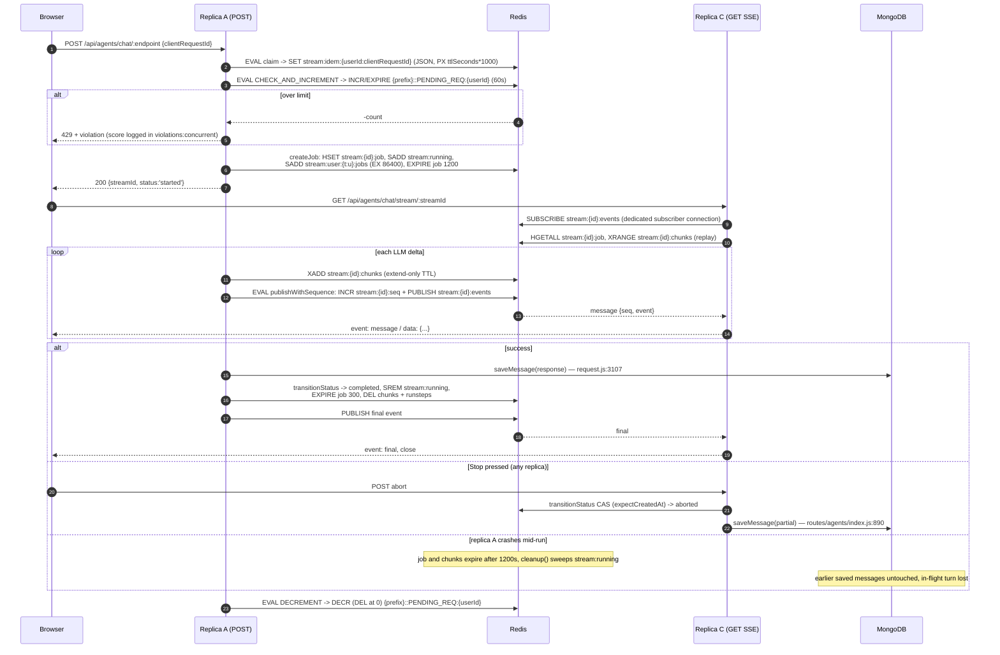

# 04 — Redis: what it does, and what happens without it

> Part of the developer guide. Related: [00 Overview](./00-overview.md) ·
> [01 Architecture](./01-architecture.md) · [02 Backend](./02-backend.md) ·
> [09 Background processing](./09-background-processing.md) ·
> [13 Architecture decisions and limitations](./13-architecture-decisions-and-limitations.md)

**Evidence labels used throughout**

- **Verified**: read in source at the cited `file:line`.
- **Inferred**: follows from verified code, but no single line states it (for example, a consequence of
  two verified behaviours combined).
- **Unknown**: not established by this pass. The list is in [§9](#9-what-could-not-be-verified).

All paths are relative to the repository root. Line numbers were taken from the working tree when
this page was written, so expect them to drift.

---

## 1. Short answer: is Redis used, and do you need it?

**Redis is in active use, but it is optional.** Six subsystems call Redis in production code paths.
Every one of them is gated on a feature flag and has a working non-Redis fallback.

| Question | Answer | Evidence |
|---|---|---|
| Is Redis touched when `USE_REDIS` is unset? | No. Both clients are `null` and every consumer takes its fallback branch. | **Verified**: `packages/api/src/cache/cacheConfig.ts:15`, `packages/api/src/cache/redisClients.ts` |
| Can you turn Redis on without a URI? | No. `USE_REDIS=true` without `REDIS_URI` throws at startup. Setting the flag is the only way Redis becomes "mandatory". | **Verified**: `cacheConfig.ts:16-18` |
| Is the streaming job store tied to `USE_REDIS`? | Through a separate flag, `USE_REDIS_STREAMS`, which defaults to the value of `USE_REDIS`. You can keep Redis for caches and leave streams in memory. | **Verified**: `cacheConfig.ts:20-26` |
| Does a Redis outage at runtime crash the process? | No. Connection errors are logged and the clients reconnect. Each call site either fails open, reports a cache miss, or surfaces the error, depending on the subsystem (see each section below). | **Verified**: `cacheFactory.ts:93-133`, `concurrency.ts:140-144`, `LeaderElection.ts:75-77` |
| Is Redis ever the only copy of durable data? | No. MongoDB is the system of record. Redis holds caches, coordination state and in-flight generation state, all with a bounded lifetime. See [§4](#4-persistence-and-durability). | **Verified** (see §4) |
| When is Redis *required*? | When you run **more than one replica** and need cross-replica behaviour: resuming a stream on another replica, leader election, shared rate and concurrency counters, and scheduled tasks. The schedule engine **refuses to arm** in multi-replica mode without a Redis-backed job store. | **Verified**: `packages/api/src/schedules/service.ts:98-100`, `1034-1042`. See [09 Background processing](./09-background-processing.md) |

The schedule guard reads:

```ts
// packages/api/src/schedules/service.ts:98-100
function isTopologySafeToArm(): boolean {
  return GenerationJobManager.isRedis || isEnabled(process.env.SCHEDULES_SINGLE_PROCESS);
}
```

Every replica starts the schedule engine, so a process-local job store would let replica B "reconcile"
a generation that only replica A can see and wrongly mark it interrupted. In practice:

- **Single replica:** run without Redis, or set `SCHEDULES_SINGLE_PROCESS=true` if you use schedules
  without Redis.
- **More than one replica:** set `USE_REDIS=true`.

[09 Background processing](./09-background-processing.md) covers this guard in detail. It also covers the
subagent control and activity transports, which
`api/server/services/Endpoints/agents/subagentThreadStore.js:110-160` wires to Redis only when
`USE_REDIS` is set. Those transports were documented in a separate pass and are not re-verified on this
page.

### 1.1 The six confirmed uses

| # | Subsystem | Main file | Redis structures | Fallback without Redis |
|---|---|---|---|---|
| 1 | Generic cache layer (about 25 named caches, sessions, rate limits, violation scores) | `packages/api/src/cache/cacheFactory.ts`, `api/cache/getLogStores.js` | Keyv string values, connect-redis sessions, rate-limit-redis counters | In-memory `Keyv`, `memorystore`, a file store, or `undefined` (express-rate-limit's default) |
| 2 | Leader election | `packages/api/src/cluster/LeaderElection.ts` | One string key, set with `SET NX EX` and Lua compare-and-set (CAS) | `isLeader()` always returns `true` |
| 3 | Per-user concurrency limiter | `packages/api/src/middleware/concurrency.ts` | One counter per user, changed with Lua `INCR`/`EXPIRE`/`DECR` | Non-atomic in-memory `Keyv` counter |
| 4 | MCP OAuth/async flow coordination | `packages/api/src/flow/manager.ts` | JSON strings guarded by a Lua CAS state machine | Same `Keyv` API backed by memory, plus an in-process lease `Map` |
| 5 | MCP server-config cache | `packages/api/src/mcp/registry/cache/ServerConfigsCacheRedis.ts` (and siblings) | JSON strings, a Lua merge-patch, `SCAN` listing | `ServerConfigsCacheInMemory` |
| 6 | Resumable SSE generation job store | `packages/api/src/stream/` (`RedisJobStore.ts`, 5,987 lines; `RedisEventTransport.ts`, 1,987 lines) | Hashes, Streams, Lists, Sets, Sorted Sets, pub/sub, many Lua scripts | `InMemoryJobStore` and `InMemoryEventTransport` |

### 1.2 Shared client infrastructure

**Verified** (`packages/api/src/cache/redisClients.ts`): when `USE_REDIS` is true, the server builds
two clients:

- **`ioredisClient`** (ioredis) handles Lua `EVAL`, the `connect-redis` session store, `rate-limit-redis`,
  leader election, the concurrency limiter and the stream job store and transport.
- **`keyvRedisClient`** (`@keyv/redis`, built on node-redis) backs `standardCache`.

Shared behaviour of both clients (all **Verified** in `cacheConfig.ts`):

- **Topology.** Single node, cluster (more than one URI, or `USE_REDIS_CLUSTER`), and TLS
  (`rediss://`, `REDIS_CA`) are supported.
- **Reconnection.** Exponential backoff, capped by `REDIS_RETRY_MAX_DELAY` (default 3000 ms) and
  `REDIS_RETRY_MAX_ATTEMPTS` (default 10) (`cacheConfig.ts:183-185`).
- **Failover recovery.** `READONLY` errors after a replica failover trigger a reconnect, spaced by
  `REDIS_READONLY_RECOVERY_INTERVAL` (`cacheConfig.ts:189`, `packages/api/src/cache/recovery.ts`).
- **Heartbeat.** An optional PING watchdog (`REDIS_PING_INTERVAL`, default 0 = off) and a subscriber
  heartbeat (`REDIS_SUBSCRIBER_PING_INTERVAL`, default 15 s) (`cacheConfig.ts:175-179`).
- **Offline queue.** Commands are queued while the connection is down; this is on by default
  (`REDIS_ENABLE_OFFLINE_QUEUE`, `cacheConfig.ts:191`).
- **Deployment key prefix.** Keys are prefixed with `REDIS_KEY_PREFIX`, or with the value of the
  environment variable named by `REDIS_KEY_PREFIX_VAR`, joined by `GLOBAL_PREFIX_SEPARATOR = '::'`
  (`cacheConfig.ts:172-173`). Setting both throws (`cacheConfig.ts:11-13`). The prefix lets several
  deployments share one Redis. In the tables below, `{prefix}::` stands for this prefix and the
  separator.

---

## 2. The six use cases in detail

### Use case 1 — The generic cache layer (`cacheFactory.ts` + `getLogStores.js`)

**What it is.** `cacheFactory.ts` is a factory built on Keyv. Each call selects its backend
(**Verified**):

| Factory | Backend with Redis | Backend without Redis | Source |
|---|---|---|---|
| `standardCache(ns, ttl)` | `KeyvRedis(keyvRedisClient)` | A memoized in-memory `Keyv` per namespace, or `fallbackStore` if one is given | `cacheFactory.ts:93-147` |
| `violationCache(ns, ttl)` | `standardCache('violations:'+ns, ttl, violationFile)` | File-backed `violationFile` | `cacheFactory.ts:161-166` |
| `sessionCache(ns, ttl)` | `connect-redis` `RedisStore(ioredisClient, prefix: ns+':')` | `memorystore` `MemoryStore` | `cacheFactory.ts:174-191` |
| `limiterCache(prefix)` | `rate-limit-redis` `RedisStore`, sent through `createClusterSafeSendCommand` | `undefined` (express-rate-limit uses its in-memory default) | `cacheFactory.ts:198-238` |

**Writers and readers.** `api/cache/getLogStores.js:22-81` maps each `CacheKeys` value to a cache
instance. The feature that owns a namespace both writes and reads it. Examples, all **Verified** at
`getLogStores.js`:

- **Login sessions.** `OPENID_SESSION` and `SAML_SESSION` use `sessionCache` (line 45). They back
  `express-session` and `passport.session()`, which are mounted **only** on the OAuth, OIDC and SAML
  handshake routes. The main API uses stateless JWT authentication (`PROJECT_MAP.md:259`). This is the
  only place sessions live in Redis.
- **The user-document cache.** `AUTH_USER_DOC` uses `standardCache(..., { throwOnErrors: true })`
  (line 69) and is read through `packages/api/src/auth/userDocCache.ts`. Errors are surfaced instead
  of being treated as misses. Serving a stale `req.user` is a correctness bug; see "Backend auth
  cache" in `AGENTS.md`.
- **Other standard caches.** `ROLES` (48), `PENDING_REQ` (55), `FLOWS` (64, 10 min) and the rest use
  `standardCache`. TTLs range from 30 s (`ADMIN_OAUTH_EXCHANGE`) to 30 min (`TOKEN_CONFIG`,
  `S3_EXPIRY_INTERVAL`). Some namespaces, such as `ROLES` and `MODEL_QUERIES`, have no TTL.
- **Violation scores.** Each `ViolationTypes.*` score uses `violationCache` with the TTL
  `VIOLATION_SCORE_TTL` (default 1 h). Each new violation restarts the countdown
  (`cacheConfig.ts:51-55`).
- **Values deliberately kept out of Redis:**
  - `ViolationTypes.BAN` is stored in **MongoDB** (`keyvMongo`, lines 39-43), so bans are durable.
  - `ENCODED_DOMAINS` is also stored in MongoDB.
  - `PROMPT_GROUPS_ACCESS` uses `disabledCache` (line 51). The comment there reads: *"a failed shared
    invalidation cannot fail closed"*.
- **Namespaces forced into memory.** `CONFIG_STORE` and `APP_CONFIG` stay in memory even with Redis
  enabled, so each container keeps its own configuration derived from YAML
  (`FORCED_IN_MEMORY_CACHE_NAMESPACES`, `cacheConfig.ts:32-37`).

**Why Redis.** In a single process, an in-memory `Keyv` works. With N replicas, each replica keeps its
own copy:

- An invalidation on replica A, such as a role change, never reaches replica B.
- Rate-limit and violation counters are split N ways, so a client that spreads requests across
  replicas gets roughly N times the limit (**Inferred**).

**Data and serialization.**

- **Keyv values.** Stored as a Keyv envelope, a JSON string of `{ value, expires }`. The Lua scripts in
  `flow/manager.ts:44-45` read `data.value` from it (**Verified**).
- **Key format.** `{prefix}::{namespace}:{key}`. `clearRedisNamespace` deletes keys by matching this
  pattern (`cacheFactory.ts:59`).
- **Sessions and rate limits.** connect-redis and rate-limit-redis use their own internal formats.

**TTL and expiry.** With Redis, the server's own TTL expires keys. Without Redis, in-memory Keyv has no
active expiry. `getLogStores.js:189-230` therefore starts a sweep every 30 s
(`clearAllExpiredFromCache`), and only when `!USE_REDIS && !CI` (**Verified**). This sweep is concrete
evidence that the two code paths behave differently.

**Failure behaviour (Verified).**

- **Standard caches.** `standardCache` attaches an error logger, and a failed operation resolves as a
  miss unless `throwOnErrors` is set (`cacheFactory.ts:106-113`).
- **Construction failure.** If building the Redis-backed cache throws, the error is logged and the
  call falls through to the fallback store (`cacheFactory.ts:127-133`).
- **Rate limits.** `limiterCache` returns `undefined` if building the store throws
  (`cacheFactory.ts:234-237`).
- **Sessions.** `sessionCache` logs Redis errors per namespace (`cacheFactory.ts:184-188`).

**Concurrency.** Ordinary caches use plain `GET`/`SET`, so the last write wins. Two special cases:

- **Cluster-safe rate limiting.** `rate-limit-redis` commands pass through
  `packages/api/src/cache/limiterSendCommand.ts`, which avoids `CROSSSLOT` errors on a cluster.
- **Prefix applied by hand.** `limiterCache` adds the deployment prefix itself, because ioredis does
  not apply `keyPrefix` to uppercase dynamic commands (`cacheFactory.ts:205-213`, comment).

**Consistency.** Eventual consistency, bounded by TTL. A lost write or a stale read costs a cache
miss, or a stale value until the TTL expires. The one exception is the user-document cache. It is
invalidated explicitly on mutation and raises errors instead of masking them.

---

### Use case 2 — Leader election (`cluster/LeaderElection.ts`)

**What it is.** One global key elects exactly one replica as leader, for work that should run once per
cluster. On the wire the key is `{REDIS_KEY_PREFIX}::LeadingServerUUID`. ioredis adds the prefix
(**Verified**, `LeaderElection.ts:29-33`).

**Writers and readers.** Each process holds a singleton `LeaderElection` with a random `UUID`
(lines 34-36). Callers use the exported `isLeader()` (line 201). One verified consumer is the MCP
server-config caches: they take a `leaderOnly` flag and call `leaderCheck` before writes
(`ServerConfigsCacheRedis.ts:50,73`). This pass did not enumerate every other caller (**Unknown**).

**Why Redis.** An in-process boolean cannot tell replicas apart: every replica would conclude it is
the leader. A shared key with a lease does.

**Data, TTL and timing (Verified).**

| Item | Value | Source |
|---|---|---|
| Value stored | Raw UUID string | `LeaderElection.ts:131-137` |
| Lease (`EX`) | `LEADER_LEASE_DURATION`, default **25 s** | `cluster/config.ts:14` |
| Renew interval | `LEADER_RENEW_INTERVAL`, default **10 s** | `cluster/config.ts:16` |
| Renew retries | `LEADER_RENEW_ATTEMPTS` = 3, `LEADER_RENEW_RETRY_DELAY` = 0.5 s | `cluster/config.ts:18-20` |
| Election jitter | A random 0-2 s delay before attempting `SET NX`, to avoid a thundering herd | `LeaderElection.ts:72-74` |

**Concurrency: why each step is atomic.**

1. **Electing.** The leader sets the key with `SET key uuid EX 25 NX` (line 131-137). `NX` makes this
   one atomic "create if absent", so if two replicas race, exactly one gets `OK`.
2. **Renewing (Lua).** The leader runs `if GET(key) == myUUID then EXPIRE(key, lease) else return 0`
   (lines 165-179). Without Lua, the check and the `EXPIRE` are two network round-trips:
   1. Replica A reads the key and sees its own UUID.
   2. A's lease expires and replica B wins `SET NX`.
   3. A sends `EXPIRE` and extends **B's** lease while still believing it is the leader.

   The Lua script closes that gap. When the script returns 0, the leader logs `Lost leadership` and
   stops its timer (lines 181-184).
3. **Resigning (Lua).** The leader runs `if GET(key) == myUUID then DEL(key)` (lines 92-98), triggered
   by `SIGTERM`/`SIGINT` (lines 44-45). Run as two separate commands, a GET followed by a DEL could
   delete a successor's key.

**Failure behaviour (Verified).**

| Situation | What happens | Source |
|---|---|---|
| `USE_REDIS` is false | `isLeader()` always returns `true`. Every single-process deployment is its own leader. | line 62 |
| Redis error in `isLeader()` | Returns `false` (fail closed), so a replica that cannot reach Redis never assumes leadership | lines 75-77 |
| Renewal exhausts its retries | The leader clears its timer. `isLeader()` then returns false even while the key still holds its UUID, because the check requires `refreshTimer != null`. This avoids split-brain after a partial failure. | lines 69, 192-195 |

**Consistency.** At most one leader per lease window, under normal clock and network conditions.

- **After a crash:** the key expires within 25 s and another replica takes over (**Verified** by the
  class doc comment, lines 16-21).
- **During a network partition:** leadership can lapse for up to one lease window. Callers must treat
  leader-only work as safe to repeat (**Inferred**).

---

### Use case 3 — Per-user concurrency limiter (`middleware/concurrency.ts`)

**What it is.** A counter of how many generations a user has in flight. When the count reaches
`CONCURRENT_MESSAGE_MAX`, new requests are rejected with HTTP 429.

**Configuration (Verified).**

| Setting | Effect | Source |
|---|---|---|
| `LIMIT_CONCURRENT_MESSAGES` | The limiter runs only when this is set | `concurrency.ts:8,108` |
| `CONCURRENT_MESSAGE_MAX` | Maximum concurrent generations per user, default **2** | line 9 |
| `CONCURRENT_VIOLATION_SCORE` | Violation score added on rejection, default 1 | line 10 |

**Writers and readers (Verified).**

- **Increment.** `checkAndIncrementPendingRequest(userId)` is called by the agents controller before
  the request is admitted (`api/server/controllers/agents/request.js:1538`), and by the resume
  controller (`resume.js:1211`).
- **Decrement.** `decrementPendingRequest(userId)` is called in `finishResumableRequest`
  (`request.js:377-385`), from `AgentClient` (`client.js:4290`), and on many early-exit paths in
  `resume.js`.
- **Exemption.** Scheduled-task requests can bypass the limiter (`exemptFromConcurrencyLimiter`,
  `request.js:1535-1537`).

**Why Redis.** Resumable streams decouple the HTTP request from the generation (see
[01 Architecture](./01-architecture.md) and `CRITICAL_FLOWS.md` Flow 1). The POST returns at once while
the job keeps running, possibly with a follow-up request on another replica. A per-process counter
would let a user reach the limit on each replica. Only a shared counter enforces one limit per user
across the cluster (**Inferred** from the doc comment at lines 92-96 and the multi-replica design).

**Key, data and TTL (Verified).**

- **Key:** `{prefix}::PENDING_REQ:{userId}`. `buildKey` returns `PENDING_REQ:{userId}` (lines 67-70);
  ioredis adds the prefix (comment, line 65).
- **Type:** a plain string integer, changed by `INCR`/`DECR`. There is no JSON.
- **TTL:** **60 s**, passed as `ARGV[2]` (line 128) and reapplied with `EXPIRE` on **every**
  increment. The in-memory fallback uses `Time.ONE_MINUTE` (lines 163, 221).

**The two Lua scripts (Verified, lines 18-44).**

```lua
-- CHECK_AND_INCREMENT_SCRIPT
local current = redis.call('INCR', key)
redis.call('EXPIRE', key, ttl)
if current > limit then
  redis.call('DECR', key)
  return -current           -- negative = rejected
end
return current

-- DECREMENT_SCRIPT
local current = redis.call('DECR', key)
if current <= 0 then redis.call('DEL', key); return 0 end
return current
```

**Why Lua.** The obvious version is `GET`, compare, then `INCR`. That takes three round-trips. Two
replicas serving the same user can both `GET 1` and both `INCR` to 3, which exceeds a limit of 2. A
bare `INCR` followed by a check and a separate `DECR` leaves a window in which a third request sees the
inflated count and is wrongly rejected. Redis runs a Lua script atomically, so the increment, check
and rollback happen as one step (comment, lines 13-17). The decrement script also removes the race
between `DECR` and `DEL`, so a key is never left at `0` or below.

**Failure behaviour (Verified).**

- **On increment, the limiter fails open.** A Redis error logs and **allows** the request
  (lines 140-144).
- **Decrement never throws** (lines 175-176, 205-207, 227-229).
- **The in-memory fallback is non-atomic** (`get` then `set`, lines 147-168). The source accepts the
  race explicitly: *"race condition possible but acceptable for in-memory"*.

**Consistency (Inferred from the script semantics).** The counter is a best-effort limiter, not a
ledger.

- **Self-healing.** Each increment reapplies the 60 s TTL. If a decrement is lost, for example because
  a process crashed mid-generation, the key expires 60 s after the user's last increment and the user
  is not locked out.
- **The cost of self-healing.** A generation that runs longer than 60 s with no further increment from
  that user stops being counted once the key expires. Its later decrement then hits a missing key:
  `DECR` returns -1, the key is deleted and the script returns 0.

[§6](#6-execution-trace-the-concurrency-limiter-step-by-step) walks through a full scenario.

---

### Use case 4 — MCP OAuth / async flow coordination (`flow/manager.ts`)

**What it is.** `FlowStateManager` tracks multi-step flows such as MCP server OAuth authorization. A
flow is created as `PENDING`, completed or failed by a callback that may land on a different replica,
and polled by waiters until it settles.

**Writers and readers (Verified).**

- **Storage.** The manager wraps a `Keyv` store. It uses Redis Lua only when the store's constructor
  is `KeyvRedis` (`getRedisKey`, `manager.ts:346-353`).
- **Callers.** OAuth callback handlers complete or fail a flow, and waiters poll its state, every
  25 ms in the lease path (line 342). The callers themselves were not traced individually (see §9).

**Which cache backs it (Inferred).** The `CacheKeys.FLOWS` namespace in `getLogStores.js:64` has a
10-minute TTL. The manager's default TTL when no options are passed is 3 minutes (`manager.ts:198-199`).
`PENDING_STALE_MS` (default 10 min, `MCP_OAUTH_HANDLING_TIMEOUT`, lines 165-167) bounds how long a
pending OAuth flow can be reused.

**Why Redis.** The browser returns from the OAuth provider to whichever replica the load balancer
picks. The replica that started the flow, and is waiting on it, must see the result. An in-memory
`Keyv` only works when both requests reach the same process.

**Keys and data (Verified).**

- **Flow key:** `getFlowKey(flowId, type)` returns `${type}:${flowId}` (lines 242-243). The full Redis
  key is `{prefix}::{namespace}:{type}:{flowId}`, built by `KeyvRedis.createKeyPrefix` (lines 351-352).
- **Lease key:** leases use the same scheme with type `lease`, giving `lease:{leaseId}` (lines 248, 279).
- **Value:** a Keyv envelope `{ value: FlowState, expires }` stored as JSON. `FlowState` carries
  `status`, `createdAt`, `metadata.state`, `result`, `error`, `completedAt` and `failedAt`.

**Lua scripts (Verified, lines 41-158).** Each script runs `GET` → `cjson.decode` → check → mutate →
`SET ... PX <ms>`:

| Script | Guard | Effect |
|---|---|---|
| `CLAIM_FLOW` | Key absent, **or** it still holds the exact attempt the caller observed (`createdAt`, `metadata.state` and `status` all match) | Installs a new attempt |
| `GUARDED_COMPLETE_FLOW` | Same `createdAt` and `state`, and `status == 'PENDING'` | Changes `PENDING` to `COMPLETED` |
| `GUARDED_FAIL_FLOW` | Same attempt and not already `COMPLETED` | Sets `FAILED` |
| `GUARDED_SETTLE_FLOW` | Same attempt, from pending or completed | Replaces the result, so a fresher durable credential wins |
| `GUARDED_DELETE_FLOW` | Same attempt | Deletes the flow |
| `ACQUIRE_LEASE` / `RELEASE_LEASE` / `READ_LEASE_GENERATION` | Owner, generation and `leaseUntil` | A generation-counted, owner-checked lease stored in the same namespace |

The guarded scripts recompute the expiry on every change (`data.expires = now + ttl` with `SET ... PX`).
A transition therefore restarts the flow's lifetime instead of inheriting the old one.

**Why Lua.** The danger is a stale handler overwriting a newer attempt:

1. Handler 1 reads flow attempt `createdAt=T1`.
2. The user retries, and attempt `T2` replaces it.
3. Handler 1 writes `COMPLETED` with stale credentials.

With a plain `GET` followed by `SET`, step 3 succeeds and clobbers `T2`. The scripts compare the
decoded `createdAt` and `metadata.state` and write in one atomic step, so the stale handler gets `-1`
(`stale`) and changes nothing (`guardedResult`, lines 366-371).

**Failure behaviour (Verified, partial).**

- **Without Redis,** the same API runs against an in-memory `Keyv`, and leases use a static in-process
  `Map` (`inMemoryLeases`, lines 180-188).
- **If the store is `KeyvRedis` but its client cannot run `eval`,** the manager throws instead of
  silently losing atomicity (lines 360-362).

**Consistency.** Each flow key has linearizable transitions. Flows are short-lived and expire with
their TTL. The durable artifact, the OAuth token, is persisted elsewhere: `mcp/oauth/tokens.ts`, as
named by the exploration pass.

---

### Use case 5 — MCP server-config cache (`mcp/registry/cache/`)

**What it is.** A shared cache of parsed MCP server configurations, so replicas do not reparse configs
or query Mongo on every tool-list request. `ServerConfigsCacheFactory.create` picks the implementation
(**Verified**, `ServerConfigsCacheFactory.ts:45-56`):

| Condition | Implementation | Storage |
|---|---|---|
| `!USE_REDIS` | `ServerConfigsCacheInMemory` | In-process memory |
| Namespace `App` or `Config` with Redis | `ServerConfigsCacheRedisAggregateKey` | A single aggregate key. It avoids `SCAN` plus N `GET`s, which caused stalls of 60 s or more (comment, lines 11-15) |
| Any other namespace with Redis | `ServerConfigsCacheRedis` | One key per server |

**Writers and readers (Verified).**

- **Writers.** `ServerConfigsCacheRedis.add`, `update`, `upsert` and `patch` call `this.cache.set` at
  lines 80, 92, 98 and 130. With `leaderOnly`, they first run a leader check (use case 2).
- **Readers.** `get` and `getAll`. The cache-integration specs show `getAll` using a cluster-safe
  `SCAN`.
- **Registry layer.** `MCPServersRegistry` puts two read-through caches on top:
  `mcp-registry-read-through` and `mcp-registry-read-through-all` (`MCPServersRegistry.ts:294-307`).
  Both are built on `standardCache`, so they are in Redis when Redis is enabled
  (`ReadThroughCache.ts:20-24`).
- **Database layer.** The Mongo repository is `ServerConfigsDB(mongoose)` (`MCPServersRegistry.ts:286`).

**Key and data (Verified).** The per-server key is
`{prefix}::{standardCache namespace}:{serverName}` (`redisKey`, `ServerConfigsCacheRedis.ts:65-70`). The
namespace is `${PREFIX}::Servers::${namespace}` (line 53). The value is a Keyv JSON envelope whose
`value` is the parsed config, including `updatedAt`.

**The PATCH Lua script (Verified, lines 26-40).** The script does the following:

1. `GET` the key and decode the envelope.
2. If an expected `updatedAt` is supplied, reject on a mismatch. This is optimistic concurrency.
3. Refuse to overwrite `resolvedInstructions`.
4. Merge the new fields.
5. `SET` the result, then `PEXPIRE` with the **previously remaining** `PTTL` if that is positive.

**Why Lua.** A read-modify-write over the network loses concurrent field updates from other replicas.
A plain `SET` would also drop the key's remaining TTL. The script both merges atomically and keeps the
remaining TTL.

**TTL: correcting the exploration notes.**

- **Verified:** `MCP_REGISTRY_CACHE_TTL` (default **5000 ms**, `cacheConfig.ts:247`) is the TTL of the
  registry's **read-through caches** (`MCPServersRegistry.ts:294`) and of the aggregate key's local
  snapshot (`ServerConfigsCacheRedisAggregateKey.ts:180`). The comment at `cacheConfig.ts:154-162`
  says the worst-case staleness across instances is **twice** that value.
- **Inferred:** the per-server `ServerConfigsCacheRedis` writes pass no TTL (`cache.set(serverName,
  value)`), and `standardCache` is called without one (line 53), so those entries probably do not
  expire. The class doc comment says data *"persists across server restarts"* (line 22). This was not
  traced end to end.
- `ReadThroughCache` documents that a TTL of 0 or less **disables** the cache, because entries encode
  access-control (ACL) decisions that must not outlive a revocation (`ReadThroughCache.ts:20-24`).

**Consistency.** Read-through, eventually consistent, with staleness bounded by about twice
`MCP_REGISTRY_CACHE_TTL`. A targeted invalidation rotates a generation token, so a fill that started
before a delete cannot repopulate stale data (`ReadThroughCache.ts` `FillToken`, lines 10-16,
**Verified** by its doc comment).

---

### Use case 6 — Resumable SSE generation job store (`packages/api/src/stream/`)

This is the largest Redis consumer. It is the shared state behind the
"generation is decoupled from the HTTP connection" design (`CRITICAL_FLOWS.md:5,13`):

- `POST /api/agents/chat/...` creates a job and returns `{streamId}`.
- `GET /api/agents/chat/stream/:streamId` subscribes to that job as an SSE stream.

The two requests can land on different replicas.

**Selecting the implementation (Verified, `createStreamServices.ts:72-137`).**

- **Redis path.** Used when `USE_REDIS_STREAMS` is true and `ioredisClient` exists. The factory
  duplicates the client to get a dedicated subscriber connection, then constructs `RedisJobStore` and
  `RedisEventTransport` with `isRedis: true`.
- **Fallback.** If there is no subscriber, or construction throws, it logs and falls back to
  `InMemoryJobStore`, which mirrors the Redis TTLs: a 300,000 ms TTL after completion and a 20-minute
  stale timeout. It also falls back to `InMemoryEventTransport`, with `isRedis: false`.
- **Exposure.** `GenerationJobManager` exposes this choice as `isRedis` (`GenerationJobManager.ts:1098,
  1122-1124`). That getter is what the schedule guard in §1 reads.

**Writers and readers (Verified).**

- **Writers.** `GenerationJobManager` (`createJob` at line 2502, `claimGeneration` at 3327,
  `emitChunk` at 6856, `completeJob` at 4505, `abortJob` at 4601) delegates to
  `RedisJobStore.createJob` (2053), `transitionStatus` (2989), `claimIdempotencyKey` (3164),
  `appendChunk` (5167), `saveRunSteps` (5386) and `deleteJob` (3280).
- **Readers.**
  - `GenerationJobManager.subscribe` (5050) serves SSE GETs, and `RedisJobStore.getJob` (2359) serves
    job lookups.
  - `getChunks` replays the stream with `XRANGE` (5316-5344).
  - `cleanup` (3679) sweeps stale jobs, and `getRunningJobs` (3356) lists active ones.
  - The schedule reconciler reads job state (see [09](./09-background-processing.md)).

**Why Redis.** `InMemoryJobStore` is a `Map` in one process's heap. If the GET, a second tab, the Stop
button or a reconnect lands on replica B while the generation runs on replica A, B cannot see the job.
Redis gives every replica the same job state and chunk log, and pub/sub carries chunks live across
replicas.

#### 6a. Key design (Verified, `RedisJobStore.ts:1739-1781`)

Each per-stream key wraps `streamId` in a **cluster hash tag** `{...}`, so all keys for one generation
map to the same Redis Cluster slot. Multi-key Lua scripts and pipelines are only legal within one slot.
`streamId === conversationId` (comment, line 1732).

| Key | Redis type | Contents |
|---|---|---|
| `stream:{id}:job` | Hash | Job fields (status, userId, conversationId, endpoint, model, flags, `createdAt`, …). Scalars are stored as strings and nested values as JSON per field |
| `stream:{id}:seq` | String counter | Pub/sub sequence number |
| `stream:{id}:chunks` | **Stream** (`XADD`/`XRANGE`) | Append-only event log, replayed on reconnect |
| `stream:{id}:runsteps` | String (JSON) | `Agents.RunStep[]` |
| `stream:{id}:steers` | List (`RPUSH`) | Pending mid-run "steer" messages, first in first out (FIFO) |
| `stream:{id}:steers-claimed` | List | Steers drained but not yet committed |
| `stream:{id}:parked` | String (JSON) | Steers parked after a terminal drain. Has its own TTL so it outlives the job hash |
| `stream:{id}:steer-receipts` | Hash (field = `clientSteerId`) | Receipts that make steer delivery idempotent |
| `stream:{id}:steer-receipt-order` | Sorted set (score = `createdAt`) | Orders and bounds the receipts |
| `stream:{id}:generation-epoch` | String | The latest generation's `createdAt` |
| `stream:{id}:subscriber-leases:{createdAt}` | Hash + sorted set | Expiring leases for each generation's subscriber group |
| `stream:running` | Set (global) | Index of running jobs |
| `stream:requires_action` | Set (global) | Jobs paused for human review |
| `stream:terminal_host_action` | Set (global) | Terminal jobs that still owe a lifecycle hook. Members are `JSON.stringify([streamId, createdAt])` (lines 1797-1799) |
| `stream:schedule_reconcile:v1` | Set (global) | Retry outbox for scheduled-task settlement |
| `stream:agent_event_detached:terminal_host_action:v1` | Set (global) | Versioned recovery lane for detached event-actor completions |
| `stream:user:{tenantId:userId}:jobs` (or `stream:user:{userId}:jobs`) | Set | A user's active jobs |
| `stream:idem:{userId:clientRequestId}` | String (JSON) | Idempotency claim that maps a retried POST to its existing `streamId` |

Pub/sub channel (not stored): `stream:{id}:events` (`RedisEventTransport.ts:24-26`). The channel name
goes to Lua as `ARGV`, not `KEYS`. ioredis applies `keyPrefix` to `EVAL` keys but never to channel names
(comment, `RedisEventTransport.ts:140`).

#### 6b. TTLs (Verified)

| Constant | Default | Applies to | Source |
|---|---|---|---|
| `DEFAULT_TTL.running` | **1200 s** (20 min) | A running job and its chunks. A safety net for crashed or hung generations | `RedisJobStore.ts:1830-1849` |
| `DEFAULT_TTL.completed` | **300 s** (5 min) | The job hash after completion | same |
| `DEFAULT_TTL.chunksAfterComplete` | **0** (deleted immediately) | The chunk stream after completion | same |
| `DEFAULT_TTL.runStepsAfterComplete` | **0** (deleted immediately) | Run steps after completion | same |
| `DEFAULT_TTL.userJobsSet` | **86400 s** (24 h) | A user's job set, refreshed on every `createJob` | same |
| `DEFAULT_TTL.requiresAction` | **86400 s** (24 h) | A job paused for approval. A paused job is not hung, so it must not inherit the 20-minute TTL | same |
| `PARKED_RECOVERY_TTL_S` | 300 s | Parked steers when `completed` is configured as 0, since Redis rejects `EX 0` | line 1718 |
| `GENERATION_EPOCH_GRACE_TTL_S` | 300 s | How long the epoch key outlives the job hash | line 1721 |
| `TERMINAL_PERSISTENCE_RETENTION_TTL_S` | 300 s | An uncommitted final event, kept after its persistence owner times out | line 1724 |
| `STEER_RECEIPT_MAX_PER_STREAM` | 100 entries | A count, not a TTL | line 1719 |
| Idempotency claim | Set by the caller (`ttlSeconds`, sent as ms) | `stream:idem:*` | lines 3164-3177 |

**TTLs only grow.** The Lua scripts extend expiry only upward:
`local cur = TTL(key); if cur < target then EXPIRE(key, target) end`
(**Verified**, for example at `RedisJobStore.ts:964-965` and `1015-1016`). A later write can never
shorten a key's remaining life, so a 24-hour `requires_action` TTL cannot be cut back to 20 minutes by
a chunk write.

#### 6c. Concurrency (Verified)

`RedisJobStore.ts` defines **49** top-level `*_LUA`/`*_SCRIPT` constants (counted by grep), and
`RedisEventTransport.ts` defines more. Each one closes a check-then-act race between two network
round-trips:

- **Status changes (`transitionStatus`).** The job status is compared and set in one step, optionally
  guarded by `expectCreatedAt`, `expectActionId` or `notAfterMs`. Without this, a Stop request and a
  natural completion on different replicas could both "win".
- **Idempotency claims (`claimIdempotencyKey`, `takeoverIdempotencyKey`, `adoptIdempotencyKeyForJob`).**
  Claim and create happen atomically, so a retried POST attaches to the existing job instead of
  starting a second, separately billed generation (`CRITICAL_FLOWS.md:68`).
- **Steers (`enqueueSteer`, `drainSteers`, `closeAndDrainSteers`).** Enqueueing and draining steers is
  atomic with respect to the job reaching a terminal state, so a steer is never lost between "drained"
  and "job closed".
- **Final event (`finalizeTerminalPersistence`).** Exactly one replica publishes the terminal event.
- **Live delivery (`publishWithSequence` in `RedisEventTransport.ts:472-520`).** The `INCR` of
  `stream:{id}:seq` and the `PUBLISH` happen in one script, so concurrent publishers cannot reorder
  sequence numbers.
- **Generation guard.** Scripts compare the job hash's `createdAt` (for example
  `RedisJobStore.ts:163, 904, 987`), so a write from an older generation of the same `conversationId`
  is rejected.

**Known gap (Verified, documented in `IJobStore.ts:1169-1172`).** On Redis **Cluster**, the global
index sets (`stream:running` and the others) live in a different slot from the per-stream hash. A
status change that also updates an index is therefore only best-effort atomic on a cluster.

#### 6d. Failure behaviour

| Failure | Behaviour | Label |
|---|---|---|
| Redis unavailable when stream services are built | Falls back to the in-memory job store and transport, and the process stays up | **Verified** (`createStreamServices.ts:105-111`) |
| That fallback in a multi-replica deployment | Becomes N independent in-memory stores. Resume works only when the client returns to the same replica. Schedules then refuse to arm unless `SCHEDULES_SINGLE_PROCESS=true`. | **Inferred** (fallback) + **Verified** (`service.ts:98-100`) |
| Redis lost or evicted mid-generation | The live stream is lost; the user sees the turn drop. No persisted Mongo message is affected. | **Inferred** (see §4) |
| A generation crashes or hangs | Keys expire after 1200 s, and `cleanup()` sweeps `stream:running` | **Verified** (TTL), **Inferred** (sweep trigger cadence not traced) |

---

## 3. Verified key table

This table lists only keys and patterns confirmed by the exploration pass (E5) or by source checks on
this page. `{prefix}::` is the deployment prefix described in §1.2.

| Key or key pattern | Purpose | Writer | Reader | Data format | Expiration |
|---|---|---|---|---|---|
| `{prefix}::LeadingServerUUID` | Leader election across replicas | `LeaderElection.electSelf` (`LeaderElection.ts:131`), Lua renew (165-179) | `LeaderElection.isLeader` / `getLeaderUUID` (61-112) | Raw UUID string | `EX` 25 s (`LEADER_LEASE_DURATION`), renewed every 10 s. Deleted by Lua on SIGTERM/SIGINT |
| `{prefix}::PENDING_REQ:{userId}` | Per-user count of concurrent generations | `CHECK_AND_INCREMENT_SCRIPT` (`concurrency.ts:18-29`) | The same script (via the `INCR` return value). `DECREMENT_SCRIPT` releases | String integer | `EXPIRE` 60 s, reapplied on each increment. Deleted when the count reaches 0 |
| `{prefix}::violations:{type}:{identifier}` (Keyv) | Violation and ban scoring | `logViolation` (`api/cache`) | Ban-check middleware | Keyv JSON envelope | `VIOLATION_SCORE_TTL`, default 3,600,000 ms, restarted on each write |
| `{prefix}::OPENID_SESSION:*` / `SAML_SESSION:*` (connect-redis) | `express-session` store, used only during OAuth/OIDC/SAML handshakes | `express-session` middleware | The same middleware | connect-redis session JSON | The session TTL passed to `sessionCache` |
| `{prefix}::FLOWS:{type}:{flowId}` (Keyv + Lua) | MCP OAuth and async flow coordination | `flow/manager.ts` `CLAIM_FLOW`, `GUARDED_*_FLOW` | Flow waiters | JSON `{value: FlowState, expires}` | `PX` recomputed on each guarded change. The namespace TTL is 10 min (`getLogStores.js:64`) |
| `{prefix}::MCP::Servers::{ns}:{serverName}` | Cached MCP server config | `ServerConfigsCacheRedis.add` / `update` / `upsert` / `patch` | `get` / `getAll` (`SCAN`) | Keyv JSON envelope | Patches preserve the remaining `PTTL`. The read-through layers use `MCP_REGISTRY_CACHE_TTL` (5000 ms). Base-entry TTL: see the use case 5 note |
| `{prefix}::ROLES:*`, `TOOL_CACHE:*`, `AUTH_USER_DOC:*`, … (`standardCache`) | General caches keyed by `CacheKeys` | The owning feature code | The same | Keyv JSON envelope | Set per namespace in `getLogStores.js` (30 s to 30 min; some have none) |
| `stream:{id}:job` | Generation job metadata | `RedisJobStore.createJob` / `updateJob` / `transitionStatus` (Lua `HSET`) | `RedisJobStore.getJob` (`HGETALL`) | Hash. Scalars as strings, nested values as JSON | 1200 s running, 300 s completed, 86400 s `requires_action`. Extend-only |
| `stream:{id}:chunks` | Chunk log replayed on reconnect | `appendChunk` / `flushPendingAppends` (`XADD`) | `getChunks` (`XRANGE`), resume path | Redis Stream, field `event` = JSON | Follows the job TTL while running. Deleted immediately after completion (0) |
| `stream:{id}:runsteps` | Serialized agent run steps | `saveRunSteps` | `getRunSteps` | String (JSON) | Follows the job TTL. 0 after completion |
| `stream:{id}:steers`, `:steers-claimed`, `:parked` | Mid-run steer queue | `enqueueSteer` | `drainSteers` / `peekSteers` | List / List / String (JSON) | Follows the job TTL. `parked` 300 s when `completed` is 0 |
| `stream:{id}:steer-receipts`, `:steer-receipt-order` | Idempotent steer receipts | Enqueue and drain paths | Steer acknowledgement and resume | Hash / sorted set | Extend-only. Capped at 100 entries per stream |
| `stream:{id}:generation-epoch` | Identity of the latest generation after the job hash expires | `createJob` / `transitionStatus` | Detection of stale generations | String (timestamp) | Job TTL + 300 s grace |
| `stream:{id}:events` (pub/sub channel) | Live chunk delivery | `RedisEventTransport` (Lua `PUBLISH`) | Subscriber connection → SSE writer | JSON payload | Not stored |
| `stream:running` | Index of active generations | `createJob` / `transitionStatus` | `cleanup` / `getRunningJobs` | Set | None. Membership is reconciled on transitions |
| `stream:requires_action` | Index of paused jobs | `transitionStatus` (to `requires_action`) | Cleanup when approvals expire | Set | None |
| `stream:terminal_host_action` | Jobs that still owe a lifecycle hook | Terminal transition | Retry after restart or from another replica | Set of `[streamId, createdAt]` JSON | None |
| `stream:user:{tenantId:userId}:jobs` | A user's active jobs | `createJob` | Account deletion and per-user cleanup | Set | 86400 s, refreshed on each `createJob` |
| `stream:idem:{key}` | Idempotency claim (`userId:clientRequestId` → `streamId`) | `claimIdempotencyKey` | Attach logic for retried POSTs | String (JSON `IdempotencyClaimValue`) | `ttlSeconds` set by the caller |

**Prefix note (Inferred).** The `stream:*` keys go through `ioredisClient`, which applies the
deployment `keyPrefix` to `EVAL` keys. On the wire they are therefore `{prefix}::stream:...` when a
prefix is set. Pub/sub channel names are **not** prefixed (`RedisEventTransport.ts:140`).

---

## 4. Persistence and durability

There are two separate claims here.

### 4.1 Redis holds no durable copy of anything that must survive a restart

**Verified, by category:**

1. **Coordination state:** the leader key, flow claims and leases, subscriber leases, idempotency
   claims. If a key is lost, the system re-elects or re-claims. No record is lost.
2. **Caches over MongoDB or YAML:** roles, the user-document cache, tool and MCP config caches. A loss
   causes a burst of cache misses against Mongo, not data loss.
3. **Counters with a natural decay:** the concurrency limiter (60 s), rate limits and violation scores
   (1 h). Bans themselves are written to **Mongo** (`getLogStores.js:39-43`).
4. **In-flight generation state:** the `stream:*` keys. Every one has a TTL between minutes and 24 h.
   This state describes a turn that has not yet been persisted.

The codebase does not depend on Redis persistence (RDB/AOF) for correctness. Whether a given deployment
enables it is out of scope (**Unknown**, see §9).

### 4.2 A Redis crash can lose an in-flight stream, but never a persisted message

The final assistant message is written to **MongoDB** before the stream is considered finished:

- **Normal completion (Verified).** `api/server/controllers/agents/request.js:3100-3107` calls
  `saveMessage(...)`, with the comment *"CRITICAL: Save response message BEFORE emitting final
  event"*. This ensures that a client follow-up cannot reference a `parentMessageId` that has not been
  saved yet.
- **Stop or abort (Verified).** `api/server/routes/agents/index.js:890` calls `saveMessage(...)` to
  persist the partial response from the job's collected content.
- **After that write (Verified, TTLs).** The job hash expires within 300 s, and the chunk stream and
  run steps are deleted immediately (`chunksAfterComplete: 0`).

What a crash loses depends on its timing (**Inferred**):

| Redis crashes or is flushed… | What is lost | What survives |
|---|---|---|
| Before generation starts | The idempotency claim and the job hash. The client's POST fails or is retried. | Every Mongo message and conversation |
| During generation | The live stream, chunk replay and steers. The user sees the turn drop or fail to resume. | Every message persisted earlier, including the user's own message once `BaseClient` has saved it |
| After `saveMessage` but before the final event | The final SSE event and the job's terminal status | The **assistant message in Mongo**. The UI reloads it from the message query |
| After completion | Nothing of value: the keys were expiring anyway | Everything |

In short, Redis is coordination, cache and short-lived state only. MongoDB is the system of record.

---

## 5. A generation job through Redis

The sequence below follows the default Redis path: `USE_REDIS=true`, `USE_REDIS_STREAMS` left at its
default, and `LIMIT_CONCURRENT_MESSAGES` set. Method names and line numbers are **Verified**. Exact
command batching inside each Lua script is simplified.



**Paused for human review (Verified TTL).** When a tool needs approval, `transitionStatus` moves the
job to `requires_action` and adds it to `stream:requires_action`. The TTL is extended upward only, to
86400 s or the approval's `expiresAt` if that is later. A paused job is therefore not reaped by the
20-minute running TTL.

---

## 6. Execution trace: the concurrency limiter step by step

**Setup.**

- `USE_REDIS=true`, `LIMIT_CONCURRENT_MESSAGES=true`, `CONCURRENT_MESSAGE_MAX=2`,
  `REDIS_KEY_PREFIX=prod`.
- Two API replicas, **A** and **B**, sit behind a round-robin load balancer.
- User `u42` has two tabs open and sends three messages within about 200 ms.

All behaviour is **Verified** against `concurrency.ts` and `request.js`, unless a step is marked
otherwise.

1. **t=0 ms, message 1 → replica A.**
   - `ResumableAgentController` reaches `request.js:1538` and calls
     `checkAndIncrementPendingRequest('u42')`.
   - `limit = max(2, 1) = 2` (line 106). The key is `PENDING_REQ:u42`, sent on the wire as
     `prod::PENDING_REQ:u42`.
   - A sends `EVAL CHECK_AND_INCREMENT_SCRIPT 1 PENDING_REQ:u42 2 60`.
   - Inside Redis: `INCR` gives 1 and `EXPIRE` sets 60 s. 1 is not greater than 2, so the script
     returns `1`.
   - A gets `{allowed: true, pendingRequests: 1}`, creates the job and returns `{streamId}`.
2. **t=40 ms, message 2 → replica B.**
   - B sends the same `EVAL`. `INCR` gives 2, `EXPIRE` is reset to 60 s, and the script returns `2`.
   - The request is allowed.
3. **t=45 ms, message 3 → replica A,** while B's message 2 may still be in flight.
   - A sends `EVAL`. `INCR` gives 3, which exceeds 2, so the script runs `DECR` (back to 2) and returns
     `-3`.
   - A computes `count = 3` and returns `{allowed: false, pendingRequests: 3, limit: 2}`
     (lines 131-135).
   - The controller releases any idempotency claim it owns (`request.js:1540-1546`) and logs a
     `CONCURRENT` violation with score 1 (`request.js:1548-1549`). That score goes to
     `violations:concurrent` with a 1 h TTL.
   - It then responds **429** (`request.js:1551`).
4. **The race the script prevents.** Suppose steps 2 and 3 used `GET`, compare, `SET`:
   - A and B both `GET 1`, both see 1 < 2, and both `SET 2`.
   - The user ends up with **three** concurrent generations and a counter that reads 2.
   - When those generations finish, the three decrements drive the counter to -1, or delete it, and the
     next burst is under-counted.

   A single atomic `EVAL` makes the increment, comparison and rollback one indivisible step on the
   Redis server, so no ordering of A and B can over-admit.
5. **t=8 s, message 1 finishes on A.**
   - `finishResumableRequest` (`request.js:377-385`) calls `decrementPendingRequest('u42')`.
   - A sends `EVAL DECREMENT_SCRIPT 1 PENDING_REQ:u42`. `DECR` gives 1, and the script returns 1.
6. **t=9 s, message 2 finishes on B.**
   - `DECR` gives 0, the script deletes the key and returns 0.
   - The log shows `pending requests cleared`. User `u42` can now send two more messages.
7. **Failure variant: Redis restarts at t=5 s.**
   - Any `EVAL` that fails is caught and the request **fails open** (`allowed: true`, lines 140-144).
     Availability is chosen over strict enforcement.
   - The counter is lost with the restart. The later decrements hit a missing key, `DECR` returns -1,
     the key is deleted and the script returns 0. The counter recovers by itself (**Inferred**).
8. **Long-generation variant (Inferred).**
   - If message 1 runs for 3 minutes and `u42` sends nothing else, the key expires at about t=60 s.
   - From then on the user can start two *more* generations while message 1 is still running. The 60 s
     TTL trades enforcement precision for self-healing when a decrement is lost.
9. **Same scenario without Redis (Verified fallback, Inferred effect).**
   - Each replica keeps its own in-memory `Keyv` counter, using `get` then `set` with no atomicity
     (lines 147-168).
   - With 2 replicas, `u42` could run up to 2 × 2 = 4 concurrent generations. This is one of the
     reasons a multi-replica deployment needs `USE_REDIS=true`.

---

## 7. Configuration quick reference

All values are **Verified** in `packages/api/src/cache/cacheConfig.ts` unless another file is named.

| Variable | Default | Effect |
|---|---|---|
| `USE_REDIS` | off | Master switch for all Redis use |
| `REDIS_URI` | — | Required when `USE_REDIS` is set. More than one URI enables cluster mode |
| `USE_REDIS_STREAMS` | same as `USE_REDIS` | Job store and event transport only |
| `USE_REDIS_CLUSTER` | false | Use cluster mode with a single URI |
| `REDIS_CLUSTER_SAFE_DELETE` | false | Delete keys one by one, for single-endpoint sharded services such as ElastiCache Serverless |
| `REDIS_KEY_PREFIX` / `REDIS_KEY_PREFIX_VAR` | `''` | Isolates deployments that share one Redis. The two are mutually exclusive |
| `FORCED_IN_MEMORY_CACHE_NAMESPACES` | `CONFIG_STORE,APP_CONFIG` | Namespaces kept in memory even with Redis enabled |
| `VIOLATION_SCORE_TTL` | 3,600,000 ms | Violation score lifetime. A value of 0 or less disables expiry |
| `MCP_REGISTRY_CACHE_TTL` | 5000 ms | TTL for the MCP read-through caches and the aggregate snapshot |
| `LEADER_LEASE_DURATION` / `LEADER_RENEW_INTERVAL` | 25 s / 10 s | `packages/api/src/cluster/config.ts` |
| `CONCURRENT_MESSAGE_MAX` / `LIMIT_CONCURRENT_MESSAGES` | 2 / off | `packages/api/src/middleware/concurrency.ts:8-9` |
| `SCHEDULES_SINGLE_PROCESS` | off | Lets schedules arm without Redis on a single replica (`schedules/service.ts:98-100`) |

Local Redis tooling for single-node, cluster and TLS setups lives in `redis-config/`. The Redis
end-to-end lane is `e2e/playwright.config.redis.ts`, and the integration suites run through
`npm run test:cache-integration:*` from `packages/api` (`PROJECT_MAP.md:433`).

For the reasoning behind the optional-Redis design and its trade-offs, see
[13 Architecture decisions and limitations](./13-architecture-decisions-and-limitations.md). For the
overall dependency picture (Mongo is required; Redis, Meilisearch and the RAG API are optional), see
[00 Overview](./00-overview.md) and [01 Architecture](./01-architecture.md). For where these modules sit
in the backend package layout, see [02 Backend](./02-backend.md).

---

## 8. Rules for contributors

- **New multi-replica state follows the existing pattern.** Write an interface, give it a Redis
  implementation and an in-memory implementation, and select one at construction time. The models are
  `IJobStore`/`IJobStoreV2` and the `ServerConfigsCache` factory. Do not branch on `USE_REDIS` deep
  inside business logic (see `AGENTS.md`, "Module boundaries").
- **Never make Redis the sole copy of something that must survive a restart.** Persist it to Mongo
  through `packages/data-schemas`.
- **Use a Lua script for any read-check-write against Redis that another replica could interleave.**
  Plain `GET` followed by `SET` is a race between replicas.
- **On a cluster, keep multi-key scripts within one hash slot.** Use `{...}` hash tags as `stream:*`
  does, or document the best-effort gap as `IJobStore.ts:1169-1172` does.
- **Extend TTLs only upward** when several writers touch the same key.
- **Remember that pub/sub channel names are not prefixed** by ioredis `keyPrefix`.
- **When you mutate user documents, invalidate the `AUTH_USER_DOC` cache** (see `AGENTS.md`, "Backend
  auth cache").

---

## 9. What could not be verified

Neither the exploration pass (E5) nor this page's source checks establish the following.

- **Readers of every cache namespace (Unknown).** The `getLogStores.js` registry and several consumers
  were confirmed: `userDocCache.ts`, `concurrency.ts`, `ServerConfigsCacheRedis.ts` and
  `flow/manager.ts`. Not every namespace's reader was traced to a line; examples are `MODEL_QUERIES`,
  `AUDIO_RUNS` and `GEN_TITLE`. All of them go through the same verified `standardCache` path.
- **The RUM and trace limiters (Unknown, presumed).** `packages/api/src/rum/limiter.ts` and
  `packages/api/src/traces/limiter.ts` import `standardCache`/`cacheConfig`. Their imports suggest the
  same optional-Redis pattern, but their key names and TTLs were **not** confirmed.
- **Redis keys in the schedule files (Unknown).** The barrier, gate and receipt files in
  `packages/api/src/schedules/` reuse the job-store machinery. Their keys were not derived beyond
  `stream:schedule_reconcile:v1` and the job hash's schedule fields.
- **TTL of per-server MCP cache entries (Inferred).** No explicit TTL was found on
  `ServerConfigsCacheRedis` base writes (see use case 5). The exploration notes attributed
  `MCP_REGISTRY_CACHE_TTL` to these entries, but spot checks show that value applies to the
  read-through layers and the aggregate snapshot.
- **Every caller of leader election (Unknown).** Only the MCP registry's `leaderOnly` path was
  confirmed.
- **Which callers construct `FlowStateManager` with the `FLOWS` cache (Inferred).** This is inferred
  from the namespace and from `getRedisKey`.
- **The `cleanup()` schedule (Unknown).** What triggers the job-store `cleanup()` sweep, and how often,
  was not traced.
- **Production topology (Unknown).** Whether any hosted Eleven-Chat deployment runs `USE_REDIS=true`,
  and whether its Redis has RDB/AOF persistence, is a deployment question that the code cannot answer.
- **Subagent task routing (documented elsewhere).** `RedisSubagentTaskControlTransport` and the Redis
  activity stream are documented in [09 Background processing](./09-background-processing.md) and
  were not re-verified here.
