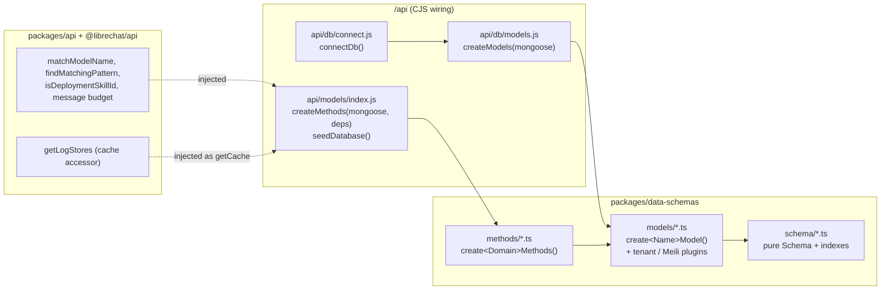
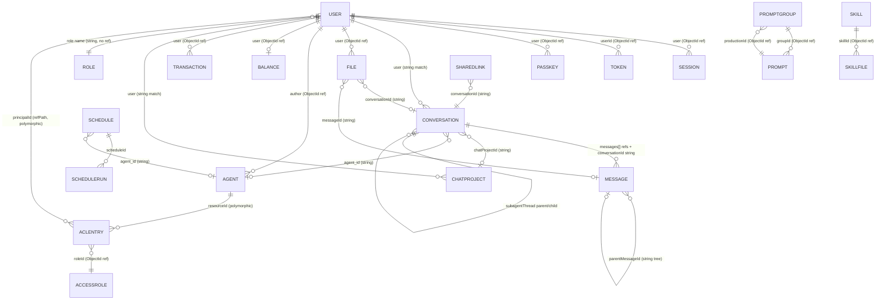

# 05 — Database (MongoDB / Mongoose)

This guide covers what Eleven-Chat stores in MongoDB: how the connection is opened, how the
models and query methods are wired, what each collection holds, how consistency, migrations and
validation work, and how one record (a Conversation) moves from creation to deletion. It ends
with the workflow for adding a field, entity, index or migration.

**Evidence labels used throughout**

| Label | Meaning |
|---|---|
| **Verified** | Read in source at the cited `file:line` during this documentation pass. |
| **Inferred** | Reasoned from strong but indirect evidence (naming, surrounding code, partial reads). |
| **Unknown** | Could not be confirmed; listed in [§16](#16-open-questions-and-unverified-items). |

All paths are relative to the repository root. `data-schemas` means
`packages/data-schemas/src/`.

**Related guides:** [00 Overview](./00-overview.md) · [01 Architecture](./01-architecture.md) ·
[02 Backend](./02-backend.md) · [04 Redis](./04-redis.md) ·
[06 Business logic](./06-business-logic.md) ·
[09 Background processing](./09-background-processing.md) ·
[10 Feature development](./10-feature-development.md)

---

## Contents

1. [Engine and why MongoDB is the system of record](#1-engine-and-why-mongodb-is-the-system-of-record)
2. [Connection initialization and lifecycle](#2-connection-initialization-and-lifecycle)
3. [Wiring: `createModels` and `createMethods`](#3-wiring-createmodels-and-createmethods)
4. [Cross-cutting behavior every collection shares](#4-cross-cutting-behavior-every-collection-shares)
5. [Entity inventory by domain](#5-entity-inventory-by-domain)
6. [Query and method organization](#6-query-and-method-organization)
7. [The `{ message }` pattern in `prompt.ts`](#7-the--message--pattern-in-promptts)
8. [Transactions and consistency](#8-transactions-and-consistency)
9. [Migrations and schema evolution](#9-migrations-and-schema-evolution)
10. [Validation and constraints](#10-validation-and-constraints)
11. [Seed data, ops tooling and test fixtures](#11-seed-data-ops-tooling-and-test-fixtures)
12. [Entity relationship diagram](#12-entity-relationship-diagram)
13. [Record lifecycle: Conversation](#13-record-lifecycle-conversation)
14. [MongoDB vs. Redis: what lives where](#14-mongodb-vs-redis-what-lives-where)
15. [How to add a field, entity, index or migration](#15-how-to-add-a-field-entity-index-or-migration)
16. [Open questions and unverified items](#16-open-questions-and-unverified-items)

---

## 1. Engine and why MongoDB is the system of record

**Verified.** MongoDB, accessed through Mongoose, is the only primary datastore for application
records. `packages/data-schemas` depends on `mongoose`, every schema under `data-schemas/schema/`
is a Mongoose `Schema`, and the server connects with `mongoose.connect(MONGO_URI, opts)` in
`api/db/connect.js:68`.

The other datastores hold data that is derived, specialized or temporary:

| Store | Role | Why it is not the system of record |
|---|---|---|
| **MongoDB** (Mongoose) | Users, conversations, messages, files metadata, agents, ACLs, billing ledger, schedules, audit log, config overrides | The source of truth. Everything else can be rebuilt from it or is disposable. |
| **Meilisearch** (optional) | Full-text search over conversations and messages | A *derived index*. The `mongoMeili` plugin copies Conversation/Message documents into it on write (`data-schemas/models/convo.ts:11-20`, `data-schemas/models/message.ts:10`). It is only attached when both `MEILI_HOST` and `MEILI_MASTER_KEY` are set. Losing it loses search, not data. |
| **Postgres + pgvector** | RAG embeddings, via the separate `rag_api` sidecar | Lives outside `packages/data-schemas`; scoped to retrieval only (**Inferred** from E4 and the deployment layout; see [01 Architecture](./01-architecture.md)). |
| **Redis** (optional) | Cache, rate limits, locks, stream/job coordination | Temporary or coordination state. Data-schemas methods only see a cache *accessor* injected by the caller (§3). See [04 Redis](./04-redis.md). |

The practical rule for contributors: if losing it after a restart would be a bug, it belongs in
MongoDB behind a `data-schemas` method.

---

## 2. Connection initialization and lifecycle

**Verified** — `api/db/connect.js` (79 lines, CommonJS wiring layer, consistent with
`AGENTS.md`'s "`/api` holds wiring, not behavior").

### Where it is called

- `api/server/index.js` requires `{ connectDb, indexSync }` from `~/db` and awaits `connectDb()`
  (`api/server/index.js:196`) during `startServer()`, before app config is loaded and routes are
  mounted.
- A second entry point, `api/server/experimental.js`, calls the same `connectDb()`
  (`api/server/experimental.js:448`).

### Connection string and options

The connection string comes only from the environment variable `MONGO_URI`
(`api/db/connect.js:6`). The module throws at load time if it is unset
(`api/db/connect.js:10-12`). Never commit a value for it; set it in `.env` or the deployment's
secret store.

Pool and timing options are optional environment variables. Each is parsed with
`parseInt(...) || undefined`, so an unset variable falls back to the MongoDB driver default
(`api/db/connect.js:14-27`):

| Environment variable | Mongoose/driver option | Notes |
|---|---|---|
| `MONGO_MAX_POOL_SIZE` | `maxPoolSize` | |
| `MONGO_MIN_POOL_SIZE` | `minPoolSize` | |
| `MONGO_MAX_CONNECTING` | `maxConnecting` | |
| `MONGO_MAX_IDLE_TIME_MS` | `maxIdleTimeMS` | |
| `MONGO_WAIT_QUEUE_TIMEOUT_MS` | `waitQueueTimeoutMS` | |
| `MONGO_AUTO_INDEX` | `autoIndex` | Parsed with `optionalEnabled()` from `@librechat/api`. Migration scripts force it off (§9). |
| `MONGO_AUTO_CREATE` | `autoCreate` | Same parsing. |
| *(hard-coded)* | `bufferCommands: false` | Operations fail fast while disconnected instead of queuing (`api/db/connect.js:51`). |
| *(hard-coded)* | `mongoose.set('strictQuery', true)` | Set globally before connecting (`api/db/connect.js:67`). |

### Lifecycle behavior

- **Hot-reload cache.** A `global.mongoose = { conn, promise }` cache
  (`api/db/connect.js:33-37`) keeps one connection across nodemon reloads in development.
- **Reconnect.** `connectDb()` returns the cached connection when `_readyState === 1`; otherwise
  it dials again (`api/db/connect.js:43-76`). Driver-level reconnect handles the rest.
- **Errors.** `mongoose.connection.on('error', ...)` only logs (`api/db/connect.js:39-41`); it does
  not exit the process.
- **Query metrics.** `instrumentMongooseQueryMetrics(mongoose)` is applied at module load
  (`api/db/connect.js:8`), so every query on this connection is timed. Per `AGENTS.md`, this is also
  the hook the Lighthouse CI lane uses to add 250 ms per Mongo query — the reason serial database
  reads on startup or request paths are treated as a performance bug.
- **Index-build failures are logged, not silent.** `createModels` attaches an `'index'` listener to
  every model (`data-schemas/models/index.ts:157-174`). A background index build that fails (for
  example, Amazon DocumentDB before 5.0 rejecting a `partialFilterExpression`) is logged with a
  migration hint from `getTenantIndexMigrationHint()` instead of leaving a unique constraint
  quietly unenforced.

---

## 3. Wiring: `createModels` and `createMethods`

**Verified.** This is the pattern `AGENTS.md` cites under *Module boundaries*: modules receive
their dependencies — "the way `createModels(mongoose)` receives the app's connection" — instead of
importing app singletons.



### Schemas vs. models

- **`data-schemas/schema/*.ts`** — pure `Schema<T>` definitions plus `schema.index(...)` calls. No
  model registration.
- **`data-schemas/models/*.ts`** — one `create<Name>Model(mongoose)` factory per entity. This is
  the only place that calls `applyTenantIsolation(schema)` and, for Conversation/Message, the
  `mongoMeili` plugin. Registration is idempotent:
  `mongoose.models.X ?? mongoose.model('X', schema)`.
- **Exception (Verified):** `ToolApprovalGrant` defines its schema inline in
  `data-schemas/models/toolApprovalGrant.ts` rather than in `schema/`.

### `createModels(mongoose)`

`data-schemas/models/index.ts:54` declares `createModels(mongoose)`; its return type lists **49**
models (Verified by counting the `ReturnType<...>` entries; E4's earlier count of 46 predates
this pass). The legacy wiring site is `api/db/models.js:1-5`:

```js
const mongoose = require('mongoose');
const { createModels } = require('@librechat/data-schemas');
const models = createModels(mongoose);
module.exports = { ...models };
```

### `createMethods(mongoose, deps)`

`data-schemas/methods/index.ts:324` declares
`createMethods(mongoose, deps: CreateMethodsDeps = {})`, which composes the per-domain
`create<Domain>Methods(...)` factories into one flat `AllMethods` object (some are tiered —
transaction methods are built from multiplier helpers created first). `CreateMethodsDeps` is
documented at `methods/index.ts:300`.

The real external dependencies are injected at `api/models/index.js:13-19`:

```js
const methods = createMethods(mongoose, {
  matchModelName,
  findMatchingPattern,
  isExternalSkillId: isDeploymentSkillId,
  getCache: getLogStores,
  getMCPAppMessageBudget: messageBudget.getBudget,
});
```

Routes and controllers use this object as `db.<method>(...)` (exported as `~/models`). They do not
import Mongoose models from `data-schemas` to run queries. (One exception class exists: the
`config/migrate-*.js` scripts read models from `~/db/models` directly; see §9.)

---

## 4. Cross-cutting behavior every collection shares

### Tenant isolation

**Verified.** Every model factory calls `applyTenantIsolation(schema)`
(`data-schemas/models/plugins/tenantIsolation.ts:105`). The plugin is a thin Mongoose binding over
an engine-neutral policy in `data-schemas/tenant/policy.ts`; it installs query, save and aggregate
middleware that scopes reads and stamps writes using the tenant in AsyncLocalStorage context
(`data-schemas/config/tenantContext.ts`).

- Most schemas carry `tenantId: { type: String, index: true }` and tenant-qualified compound
  indexes — for example `{ email: 1, tenantId: 1 }` unique, not a bare unique `email`.
- `TENANT_ISOLATION_STRICT=true` makes a missing tenant context fail closed
  (`data-schemas/tenant/policy.ts:48-50`).
- Startup seeding and some migration scripts run under `runAsSystem(...)`, which bypasses tenant
  scoping deliberately.
- Documented exceptions: `ToolFavorite`'s unique index is intentionally not tenant-scoped (user
  ObjectIds are already globally unique — in-file comment, `schema/favorite.ts`), and `Role` is
  treated as a global collection by `initializeRoles()` (§9).

Business rules for tenancy (who may see which tenant) are covered in
[06 Business logic](./06-business-logic.md); the database layer only enforces the scoping.

### Retention: TTL indexes and hard deletes — no soft delete

**Verified.** No schema has an `isDeleted`-style flag. Records leave the database in one of two
ways:

1. **TTL index** (`expireAfterSeconds` on a `Date` field) — MongoDB deletes the document itself.
   Used by Session (`expiration`), Token, RefreshTokenBridge, OpenIDRefreshFlight, File
   (`expiresAt`, upload staging), AclEntry (`expiredAt`), SharedLink, AgentApiKey, Key,
   Conversation/Message/ToolCallData (`expiredAt`, temporary chats), ScheduleRun (`settledAt`,
   terminal rows only), and AgentQueuedTurnSequence (`expiresAt`).
2. **Application hard delete** — for example `deleteConvos`, `deleteMessages` (§13).

`Config.tombstones[]` is the only soft-delete-like mechanism, and it marks removed *override
keys* inside a document, not deleted documents.

---

## 5. Entity inventory by domain

The tables below cover the load-bearing collections. Schema files are in `data-schemas/schema/`,
method files in `data-schemas/methods/`. "Rules enforced in" names where business rules live
beyond the schema's own constraints. Index lists omit the ubiquitous single `tenantId` index.
Unless noted, the entry is **Verified** from E4's reading of the schema file.

### 5.1 Identity and authentication

| Entity | Purpose | Key fields | Indexes | Relationships | CRUD / rules enforced in |
|---|---|---|---|---|---|
| **User** (`user.ts`) | Account, auth, profile, personalization | `email` (lowercase, regex-validated), `password` (bcrypt hash, `select:false`, 8–128), `role` (string, default `USER`), 8 OAuth id fields, `twoFactorEnabled`/`totpSecret`/`backupCodes[]` (`select:false`), `credentialsChangedAt` (retires earlier JWTs), `favorites[]`, `pinnedOrder[]` (`select:false`), `skillStates` | `{email,tenantId}` unique; `{role,tenantId}`; `{idOnTheSource,openidIssuer,tenantId}`; one unique partial index per OAuth id | Referenced by **string** from Conversation/Message; by ObjectId from File/Session/Balance/Transaction/Agent | `methods/user.ts`; auth strategies in `api/strategies/` and `packages/api/src/auth/`. After mutating a user, invalidate the auth user cache (`AGENTS.md`, *Backend auth cache*). |
| **Session** (`session.ts`) | Refresh-token session (current mechanism) | `refreshTokenHash`, `expiration` (TTL `expires:0`), `user` | `{user,refreshTokenHash}` unique | ObjectId → User | `methods/session.ts`; auth flow (see [02 Backend](./02-backend.md)) |
| **Token** (`token.ts`) | Short-lived reset/verify/invite tokens | `userId`, `email` (lowercase+trim), `type`, `scope`, `token`, `expiresAt` | `{expiresAt}` TTL; `{scope}` unique sparse; `{userId,type,identifier,tenantId}` | ObjectId → User | `methods/token.ts` |
| **RefreshTokenBridge** (`refreshTokenBridge.ts`) | Maps an old refresh-token hash to the rotated token, so concurrent refreshes don't log a user out | `oldRefreshTokenHash`, `encryptedNewRefreshToken`, `userId` (string), `expiresAt` | `{expiresAt}` TTL; `{oldRefreshTokenHash,userId,tenantId}` unique | string → User | `methods/refreshTokenBridge.ts` |
| **OpenIDRefreshFlight** (`openidRefreshFlight.ts`) | Deduplicates in-flight OIDC token refreshes; a MongoDB-backed lock with a `pending/completed/failed/revoked` state machine | `key` (unique), `status`, `encryptedResult`, `lockExpiresAt` | `{expiresAt}` TTL | string owner id | `methods/openidRefreshFlight.ts` |
| **Passkey** (`passkey.ts`) | WebAuthn credential | `user`, `credentialId` (unique), `publicKey`, `counter`, `deviceType` | inline unique on `credentialId` | ObjectId → User | `methods/passkey.ts` |
| **Group** (`group.ts`) | Local or Entra-sourced user group for sharing and RBAC | `name`, `email`, `memberIds[]` (strings), `source` (`local`/`entra`), `idOnTheSource` | `{idOnTheSource,source,tenantId}` unique partial; `{memberIds,tenantId}` | member ids are opaque strings | `methods/userGroup.ts` (transaction-aware cache invalidation, §8) |
| **AgentApiKey** (`agentApiKey.ts`) | User-minted key for calling an Agent programmatically | `userId`, `keyHash` (`select:false`), `keyPrefix`, `expiresAt` | `{userId,name,tenantId}`; `{expiresAt}` TTL | ObjectId → User | `methods/agentApiKey.ts`; `packages/api/src/apiKeys/` |

### 5.2 Conversations and content

| Entity | Purpose | Key fields | Indexes | Relationships | CRUD / rules enforced in |
|---|---|---|---|---|---|
| **Conversation** (`convo.ts`, 435 lines) | Chat thread; also root for sub-agent child threads and agent-event checkpoint/suspension state | `conversationId`, `title`, `messages[]` (ObjectId refs), `agent_id`, `subagentThread.*` (parent/child), `subagentThreadLease.*` and `agentEventBinding`/`agentEventActor*` (`select:false`), `tags[]`, `chatProjectId`, `isTemporary`, `expiredAt`, `pinned`, `archivedAt`, server-owned read state (`lastResponseAt`, `isMarkedUnread`), plus the shared `conversationPreset` field set | `{expiredAt}` TTL; `{conversationId,user,tenantId}` unique; many compound cursor-pagination indexes (archived, pinned, project, endpoint, subagent lease); `{_meiliIndex,isTemporary,expiredAt}` | 1—N Message; N—1 ChatProject; self-link via `subagentThread.parentConversationId`/`rootConversationId` | `methods/conversation.ts`; `packages/api/src/conversations/` (save, rename, delete fencing). Lifecycle in §13. |
| **Message** (`message.ts`, 325 lines) | One turn's content, plus sub-agent transcript projections | `messageId`, `conversationId`, `user` (string), `parentMessageId` (tree, no ref), `content[]` (multi-part), `text`, `privateText` (`select:false`), `feedback.rating`, `subagentTranscript`/`subagentTask.*` (`select:false`), `isTemporary`, `expiredAt` | `{expiredAt}` TTL; `{messageId,user,tenantId}` unique; `{conversationId,user,createdAt,_id}` (sort-free pagination); several `{tenantId,isTemporary,...}` analytics indexes | N—1 Conversation by string; self tree via `parentMessageId` | `methods/message.ts`; `packages/api/src/messages/` |
| **ToolCallData** (`toolCall.ts`) | Stored result/attachments of one tool call in a message | `conversationId`, `messageId`, `toolId`, `user`, `result`, `blockIndex`/`partIndex` | `{expiredAt}` TTL; `{messageId,user,tenantId}`; `{conversationId,user,tenantId}` | string → Conversation/Message | `methods/toolCall.ts` |
| **ToolApprovalGrant** (inline in `models/toolApprovalGrant.ts`) | Remembered tool-approval decision per user/agent/tool/conversation | `user`, `agentId`, `toolName`, `conversationId`, generation/revocation fencing fields | (see model file) | string → User/Conversation | `methods/toolApprovalGrant.ts`; deleted with conversations (§13) |
| **File** (`file.ts`) | Metadata for an uploaded/generated file (bytes live in the storage backend) | `user` (real ObjectId ref), `conversationId`/`messageId` (strings), `file_id`, `status` (`pending/ready/failed`), `metadata.runFile.*` (`immutable`), `expiresAt` (1 h staging TTL) vs. `expiredAt` (app retention), `deletionAttempts`/`deletionRetryAt` | `{filename,conversationId,context,tenantId}` unique partial (`execute_code`); `{user,tenantId,conversationId,'metadata.runFile.*'}` unique partial (`run_artifact`); `{user,tenantId,context,_id}` partial (`embedded`) | N—1 User, Conversation, Message | `methods/file.ts`; `packages/api/src/files/`, `packages/api/src/storage/` |
| **SharedLink** (`share.ts`) | Public share of a conversation with a per-link file snapshot | `conversationId`, `shareId`, `targetMessageId`, `messages[]` (refs), `expiredAt`, `fileSnapshots[]` | `{expiredAt}` TTL; `{conversationId,user,targetMessageId,tenantId}`; `{user,conversationId}` | N—1 Conversation; N—N Message | `methods/share.ts`; `packages/api/src/shared-links/` |
| **ConversationTag** (`conversationTag.ts`) | User tag/bookmark with usage count | `tag`, `user`, `description`, `count`, `position` | `{tag,user,tenantId}` unique | counts decremented on conversation delete | `methods/conversationTag.ts` |
| **ChatProject** (`chatProject.ts`) | Workspace grouping conversations, with rolled-up stats | `name`, `instructions`/`description` (length-capped), `contextRevision`, `file_ids[]`, `user`, `conversationCount`, `lastConversationAt`/`lastConversationId` (denormalized) | `{user,name,_id}`; `{user,createdAt,_id}`; `{user,lastConversationAt,_id}` | 1—N Conversation via `chatProjectId` | `methods/chatProject.ts`; stats kept in sync by the delete path (§13) |
| **Preset** (`preset.ts`) | Saved conversation parameter preset | `presetId`, `title`, `user` (string), `defaultPreset`, `order`, the `conversationPreset` field set | `{presetId,tenantId}` unique | — | `methods/preset.ts` |
| **MemoryEntry** (`memory.ts`) | Durable user memory (key/value), optionally per agent | `userId`, `key` (`^[a-z_]+$`), `value`, `agentId?`, `tokenCount` | `{userId,agentId,key}` | ObjectId → User | `methods/memory.ts`; `packages/api/src/memory/` |

### 5.3 Agents, tools and prompts

| Entity | Purpose | Key fields | Indexes | Relationships | CRUD / rules enforced in |
|---|---|---|---|---|---|
| **Agent** (`agent.ts`) | User-authored agent definition, versioned in-document | `id` (string key, not `_id`), `provider`/`model` (required), `tools[]`, `skills[]`, `actions[]`, `author`, `edges[]`, `versions[]`, `category`, `is_promoted`, `mcpServerNames[]` (denormalized), `subagents`, `memory_scope` | `{id,tenantId}` unique; `{mcpServerNames,tenantId}`; `{updatedAt,_id}`/`{createdAt,_id}` (+ tenant variants); `{'edges.to'}` | `author` → User; referenced by `Conversation.agent_id` (string) | `methods/agent.ts`; `packages/api/src/agents/`; access via ACL (§5.4) |
| **AgentCategory** (`agentCategory.ts`) | Marketplace category taxonomy | `value`, `label`, `order`, `isActive`, `custom` | `{value,tenantId}` unique | — | `methods/agentCategory.ts`; seeded at startup (§11) |
| **MCPServer** (`mcpServer.ts`) | User-registered MCP server | `serverName`, `normalizedServerName` (derived in `pre('validate')`), `config`, `author` | `{serverName,tenantId}` unique; `{normalizedServerName,tenantId}` unique partial | ObjectId → User | `methods/mcpServer.ts`, `methods/mcpAuthority.ts`; `packages/api/src/mcp/` |
| **Action** (`action.ts`) | OpenAPI-based custom tool attached to an agent/assistant | `user`, `action_id`, `metadata.auth`, `metadata.domain`, `agent_id`/`assistant_id` | inline only | ObjectId → User | `methods/action.ts`; `packages/api/src/actions/` |
| **Assistant** (`assistant.ts`) | Legacy OpenAI/Azure Assistants record | `user`, `assistant_id`, `file_ids[]`, `actions[]`, `access_level` | `{tenantId,'avatar.filepath'}` | ObjectId → User | `methods/assistant.ts` |
| **PromptGroup** (`promptGroup.ts`) | Named prompt slot with a production version | `name`, `category`, `productionId`, `author`, `command` (validated), `numberOfGenerations` | `{numberOfGenerations,updatedAt,_id}` | → Prompt (production); → User; 1—N Prompt | `methods/prompt.ts` (see §7); `packages/api/src/prompts/` |
| **Prompt** (`prompt.ts`) | One version of a prompt | `groupId`, `author`, `prompt`, `type` (`text`/`chat`) | `{createdAt,updatedAt}` | N—1 PromptGroup | `methods/prompt.ts` |
| **Skill** (`skill.ts`, 234 lines) | SKILL.md-based capability, GitHub-syncable | `name` (kebab-case, reserved-name validated), `description`, `body` (≤100k chars), `displayTitle` — *not fully enumerated* | *not fully enumerated* | 1—N SkillFile; → User | `methods/skill.ts`, `methods/skillSync.ts`; `packages/api/src/skills/` |
| **SkillFile** (`skillFile.ts`) | One file inside a skill bundle | `skillId`, `relativePath` (path-traversal validated), `file_id`, `category`, `isExecutable`, `content`/`isBinary` | `{skillId,relativePath}` unique (`skillFile.ts:123`); `{skillId,category}` | N—1 Skill | `methods/skill.ts` |
| **SkillSyncCredential** / **SkillSyncStatus** | Encrypted GitHub token; last-run status + MongoDB-backed sync lock (`lockOwner`/`lockExpiresAt`) | `encryptedToken`/`tokenHash` (`select:false`); `status`, `skippedSkills[]` | `{provider,credentialKey}` unique; `{provider,sourceId,tenantId}` unique | → User | `methods/skillSync.ts`; error codes in `packages/api/src/skills/sync/errors.ts` |
| **CodeEnvironment** (`codeEnvironment.ts`) | Managed/attached code-execution sandbox registration | `environmentId`, `type`, `baseURL`, `controlPlaneId`, `createdBy` — *not fully enumerated* | *not enumerated* | → User | `methods/codeEnvironment.ts`; `packages/api/src/code/` |

### 5.4 Access control

The fork has three layers. Roles answer "may this kind of user use feature X at all", ACL entries
answer "may this principal act on this specific resource", and system grants answer "does this
principal hold a platform or tenant capability".

| Entity | Purpose | Key fields | Indexes | Relationships | CRUD / rules enforced in |
|---|---|---|---|---|---|
| **Role** (`role.ts`) | RBAC role with per-`PermissionTypes` boolean flags (BOOKMARKS, PROMPTS, AGENTS, MCP_SERVERS, SKILLS, SCHEDULES, …) | `name`, `permissions` (sub-schema) | `{name,tenantId}` unique | looked up by `User.role` **name**, not a ref | `methods/role.ts` (role permissions cached through the injected `getCache`) |
| **AccessRole** (`accessRole.ts`) | Named bitmask template per resource type | `accessRoleId`, `permBits`, `resourceType` | `{accessRoleId,tenantId}` unique | referenced by `AclEntry.roleId` | `methods/accessRole.ts` |
| **AclEntry** (`aclEntry.ts`) | Per-resource, per-principal grant | `principalType` (incl. `PUBLIC`), `principalId` (Mixed, `refPath: principalModel`), `resourceType`, `resourceId`, `permBits`, `roleId`, `inheritedFrom`, `expiredAt` | four compound lookup indexes (by principal, by resource, by permBits, public lookups); `{expiredAt}` TTL | polymorphic → User/Group/Role; → AccessRole; `resourceId` points at whatever `resourceType` names | `methods/aclEntry.ts`; `packages/api/src/acl/accessControlService.ts` (bulk updates in a transaction, §8) |
| **SystemGrant** (`systemGrant.ts`) | Platform- or tenant-level capability grant; `tenantId` must be **omitted, never null**, for platform rows | `principalType`, `principalId`, `capability` (validated), `tenantId?` | `{principalType,principalId,capability,tenantId}` unique; two lookup indexes | polymorphic principal | `methods/systemGrant.ts`; seeded at startup (§11) |

Authorization logic itself is documented in [06 Business logic](./06-business-logic.md).

### 5.5 Usage and billing

| Entity | Purpose | Key fields | Indexes | Relationships | CRUD / rules enforced in |
|---|---|---|---|---|---|
| **Balance** (`balance.ts`) | Per-user token-credit wallet and auto-refill policy | `user`, `tokenCredits`, `autoRefillEnabled`, refill interval/amount/mode, `reservations[]`/`reservedCredits`/`pendingRefill` (`select:false`, in-flight holds) | field-level index on `user` | ObjectId → User | `methods/transaction.ts`, `methods/spendTokens.ts`, `methods/tx.ts` |
| **Transaction** (`transaction.ts`) | Append-only ledger row for one usage/cost event | `user`, `conversationId`, `tokenType` (`prompt/completion/credits`), `model`, `rate`/`rawAmount`/`tokenValue`, input/write/read token counts | field-level indexes on `user`, `conversationId`, `model` | ObjectId → User | `methods/transaction.ts` (`createTransaction`, §6) |

### 5.6 Scheduling, triggers and queued turns

These collections hold durable state for background work. How the workers claim, lease and
coordinate them (including any Redis involvement) is in
[09 Background processing](./09-background-processing.md) and [04 Redis](./04-redis.md); this
section covers only the MongoDB shape.

| Entity | Purpose | Key fields | Indexes | Relationships | CRUD / rules enforced in |
|---|---|---|---|---|---|
| **Schedule** (`schedule.ts`) | Recurring/cron agent trigger owned by a user | `id`, `user`, `name`, `prompt` (≤32000), `agent_id`, `cadence.*` (`frequency` incl. `cron`; `hour`/`minute` conditionally required) | indexed on `id`, `user` (**Inferred**, not every index read) | → User; drives ScheduleRun | `methods/schedule.ts`, `methods/scheduleConsent.ts`; `packages/api/src/schedules/` |
| **ScheduleRun** (`scheduleRun.ts`) | One fired occurrence of a schedule | `scheduleId`, `user`, `status` (`started/requires_action/success/error/interrupted/skipped_*`), `capacitySlot`, `settledAt`, `mcp[]`, `configRevision` | `{scheduleId,scheduledFor}` unique; `{scheduleId}` unique partial on `status:'started'`; `{capacitySlot}` unique partial; `{settledAt}` TTL (terminal rows only); status/firedAt lookups (`scheduleRun.ts:157-187`) | N—1 Schedule; → User | `methods/schedule.ts` |
| **AgentTriggerDelivery** (`triggerDelivery.ts`) | Durable, lane-ordered delivery of an inbound event that drives an agent | *not fully enumerated* (large state machine) | *not enumerated* | → User, Agent, Conversation (**Inferred**) | `methods/triggerDelivery.ts` |
| **AgentTriggerLaneSequence** (`triggerLaneSequence.ts`) | Per-lane monotonic counter and abandoned-publisher recovery | `_id` (lane key), `value`, `tailDeliveryId`, `publisherDeliveryId`, `cleanupRequestedAt` | `{publisherStartedAt}` sparse | → AgentTriggerDelivery ×2 | `methods/triggerDelivery.ts` (**Inferred**) |
| **AgentTriggerUserPurge** (`triggerUserPurge.ts`) | Fence: "this user's trigger history is being purged since X" | `_id` = user ObjectId, `fenceStartedAt` | — | 1—1 User | `methods/triggerDelivery.ts` (**Inferred**) |
| **AgentQueuedTurn** (`queuedTurn.ts`) | A turn queued behind a running generation | *not fully enumerated* | *not enumerated* | → User, Conversation | `methods/queuedTurn.ts` |
| **AgentQueuedTurnSequence** (`queuedTurnSequence.ts`) | Per-(user, conversation, lane) sequence plus writer lease | `_id`, `user`, `conversationId`, `laneId`, `value`, `writerId`/`writerUntil`, `expiresAt` | `{expiresAt}` TTL | → User | `methods/queuedTurn.ts` |

### 5.7 Audit, configuration and miscellaneous

| Entity | Purpose | Key fields | Indexes | Relationships | CRUD / rules enforced in |
|---|---|---|---|---|---|
| **AuditLog** (`auditLog.ts`) | Tamper-evident, hash-chained audit trail | `seq`, `prevHash`, `hash` (all `required`, `immutable` — `auditLog.ts:102-104`); `actor`/`target`/`context` sub-schemas with immutable leaves; `GENESIS_HASH` (64 zeros) is the first entry's `prevHash` and `PLATFORM_CHAIN_KEY = '__platform__'` names the platform chain (`auditLog.ts:12-15`) | unique per-chain `seq` (keyset pagination key — `auditLog.ts:169`, exact index spec not transcribed) | polymorphic actor/target | `methods/auditLog.ts`; `packages/api/src/admin/auditLog.ts` |
| **Config** (`config.ts`) | Per-principal (user/role/tenant) config override layer, priority-ordered | `principalType`/`principalId`/`principalModel`, `priority`, `overrides`, `tombstones[]`, `isActive`, `configVersion` | `{principalType,principalId,tenantId}` unique; `{principalType,principalId,isActive,tenantId}`; `{priority,isActive,tenantId}` | polymorphic principal | `methods/config.ts`; `packages/api/src/app/` |
| **Banner** (`banner.ts`) | Admin announcement banner/popup | `bannerId`, `message`, `displayFrom`/`displayTo`, `type`, `isPublic` | — | — | `methods/banner.ts` |
| **Categories** (`categories.ts`) | Generic label/value lookup list | `label`, `value` | `{label,tenantId}` unique; `{value,tenantId}` unique | — | `methods/categories.ts`; seeded (§11) |
| **Key** (`key.ts`) | Expiring per-user (name, value) pair, used for provider key expiry | `userId`, `name`, `value`, `expiresAt` | `{expiresAt}` TTL | → User | `methods/key.ts` |
| **PluginAuth** (`pluginAuth.ts`) | Stored auth field for a legacy plugin | `authField`, `value`, `userId` (string), `pluginKey` | `{userId,pluginKey,authField,tenantId}` | — | `methods/pluginAuth.ts` |
| **ToolFavorite** (`favorite.ts`) | User's favorited agent/model/spec/endpoint | `user`, `itemType`, `itemId` | `{user,itemType,itemId}` unique, deliberately not tenant-scoped | → User | `methods/favorite.ts` |

**About the count.** `data-schemas/schema/` holds 62 entries: 52 non-spec `.ts` files, the
`index.ts` barrel and 9 `*.spec.ts` files (Verified by `ls`). Not every non-spec file is a
collection — `defaults.ts`, `codeEnvRef.ts` and `fading.ts` are shared sub-schemas or field sets
(**Inferred** from names and from not being registered in `createModels`). `createModels` registers
49 models. `PROJECT_MAP.md` §5's "~45" is an older estimate.

---

## 6. Query and method organization

**Verified.** Every database operation goes through `data-schemas/methods/<domain>.ts`. Each
file exports a `create<Domain>Methods(mongoose, deps?)` factory returning plain async functions
that close over `mongoose.models.<Model>`. `methods/index.ts` composes them into `AllMethods`.

Four representative methods show the contracts in use.

### 6.1 `getConvo` — plain value, `null` for absence, throw on failure

`data-schemas/methods/conversation.ts:757`

```ts
async function getConvo(user: string, conversationId: string) {
  try {
    const Conversation = mongoose.models.Conversation as Model<IConversation>;
    return await Conversation.findOne({ user, conversationId }).lean<IConversation>();
  } catch (error) {
    logger.error('[getConvo] Error getting single conversation', error);
    throw new Error('Error getting single conversation');
  }
}
```

Plain strings in, a lean object or `null` out. A database failure throws, so an outage cannot be
mistaken for "not found". The thrown error is a generic `Error`, not a coded one.

### 6.2 `saveConvo` — upsert that guards server-owned fields

`data-schemas/methods/conversation.ts:2430` — three arguments:

1. an auth context: `{ userId, isTemporary, expiredAt, interfaceConfig }`
2. the fields: `{ conversationId, newConversationId, ...convo }`
3. an options bag: `unsetFields`, `noUpsert`, `titleSource`, `appendMessageIds`, `stampReply`,
   `replyMessageId`, …

Before writing, it strips server-owned paths from the caller's update (`lastResponseIsManual`,
`isMarkedUnread`, `toolApprovalAllows`, lane-private and actor-checkpoint fields), so a generic
save cannot write them. It resolves `messages[]` through `getMessages(...)` unless
`appendMessageIds` is supplied, which avoids re-reading the whole message list on the hot append
path.

### 6.3 `deleteConvos` — typed result plus throw

`data-schemas/methods/conversation.ts:3916` —
`deleteConvos(user, filter, options?: { beforeDelete, allowEmpty })` returns
`{ acknowledged, deletedCount, messages, conversationIds }`. Real failures propagate. An empty
match is either an error (`'Conversation not found or already deleted.'`) or a documented
`deletedCount: 0` success, chosen by the caller's `allowEmpty` flag. The cascade is in §13.

> `filter` is typed as a Mongoose `FilterQuery<IConversation>`. That is inside `data-schemas`,
> which owns database contracts, so it is allowed there. `AGENTS.md` asks that such types not
> appear in exported signatures of `packages/api`, `packages/data-provider` or `client`.

### 6.4 `createTransaction` — documented no-op as `undefined`

`data-schemas/methods/transaction.ts:607`

```ts
async function createTransaction(_txData: TxData): Promise<TransactionResult | undefined>
```

Returns `undefined` for three documented no-op cases (`rawAmount` is `NaN`, transactions disabled,
or balance tracking disabled after the ledger row is written) and a typed `TransactionResult`
(`{ rate, user, balance, [tokenType]: increment }`) otherwise. It has no `try/catch`; a Mongoose
error propagates to the caller unchanged.

These four follow the *Service failures* section of `AGENTS.md`. The next section shows one that
does not.

---

## 7. The `{ message }` pattern in `prompt.ts`

`AGENTS.md` (*Service failures and user-facing errors*) names
`packages/data-schemas/src/methods/prompt.ts` as code that "currently returns `{ message }` on
query failure; do not extend that pattern." The file predates that guidance. It is documented here
as a concrete example of what new code should avoid.

**Verified.** `getAllPromptGroups` and `getPromptGroups` declare return types that union their
success data with `{ message: string }` (`prompt.ts:214`, `:257`), and on a caught error
return a message object instead of throwing:

```ts
// prompt.ts:250 (inside getAllPromptGroups' catch)
return { message: 'Error getting all prompt groups' };

// prompt.ts:331 (inside getPromptGroups' catch)
return { message: 'Error getting prompt groups' };
```

`getPromptGroupsWithPrompts` (`prompt.ts:665`) repeats it (`:677`), as does another catch at
`:658`.

Why it is a problem:

- The caller receives a success-shaped object with no `ok`/error discriminant. Unless it checks
  for a `message` key, a database outage looks like an odd but successful result, and can be sent
  as an HTTP 200.
- The real error is reduced to a log line.
- The write paths return `{ message: string }` on both success and failure, with nothing else to
  tell them apart: `'Prompt group deleted successfully'` (`:370`),
  `'Prompt production made successfully'` (`:1104`), and `updatePromptLabels` returning
  `'Prompt not found'`, `'Prompt labels updated successfully'` or
  `'Error updating prompt labels'` (`:1120-1125`).

What to do instead in new or substantially changed code:

| Situation | Contract |
|---|---|
| Success | Return the plain value. |
| Documented absence | Return `null` (as `getConvo` does). |
| Expected, recoverable failure | A discriminated result such as `{ ok: true; value } \| { ok: false; error: { code } }`. |
| Unexpected database/provider failure | Throw (a coded error if a boundary must recognize it). |

Do not "fix" `prompt.ts` incidentally inside unrelated work: `AGENTS.md` asks for a separate
migration of each existing contract together with its callers and tests.

---

## 8. Transactions and consistency

MongoDB multi-document transactions need a replica set, and some target engines (standalone
`mongod`, older Amazon DocumentDB) do not support them. The code therefore **checks first** and
degrades instead of failing.

### 8.1 Capability probe

**Verified** — `data-schemas/utils/transactions.ts:60` (`supportsTransactions`) and `:92`
(`getTransactionSupport`). The probe runs a real `startTransaction()`/`commitTransaction()` round
trip against a `__transaction_test__` collection. It handles a DocumentDB quirk (a transaction on a
nonexistent collection fails, so it creates the collection and retries once) and caches the
in-flight probe so concurrent first callers share one result.

### 8.2 Real usages

| Site | What it does | Why |
|---|---|---|
| `packages/api/src/acl/accessControlService.ts:423-447` | Bulk ACL permission update. Calls `getTransactionSupport`; if supported and the caller did not pass a session, starts its own (`startSession()` + `startTransaction()`), threads `{ session }` through the batch, and ends the session it created. If unsupported, runs the batch without a transaction. | Grants and revocations for one resource land together where the engine allows it; elsewhere it degrades to best-effort batching. |
| `data-schemas/methods/mcpAuthority.ts:1624-1663` (`loadAuthoritativeSnapshot`) | A **read** inside a transaction with `readConcern: { level: 'snapshot' }`, `readPreference: 'primary'`, `writeConcern: { w: 'majority' }`. Aborts and rethrows on error. Rejects a caller session that is already in a transaction (`:1634`). | An MCP authority check must read committed state, not a caller's uncommitted writes. |
| `data-schemas/methods/userGroup.ts:90` (`runAfterTransaction`) | Not a transaction itself: if the session is in a transaction, cache invalidation is queued until commit; otherwise it runs immediately. Used for group-membership writes. | Prevents a concurrent reader from re-caching pre-commit membership. |

**Verified absent:** no use of `mongoose.connection.transaction(...)` in the scanned method
directories. Most multi-step writes — including the conversation delete cascade (§13) — use
idempotent, ordered writes with retry rather than one transaction. **Unknown:** whether the
trigger-delivery and queued-turn methods use sessions; their sequence/lease collections suggest
careful ordering, but no `startSession` call was confirmed there.

### 8.3 Database-enforced invariants

Where a race matters, the code prefers a **unique (often partial) index** over a read-then-write
check. The clearest example is `ScheduleRun` (§10). Denormalized counters (`ChatProject` stats,
`ConversationTag.count`) are kept in sync by the write paths themselves, not by database triggers.

---

## 9. Migrations and schema evolution

**Verified: there is no migration framework** — no `migrate-mongo`, no applied-migrations
collection. Schema changes use one of two mechanisms, plus Mongoose's own index sync.

### 9.1 Default: additive changes need no migration

Adding an optional field, or a field with a `default`, needs nothing extra: Mongoose applies
defaults on read and write. New indexes are created by Mongoose `autoIndex` on startup unless
`MONGO_AUTO_INDEX` disables it (**Inferred** from standard Mongoose behavior and the env option in
§2; production policy for this flag is not documented in the repo).

### 9.2 Mechanism A — packaged migrations run by an operator

Idempotent functions in `data-schemas/migrations/`, exported from the package root
(`data-schemas/index.ts:111-118`):

| File | Export | Purpose |
|---|---|---|
| `tenantIndexes.ts` | `migrateTenantIndexes(connection, { dryRun })`, `dropSupersededTenantIndexes` | Drops old globally-unique indexes (e.g. `email_1`) that would block a second tenant. Driven by the `SUPERSEDED_INDEXES` map (`tenantIndexes.ts:45`). |
| `mcpAuthorityIndexes.ts` | `createMCPAuthorityLookupIndexes` | Builds MCP authority lookup indexes. |
| `mcpServerNames.ts` | `backfillMCPServerNormalizedNames` | Backfills the derived `normalizedServerName` for rows written before the field existed; has its own `MCPServerNameMigrationError`. |
| `promptGroupIndexes.ts` | `dropSupersededPromptGroupIndexes` | Drops superseded PromptGroup indexes. |

These run **by hand**, never at server startup (Verified: no reference to them under
`api/server/`). The operator entry points are `config/migrate-*.js`, exposed as npm scripts in the
root `package.json:140-158`:

| npm script | Script | Implementation |
|---|---|---|
| `migrate:tenant-indexes` (`:dry-run`) | `config/migrate-tenant-indexes.js` | Calls packaged `migrateTenantIndexes`. Forces `MONGO_AUTO_INDEX` and `MONGO_AUTO_CREATE` off so the migration controls index order; exits non-zero on error. |
| `migrate:agent-permissions` (`:dry-run`, `:batch`) | `config/migrate-agent-permissions.js` | **Inline** logic in `config/`, using `~/db/models` and `PermissionService.grantPermission`. |
| `migrate:prompt-permissions` (`:dry-run`, `:batch`) | `config/migrate-prompt-permissions.js` | Inline, same shape. |
| `migrate:shared-link-permissions` (`:dry-run`, `:batch`) | `config/migrate-shared-link-permissions.js` | Inline. |
| `migrate:orphaned-agent-files` (`:dry-run`, `:batch`) | `config/migrate-orphaned-agent-files.js` | Inline. |
| `migrate:code-file-duplicates` (`:dry-run`, `:batch`) | `config/migrate-code-file-duplicates.js` | Inline. |
| `migrate:terms-timestamp` | `config/migrate-terms-timestamp.js` | Inline; builds its own `createModels`/`createMethods`. |

(Verified in this pass from each script's `require` lines: only `migrate-tenant-indexes.js` calls
a function from `data-schemas/migrations/`. This settles an item E4 left open.)

The batch-and-dry-run scripts default to `dryRun = true` in their function signatures and accept
`--dry-run` / `--batch-size=N` flags.

### 9.3 Mechanism B — data fixes inside the startup seed

`initializeRoles()` (`data-schemas/methods/role.ts:76`) runs on every server start through
`seedDatabase()` (§11). Before upserting the ADMIN and USER roles, it renames a legacy permission
field in place:

- It reads the raw document with `Role.collection.findOne(...)`, because Mongoose strict mode hides
  the off-schema `SHARED_GLOBAL` key and would not `$unset` it on save (comment at `role.ts:80`).
- If `permissions.PROMPTS.SHARED_GLOBAL` or `permissions.AGENTS.SHARED_GLOBAL` exists, it copies
  the value to `.SHARE` (unless `.SHARE` is already set — `role.ts:88-90`) and `$unset`s the old key
  through `Role.collection.updateOne`, with an `eslint-disable-next-line no-restricted-syntax`
  because `Role` is a global, non-tenant collection.
- Once every document is migrated the block is a no-op.

This is migration by convention: a small, idempotent rename inlined into the startup path.

### 9.4 Not migrations: ops CLI scripts

`config/create-user.js`, `invite-user.js`, `add-balance.js`, `set-balance.js`, `ban-user.js`,
`reset-password.js`, `reset-terms.js`, `delete-user.js`, `delete-banner.js`, `update-banner.js`,
`user-stats.js`, `list-users.js`, `list-balances.js` and `flush-cache.js` act on one record or a
small set in a live database. They share `config/connect.js` but do not change schema or backfill
history.

---

## 10. Validation and constraints

**Verified examples**, from simple to structural:

| Kind | Example | Location |
|---|---|---|
| Regex format | `User.email`: `match: [/\S+@\S+\.\S+/, 'is invalid']` | `schema/user.ts:40` |
| Custom validator + length cap | `PromptGroup.command`: empty or `/^[a-z0-9-]+$/`; `maxlength` from `Constants.COMMANDS_MAX_LENGTH` | `schema/promptGroup.ts:44-53` |
| Conditional `required` (function) | `Schedule.cadence.hour`/`minute`: `required: isStructuredCadence`, which is false when `cadence.frequency === 'cron'`. A comment warns that a nested path's validator receives the **document** as `this`, not the nested object. | `schema/schedule.ts:15`, `:66`, `:72` |
| Conditional `required` by principal | `AclEntry.principalId`/`principalModel` required unless `principalType === PUBLIC` | `schema/aclEntry.ts:17`, `:25` |
| Array length cap | Conversation `agentEventActor.skillManifest` ≤ `MAX_AGENT_EVENT_ACTOR_SKILLS` | `schema/convo.ts:151-152` |
| Path-traversal guard | `SkillFile.relativePath`: rejects empty, absolute (`/`, `\`), characters outside `^[a-zA-Z0-9._\-/]+$`, any `.`/`..` segment, and `SKILL.md` itself | `schema/skillFile.ts:9`, `:19-48` |
| Reserved names | `Skill.name` checked against `RESERVED_NAME_PREFIXES` (`anthropic-`, `claude-`) and `RESERVED_NAME_WORDS`; the comment requires keeping them in sync with `methods/skill.ts` | `schema/skill.ts:21-28` |
| Write-once | `File.metadata.runFile` is `immutable: true`; AuditLog `seq`/`prevHash`/`hash` and actor/target/context leaves are immutable | `schema/file.ts:141`; `schema/auditLog.ts:102-104` |
| DB-enforced concurrency | `ScheduleRun`: `{ scheduleId }` unique with `partialFilterExpression: { status: 'started' }` → at most one active run per schedule; `{ capacitySlot }` unique with `partialFilterExpression: { status: 'started', capacitySlot: { $exists: true } }` → a global concurrency cap enforced by duplicate-key rejection rather than a count | `schema/scheduleRun.ts:172-185` |
| Derived field | `MCPServer.normalizedServerName` computed in a `pre('validate')` hook and uniquely indexed | `schema/mcpServer.ts` |

> **Note on line numbers:** E4 cited `skillFile.ts:630-652` and `scheduleRun.ts:1302-1331`; those
> files are 126 and 198 lines long. The locations above were re-checked in this pass.

DocumentDB compatibility shapes some of these: a comment near `scheduleRun.ts:164` explains an
index written to avoid a `$in` predicate in `partialFilterExpression` that DocumentDB rejects.
Partial-index failures on DocumentDB are surfaced by the `'index'` listener (§2).

Validation that depends on the caller, config or other records (authorization, quota, tenant
policy) lives in `packages/api`, not in schemas — see
[06 Business logic](./06-business-logic.md).

---

## 11. Seed data, ops tooling and test fixtures

Three different things, often confused:

| Category | What | When it runs | Where |
|---|---|---|---|
| **Startup seed** | `seedDatabase()`: `initializeRoles()` → `seedDefaultRoles()` → `ensureDefaultCategories()` → `seedSystemGrants()`. Creates or repairs ADMIN/USER roles, default categories and baseline system grants; idempotent; also hosts the §9.3 rename. | Every server start, under `runAsSystem(...)` | `api/models/index.js:21-26`; called as `await runAsSystem(seedDatabase)` at `api/server/index.js:225` |
| **Ops tooling** | One-shot admin scripts (create user, reset password, add balance, …) and the `migrate:*` scripts | Manually, by an operator | `config/*.js` (§9.2, §9.4) |
| **Test fixtures** | Real ephemeral MongoDB via `mongodb-memory-server` | Jest | below |

### Test database

**Verified.** Following `AGENTS.md` ("use `mongodb-memory-server` for database queries"),
data-schemas tests run against a real in-memory MongoDB, not mocked models.

- `packages/data-schemas/jest.globalSetup.mjs:20` calls `MongoBinary.getPath({})` once before Jest
  forks workers, so workers do not race to download the same binary (a documented
  `ENOENT ... .tgz.downloading` failure).
- Specs such as `methods/conversation.spec.ts` import `MongoMemoryServer` (`:3`), call
  `MongoMemoryServer.create()` in `beforeAll` (`:52`), connect Mongoose, and build the real
  `createModels`/`create<Domain>Methods` factories. Schema validation, indexes and query behavior
  are exercised for real.
- These specs are large integration suites next to each method file (E4: `conversation.spec.ts`
  ~379 KB, `agent.spec.ts` ~278 KB, `message.spec.ts` ~215 KB).

Run them from the owning workspace, e.g. `cd packages/data-schemas && npx jest src/methods/conversation.spec.ts`.

---

## 12. Entity relationship diagram

The 15 most load-bearing entities, restricted to relationships confirmed in schema or method code.
Labels say whether a link is a real `ObjectId` ref or a string match.



**What the diagram cannot show** (Verified, E4 §9):

- **String matches and ObjectId refs are mixed on purpose.** `Conversation.user`, `Message.user`,
  `Conversation.agent_id`, `Message.conversationId`, `File.conversationId`, `ChatProject.user` and
  `Schedule.agent_id` are plain `String` fields matched by value; they cannot be `populate()`d.
  `File.user`, `Agent.author`, `Balance.user`, `Transaction.user`, `AclEntry.roleId` and
  `PromptGroup.productionId`/`author` are real `ObjectId` refs. Match the existing type of the
  field you join on; do not "normalize" one side.
- **`User.role` is a role name**, resolved with `Role.findOne({ name })`.
- **`AclEntry.principalId` is polymorphic** — `Schema.Types.Mixed` with
  `refPath: 'principalModel'`: a User or Group id, or a role-name string, depending on
  `principalType`. `resourceId` likewise points at whichever collection `resourceType` names.
- **No database-level cascades.** MongoDB has no foreign keys; every cascade below is application
  code.
- Balance is drawn as one per user; its schema only has a field-level index on `user`, so the
  one-per-user rule is enforced by the methods, not a unique index (**Inferred**).

---

## 13. Record lifecycle: Conversation

**Verified** call chains, E4 §10, with route lines re-checked in `api/server/routes/convos.js`.

```mermaid
sequenceDiagram
    autonumber
    participant C as Client
    participant R as api/server/routes/convos.js
    participant A as packages/api/src/conversations
    participant D as data-schemas methods/conversation.ts
    participant M as MongoDB

    Note over C,M: Create (no separate endpoint — first turn save)
    C->>A: chat turn (agents controllers)
    A->>D: saveConvo(ctx, fields, metadata)
    D->>M: upsert Conversation (server-owned fields stripped)

    Note over C,M: Read
    C->>R: GET /api/convos?cursor=…
    R->>D: getConvosByCursor(userId, {…})
    C->>R: GET /api/convos/:conversationId
    R->>D: getConvo(userId, conversationId)
    D-->>R: doc or null (404; also 404 if subagentThread set)

    Note over C,M: Update (rename)
    C->>R: POST /api/convos/update
    R->>A: createRenameConversationHandler(deps)
    A->>D: saveConvo(…, { titleSource: 'manual' })

    Note over C,M: Delete
    C->>R: DELETE /api/convos  or  /api/convos/all
    R->>A: drain generations, deletion fence
    A->>D: deleteConvos(user, filter, { beforeDelete })
    D->>M: waves: Conversation.deleteMany (roots first)
    D->>M: tag counts, project stats, Message + ToolApprovalGrant cleanup
    D-->>A: { deletedCount, messages, conversationIds }
    A->>A: checkpoint cleanup using returned ids
```

### Create

There is no "create conversation" endpoint. The shared turn-persistence module
`packages/api/src/conversations/save.ts` (callers include
`api/server/controllers/agents/request.js`, `.../responses.js` and
`packages/api/src/agents/subagentThreads.ts`) calls `deps.saveConvo(ctx, convoFields, metadata)`,
which upserts. The first saved turn for an unknown `conversationId` creates the document; every
later turn updates it through the same path.

### Read

- **List:** `GET /api/convos` (`convos.js:184`) → `db.getConvosByCursor(req.user.id, { cursor,
  limit, isArchived, pinned, tags, search, sortBy, sortDirection, projectId, ... })` →
  `conversation.ts:3524`. Served by the compound cursor indexes in §5.2.
- **Single:** `GET /api/convos/:conversationId` (`convos.js:260`) → `db.getConvo(...)`. The route
  returns 404 for sub-agent threads; those are only reachable through the
  `/:parentConversationId/subagents/...` routes (`convos.js:250`, `:258`).

### Update — rename as the representative case

`POST /api/convos/update` (`convos.js:711-715`) mounts
`createRenameConversationHandler(deps)` (`packages/api/src/conversations/rename.ts:40`). It:

1. Uses `req.resolvedConversation` if middleware already loaded it, otherwise `deps.getConvo(...)`
   — no second read when the data is already on the request.
2. Returns `404 conversation_not_found` if absent.
3. **Title-ownership gate:** unless `interfaceConfig.runningChatRename === true`, refuses with
   `409 conversation_title_ownership_not_ready` (`rename.ts:58-65`) when the title is still
   unclaimed and a generation is running, so the auto-title writer and a manual rename cannot
   race.
4. Runs the title through content-filter inspection when filters are configured (`400` on block).
5. Calls `deps.saveConvo(..., { titleSource: 'manual' })`; `saveConvo` then sets
   `titleSetByUser: true`.

### Delete — the cascade

`DELETE /api/convos` (`convos.js:458`, filtered/bulk) and `DELETE /api/convos/all`
(`convos.js:594`) reach `db.deleteConvos(user, filter, options)` (`conversation.ts:3916`):

1. **Resolve the target set**, including recovery when a root is already gone but descendants
   remain.
2. **Delete in waves, roots before children**, following `subagentThread.parentConversationId`.
   A child that starts concurrently sees its parent vanish and rolls back; a child that already
   committed is found by the next wave.
3. **Per wave, before deleting:** `deps.deleteAgentQueuedTurns(...)`, the caller's
   `options.beforeDelete(waveIds)` hook (used by `save.ts` to drain in-flight generations and
   remember ids for checkpoint cleanup), and
   `deps.prepareAgentTriggerConversationResultErasure(...)`.
4. **Hard delete:** `Conversation.deleteMany({ user, conversationId: { $in: waveIds } })`
   (`conversation.ts:4047`).
5. **Receipt erasure**, best-effort: `eraseAgentTriggerDeliveryConversationResults(...)`; failures
   are logged and deferred to durable cleanup (`:4055`, `:4091`) rather than failing the delete.
6. **Reconcile denormalized data:** `decrementTagCounts` (`:4017`) and
   `refreshChatProjectStatsInBatches` (`:4026`).
7. **After all waves:** `deleteMessages({ conversationId: { $in }, user })` and
   `ToolApprovalGrant.deleteMany(...)` (`:4114`), both best-effort and logged
   (`:4110`, `:4119`), because the conversations are already gone and the ids must still be
   returned.
8. **Return** `{ acknowledged, deletedCount, messages, conversationIds }`. The ids are returned on
   purpose: callers (`save.ts`'s `drainDeletedAgentGenerations` and
   `deleteOwnerConversationPersistence`) use them to delete LangGraph checkpoints and confirm
   generations drained, which they cannot do by re-querying deleted rows.
9. **Owner-wide deletion fence** (`withOwnerDeletionFence` / `withAgentOwnerDeletionFence` in
   `packages/api`) blocks new generations from starting against a conversation mid-delete.

**Expiry is separate.** Temporary chats (`isTemporary` + `expiredAt`) are removed by the TTL index
on Conversation and Message, not by this path.

---

## 14. MongoDB vs. Redis: what lives where

| Concern | MongoDB (this guide) | Redis ([04 Redis](./04-redis.md)) |
|---|---|---|
| Records that must survive restart | All entities in §5 | — |
| Role-permission and other method-level caches | Source data | Cache store, reached through the injected `getCache` (`getLogStores`) — data-schemas does not know whether it is Redis or in-memory (`api/models/index.js:17`) |
| Long-lived coordination locks | `SkillSyncStatus.lockOwner/lockExpiresAt`, `OpenIDRefreshFlight.lockExpiresAt`, `AgentQueuedTurnSequence.writerId/writerUntil` — kept in MongoDB so they survive a Redis flush | Short-lived locks, rate limits, stream state |
| Schedules, trigger deliveries, queued turns | Durable records, sequences, unique-index invariants (§5.6, §10) | Worker coordination, if any — see [09 Background processing](./09-background-processing.md) |
| Search | Source documents | — (Meilisearch holds the derived index, §1) |

If a feature writes to both, the MongoDB write is the commit point. Redis entries should be
rebuildable or safe to lose.

---

## 15. How to add a field, entity, index or migration

This is synthesized from the mechanisms above and the rules in `AGENTS.md`. For the end-to-end
feature workflow (API route, client, tests, review), see
[10 Feature development](./10-feature-development.md).

### Add a field

1. Add it to the TypeScript interface in `data-schemas/types/` and to the schema in
   `data-schemas/schema/<entity>.ts`. Prefer optional or `default:` values, so existing documents
   stay valid without a backfill.
2. Mark secrets or large payloads `select: false`; mark write-once data `immutable: true`.
3. If the server owns the field, make the write method strip it from caller input, as `saveConvo`
   does (§6.2).
4. Expose reads and writes through a method in `data-schemas/methods/<domain>.ts`. Return plain
   typed objects; follow §7's contract table.
5. If the field mutates a **User** document, invalidate the auth user cache (`AGENTS.md`).
6. If it is a limit, timeout or toggle, add it to `configSchema` in
   `packages/data-provider/src/config.ts` with a default that preserves today's behavior.

### Add an entity

1. `data-schemas/schema/<name>.ts` — schema, `tenantId: { type: String, index: true }`, and
   tenant-qualified indexes.
2. `data-schemas/models/<name>.ts` — a `create<Name>Model(mongoose)` factory that calls
   `applyTenantIsolation(schema)` and registers idempotently.
3. Register it in `createModels` (`data-schemas/models/index.ts`) and export the schema from
   `schema/index.ts`.
4. `data-schemas/methods/<domain>.ts` — a `create<Domain>Methods(mongoose, deps?)` factory; add it
   to `createMethods` and `AllMethods` (`methods/index.ts`). New external dependencies go into
   `CreateMethodsDeps` and are passed from `api/models/index.js`; do not import app singletons.
5. Keep Mongoose types (`FilterQuery`, `Types.ObjectId`, `Document`) out of signatures exported
   from `packages/api`, `packages/data-provider` and `client`.
6. Choose retention explicitly: a TTL index, an application delete path, or both. There is no
   soft-delete convention.
7. Add a `*.spec.ts` beside the method file using `mongodb-memory-server` (§11). Test absence vs.
   failure.

### Add an index

- Declare it with `schema.index(...)` in the schema file. Include `tenantId` unless the key is
  globally unique by construction (and leave a comment, like `favorite.ts`).
- For a concurrency invariant, prefer a unique partial index over a read-then-check (§10).
- Avoid `partialFilterExpression` operators that DocumentDB rejects (e.g. `$in`) when the
  deployment may target it; the `'index'` listener will log a failed build, but the constraint
  will not exist.
- On large collections, consider whether `autoIndex` building on startup is acceptable, or whether
  the index should be built by an operator script (**Inferred** guidance; no repo policy found).

### Add a migration

Pick the mechanism by what changes:

| Change | Mechanism | Example |
|---|---|---|
| Superseded or conflicting index; backfill of a derived field over many rows | Packaged function in `data-schemas/migrations/`, exported from the package root, plus a `config/migrate-<name>.js` runner and `migrate:<name>` / `:dry-run` npm scripts | `migrateTenantIndexes`, `backfillMCPServerNormalizedNames` |
| One-off data repair that needs app services (permissions, files) | `config/migrate-<name>.js` with `{ dryRun = true, batchSize }` and `--dry-run` / `--batch-size` flags | `migrate-agent-permissions.js` |
| Tiny, idempotent rename on a small global collection that must happen before the app uses it | Inline guarded block in the startup seed | `SHARED_GLOBAL` → `SHARE` in `initializeRoles()` |

Rules that hold for all three: idempotent (safe to re-run), dry-run first where possible, no
automatic run of operator scripts at startup, and a release note telling operators which script to
run. A migration that touches every tenant runs under `runAsSystem(...)`.

Before opening the PR: run the focused specs, `npx tsc --noEmit` in `packages/data-schemas` (its
`tsdown` build does not typecheck), and `npm run lighthouse` if the change affects startup or
message loading (`AGENTS.md`, *Verification*).

---

## 16. Open questions and unverified items

| Item | Status |
|---|---|
| Full field lists for `Skill`, `CodeEnvironment`, `AgentTriggerDelivery`, `AgentQueuedTurn`, `Schedule` indexes | **Unknown** — files read partially; purpose and key fields confirmed only. |
| AuditLog hash-chain field names | **Resolved in this pass:** `seq`, `prevHash`, `hash` (`schema/auditLog.ts:102-104`). The exact index declaration for per-chain `seq` uniqueness was not transcribed. |
| Schema count vs. `PROJECT_MAP.md` "~45" | **Resolved:** 52 non-spec schema files (some are sub-schemas), 49 registered models. Specs such as `agentWorkspace.spec.ts`, `insights.spec.ts`, `subagent.spec.ts` have no same-named schema file; what they test was not checked. |
| Whether each `migrate-*.js` uses packaged migration functions | **Resolved:** only `migrate-tenant-indexes.js` does; the rest implement logic inline in `config/`. |
| Whether trigger-delivery / queued-turn writes use Mongo sessions or transactions | **Unknown.** |
| Cascade behavior from Agent deletion to `Action`/`Assistant` | **Unknown** — no reverse index or cascade was traced. |
| Production policy for `MONGO_AUTO_INDEX` | **Unknown** — the option exists; no documented default for deployments. |
