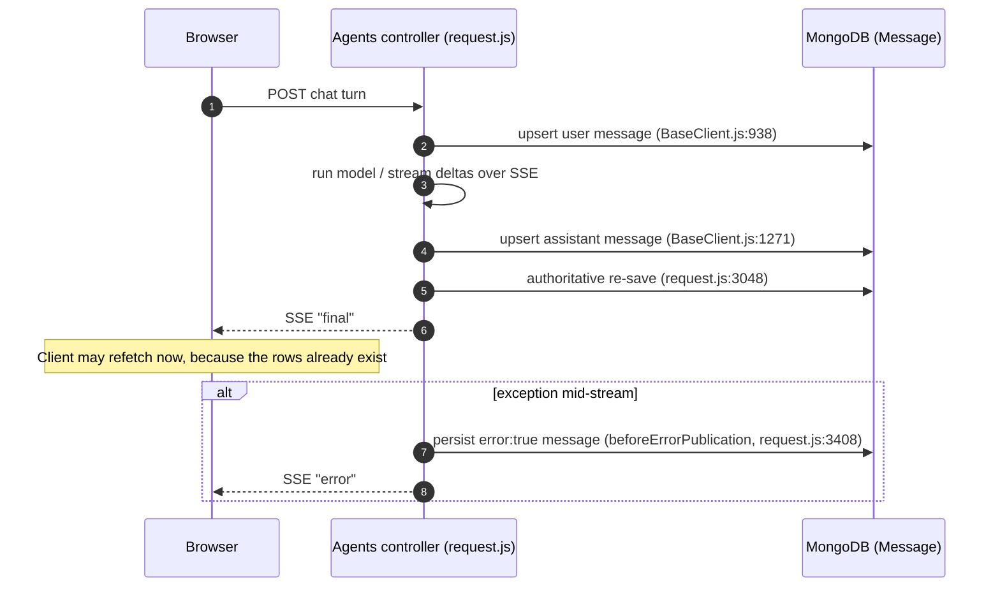
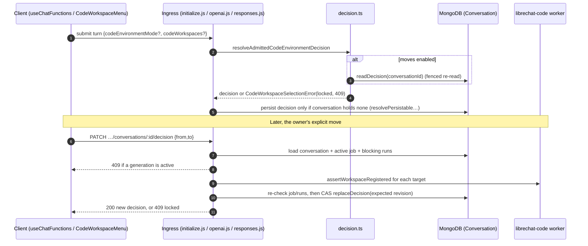
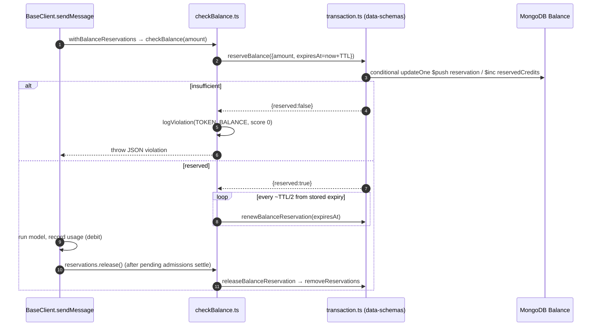
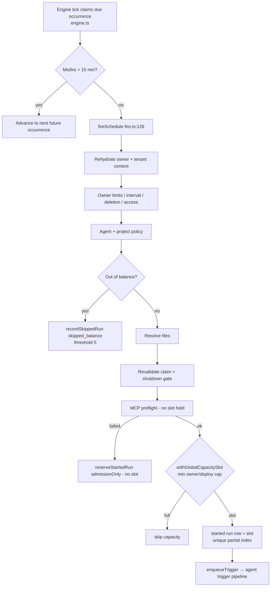

# 06 — Business Logic

> **Who this is for:** engineers who need to know *why* Eleven-Chat behaves the way it does
> before they change it. Each rule below starts with the business problem in plain language,
> then gives the mechanics, with `file:line` citations into the source.
>
> **Related guides:** [00 Overview](./00-overview.md) · [01 Architecture](./01-architecture.md) ·
> [02 Backend](./02-backend.md) · [05 Database](./05-database.md) ·
> [08 Auth & Security](./08-auth-security.md) ·
> [09 Background Processing](./09-background-processing.md) ·
> [13 Architecture Decisions & Limitations](./13-architecture-decisions-and-limitations.md) ·
> [14 Glossary](./14-glossary.md) · the original domain glossary in
> [`CONTEXT.md`](../../CONTEXT.md)

---

## How to read this guide

Every claim carries one of three evidence labels:

| Label | Meaning |
|---|---|
| **Verified** | The implementing code was read directly, either in the research pass or in a spot-check while writing this guide. |
| **Inferred** | There is strong indirect evidence (tests, call sites, config schema, code comments), but not every branch was traced. |
| **Unknown** | A concept is described (usually in `CONTEXT.md`) but was not traced to code in this pass. It is not confirmed and not disproved. |

Citations use `path:line` relative to the repository root. Line numbers drift as the code
changes, so treat them as the last known location and search for the named symbol if the line
has moved. Where the original research cited a line that has since moved, this guide uses the
location found in the spot-check (see [Citation corrections](#appendix-b--citation-corrections)).

Each rule uses the same layout:

- **Problem**: the business problem in plain language.
- **Trigger**: when the rule runs.
- **Inputs → outputs**
- **Where**: the implementation location.
- **Depends on**: data stores, services and other modules.
- **State changes**: what gets written, or "none".
- **Validation / authorization**
- **Failure behavior**
- **Edge cases**
- **Tests**

### Domain map

| # | Domain | Rules | Crosses boundaries |
|---|---|---|---|
| 1 | [Conversations & messaging](#1-conversations--messaging) | 1.1–1.4 | client ↔ API ↔ Mongo |
| 2 | [Conversation code-environment decisions](#2-conversation-code-environment-decisions) | 2.1–2.2 | client ↔ API ↔ Mongo ↔ code worker |
| 3 | [Agents: selection, authorization, access](#3-agents-selection-authorization-access) | 3.1–3.3 | API middleware ↔ ACL collection |
| 4 | [Usage, balance & billing](#4-usage-balance--billing) | 4.1–4.3 | API ↔ Mongo `Balance` ↔ SSE to client |
| 5 | [Scheduling & triggers](#5-scheduling--triggers) | 5.1–5.2 | engine worker ↔ Mongo ↔ trigger pipeline ↔ MCP |
| 6 | [Human-in-the-loop & resume security](#6-human-in-the-loop-tool-approval--resume-security) | 6.1–6.2 | API ↔ persisted pending action ↔ LangGraph checkpointer |
| 7 | [Files & request limits](#7-files-attachments--request-limits) | 7.1–7.2 | API ↔ rate-limit cache store |
| 8 | [Auth & multi-tenancy](#8-authentication-authorization--multi-tenancy) | 8.1–8.2 | API ↔ Mongo ↔ optional Redis cache |
| 9 | [Cross-reference findings](#9-cross-reference-findings) | 9.1–9.2 | n/a |
| 10 | [Unknown / not yet traced](#10-unknown--not-yet-traced) | n/a | n/a |

---

## 1. Conversations & messaging

Eleven-Chat keeps LibreChat's core idea: a conversation is a **tree** of messages. Editing or
regenerating never overwrites an earlier turn; it adds a sibling. The rules in this section
follow from that design. For the full walkthrough, see `CRITICAL_FLOWS.md` §Flow 4 and
[05 Database](./05-database.md) for the `Message` schema.

### 1.1 Message history is a tree walked by `parentMessageId`

**Problem.** Users want to edit a message or regenerate a reply and still compare it with the
old version. Nothing should be lost after a bad edit. The model, however, must only ever see one
consistent, linear path.

| Facet | Detail |
|---|---|
| Trigger | Every turn that assembles a prompt on the legacy client path (`buildMessages` → `getMessagesForConversation`). |
| Inputs → outputs | The full flat set of messages in the conversation plus a target leaf `parentMessageId` → an ordered root-to-leaf array. |
| Where | `api/app/clients/BaseClient.js:1499` (`static getMessagesForConversation`). **Verified** |
| Depends on | MongoDB `Message` collection only. |
| State changes | None. It is a read-only reconstruction. |
| Validation / authorization | Only the `user` scoping of the Mongo query. The walk does not re-check that the leaf belongs to the authenticated conversation. **Verified** (per research) |
| Failure behavior | A missing message stops the walk early (`if (!message) break;`, `BaseClient.js:1529-1531`). No error is raised, so the model simply sees a shorter history. A `visitedMessageIds` set (`BaseClient.js:1512-1527`) breaks cycles in corrupted chains. **Verified** |
| Tests | No direct spec for `getMessagesForConversation` was found. Coverage is indirect, through agent and run specs. |

**How it works (Verified, spot-checked).** Every message is indexed by `messageId` into a `Map`.
The walk then starts at the target leaf and follows `parentMessageId` until it reaches
`Constants.NO_PARENT`. Because it follows one parent pointer per node, siblings created by edits
or regenerations are excluded automatically. One newer detail: when called with `summary: true`,
the walk **stops at a summary checkpoint** (`resolveCheckpointMessage`, then `break`,
`BaseClient.js:1534-1543`). This links to rule 1.3.

**Edge cases.**

- **Edit and Regenerate both create siblings.** The edit path resubmits with the original
  message's `parentMessageId` (`client/src/components/Chat/Messages/Content/EditMessage.tsx:73-77`).
  Regenerate sets `overrideParentMessageId: isRegenerate ? messageId : null`
  (`client/src/hooks/Chat/useChatFunctions.ts:855`). **Verified**
- **Every branch is fetched on every turn.** The whole conversation, including abandoned
  branches, is loaded from Mongo before the walk discards most of it. This is a scaling cost for
  heavily edited conversations (`CRITICAL_FLOWS.md` §Flow 4 "Gotchas"). **Verified** (per research)
- **The active branch exists only on the client.** The branch on screen is per-level UI state held
  in a Jotai atom family, `siblingIdxFamily`, read in
  `client/src/components/Chat/Messages/MultiMessage.tsx:26` and defined in `./Thread/state`. Two tabs
  can show different branches, and the server has nothing to reconcile. **Verified**

### 1.2 Message saves are upserts keyed by `messageId`, with a final authoritative re-save

**Problem.** The browser can refetch a conversation as soon as a turn finishes. If the database
write has not landed yet, the user sees stale or missing content. Saves must be idempotent and
must be ordered before the events that prompt a refetch.

| Facet | Detail |
|---|---|
| Trigger | Three points in the chat lifecycle: turn start (user message), after the model call resolves (assistant message), and just before the `final` SSE event. |
| Inputs → outputs | A full message document → the persisted row, always identified by `messageId` and never by a new `_id`. |
| Where | User-message save: `api/app/clients/BaseClient.js:938`. Assistant save: `BaseClient.js:1271`. Pre-`final` re-save: `api/server/controllers/agents/request.js:3048` (comment: *"Save user message BEFORE sending final event to avoid race condition"*). Upsert primitives: `packages/data-schemas/src/methods/message.ts:400` (`findOneAndUpdate` with conditional `upsert`) and `message.ts:1280-1300`. **Verified** |
| Depends on | MongoDB. Idempotency relies on the unique message index, and the duplicate-key path at `message.ts:1353` (`code === 11000`) logs, re-reads the existing row and continues. **Verified** |
| State changes | Overwrites the row's content and metadata. The same `messageId` never produces a second row. |
| Failure behavior | On a mid-stream exception, a `beforeErrorPublication` hook (`request.js:3408`, again at `:3627`) persists a real assistant message *before* the `error` SSE event goes out. Success and failure share the same "persist, then announce" ordering. **Verified** (location); ordering semantics **Verified** per research |
| Edge cases | If every SSE subscriber disconnects, the `allSubscribersLeft` handler (`request.js:1925`) writes a defensive partial snapshot (`unfinished: true`). Generation is **not** aborted, and the real final save overwrites the placeholder later. **Verified** (per research) |

### 1.3 Context-window management: legacy truncation vs. agents-path summarization

**Problem.** A long conversation eventually outgrows the model's context window. The legacy path
drops the oldest turns. The agents path tries to keep older context by summarizing it, but must
not loop forever when the budget is too small to make progress.

| Facet | Detail |
|---|---|
| Trigger | Every turn, after history loads and before the provider call. |
| Inputs → outputs | Ordered messages plus `maxContextTokens` and `reserveRatio` → the truncated or summarized subset that is sent. |
| Where | Legacy: `api/app/clients/BaseClient.js:721` (`getMessagesWithinTokenLimit`). Agents: `packages/api/src/agents/run.ts:1522` (`MIN_SUMMARIZATION_CONTEXT_TOKENS = 1024`), `run.ts:1528` (`computeEffectiveMaxContextTokens`), gate at `run.ts:2601-2616`. **Verified** |
| Depends on | Tokenizer (`packages/api/src/utils/tokenizer.ts`). |
| Validation | `isUsableSummaryPart` (`packages/api/src/agents/compaction.ts:63`) rejects a summary that is still in progress, failed, or missing its final boundary. A crashed summarization round is therefore never used as a checkpoint. **Verified** |
| Failure behavior | **Legacy:** fills from the newest message backwards and silently drops everything older. No warning reaches the user. **Agents:** when the effective budget is below 1024 tokens, summarization is turned off, plain pruning is used, and the run can fail fast with an actionable `empty_messages` token-budget error instead of looping (comment at `run.ts:1518`). **Verified** |
| Edge cases | Once a summary checkpoint is used, turns before it are **never loaded into the prompt**, rather than just being left out of the token count. This matches the checkpoint `break` in rule 1.1. **Verified**. The research reported a `reserveRatio` default of 0.05 from a code comment. The spot-check found `reserveRatio: z.number().min(0).max(1).optional()` in `packages/data-provider/src/config.ts:3557` and test fixtures using 0.03–0.99, but did not locate the literal default. Treat 0.05 as **Inferred**. |
| Tests | `packages/api/src/agents/compaction.spec.ts`, `packages/api/src/agents/__tests__/run-summarization.test.ts`. |

### 1.4 Forking copies messages and never mutates the source

**Problem.** A user wants to branch a long conversation into a new, independent one, for example
to explore a tangent, without risking the original.

| Facet | Detail |
|---|---|
| Trigger | `POST /api/convos/fork`. |
| Inputs → outputs | Source `conversationId`, target leaf, and fork mode → a new conversation with fresh `messageId`s. |
| Where | `api/server/utils/import/fork.js:71` (`forkConversation`, default `option = ForkOptions.TARGET_LEVEL` at `:76`). Mode branches: `DIRECT_PATH` `:112`, `INCLUDE_BRANCHES` `:118`, `TARGET_LEVEL` `:121`. **Verified** |
| Depends on | MongoDB only, through an `ImportBatchBuilder`. |
| State changes | Inserts a new conversation and message set. The source is only read. Cloned IDs are remapped, and `createdAt` is moved forward by 1 ms when a clone would otherwise tie with or precede its new parent. **Verified** (per research) |
| Failure behavior | Not traced beyond mode selection. **Unknown** |
| Edge cases | `TARGET_LEVEL`, the default, is deliberately broader than a single path: it also pulls in sibling branches at the target's level. Forking is a bulk write, not an O(1) operation. |
| Tests | `api/server/utils/import/fork.spec.js` exists (found in the spot-check). |

---

## 2. Conversation code-environment decisions

**Background.** An *attached code environment* is a stateful workspace run by a
`librechat-code` worker on a machine the user chooses (`CONTEXT.md` line 5). Giving a chat access
to that workspace is a privilege decision, so the fork **seals** it per conversation.

### 2.1 The code-environment choice is sealed on the first accepted submission

**Problem.** A later turn, a retry, a resume, or a request from a different entry point must not
quietly upgrade a plain chat into one with shell and file access to a stateful workspace. It also
must not swap which workspace an attached chat uses. Either would be a privilege escalation the
user never agreed to for this conversation.

| Facet | Detail |
|---|---|
| Trigger | Every turn's admission path, before attached-workspace tools are registered. |
| Inputs → outputs | The stored conversation's `codeEnvironmentMode` / `codeWorkspaces` plus the requested mode and selections → a `ConversationCodeEnvironmentDecision` (`'attached'` with a workspace list, or `'without_attached'`), or a thrown `CodeWorkspaceSelectionError` with reason `locked`, `invalid` or `required`. |
| Where | `packages/api/src/code/decision.ts:73` (`resolveConversationCodeEnvironmentDecision`); sealing checks `:84-109`; persistence rule `:181` (`resolvePersistableCodeEnvironmentDecision`); admission wrapper `:221` (`resolveAdmittedCodeEnvironmentDecision`). **Verified** |
| Callers | `api/server/services/Endpoints/agents/initialize.js:664`, `api/server/controllers/agents/openai.js:483`, `api/server/controllers/agents/responses.js:734`. Chat UI, OpenAI-compatible and Responses ingress all go through the same function. **Verified** |
| Depends on | Pure function over the conversation document the caller supplies. When moves are enabled, `resolveAdmittedCodeEnvironmentDecision` re-reads the decision through `readDecision` instead of reusing the conversation loaded earlier in the request (`decision.ts:218-235`). **Verified** |
| State changes | A conversation's first decision is persisted with its first accepted message. Later runs never overwrite it: `resolvePersistableCodeEnvironmentDecision` returns `{}` for a conversation that already holds a decision (`decision.ts:209-214`). |
| Validation | `validateDecision` (`decision.ts:33`): `'attached'` requires a non-empty selection list (`required`), and `'without_attached'` rejects any selections (`invalid`). Selections are canonicalized before comparison (`decision.ts:25-31`). **Verified** |
| Failure behavior | A requested mode or selection that conflicts with the sealed decision throws `locked` (`decision.ts:90-107`). The turn is rejected outright, with no silent override. `CodeWorkspaceSelectionError` carries HTTP status **409** and code `ErrorTypes.CODE_WORKSPACE_UNAVAILABLE` (`packages/api/src/code/errors.ts:21-29`). **Verified** |
| Edge cases | A chat that never used a code-capable agent holds **no** decision (`holdsDecision`, `decision.ts:58`). Switching it to a coding agent still gets a first choice, and the code comment explains that sealing it would report a `without_attached` choice the owner never made. Legacy rows that store only selections are read as `attached` (`readPersistedDecision`, `:63-70`). |
| Tests | `packages/api/src/code/decision.spec.ts`. |

### 2.2 The single allowed mutation: the owner's explicit move

**Problem.** After a chat is sealed, the agent's workspace can change, or a machine can become
unreachable. The owner needs a way to repoint the conversation without losing history. No one
else, and no in-flight generation, may do it.

| Facet | Detail |
|---|---|
| Trigger | `PATCH /api/code-environments/conversations/:conversationId/decision` (`api/server/routes/code-environments.js:52-57`, behind IP and user status limiters). |
| Inputs → outputs | `from` (must equal the current sealed selections) and `to` (new selections; empty means detach) → `200 {conversationId, codeEnvironmentMode, codeWorkspaces?}`. |
| Where | Pure contract: `packages/api/src/code/decision.ts:134` (`resolveConversationCodeEnvironmentMove`). HTTP handler: `packages/api/src/code/http.ts:401` (`moveConversationDecision`). Endpoint helper: `packages/data-provider/src/api-endpoints.ts:58-59`. **Verified** |
| Config | `endpoints.agents.statefulCodeSessions.conversationMoves.enabled` enables moves, and `...conversationMoves.allowAttachDetach` separately enables attach and detach (`packages/api/src/code/config.ts:42-61`; schema `packages/data-provider/src/config.ts:1683-1688`). **Verified** |
| Validation / authorization | 401 without a principal (`http.ts:403`). 403 when moves are disabled (`:423-425`). 403 when the move attaches or detaches and `allowAttachDetach` is off (`:451-459`). Every target workspace must be live-registered for the owner (`assertWorkspaceRegistered`, `:466-477`). The pure function refuses a chat with no decision, a stale `from`, a detach of a non-attached chat, and a no-op move to the same set; each refusal is `locked` (`decision.ts:143-165`). **Verified** |
| Failure behavior | **409** `"Wait for the current response to finish before moving this conversation"` while a generation job is active or any cleanup-blocking run exists for the conversation (`http.ts:440-446`). The check runs again after the worker round-trips (`:489-495`). The write is a compare-and-swap on `codeEnvironmentMode`, `codeWorkspaces` and `codeEnvironmentRevision` (`conversations.replaceDecision`, `:497-510`), so a run admitted in between causes `locked`. **Verified** |

> **Correction to the research pass.** The research left the "refused while a generation is
> running" guarantee as *Inferred*. The spot-check found it in `http.ts:440-446` and `:489-495`,
> so it is now **Verified**. The handler comment (`http.ts:392-400`) says the refusal covers
> "running, awaiting approval, or saving its response". The code checks this through
> `isGenerationActive(job)` and `getCleanupBlockingJobIdsForConversations`. Exactly how those two
> map onto each of the three states was not traced.

> **Glossary vs. code nuance (Verified).** `CONTEXT.md` line 6 says a move "never upgrades a
> conversation that continues without an attached environment." The pure function *does* return
> `attached` for a `without_attached` conversation (`decision.ts:160-161`), and the handler comment
> lists "an attach for a chat that has been running without one" (`http.ts:394-395`). The upgrade
> is allowed **only** when `allowAttachDetach` is `true` (`http.ts:451-459`). With the default
> configuration, the glossary statement holds. With the opt-in, it does not.

---

## 3. Agents: selection, authorization, access

See [08 Auth & Security](./08-auth-security.md) for the ACL model in depth.

### 3.1 Enforced model specs override the client's agent and model before authorization

**Problem.** When an administrator sets `modelSpecs.enforce: true`, users must not be able to pick
any agent or model by sending a different `agent_id` or `model` in the request body. The agent
bound to the spec must be the one that is authorized **and** the one that runs. `CONTEXT.md`
calls this *Effective agent selection* (line 13).

| Facet | Detail |
|---|---|
| Trigger | Every chat request, in `canAccessAgentFromBody` (ACL) and in `buildEndpointOption` (request building). |
| Inputs → outputs | `req.body.spec`, `req.body.agent_id`, `req.config.modelSpecs` → the agent ID that is checked against the ACL, plus a request body rewritten by `applyModelSpecPreset`. |
| Where | `api/server/middleware/accessResources/canAccessAgentFromBody.js:18-31` (`resolveEnforcedAgentId`) and `:177` (`let agentId = resolveEnforcedAgentId(req, endpoint) ?? agent_id;`). `api/server/middleware/buildEndpointOption.js:89-135` (the `enforce` branch). **Verified** |
| Depends on | `resolveModelSpecForEndpoint` and `applyModelSpecPreset` from `@librechat/api`, and the per-resource ACL (rule 3.2). |
| Failure behavior | With enforcement on: 400 `'No model spec selected'` when no spec is sent (`buildEndpointOption.js:101-103`), and `'Invalid model spec'` / `'Model spec mismatch'` on resolution errors (`:110-117`). 400 `'agent_id is required in request body'` when no ID resolves (`canAccessAgentFromBody.js:184-189`). **Verified** |
| Edge cases | A non-agents endpoint is forced to `Constants.EPHEMERAL_AGENT_ID` (`canAccessAgentFromBody.js:179-181`). Ephemeral agent IDs skip the resource ACL check and go straight to the added-conversation check (`:192-194`). **Verified** |
| Tests | `api/server/middleware/accessResources/canAccessAgentFromBody.spec.js`, `api/server/middleware/buildEndpointOption.spec.js`. |

The two call sites compute the enforced identity independently. See [§9.1](#91-the-enforced-agent-id-is-derived-in-two-places).

### 3.2 Agent access has two layers: capability bypass, then per-resource ACL

**Problem.** An organization admin should not need an ACL row on every agent. A regular user's
access must still come from explicit grants. Blanket role capabilities and per-resource grants
are therefore checked separately.

| Facet | Detail |
|---|---|
| Trigger | Any route wrapped in `canAccessResource({resourceType: 'agent', …})`, or `canAccessAgentFromBody`. |
| Inputs → outputs | `req.user`, a resource ID (a custom string such as `agent_abc123`, resolved to a Mongo `_id` by `idResolver`), and a permission bitmask (1 view, 2 edit, 4 delete, 8 share) → `next()` with `req.resourceAccess` set, or an error response. |
| Where | `api/server/middleware/accessResources/canAccessResource.js:73-85` (capability bypass through `ResourceCapabilityMap` / `hasCapability`), `:91-118` (ID resolution), `:121` (`checkPermission`). **Verified** |
| Depends on | Mongo `aclEntry` collection and role capability flags. Access roles `AGENT_VIEWER` / `AGENT_EDITOR` / `AGENT_OWNER` (plus `REMOTE_AGENT_*`) are defined in `packages/data-provider/src/accessPermissions.ts:75-89`. |
| State changes | None. |
| Failure behavior | 400 when the resource ID param is missing, 401 when unauthenticated (`:65-72`), 404 when the resolver finds nothing (`:97-103`), 403 `'Insufficient permissions…'` when the ACL check fails, 500 on an internal error. **Verified** (400/401/404 spot-checked; 403/500 per research) |
| Edge cases | The bypass runs **first**. If the capability check itself throws, the error is logged as `"capability check failed, denying bypass"` and the request falls through to the normal ACL path (`:76-80`). Only the shortcut is denied; the request is not. **Verified** |
| Tests | No dedicated spec for `canAccessResource.js` was found. Coverage comes through route specs and `canAccessAgentFromBody.spec.js`. |

### 3.3 Sub-agents never inherit the request's per-call `model_parameters`

**Problem.** A one-off UI tweak, such as a temperature slider on the message being sent, should
affect only the agent answering the request. If it leaked into every sub-agent, sub-agent
behavior would depend on unrelated UI state.

| Facet | Detail |
|---|---|
| Trigger | Every agent initialization where `isInitialAgent !== true`. |
| Where | `packages/api/src/agents/initialize.ts:1499`: `isInitialAgent === true ? endpointOption?.model_parameters : {}`. **Verified** |
| Edge cases | `CRITICAL_FLOWS.md` §Flow 3 "Gotchas" documents this gate. A refactor that drops it would silently change every nested-agent conversation. |

---

## 4. Usage, balance & billing

### 4.1 Credits are reserved at admission, renewed while the work runs, then released

**Problem.** Suppose several requests from a user with a small balance arrive at once. If each one
only checked "is the balance high enough?" before running, all of them would pass and the user
would overspend. The fix is to **hold** credits at admission and keep the hold alive for as long
as the work runs.

| Facet | Detail |
|---|---|
| Trigger | Before a priced generation proceeds. Holds are only placed for `amount > 0`. |
| Inputs → outputs | `user`, `model`, `endpoint`, `tokenType`, and `amount` (a raw token count) → a `BalanceReservation` with an idempotent `release()`, or a thrown `Error` whose message is a JSON violation payload (`{type, balance, tokenCost, promptTokens, generations?}`). |
| Where | API side: `packages/api/src/middleware/checkBalance.ts:199` (`checkBalance`), `:112` (`holdReservation`), `:72` (`createBalanceReservations`). DB side: `packages/data-schemas/src/methods/transaction.ts:467` (`reserveBalance`), `:579` (`renewBalanceReservation`), `:593` (`releaseBalanceReservation`). **Verified** |
| Callers | `api/app/clients/BaseClient.js:766` wraps every `sendMessage` in `withBalanceReservations`, and `checkBalance` is called at `BaseClient.js:1026` and tracked at `:1048`. The Assistants controllers do the same (`api/server/controllers/assistants/chatV1.js:338`, `chatV2.js:209`). **Verified** |
| Depends on | MongoDB `Balance` document: the `reservations[]` array and the `reservedCredits` counter. No Redis is involved in reservations. Rates come from `getMultiplier` (rule 4.2). **Verified** |
| Config | `balance.reservationTtlMs` in `configSchema` (`packages/data-provider/src/config.ts:3466-3471`), default `DEFAULT_BALANCE_RESERVATION_TTL_MS = 30 * 60 * 1000` (`packages/data-provider/src/balance.ts:28`). **Verified** |
| State changes | Pushes a `{id, amount, expiresAt}` reservation and increments `reservedCredits`. The final debit is **not** applied here; that happens when actual usage is recorded. A missing balance record is created lazily from `config.startBalance` (`buildInitialBalance`, `checkBalance.ts:186`; upsert at `transaction.ts:484-489`). |
| Validation | Only the balance check. The middleware trusts its caller for the user's identity. |
| Failure behavior | Throws `Error(JSON.stringify(...))` with `type: ViolationTypes.TOKEN_BALANCE`, after calling `deps.logViolation(…, 0)` (`checkBalance.ts:272`). An insufficient-balance rejection goes to the same channel as abuse violations, with a score of 0. A reservation that keeps losing write races throws `"Balance reservation … exceeded its retry bound"` (`transaction.ts:575`). **Verified** |
| Tests | `packages/api/src/middleware/checkBalance.spec.ts`, `packages/api/src/middleware/balance.spec.ts`. |

**How the atomic admission works (Verified, spot-checked in `transaction.ts:467-576`).**

1. Read the user's `Balance` row. If it is missing, create it from `initialBalance` and retry.
2. If the stored refill policy differs from the configured one, upsert it and retry.
3. Remove any expired reservations, then retry.
4. Compute `available = tokenCredits − reservedCredits`. If an auto-refill is due (and the mode is
   reset, or this admission would exhaust the balance), apply one fenced refill per admission and
   retry.
5. If `available < amount`, return `{reserved: false}`.
6. Otherwise run a **conditional** `updateOne`. It matches only while `tokenCredits ≥ credits read`
   and `reservedCredits ≤ credits − amount`, then `$push`es the reservation and `$inc`s
   `reservedCredits` by `ceil(amount)`. Losing the race means re-reading with jittered
   exponential backoff (10 ms doubling, capped at 500 ms).
7. If the write throws, which can happen after it has already committed, the reservation is
   removed immediately. The caller never got a handle to release it, so it is not left to expire.

**Renewal and release edge cases (Verified, `checkBalance.ts:60-162`).**

- The hold is renewed at **half its TTL, measured from the stored expiry** rather than from when
  the renewal write finished. A slow write therefore cannot let the hold lapse before the next
  renewal fires.
- A failed renewal retries every `min(ttl/20, 5 s)` instead of waiting out the full half-TTL.
- `release()` is idempotent. A failed release is logged and left to expire.
- `BalanceReservations.release()` first waits for admissions that are still **pending**. A
  reservation that settles after its turn has already failed is still released, not leaked.
  `holdUntil(work)` keeps holds alive while a run continues in the background.

### 4.2 The cost shown and the cost billed come from one function

**Problem.** Providers count cache tokens differently. OpenAI, Anthropic and Google report cached
tokens as a *subset* of `input_tokens`. Bedrock reports them *in addition to* `input_tokens`.
Vertex AI's streaming path under-reports `output_tokens` by leaving out thinking tokens. If the
live cost in the UI and the billing path used different math, the number shown while streaming
could quietly differ from the amount charged.

| Facet | Detail |
|---|---|
| Trigger | Any conversion of usage into credits or USD, both for live SSE usage events and for the final transaction. |
| Inputs → outputs | `UsageMetadata`, `PricingFns`, and an optional admin `endpointTokenConfig` → USD (credits / 1e6). |
| Where | `packages/api/src/agents/usage.ts:215` (`computeUsageCostUSD`), split by `splitUsage` (`:124`), completion repair in `resolveCompletionTokens` (`~:75-94`). The docstring at `usage.ts:208-214` says *"the client must not re-derive pricing from base rates."* **Verified** |
| Depends on | `packages/data-schemas/src/methods/tx.ts`: `getMultiplier` (`:627`), `defaultRate = 6` (`:29`), `getPremiumRate` (`:609`). |
| Rate resolution order | (1) Admin `endpointTokenConfig[model]`, when that model is listed. A partial override prices only the models it lists (`tx.ts:642-649`). (2) Premium / tiered rate based on `inputTokenCount`. (3) Static `tokenValues[valueKey][tokenType]`. (4) `defaultRate` (6). If `tokenType` or `model` is missing, the multiplier is `1` (`tx.ts:662-664`). **Verified** |
| Failure behavior | No exception path. An unmapped model falls back to `defaultRate`, so billing never blocks a generation. It can only mis-price an unmapped model. |
| Edge cases | **Vertex undercount** (issue #13006 in the code comment): the gap `total − input` is recovered as completion tokens. **Bedrock inflation**: for additive providers, cache tokens are subtracted *before* that gap test so the Vertex repair does not misfire on every cached step (`usage.ts:~55-94`). **Verified** |
| Tests | `packages/api/src/agents/usage.spec.ts`, `packages/api/src/agents/usage.bulk-parity.spec.ts`. |

### 4.3 Scheduled runs auto-disable after repeated balance skips

**Problem.** A schedule whose owner has run out of credits should not keep firing and skipping
forever. After a few consecutive skips it turns itself off.

| Facet | Detail |
|---|---|
| Where | Constant `BALANCE_SKIP_DISABLE_THRESHOLD = 5` (`packages/api/src/schedules/fire.ts:18`, doc comment: *"Consecutive balance skips (pre-fire or mid-generation) before auto-disable"*). Pre-fire path: `if (await deps.isOutOfBalance(user))` → `methods.recordSkippedRun({…status: 'skipped_balance'}, BALANCE_SKIP_DISABLE_THRESHOLD)` (`fire.ts:359-387`). Also passed as `balanceSkipDisableThreshold` from `engine.ts:354` and `service.ts:1618`. **Verified** |
| Trigger condition | The research left this as *Inferred*. The spot-check confirms the pre-fire balance check passes the threshold into `recordSkippedRun`. The comparison that disables the schedule lives inside that data method and was **not** read; the "mid-generation" path named in the comment was not traced. **Inferred** for the exact disable write. |
| Failure behavior | The claim is revalidated *before* the skip is recorded (`fire.ts:367-372`), so a stale worker cannot advance someone else's skip streak. If skip bookkeeping throws, the occurrence is **not** advanced and stays due for retry (`fire.ts:377-385`). **Verified** |
| Config note | The threshold is a hard-coded exported constant, not a `configSchema` field. The surrounding comment at `fire.ts:250-252` refers to a "different auto-disable threshold" per tenant or role, but this pass found no config field for it. **Unknown** whether that is configurable elsewhere. |

---

## 5. Scheduling & triggers

See [09 Background Processing](./09-background-processing.md) for the engine tick, leases and
reconciliation loops.

### 5.1 Scheduled-run admission is a multi-phase gate, separate from generation capacity

**Problem.** When a schedule comes due, much may have changed since it was created. The owner's
role, permissions, balance, agent access or project may all be different. Each occurrence must
re-check everything **for the owner, right now**. A slow readiness check, such as a slow MCP
server, must never hold one of the limited generation slots that healthy schedules need.
(`CONTEXT.md` line 3: *Scheduled run admission*.)

| Facet | Detail |
|---|---|
| Trigger | Every due occurrence the engine tick claims, and manual "Run now". |
| Inputs → outputs | A claimed `FireableSchedule` plus `scheduledFor` → a `FireResult` (`{fired: true}` or `{fired: false, skipped \| error}`). |
| Where | `packages/api/src/schedules/fire.ts:126` (`fireSchedule`); `packages/api/src/schedules/capacity.ts:23` (`withCapacitySlot`); `packages/api/src/schedules/engine.ts:19` (`MISFIRE_GRACE_MS`). **Verified** |
| Depends on | MongoDB (schedule and run documents, a unique partial index for occurrences and capacity slots), the agent-trigger pipeline (`createAgentTriggerEnvelope`, `deps.enqueueTrigger` at `fire.ts:108`), and MCP preflight. All dependencies are injected through `ScheduleEngineDeps`. |
| Config | `configSchema` exposes `minIntervalMinutes`, `fireConcurrency` and `mcpPreflightTimeoutMs` (`packages/data-provider/src/config.ts:2816-2841`). **Verified** |

**The admission sequence (Verified, spot-checked in `fire.ts:236-600`).** Each gate either passes
or ends the fire with a named outcome:

| # | Gate | Outcome if it fails | Line |
|---|---|---|---|
| 1 | `nextRunAt` computable | disable `invalid_schedule` | `:236-240` |
| 2 | Owner rehydrates (`getUserContext`) | disable `permission_revoked`, skip `user_missing` | `:242-247` |
| 3 | Owner-scoped limits `enabled` | deployment-wide off → **step aside without consuming** the occurrence; principal-scoped off → consume, skip `disabled` | `:253-265` |
| 4 | Cadence ≥ owner's `minIntervalMinutes` (in the schedule's own time zone) | disable `invalid_schedule` | `:273-279` |
| 5 | Owner not being deleted | skip `user_deleting` (the deletion cascade owns the row) | `:285-288` |
| 6 | Owner still has schedule access | disable `permission_revoked` | `:292-296` |
| 7 | Agent access (`missing` / `forbidden`) | disable `agent_deleted` or `permission_revoked` | `:312-321` |
| 8 | Project policy (`requireProject`, project access) | disable `project_required` or `project_deleted` | `:326-343` |
| 9 | Balance (`isOutOfBalance`) | skip `balance`, advancing the auto-disable streak (rule 4.3) | `:359-388` |
| 10 | File resolution | error `File resolution failed`; `nextRunAt` untouched so it retries | `:390-409` |
| 11 | Claim revalidation, then shutdown gate | step aside | `:422-438` |
| 12 | MCP preflight, bounded by the **lower** of owner and deployment timeout/concurrency and by the lease deadline | records an admission-only failed run **without** a generation slot | `:440-472`, `:549-556` |
| 13 | Global capacity slot | skip `capacity` | `:571-595` |
| 14 | Single active run per schedule | skip `overlap` | `:599-618` |

**State changes and fencing.**

- **The database enforces capacity.** `withCapacitySlot` claims the lowest free slot number in the
  same insert that reserves the `started` run row. A unique partial index decides collisions, so
  two *different* schedules cannot both read `cap−1` and both proceed. Attempts are bounded at
  `cap+1` (`capacity.ts:12-53`). **Verified**
- **Overrides cannot widen the cap.** The cap is `min(owner.fireConcurrency,
  deployment.fireConcurrency)` (`fire.ts:571-572`). The comment explains that a per-user override
  of 5 against a base of 1 would otherwise let repeated "Run now" clicks start five billed
  generations at once. **Verified**
- **Legacy-safe rollout.** `unslotted` counts `started` rows written before slots existed. They
  reduce the effective cap so the limit stays conservative during rollout (`capacity.ts:1-7`).
- **Stale-worker fencing.** Writes are fenced on a rotating `claimToken`, and `revalidateClaim`
  runs before every write that matters (`fire.ts:367-372`, `:422-427`, `:464-469`). A superseded
  fire steps aside through `stepAsideSuperseded` (`fire.ts:227-234`) instead of advancing the
  schedule.
- **Stable delivery identity.** `buildFireClientRequestId` (`fire.ts:24-26`) produces
  `sched:<id>:<iso>`, and the delivery key is stored on the reservation **before** enqueue. Even an
  ambiguous enqueue can then be reconciled (`fire.ts:28-48`, `:478-515`).
- **Misfire grace.** Occurrences more than 15 minutes overdue, for example after downtime, are
  advanced to the next future time without firing (`engine.ts:17-19`, `:534`). **Verified**

**Tests:** `packages/api/src/schedules/fire.spec.ts`, `engine.spec.ts`, `service.spec.ts`. No
`capacity.spec.ts` was found.

### 5.2 Agent queued turns: follow-ups during a running generation are owned by Mongo

**Problem.** A user, or a trigger, may send a follow-up while a generation is still running. The
follow-up must be admitted exactly once and in order, and must survive a process crash. The
in-memory job cannot be the source of truth because it may die or move to another replica.

| Facet | Detail |
|---|---|
| Trigger | A new message or trigger delivery for a conversation whose generation job is active. |
| Where | `packages/api/src/agents/queuedTurns.ts` (1,118 lines): `AGENT_QUEUED_TURN_SOURCE = 'agent-queued-turn'` (`:29`), `CLAIM_LEASE_MS = 2 min` (`:32`), reconciliation backoff 5 s → 5 min (`:34-35`), `PROCESS_CLAIM_OWNER = agent-queued-turn:<pid>:<uuid>` (`:43`), worker-capability constants `…QUEUED_TURN_V1/V2` (`:4-5`, used at `:790-791`). **Verified** (constants and shape) |
| Depends on | MongoDB (the queued-turn row), the generation job store (read to check the predecessor's status), and the agent-trigger delivery pipeline. |
| Lifecycle guarantees | `CONTEXT.md` line 23 describes them: the row as the sole FIFO, payload and lifecycle authority; "admission-indeterminate" evidence instead of silent resubmission after a crash; aborted predecessors kept as visible terminal rows; conversation deletion cancelling rows first. These were **not** traced statement by statement. **Inferred** in shape, **Unknown** in detail. |
| Tests | `packages/api/src/agents/queuedTurns.spec.ts`, `packages/api/src/agents/queuedTurnHttp.spec.ts`. |

---

## 6. Human-in-the-loop (tool approval) & resume security

Operator-facing configuration is in [`docs/tool-approval-modes.md`](../tool-approval-modes.md).
Security implications are in [08 Auth & Security](./08-auth-security.md).

### 6.1 Tool-approval policy: the endpoint owns `enabled`

**Problem.** Once a stateful code workspace is attached, shell and file tools should not run
completely unsupervised. At the same time, admins should not have to opt the whole endpoint into
approval prompts by hand. The real on/off switch must stay an administrative decision that agent
or skill config cannot flip.

| Facet | Detail |
|---|---|
| Trigger | Once per turn, before the run starts. |
| Inputs → outputs | `ToolApprovalPolicyLayers {endpoint, agent, skills, attachedCodeEnvironment}` → the effective `TToolApprovalPolicy \| undefined`. |
| Where | `packages/api/src/agents/hitl/policy.ts:70` (`resolveToolApprovalPolicy`), `:102` (`isHITLEnabled`), `:173` / `:184` (deny / block checks), `:984` (`exemptAskUserQuestionFromApproval`). **Verified** |
| Behavior | With an attached code environment, and **only** when the endpoint policy sets `enabled` to neither `true` nor `false`, the result is `{...endpoint, enabled: true, mode: 'bypass'}`. In every other case the endpoint policy is returned unchanged. An explicit `enabled: false` stays the administrator's emergency override (`policy.ts:64-87`). **Verified** |
| Layering caveat | The doc comment says `agent` and `skills` layers are "accepted but not yet merged" (`policy.ts:68`). Today only the endpoint layer and the attached-environment flag affect the result. **Verified** |
| Validation | HITL is off by default: `isHITLEnabled` requires `policy?.enabled === true`. A static `deny` match, or an unmatched tool under `mode: 'dontAsk'`, **blocks** the tool. Nothing downstream can turn a block into a review prompt (`policy.ts:172-194`). **Verified** |
| Edge cases | `ask_user_question` is exempt from approval unless an admin lists it in `allow`, `ask` or `deny`. The rationale in the comment is that the tool has no side effects and its payload is length-capped text (`policy.ts:~975-995`). **Verified** |
| Cross-boundary caveat | When HITL is on, the host must pass a durable `compileOptions.checkpointer` (`LibreChatCheckpointSaver`). Otherwise the SDK falls back to a process-local `MemorySaver` and resume **silently breaks across worker hops** (`policy.ts:93-100`). **Verified** (comment); call-site wiring not traced |
| Tests | `packages/api/src/agents/hitl/policy.spec.ts` (found in the spot-check), `allow.spec.ts`, `admission.spec.ts`, `byom.spec.ts`, `runtime.spec.ts`. |

### 6.2 Resume replays a server-captured request, not the client's new request

**Problem.** A paused run, waiting on a tool approval or an `ask_user_question` answer, may be
resumed after a page reload, on another replica, or after a deploy. The rebuilt graph must be
**exactly** the graph that paused. If the server trusted the resume POST, a crafted request could
reuse a legitimate interrupt ID to swap in a different agent, model, tool set, skill set or
working directory.

| Facet | Detail |
|---|---|
| Trigger | Every resume of a `tool_approval` or `ask_user_question` pause. |
| Inputs → outputs | The persisted `resumeContext` (captured at pause time) and a request fingerprint → the resume body is mutated in place. |
| Where | `RESUME_CONTEXT_KEYS` (`policy.ts:455-496`), `applyResumeContext` (`:773`), `applyResumeRequest` (`:794`), `computeAgentRequestFingerprint` (`:848`), `computeLegacyAgentRequestFingerprint` (`:875`, kept for mixed-version rolling deploys), `buildPendingAction` (`:903`). **Verified** |
| Replayed keys (Verified) | `endpoint`, `endpointType`, `agent_id`, `spec`, `model`, `promptPrefix`, `ephemeralAgent`, `codeApprovalMode`, `codeEnvironmentMode`, `codeWorkspaces`, `addedConvo`, `timezone`, `manualSkills`, `reasoningOverride`, `modelLabel`. |
| Security mechanism | A key the context **has** overwrites the client's value. A key it **lacks** is **deleted** from the body (`policy.ts:780-786`). The code comment calls the delete "the security half". `addedConvo` and `manualSkills` are not in the fingerprint, so without the delete a crafted resume could inject them and rebuild a single-agent checkpoint as a multi-agent graph. **Verified** |
| Validation | `sanitizeResumeModelParameters` (`:661`) and `sanitizeParamValue` (`:572`) strip credential-shaped keys (API keys, secrets, authorization, cloud credential fields, proxy / header / baseURL config) before persisting. The resume path re-resolves provider secrets on the server. **Verified** (per research) |
| Depends on | `node:crypto` SHA-256 for fingerprints. The caller persists the pending action. |
| Failure behavior | A replayed `reasoningOverride` that no longer validates is **degraded, not rejected**. Per the comment near `applyResumeRequest`, a 400 there would "brick the checkpoint". **Verified** (per research) |
| Edge cases | `modelLabel` is replayed but not fingerprinted. An ephemeral agent's LangGraph node name (and so its checkpoint namespace) is derived from it, and dropping it caused issue #14253, an "empty-graph resume" (`policy.ts:484-495`). `codeWorkspaces` is pinned on every pause type so a resume cannot rebuild against a different directory (`:465-468`). **Verified** |
| Tests | `hitl/policy.spec.ts`, `hitl/runtime.spec.ts`, `hitl/admission.spec.ts`. |

---

## 7. Files, attachments & request limits

### 7.1 Provider-specific file limits, with an admin override

**Problem.** Each LLM provider enforces its own attachment limits. A file the provider would reject
anyway should be caught locally, with a message that names the correct limit.

| Facet | Detail |
|---|---|
| Trigger | File validation when a file is encoded or attached for a provider. |
| Where | `packages/api/src/files/validation.ts`: `validatePdf` (`:29`, dispatches by provider), `validateAnthropicPdf` (`:68`), `validateBedrockDocument` (`:195`), `validateOpenAIPdf` (`:249`), `validateGooglePdf` (`:273`), `validateVideo` / `validateAudio` / `validateImage` (`:299` / `:336` / `:373`). Callers: `packages/api/src/files/encode/document.ts`, `encode/image.ts`. **Verified** |
| Hard-coded provider limits (Verified) | Anthropic PDF 32 MB (`:74`); Bedrock document 4.5 MB, or 32 MB for exempt model families (`:205`); OpenAI PDF 10 MB (`:253`); Google PDF / video / audio / image 20 MB (`:277`, `:306`, `:343`, `:380`); Anthropic image 5 MB (`:393`). |
| Override | Every validator takes an optional `configuredFileSizeLimit` (bytes), and `effectiveLimit = configuredFileSizeLimit ?? providerLimit`. **Verified** |
| Anthropic PDF checks | Requires a `%PDF-` header, rejects encrypted PDFs (`/Encrypt`, `/U (`, `/O (` markers), and estimates page count with a `/Type /Page` regex, capped at 100. **Verified** (per research) |
| Failure behavior | Returns `{isValid: false, error}` with the actual and limit sizes in MB. It never throws. |
| Edge cases | `BEDROCK_CLAUDE_4_PLUS_RE` (`:150`) documents two forms that used to slip through and wrongly fall back to the 4.5 MB limit: undated model IDs and bare inference-profile IDs without an `anthropic.` prefix. Read that comment before you change the regex. |
| Tests | `packages/api/src/files/validation.spec.ts`. |

See [§9.2](#92-provider-file-size-defaults-are-hard-coded-outside-configschema) for how these
defaults relate to `configSchema`.

### 7.2 Message send rate limits: per IP and per user, independently

**Problem.** Two separate concerns need separate limits: one IP hammering the API (shared
infrastructure, bots) and one authenticated user's own request rate (for example, a runaway client
loop).

| Facet | Detail |
|---|---|
| Trigger | Every message-send request, before the controller. |
| Inputs | Environment variables `MESSAGE_IP_MAX` / `MESSAGE_IP_WINDOW` and `MESSAGE_USER_MAX` / `MESSAGE_USER_WINDOW`, each defaulting to 40 requests per 1-minute window (`api/server/middleware/limiters/messageLimiters.js:8-20`). **Verified** |
| Where | `messageLimiters.js:1-60`, built on `express-rate-limit` with a shared `limiterCache` store. IP keys go through `removePorts`, so the port does not split one client into many keys. |
| Failure behavior | Logs a `ViolationTypes.MESSAGE_LIMIT` violation with `max`, `limiter` (`'ip'` or `'user'`) and a reset time, then calls `denyRequest`. **Verified** (per research) |
| Edge cases | The two counters are independent. |
| Config note | These limits are environment-only and are not in `configSchema` (observed; root `AGENTS.md` asks that env-only switches have a stated reason). |
| Tests | `api/server/middleware/limiters/messageLimiters.spec.js`. |

---

## 8. Authentication, authorization & multi-tenancy

Full treatment: [08 Auth & Security](./08-auth-security.md).

### 8.1 JWTs carry no role or permissions; the user document is re-read

**Problem.** A revoked role or a changed password must not keep working until a short-lived token
expires. Permissions are therefore read fresh instead of being baked into the token.

| Facet | Detail |
|---|---|
| Trigger | Every request authenticated by the local JWT strategy. |
| Where | `api/strategies/jwtStrategy.js:28-82`. **Verified** (spot-checked) |
| Sequence | (1) A token with the agent-trigger scope is rejected outside trigger-admission requests (`:37-40`). (2) `getUserById` runs as the system tenant and projects out `password`, `totpSecret` and `backupCodes` (`:41-46`). (3) `agentTriggerDeletionStartedAt != null` → reject with code `ACCOUNT_DELETION_IN_PROGRESS` (`:47-53`). (4) `continueAfterBearerRetirement` compares `issuedAt` / `issuedAtMs` against the user's credential-change time with `isTokenRetired` (`:55-73`). (5) A user with no role is assigned `SystemRoles.USER`, and that is **persisted** (`:66-69`). |
| Depends on | MongoDB `User`. An optional **auth user document burst cache** exists in `packages/api/src/auth/userDocCache.ts`. It is off unless `AUTH_USER_CACHE_MODE=on` and Redis is enabled (`:60-73`), with a TTL of `AUTH_USER_DOC_CACHE_TTL_MS = 5000` (`packages/data-provider/src/config.ts:4655`). In this pass the cache was found used by `api/strategies/openIdJwtStrategy.js`, **not** by `jwtStrategy.js`. **Verified** |
| State changes | The default role write only. |
| Failure behavior | Unauthorized when the user is missing, the token is retired, or deletion is in progress. |
| Edge cases | `issuedAtMs` is a custom millisecond claim because the standard `iat` has one-second resolution. That is too coarse to order a token against a password reset in the same second (`packages/data-schemas/src/methods/user.ts:794-796`). **Verified** |
| Invariant | Root `AGENTS.md` ("Backend auth cache"): any code that changes user documents must invalidate the auth user document cache for the affected users, including bulk role changes. Otherwise a cached `req.user` stays stale for up to the TTL. |
| Tests | `api/strategies/jwtStrategy.spec.js` (found in the spot-check). |

### 8.2 Multi-tenancy is opt-in through a trusted header

**Problem.** Unauthenticated routes, such as the login page, OAuth callbacks and public share links,
still need to be scoped to the right tenant. Deployments resolve tenants differently at their
reverse proxy, so the core should not hard-code a strategy like subdomain parsing.

| Facet | Detail |
|---|---|
| Trigger | Routes mounted with `preAuthTenantMiddleware` (`/api/config`, `/api/auth/*`, `/oauth/*`, `GET /api/share/:shareId`, per research). |
| Inputs → outputs | `X-Tenant-Id` header → a `tenantStorage` AsyncLocalStorage context for downstream Mongoose queries and config resolution. |
| Where | `packages/api/src/middleware/preAuthTenant.ts:38`. **Verified** |
| Validation | The header is ignored unless `TRUST_TENANT_HEADER` is enabled (`:42`). The reserved `__SYSTEM__` value is rejected with a warning log (`:53-62`). The value must match `/^[-a-zA-Z0-9_.]+$/` and be at most 128 characters (`:35-36`, `:65-74`). **Verified** |
| Failure behavior | It never blocks the request. A rejected or missing header continues **without** tenant context, the same as single-tenant mode. If `TRUST_TENANT_HEADER` is not set on a multi-tenant deployment, tenant scoping on these routes is dropped without any error. **Verified** |
| Tests | `packages/api/src/middleware/preAuthTenant.spec.ts`. |

---

## 9. Cross-reference findings

These are places where one business identity or default is set in more than one place. This
section states the evidence only. Severity and remediation are in
[13 Architecture Decisions & Limitations](./13-architecture-decisions-and-limitations.md).

### 9.1 The enforced agent ID is derived in two places

**Evidence (Verified).** "If `modelSpecs.enforce` is on, use the spec's bound agent instead of the
client's `agent_id`" is computed independently in two middlewares:

| | Location A: ACL check | Location B: request building |
|---|---|---|
| File | `api/server/middleware/accessResources/canAccessAgentFromBody.js:18-31`, used at `:177` | `api/server/middleware/buildEndpointOption.js:89-135` |
| Guard | `modelSpecs?.enforce` and `typeof req.body.spec === 'string'` | `modelSpecs?.list?.length && modelSpecs?.enforce` |
| Spec source | raw `req.body.spec` | `parsedBody.spec ?? req.body.spec` (when a string) |
| Resolver call | `resolveModelSpecForEndpoint({ modelSpecs, spec, endpoint })` | `resolveModelSpecForEndpoint({ modelSpecs: { list }, spec, endpoint })` |
| On resolution failure | returns `undefined` and falls back to the client's `agent_id` | returns 400 (`'Invalid model spec'` / `'Model spec mismatch'`) |

**Why it matters.** `CONTEXT.md` line 13 (*Effective agent selection*) requires that
"authorization and agent loading must consume this same identity". Both sites use the same
resolver against the same config, but there is no single resolved value passed through `req`, so
two code paths must keep agreeing. The table records the observable input differences. This pass
did **not** establish whether any real request makes the two disagree. In the failure case,
location B rejects the request with a 400 even though location A fell back.

### 9.2 Provider file-size defaults are hard-coded outside `configSchema`

**Evidence (Verified).**

- **Location A: provider defaults.** `packages/api/src/files/validation.ts` hard-codes
  per-provider limits as `mbToBytes(…)` literals inside each validator (`:74`, `:205`, `:253`,
  `:277`, `:306`, `:343`, `:380`, `:393`), with `configuredFileSizeLimit` as the override.
- **Location B: the declared config surface.** `fileConfigSchema` is wired into `configSchema`
  (`packages/data-provider/src/config.ts:4066`) and declares a generic default
  `defaultSizeLimit = mbToBytes(512)` (`packages/data-provider/src/file-config.ts:553`), used for
  `fileSizeLimit` / `totalSizeLimit` (`:560-581`). Per-endpoint `fileSizeLimit` is optional in the
  schema (`:644`, `:653`) and merged at `:1039`, `:1371-1373`.

**What this means.** The provider limits are overridable, so the root `AGENTS.md` rule that "new
levers ship configurable" is partly met. However, the provider *defaults* (5, 4.5, 10, 20 and
32 MB) appear nowhere in `configSchema`. An admin reading the schema sees a 512 MB default, and the
stricter per-provider ceiling that actually applies when no override is set is visible only in
`validation.ts`. This pass did not trace which value reaches `configuredFileSizeLimit` at each call
site, or whether the 512 MB default is ever passed in and overrides a stricter provider limit.
**Unknown**, and worth checking.

---

## 10. Unknown / not yet traced

Each `CONTEXT.md` term below describes a mechanism that sounds real. Several have matching names
in code. None was traced statement by statement against the glossary's specific claims in this
pass. **Do not treat them as confirmed or disproved.** Line numbers refer to
[`CONTEXT.md`](../../CONTEXT.md).

| Glossary term (CONTEXT.md line) | What was found | Status |
|---|---|---|
| Agent run envelope (7), Agent execution context (8), Agent execution host (9), Agent execution enrollment (10) | `createAgentTriggerEnvelope` / `AgentTriggerEnvelope` exist under `packages/api/src/agents/triggers/` (imported at `schedules/fire.ts:4-10`). The enrollment claims (trailing-write waits, provider-drain acknowledgement, delete-all owner fence) were not traced. | Exists in shape; behavior **Unknown** |
| Agent turn execution plan (11) | Not investigated. | **Unknown** |
| Turn delivery routing (12) | No file matching this concept was found. | **Unknown** |
| MCP runtime request body (14) | Not investigated. | **Unknown** |
| MCP direct OpenID bearer (15) | Not investigated. | **Unknown** |
| MCP OAuth prompt projection (16) | Not investigated. | **Unknown** |
| Caller Capability Projection (17) | Not investigated. | **Unknown** |
| Subagent thread (18), Live subagent task owner (19), Subagent activity stream (24) | Not investigated. | **Unknown** |
| Subagent completion wakeup (20) | Not investigated beyond the glossary. | **Unknown** |
| Agent continuation preparation (21) | Not investigated. | **Unknown** |
| Warm terminal steer continuation (22) | Not investigated. | **Unknown** |
| Agent queued turn (23) | Module, constants and tests exist (see rule 5.2). The detailed lifecycle claims were not traced. | Shape **Verified**; detail **Unknown** |
| Agent event handling outcome (25), Agent event expected action (26) | Not investigated. | **Unknown** |
| Event actor head (27), Event actor invocation fork (28), Event actor receipt (29), Agent event actor mailbox (30) | Conversation methods named `getAgentEventBinding`, `getAgentEventActorSnapshot` and `commitAgentEventActorState` exist, so the subsystem is real. The compare-and-swap, reconciliation-journal and suspension semantics were not traced. | Exists; semantics **Unknown** |
| Agent trigger capability shield (31) | `AGENT_TRIGGER_WORKER_CAPABILITY_QUEUED_TURN_V1/V2` constants exist (`queuedTurns.ts:4-5`), consistent with a mixed-version mechanism. The `staging` / `leased` / `capability_dead` lifecycle and the Redis fail-closed status were not traced. | Exists; lifecycle **Unknown** |
| Theme definition (32) | A UI theming concept, not business logic. Out of scope for this guide. | n/a |

Glossary terms that **were** traced are covered above: *Scheduled run admission* (rule 5.1),
*Attached code environment* and *Conversation code-environment decision* (section 2), and
*Effective agent selection* (rule 3.1 and §9.1). For short definitions of every term, see
[14 Glossary](./14-glossary.md).

---

## Appendix A: Primary evidence index

| Area | Key files |
|---|---|
| Message tree / history | `api/app/clients/BaseClient.js` (721, 766, 938, 1026, 1271, 1499) |
| Message persistence | `packages/data-schemas/src/methods/message.ts` (400, 1280-1300, 1353) |
| Chat controller save ordering | `api/server/controllers/agents/request.js` (1925, 3048, 3408) |
| Conversation forking | `api/server/utils/import/fork.js` (71, 112, 118, 121) |
| Code-environment decision | `packages/api/src/code/decision.ts`, `code/http.ts` (401-516), `code/config.ts` (42-61), `code/errors.ts` (21) |
| Enforced model spec | `api/server/middleware/accessResources/canAccessAgentFromBody.js`, `api/server/middleware/buildEndpointOption.js` |
| Resource ACL | `api/server/middleware/accessResources/canAccessResource.js` |
| Sub-agent parameter gating | `packages/api/src/agents/initialize.ts` (1499) |
| Balance reservation | `packages/api/src/middleware/checkBalance.ts`, `packages/data-schemas/src/methods/transaction.ts` (467-602) |
| Usage / cost | `packages/api/src/agents/usage.ts` (124, 215), `packages/data-schemas/src/methods/tx.ts` (29, 609, 627) |
| Scheduled run admission | `packages/api/src/schedules/fire.ts`, `capacity.ts`, `engine.ts` |
| Agent queued turns | `packages/api/src/agents/queuedTurns.ts` |
| Tool approval / resume | `packages/api/src/agents/hitl/policy.ts` |
| File validation | `packages/api/src/files/validation.ts`, `packages/data-provider/src/file-config.ts` |
| Rate limiting | `api/server/middleware/limiters/messageLimiters.js` |
| JWT / auth | `api/strategies/jwtStrategy.js`, `packages/api/src/auth/userDocCache.ts`, `packages/data-schemas/src/methods/user.ts` |
| Pre-auth tenancy | `packages/api/src/middleware/preAuthTenant.ts` |
| Agent sharing roles | `packages/data-provider/src/accessPermissions.ts` (75-89) |

## Appendix B: Citation corrections

The spot-check found these research-pass citations had moved. This guide uses the right-hand
column.

| Symbol | Research citation | Spot-check location |
|---|---|---|
| Regenerate `overrideParentMessageId` | `useChatFunctions.ts:598` | `client/src/hooks/Chat/useChatFunctions.ts:855` |
| Edit resubmission with original parent | `EditMessage.tsx:74` | `EditMessage.tsx:73-77` |
| `issuedAtMs` claim comment | `user.ts:781` | `packages/data-schemas/src/methods/user.ts:794-796` |
| `beforeErrorPublication` | `request.js:3395` | `request.js:3408` (and `:3627`) |
| Message upsert | `message.ts:1279` | `message.ts:1280-1300`; duplicate-key handling `:1353` |
| User-message save | `BaseClient.js:936` | `BaseClient.js:938` |
| `MIN_SUMMARIZATION_CONTEXT_TOKENS` | `run.ts:1512` | `run.ts:1522` (comment from `:1518`) |
| `BALANCE_SKIP_DISABLE_THRESHOLD` | `fire.ts:17` | `fire.ts:18` |
| `MISFIRE_GRACE_MS` | `engine.ts:18` | `engine.ts:19` |
