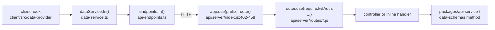

# 07 — API Reference

This is the reference for the REST and SSE (server-sent events) API that the Eleven-Chat
Express server exposes. Eleven-Chat is a heavily customized LibreChat fork. Every endpoint below
was found registered in code. Items that could not be fully confirmed are marked
**Inferred** or **Unknown**, and they are collected again in
[Could not verify](#could-not-verify) at the end.

Related guides: [Overview](./00-overview.md) · [Backend](./02-backend.md) ·
[Frontend](./03-frontend.md) · [Business logic](./06-business-logic.md) ·
[Auth & security](./08-auth-security.md) · [Background processing](./09-background-processing.md) ·
[Feature development](./10-feature-development.md)

---

## Index

**Orientation**

- [Conventions](#conventions)
- [Mount prefixes](#mount-prefixes)

**Domains**

1. [Auth](#1-auth)
2. [Conversations](#2-conversations)
3. [Messages](#3-messages)
4. [Agents chat and streaming](#4-agents-chat-and-streaming)
5. [Agents builder CRUD, actions and tools](#5-agents-builder-crud-actions-and-tools)
6. [Agents v1 API (OpenAI-compatible and management)](#6-agents-v1-api-openai-compatible-and-management)
7. [Assistants (legacy)](#7-assistants-legacy)
8. [Files](#8-files)
9. [Users](#9-users)
10. [Search](#10-search)
11. [Presets](#11-presets)
12. [Prompts](#12-prompts)
13. [Projects](#13-projects)
14. [Tags](#14-tags)
15. [Config and startup](#15-config-and-startup)
16. [Banner](#16-banner)
17. [Memories](#17-memories)
18. [Roles and permissions](#18-roles-and-permissions)
19. [Schedules](#19-schedules)
20. [Skills](#20-skills)
21. [MCP](#21-mcp)
22. [Share](#22-share)
23. [Admin](#23-admin)
24. [Misc](#24-misc) (balance, models, endpoints, categories, traces, insights, RUM, OpenAPI, OAuth, static, API keys, keys, actions, code environments)

**Endpoint details**

| Domain | Endpoint |
|---|---|
| Auth | [`POST /api/auth/login`](#post-apiauthlogin) · [`POST /api/auth/register`](#post-apiauthregister) |
| Conversations | [`GET /api/convos`](#get-apiconvos) · [`POST /api/convos/update`](#post-apiconvosupdate) · [`DELETE /api/convos`](#delete-apiconvos) · [`POST /api/convos/fork`](#post-apiconvosfork) |
| Messages | [`GET /api/messages`](#get-apimessages) · [`POST /api/messages/:conversationId`](#post-apimessagesconversationid) · [`PUT .../feedback`](#put-apimessagesconversationidmessageidfeedback) · [`POST /api/messages/branch`](#post-apimessagesbranch) |
| Agents chat | [`GET /api/agents/chat/stream/:streamId`](#get-apiagentschatstreamstreamid) · [`POST /api/agents/chat/abort`](#post-apiagentschatabort) |
| Agents builder | [`POST /api/agents`](#post-apiagents) · [`GET /api/agents/:id`](#get-apiagentsid) |
| Files | [`POST /api/files`](#post-apifiles) · [`GET /api/files/:file_id/preview`](#get-apifilesfile_idpreview) |
| Users | [`GET /api/user`](#get-apiuser) |
| Search | [`GET /api/search/enable`](#get-apisearchenable) |
| Presets | [Presets request and response details](#presets-request-and-response-details) |
| Config | [`GET /api/config`](#get-apiconfig) |
| Banner | [`GET /api/banner`](#get-apibanner) |
| Memories | [`GET /api/memories`](#get-apimemories) · [`POST /api/memories`](#post-apimemories) · [`PATCH /api/memories/preferences`](#patch-apimemoriespreferences) |
| MCP | [MCP server registry endpoints](#mcp-server-registry-endpoints) |
| Misc | [`GET /api/balance`](#get-apibalance) |

**Caveats**

- [Flagged for verification: `/api/search?q=...`](#flagged-for-verification)
- [Could not verify](#could-not-verify)

---

## Conventions

- **Where routes live.** Express routers live under `api/server/routes/`. They are mounted in
  `api/server/index.js:402-458` and aggregated by `api/server/routes/index.js:1-93`. The full
  paths in this document already include the mount prefix.
- **Where URLs are defined for the client.** `packages/data-provider/src/api-endpoints.ts` is
  the canonical source of URL strings. `packages/data-provider/src/data-service.ts` wraps those
  URLs in request functions, and React Query hooks under `client/src/data-provider/` call those
  functions. When you add an endpoint, add the builder there. See
  [Frontend](./03-frontend.md) and [Feature development](./10-feature-development.md).
- **Auth column vocabulary.**
  - **JWT** means `requireJwtAuth`. Usually a `router.use(requireJwtAuth)` applies it to the
    whole file.
  - **optional JWT** means `optionalJwtAuth`.
  - **API key** means machine authentication with no user JWT.
  - **public** means no auth middleware.
  - Other entries name the permission or capability middleware that runs after authentication,
    for example `checkAgentCreate` or `manageRoles`. [Auth & security](./08-auth-security.md)
    explains each one.
- **`configMiddleware`** loads the resolved app config onto `req.config`. Many handlers read
  limits and filters from it.
- **Handler column.** It shows the file and line, or the controller name with the line where
  the route is registered. "inline" means the handler is defined inside the route file.
  `:N` is shorthand for a line in the section's main route file.

How a request reaches a handler:

---

## Mount prefixes

From `api/server/index.js:402-458` and `api/server/routes/index.js:1-93`:

| Prefix | Router file |
|---|---|
| `/oauth` | `routes/oauth.js` |
| `/api/auth` | `routes/auth.js` |
| `/api/insights` | `routes/insights.js` |
| `/api/admin` | `routes/admin/auth.js` |
| `/api/admin/config` | `routes/admin/config.js` |
| `/api/admin/code-environments` | `routes/admin/code.js` |
| `/api/code-environments` | `routes/code-environments.js` |
| `/api/admin/langfuse` | `routes/admin/langfuse.js` |
| `/api/admin/grants` | `routes/admin/grants.js` |
| `/api/admin/groups` | `routes/admin/groups.js` |
| `/api/admin/roles` | `routes/admin/roles.js` |
| `/api/admin/skills` | `routes/admin/skills.js` |
| `/api/admin/users` | `routes/admin/users.js` |
| `/api/admin/audit-log` | `routes/admin/audit.js` |
| `/api/actions` | `routes/actions.js` |
| `/api/keys` | `routes/keys.js` |
| `/api/api-keys` | `routes/apiKeys.js` |
| `/api/user` | `routes/user.js` |
| `/api/search` | `routes/search.js` |
| `/api/messages` | `routes/messages.js` |
| `/api/convos` | `routes/convos.js` |
| `/api/traces` | `routes/traces.js` |
| `/api/presets` | `routes/presets.js` |
| `/api/projects` | `routes/projects.js` |
| `/api/prompts` | `routes/prompts.js` |
| `/api/skills` | `routes/skills.js` |
| `/api/categories` | `routes/categories.js` |
| `/api/endpoints` | `routes/endpoints.js` |
| `/api/balance` | `routes/balance.js` |
| `/api/models` | `routes/models.js` |
| `/api/config` | `routes/config.js` |
| `/api/assistants` | `routes/assistants/index.js` |
| `/api/files` | `routes/files/index.js` (`initialize()`) |
| `/images/` | `routes/static.js` |
| `/api/share` | `routes/share.js` |
| `/api/roles` | `routes/roles.js` |
| `/api/agents` | `routes/agents/index.js` |
| `/api/banner` | `routes/banner.js` |
| `/api/memories` | `routes/memories.js` |
| `/api/schedules` | `routes/schedules.js` |
| `/api/permissions` | `routes/accessPermissions.js` |
| `/api/tags` | `routes/tags.js` |
| `/api/mcp` | `routes/mcp.js` |
| `/api/rum` | `routes/rum.js` |
| `/metrics` | `metricsRouter` (not under `routes/`) |
| `/api` | `routes/openapi.js` |

All router files are relative to `api/server/`.

---

## 1. Auth

Router: `api/server/routes/auth.js`. The [Auth & security](./08-auth-security.md) guide covers
tokens, cookies, 2FA and passkeys in depth.

| Method | Path | Purpose | Auth required | Handler |
|---|---|---|---|---|
| POST | `/api/auth/logout` | Log out the current session | JWT | `controllers/auth/LogoutController.js` (`auth.js:69`) |
| POST | `/api/auth/login` | Local or LDAP password login | public, rate-limited | `LoginController.js` via `createLoginController` (`auth.js:70-80`) |
| POST | `/api/auth/refresh` | Refresh the JWT from the refresh-token cookie | none (cookie-based) | `refreshController` (`auth.js:81`) |
| POST | `/api/auth/cloudfront/refresh` | Re-mint CloudFront signed cookies | JWT | inline (`auth.js:82-94`) |
| POST | `/api/auth/register` | Create a local account | public, rate-limited, invite check | `registrationController` (`auth.js:95-102`; `controllers/AuthController.js:68`) |
| POST | `/api/auth/requestPasswordReset` | Send a password-reset email | public, rate-limited | `resetPasswordRequestController` (`auth.js:103-109`) |
| POST | `/api/auth/resetPassword` | Complete a password reset | public, rate-limited | `resetPasswordController` (`auth.js:110-116`) |
| POST | `/api/auth/2fa/enable` · `/verify` · `/confirm` · `/disable` · `/backup/regenerate` | 2FA lifecycle for a logged-in user | JWT | `TwoFactorController.js` (`auth.js:118-175`) |
| POST | `/api/auth/2fa/setup` · `/setup/confirm` · `/setup/acknowledge` · `/setup/finalize` | 2FA enrollment with temp tokens | temp-token middleware chain | `TwoFactorAuthController.js` (`auth.js:120-153`) |
| POST | `/api/auth/2fa/verify-temp` | Verify 2FA during login with a temp token | temp-token middleware | `verify2FAWithTempToken` (`auth.js:154-161`) |
| POST | `/api/auth/passkey/login/options` · `/login/verify` | WebAuthn login | public, rate-limited | `PasskeyController.js` (`auth.js:178-194`) |
| GET | `/api/auth/passkey` | List registered passkeys | JWT | `listPasskeys` (`auth.js:195`) |
| POST | `/api/auth/passkey/register/options` · `/register/verify` | Register a new passkey | JWT + step-up limiter | `PasskeyController.js` (`auth.js:196-207`) |
| PATCH / DELETE | `/api/auth/passkey/:passkeyId` | Rename or remove a passkey | JWT | `PasskeyController.js` (`auth.js:208-214`) |
| GET | `/api/auth/graph-token` | Mint a Microsoft Graph token (SharePoint) | JWT | `graphTokenController` (`auth.js:216`) |

Social and SSO login flows live under `/oauth`, from `routes/oauth.js` mounted at
`api/server/index.js:402`. They include `/oauth/openid`, `/oauth/google`, `/oauth/facebook`,
`/oauth/github`, `/oauth/discord`, `/oauth/apple` and `/oauth/saml`
(`api/server/routes/oauth.js:72-212`). These are Passport redirect and callback routes, not JSON
APIs. See [Misc](#24-misc).

### `POST /api/auth/login`

- **Middleware**: `validateEmailLogin`, then `requireLocalAuth` or `requireLdapAuth`. Passport
  fills `req.user` before the controller runs (`api/server/routes/auth.js:70-80`).
- **Body**: `{ email: string, password: string }`.
- **Responses** (`packages/api/src/auth/login.ts:52-117`, `createLoginController`):

  | Status | Body | When |
  |---|---|---|
  | 400 | `{ message: 'Invalid credentials' }` | Passport did not set `req.user` |
  | 403 | `{ code: TWO_FACTOR_FEDERATED_LOGIN_BLOCKED_CODE, message }` | A federated account is under a mandatory 2FA policy |
  | 200 | `{ twoFAPending: true, tempToken }` | 2FA is required |
  | 200 | `{ code: TWO_FACTOR_ENROLLMENT_REQUIRED_CODE, twoFAPending: true, twoFASetupRequired: true, tempToken }` | 2FA enrollment is required |
  | 401 | `{ message: 'Invalid credentials' }` | The password was reset concurrently and the session was revoked |
  | 200 | `{ token, user }` | Success. `user` is the sanitized user document: `password`, `totpSecret` and `__v` are removed and `id` is added |
  | 500 | `{ message: 'Something went wrong' }` | Unexpected error |

- **Side effects**: `setAuthTokens` sets the auth cookies and JWT. When the password was reset
  concurrently, the controller calls `withdrawMintedSession` and `deleteAllUserSessions`.
- **Frontend**: the `useLoginUser` mutation (`client/src/data-provider/Auth/mutations.ts:40`)
  calls `dataService.login()` (`packages/data-provider/src/data-service.ts:304-311`). The URL
  comes from `endpoints.login()` (`packages/data-provider/src/api-endpoints.ts:232`).

### `POST /api/auth/register`

- **Validation**: `middleware.validateRegistration` runs before the controller.
- **Body**: passed unchanged to `registerUser(req.body)` in `api/server/services/AuthService.js`.
  **Inferred**: the fields are probably `name`, `email`, `username`, `password` and
  `confirm_password`, as in standard LibreChat registration. The exact schema used by
  `validateRegistration` was not opened.
- **Response**: the `{ status, message }` returned by `registerUser`
  (`api/server/controllers/AuthController.js:68-86`).
- **Side effects**: creates a user document. When `response.userCreated === true`, the invite
  token is consumed through `deleteTokens`.
- **Frontend**: `dataService.register()` (`packages/data-provider/src/data-service.ts:312-318`).

---

## 2. Conversations

Router: `api/server/routes/convos.js`, mounted at `/api/convos`. `router.use(requireJwtAuth)`
protects the whole router (`convos.js:179`).

| Method | Path | Purpose | Auth required | Handler |
|---|---|---|---|---|
| GET | `/api/convos` | List or paginate conversations (cursor, filters, search, tags, sort) | JWT | inline (`convos.js:184-235`) |
| GET | `/api/convos/:parentConversationId/subagents/:threadId/tasks/:taskId/activity` | SSE stream of a subagent task's activity | JWT | `createSubagentActivityStreamHandler` (`:238-240`) |
| POST | `/api/convos/:parentConversationId/subagents/:threadId/control` | Steer, queue or interrupt a running subagent thread | JWT + content filter + moderation | `createSubagentControlHandler` (`:241-249`) |
| GET | `/api/convos/:parentConversationId/subagents` | List subagent threads for a parent conversation | JWT | `createParentSubagentIndexHandler` (`:250`) |
| GET | `/api/convos/:conversationId/pull-request` | Look up a GitHub PR linked to a conversation's lane | JWT | `createConversationPullRequestHandler` (`:251`) |
| GET | `/api/convos/:conversationId/background-tasks` | List background tool tasks for a conversation | JWT + `backgroundTaskPolicy` | `createBackgroundTaskIndexHandler` (`:252`) |
| POST | `/api/convos/:conversationId/background-tasks/cancel` | Cancel a background task | JWT + policy | `createBackgroundTaskCancelHandler` (`:253-257`) |
| GET | `/api/convos/:parentConversationId/subagents/:threadId` | View one subagent thread's messages | JWT | `createSubagentThreadViewHandler` (`:258`) |
| GET | `/api/convos/:conversationId` | Get one conversation | JWT | inline (`:260-269`) |
| GET | `/api/convos/gen_title/:conversationId` | Poll or wait for the generated title | JWT | `createGeneratedTitleHandler` (`:271-278`) |
| DELETE | `/api/convos` | Delete conversations matching `conversationId`, `source`, `thread_id` or `endpoint` | JWT | inline (`:458-592`) |
| DELETE | `/api/convos/all` | Delete all of the user's conversations | JWT | inline (`:594-618`) |
| POST | `/api/convos/archive` | Archive or unarchive one conversation | JWT | inline (`:627-669`) |
| POST | `/api/convos/archive/all` | Archive all visible conversations | JWT | `createArchiveAllHandler` (`:676`) |
| POST | `/api/convos/pin` | Pin or unpin a conversation | JWT | inline (`:678-705`) |
| POST | `/api/convos/seen` | Mark a conversation as seen (clears unread) | JWT | `createMarkConvoSeenHandler` (`:707`) |
| POST | `/api/convos/unread` | Mark a conversation as unread | JWT | `createMarkConvoUnreadHandler` (`:709`) |
| POST | `/api/convos/update` | Rename a conversation (title) | JWT | `createRenameConversationHandler` (`:711-722`) |
| POST | `/api/convos/import` | Import conversations from an uploaded JSON file (multipart) | JWT + import rate limiters | inline (`:753-785`) |
| POST | `/api/convos/fork` | Fork a conversation from a message | JWT + fork rate limiters | inline (`:795-825`) |
| POST | `/api/convos/duplicate` | Duplicate a whole conversation | JWT + fork rate limiters + content filter | inline (`:827-859`) |

[Background processing](./09-background-processing.md) covers subagent threads and background
tasks.

### `GET /api/convos`

- **Query parameters** (`api/server/routes/convos.js:184-207`):
  - `limit`
  - `cursor`
  - `isArchived` (a boolean-like string)
  - `pinned`
  - `search`
  - `sortBy`: one of `CONVERSATION_SORT_FIELDS`, default `updatedAt`
  - `sortDirection`
  - `projectId`: a 24-hex ObjectId or `unassigned`
  - `tags` (array)
- **Response**:
  - `200`: the object returned by `db.getConvosByCursor(userId, { cursor, limit, isArchived, pinned, tags, search, sortBy, sortDirection, projectId, ...filters })`.
    The handler does not reshape this result. Per the data-provider type
    `t.TGetConversationsResponse`, it holds a page of conversations and a `nextCursor`.
  - `400 { error }`: invalid `projectId`, or the filters could not be resolved.
  - `500 { error: 'Error fetching conversations' }`.
- **Frontend**: `dataService.getConversations()`
  (`packages/data-provider/src/data-service.ts:1016-1023`). The URL comes from
  `endpoints.conversations(params)` (`packages/data-provider/src/api-endpoints.ts:142-144`).

### `POST /api/convos/update`

Renames a conversation.

- **Body**: `{ arg: { conversationId: string, title: string } }`
  (`packages/api/src/conversations/rename.ts:18-28,44-50`).
- **Errors**:
  - `400`: `conversationId` is missing or not a string.
  - `400`: `title` is missing or not a string.
  - `401`: not authenticated.
  - `404 { error: 'conversation_not_found' }`: the conversation does not exist.
- **Response**: `200` with the updated conversation document from `saveConvo`. The handler sets
  the title-ownership flag `titleSetByUser`. When `interfaceConfig.runningChatRename !== true`,
  extra logic keeps the rename from overwriting a title that is still being generated. That
  logic was only partly read (`packages/api/src/conversations/rename.ts:58+`).
- **Frontend**: `dataService.updateConversation()`
  (`packages/data-provider/src/data-service.ts:1024+`). The URL comes from
  `endpoints.updateConversation()` (`packages/data-provider/src/api-endpoints.ts:177`).

### `DELETE /api/convos`

- **Body**: `{ arg: { conversationId?, source?, thread_id?, endpoint? } }`
  (`api/server/routes/convos.js:458-477`).
- **Validation**:
  - `400 { error: 'Invalid conversationId' }`: `conversationId` is not a string.
  - `400 { error: 'no parameters provided' }`: all four fields are absent.
  - `200 'No conversationId provided'` (plain text): `source === 'button'` and there is no id.
- **Side effects** (`:490-591`):
  - When `endpoint` belongs to the Assistants family, deletes the linked OpenAI Assistants
    thread.
  - Cancels any running agent generation and its subagent children.
  - Deletes the conversation's checkpoints, messages, tool calls and shared links.
- **Response**: `201` with the `dbResponse` from `db.deleteConvos`. It includes
  `conversationIds` (`:535-540`). Failure returns `500 'Error clearing conversations'`.
- **Frontend**: `dataService.deleteConversation()`
  (`packages/data-provider/src/data-service.ts:1000-1015`).

### `POST /api/convos/fork`

- **Body** (`TForkConvoRequest`): `{ conversationId, messageId, option, splitAtTarget, latestMessageId }`
  (`api/server/routes/convos.js:795-812`).
- **Response**: `200` with a `TForkConvoResponse` (the new conversation and its messages),
  passed through `withToolCallPreviews`. Content-filter and import errors return their own
  `statusCode` and `body`.
- **Frontend**: `dataService.forkConversation()`
  (`packages/data-provider/src/data-service.ts:985-999`).

---

## 3. Messages

Router: `api/server/routes/messages.js`, mounted at `/api/messages`.
`router.use(requireJwtAuth)` protects the whole router (`messages.js:83`).

| Method | Path | Purpose | Auth required | Handler |
|---|---|---|---|---|
| POST | `/api/messages/:conversationId/owner-text` | Show the owner the plaintext of a private-text (PII-redacted) message | JWT | `createPrivateTextView` (`messages.js:84-90`) |
| GET | `/api/messages` | List or search messages by `conversationId`, `messageId` or free-text `search` | JWT | inline (`:117-250`) |
| POST | `/api/messages/branch` | Create a branch message from one agent's content in a parallel or multi-agent response | JWT + `configMiddleware` | inline (`:272-424`) |
| POST | `/api/messages/artifact/:messageId` | Apply a find-and-replace edit to a code artifact inside a message | JWT + `configMiddleware` | inline (`:426-535`) |
| GET | `/api/messages/:conversationId` | Get all messages for a conversation | JWT + `prepareMessageRequestValidation` | inline (`:537-567`) |
| POST | `/api/messages/:conversationId` | Save a new message, usually one the user wrote | JWT + content filter + `configMiddleware` | inline (`:569-611`) |
| GET | `/api/messages/:conversationId/:messageId` | Get one message | JWT + `validateMessageReq` | inline (`:613-628`) |
| GET | `/api/messages/:conversationId/:messageId/parts/:partIndex` | Read one tool-call content part (supports streaming tool-call previews) | JWT | `createToolCallPartHandler` (`:630`) |
| PUT | `/api/messages/:conversationId/:messageId` | Edit message text or one content part | JWT + `configMiddleware` | inline (`:632-752`) |
| PUT | `/api/messages/:conversationId/:messageId/feedback` | Set or clear thumbs-up/down feedback | JWT + `requireFeedbackEnabled` + content filter | inline (`:754-818`) |
| DELETE | `/api/messages/:conversationId/:messageId` | Delete a message | JWT + `validateMessageReq` | inline (`:820-832`) |

### `GET /api/messages`

This is the endpoint behind free-text message search. See
[Flagged for verification](#flagged-for-verification).

- **Query parameters** (`api/server/routes/messages.js:117-131`):
  - `cursor`
  - `sortBy`: `updatedAt`, `createdAt` or `endpoint`
  - `sortDirection`
  - `pageSize`
  - `conversationId`
  - `messageId`
  - `search`

  Spot-check addition, not in E3: the destructuring defaults are `sortBy = 'updatedAt'` and
  `sortDirection = 'desc'`. Any other `sortBy` value falls back to `createdAt`. A missing or
  invalid `pageSize` defaults to `25` (`api/server/routes/messages.js:121-135`).
- **Response**:
  - `200 { messages: TMessage[], nextCursor }`. What it contains depends on the branch taken:
    a single message, a conversation page, or Meilisearch full-text results merged with
    conversation title, model and endpoint.
  - `404 { error: 'Conversation not found' }`: the conversation does not exist or the user does
    not own it. The exception is a currently active job that has not been saved yet.
  - `500 { error: 'Internal server error' }`.
- **Projection**: messages are selected with `CLIENT_MESSAGE_SELECT`, so server-private fields
  such as `contextMeta` are never sent. They then pass through
  `prepareToolCallPreviews` / `withMessageToolCallPreviews`, which replace large tool-call
  content with lightweight previews.
- **Frontend**: the URL comes from `endpoints.messages(params)`
  (`packages/data-provider/src/api-endpoints.ts:63-75`).
  - E3 named `dataService.getMessagesByConvoId()` (`data-service.ts:1176+`) as the caller. That
    function targets the per-conversation path `/api/messages/:conversationId`.
  - Spot-check addition: the query-string form (`?search=`, `?cursor=`) is called by
    `dataService.listMessages()` (`packages/data-provider/src/data-service.ts:1117-1118`).
    `listMessages()` is used by `useMessagesInfiniteQuery`
    (`client/src/data-provider/queries.ts:315-327`), which the search page uses
    (`client/src/routes/Search.tsx:102-104`).

### `POST /api/messages/:conversationId`

- **Body**: an object shaped like `TMessage`, destructured directly from `req.body`. Before
  saving, the server strips the client-forbidden fields `isUserSubmitted`, `userSubmittedPaths`,
  `userSubmittedMessageFieldPaths` and `contextMeta`. It then adds `isUserSubmitted: true` back
  (`api/server/routes/messages.js:569-591`).
- **Response**:
  - `201` with `toClientMessage(savedMessage)`, which is `stripPrivateMessageFields`.
  - `400 { error: 'Message not saved' }`: the save failed.
  - `500 { error: 'Internal server error' }`.
- **Side effects**: calls `db.saveMessage`. It then calls `db.saveConvo`, which copies
  `endpoint`, `model` and `iconURL` onto the conversation and appends the new message id.

### `PUT /api/messages/:conversationId/:messageId/feedback`

- **Body**: `{ feedback: TFeedback | null }`, validated with `feedbackSchema.safeParse` from
  `librechat-data-provider`. Invalid feedback returns `400 { error: 'Invalid feedback' }`.
- **Response**: `200 { messageId, conversationId, feedback }`.
- **Side effects**:
  - Calls `db.updateMessage`.
  - For messages that are not from Assistants, tries `sendFeedbackScore` to Langfuse; errors
    there are swallowed.
  - Calls `applyForcedRetention`.
- **Frontend**: `dataService.updateFeedback`. The URL comes from
  `endpoints.feedback(conversationId, messageId)`
  (`packages/data-provider/src/api-endpoints.ts:608-609`).

### `POST /api/messages/branch`

- **Body**: `{ messageId, agentId }`.
- **Response**: `201` with the new branch message, wrapped by `withMessageToolCallPreviews`.
- **Errors**:
  - `400`: a parameter is missing, the source message is not from the AI, the content is
    missing or empty, or no content is attributed to the agent.
  - `404 { error: 'Source message not found' }`.
  - `409 { error: CHILD_THREAD_READ_ONLY_ERROR }`: the parent conversation is a read-only
    subagent thread.
- **Side effects**:
  - Keeps only the source message's `content` parts whose `agentId` matches.
  - Remaps `userSubmittedPaths`.
  - Saves through `db.saveMessage` and applies forced retention.
- **Frontend**: the URL comes from `endpoints.messagesBranch()`
  (`packages/data-provider/src/api-endpoints.ts:100`).

---

## 4. Agents chat and streaming

Router: `api/server/routes/agents/index.js`, mounted at `/api/agents`. This file wires the SSE
streaming chat protocol. The agent-builder CRUD is in [§5](#5-agents-builder-crud-actions-and-tools).

`router.use(requireJwtAuth)` (`agents/index.js:154`) protects most routes. The API-key routes are
registered earlier, at `:138-152`, so the JWT middleware does not apply to them. They are
`/v1/responses`, `/v1/agents`, `/v1/skills` and `/v1`; see [§6](#6-agents-v1-api-openai-compatible-and-management).
For the generation-job lifecycle, see [Background processing](./09-background-processing.md)
and [Business logic](./06-business-logic.md).

| Method | Path | Purpose | Auth required | Handler |
|---|---|---|---|---|
| GET | `/api/agents/chat/stream/:streamId` | SSE subscribe or resume to an in-flight agent generation job | JWT (owner and tenant checked against job metadata) | inline (`agents/index.js:190-448`) |
| GET | `/api/agents/chat/active` | List the user's active generation job ids | JWT | inline (`:456-462`) |
| GET | `/api/agents/chat/status/:conversationId` | Check whether a conversation has an active or paused run, and its resume state | JWT | inline (`:470-589`) |
| POST | `/api/agents/chat/abort` | Stop a running generation job | JWT + `configMiddleware` | inline (`:597-1104`) |
| POST | `/api/agents/chat/steer` | Queue a user message to inject mid-run at the next tool boundary | JWT + rate limiters + PII filter + moderation | `SteerController` (`:1123-1135`) |
| POST | `/api/agents/chat/steer/deliver` | Trusted-host variant of steer admission | JWT + same chain | `SteerController.SteerDeliveryController` (`:1144-1156`) |
| POST | `/api/agents/chat/steer/cancel` | Cancel a steer that is still queued | JWT + rate limiters | `SteerController.SteerCancelController` (`:1164-1169`) |
| POST | `/api/agents/chat/steer/arm` | Escalate a queued steer to an interrupt | JWT + rate limiters | `SteerController.SteerArmController` (`:1177-1182`) |
| POST | `/api/agents/chat/queued-turns` | Queue a turn while a run is active | JWT + PII filter + moderation | `AgentQueuedTurnEnqueueController` (`:1184-1196`) |
| POST | `/api/agents/chat/queued-turns/v2` | Version 2 of the queued-turn endpoint | JWT + same chain | `AgentQueuedTurnEnqueueV2Controller` (`:1197-1209`) |
| GET | `/api/agents/chat/queued-turns` | List queued turns | JWT | `AgentQueuedTurnListController` (`:1212`) |
| DELETE | `/api/agents/chat/queued-turns/:queuedTurnId` | Cancel a queued turn | JWT + rate limiters | `AgentQueuedTurnCancelController` (`:1213-1218`) |
| POST | `/api/agents/chat` (and sub-paths) | Submit a new chat turn to an agent (this is the send-message endpoint) | JWT + IP and user rate limiters + retry detection | `chatRouter` → `./chat.js` (`:1220-1256`) |
| — | `/api/agents/tools/approvals/reset` | Reset a user's tool-approval grants | **Inferred** JWT | Referenced by the `resetToolApprovalGrants()` URL builder (`packages/data-provider/src/api-endpoints.ts:673`). The handler was not located; see [Could not verify](#could-not-verify) |

### `GET /api/agents/chat/stream/:streamId`

- **Path parameter**: `streamId`, which equals the `conversationId` of the current generation.
- **Query parameters**:
  - `resume=true` to reconnect.
  - `generationCreatedAt`: a numeric string, validated as a safe integer.
- **Response**: `text/event-stream`. Each event is `event: <name>\ndata: {...}` with a JSON
  payload.
- **Errors**: authorization failures return JSON with status 403, 404 or 409 instead of opening
  the stream. The `sendGenerationJson` helper sets the `GENERATION_PROTOCOL_HEADER` response
  header on every branch.
- **Side effects**: subscribes to the `GenerationJobManager` pub/sub and replays missed chunks
  on resume.
- **Frontend**: **Inferred**. The SSE client in `packages/data-provider` and the `SSE` /
  `Endpoints` folders in `client/src/data-provider` consume this stream. The exact call was not
  traced.

### `POST /api/agents/chat/abort`

- **Body**: `{ streamId?, conversationId?, abortKey?, generationCreatedAt? }`. Each of the three
  id fields must be a non-empty string of at most 512 characters. `generationCreatedAt` must be
  a safe non-negative integer (`api/server/routes/agents/index.js:604-637`).
- **Responses**:

  | Status | Body |
  |---|---|
  | 400 | `{ code: 'INVALID_ABORT_TARGET' \| 'INVALID_GENERATION_IDENTITY' }` |
  | 403 | `{ error: 'Unauthorized' }` |
  | 404 | `{ error: 'Job not found', streamId }` |
  | 409 | `{ code: 'RUN_REPLACED' \| 'RUN_STILL_ACTIVE' \| 'STOP_IN_PROGRESS' \| 'AMBIGUOUS_ACTIVE_RUN' \| 'ABORT_PERSISTENCE_FAILED' }` |
  | 200 / 409 | `{ success: boolean, aborted?, settled?, code?, persistenceFailed?, pendingSteers? }` |
  | 500 | `{ code: 'ABORT_FAILED', error }` |

- **Side effects** (`:597-1104`, heavily commented in the source):
  - Saves the partial assistant response and the user message it depends on.
  - Deletes or prunes agent checkpoints.
  - Records the outcome of scheduled runs.
  - Releases the "stop" barrier.

---

## 5. Agents builder CRUD, actions and tools

Routers:

- `api/server/routes/agents/v1.js`, mounted through `agents/index.js` at `/api/agents`
- `agents/actions.js` at `/api/agents/actions`
- `agents/tools.js` at `/api/agents/tools`

| Method | Path | Purpose | Auth required (permission) | Handler |
|---|---|---|---|---|
| GET | `/api/agents/categories` | List agent categories with counts | `generateCheckAccess(AGENTS, [USE])`, implicit through `router.use` | `v1.getAgentCategories` (`agents/v1.js:40`) |
| POST | `/api/agents` | Create an agent | `checkAgentCreate` (AGENTS: USE + CREATE) + `configMiddleware` | `v1.createAgent` (`:47`) |
| GET | `/api/agents/:id` | Get basic agent info | `checkAgentAccess` + resource VIEW | `v1.getAgent` (`:56-64`) |
| GET | `/api/agents/:id/expanded` | Get the full agent config (sensitive) | `checkAgentAccess` + resource EDIT | `v1.getAgent(..., true)` (`:73-81`) |
| GET | `/api/agents/:id/versions` | Get version history | `checkAgentAccess` + resource EDIT | `v1.getAgentVersions` (`:90-98`) |
| PATCH | `/api/agents/:id` | Update an agent | `checkAgentCreate` + resource EDIT | `v1.updateAgent` (`:106-116`) |
| POST | `/api/agents/:id/duplicate` | Duplicate an agent | `checkAgentCreate` + resource EDIT | `v1.duplicateAgent` (`:124-134`) |
| DELETE | `/api/agents/:id` | Delete an agent | `checkAgentCreate` + resource DELETE | `v1.deleteAgent` (`:142-150`) |
| POST | `/api/agents/:id/revert` | Revert to an earlier version | `checkAgentCreate` + resource EDIT | `v1.revertAgentVersion` (`:159-169`) |
| GET | `/api/agents` | List agents | `checkAgentAccess` | `v1.getListAgents` (`:177`) |
| POST | `/api/agents/:agent_id/avatar` | Upload or update the agent avatar | `checkAgentAccess` + resource EDIT | `v1.uploadAgentAvatar` (`:187-195`, exported as the `avatar` sub-router) |
| GET / POST | `/api/agents/actions/...` | Agent action (OpenAPI tool) CRUD | `configMiddleware` | `agents/actions.js` (mounted at `agents/index.js:28`) |
| GET | `/api/agents/tools` | List the tools available to agents | `configMiddleware` | `agents/tools.js` (mounted at `agents/index.js:34`) |

### `POST /api/agents`

- **Validation**: the zod schema `agentCreateSchema`
  (`packages/api/src/agents/validation.ts:615`). The full field list was not enumerated.
- **Body**: after `normalizeToolResourceFiles`, the handler destructures and validates these
  fields (`api/server/controllers/agents/v1.js:723-915`):
  - `tools`, `tool_resources`, `tool_options`, `model_parameters`
  - `stateful_code_sessions`, `stateful_code_environment`, `code_environment_id`,
    `code_workspace_id`, `code_environment_ids`
  - `edges`, `subagents`

  **Inferred** from the broader `Agent` type in `librechat-data-provider`: the standard agent
  fields `name`, `description`, `instructions`, `model`, `provider` and `avatar` are also
  accepted.
- **Responses**:
  - `201`: the created agent document (`res.status(201).json(agent)`, `:915`).
  - `400 { error: 'Invalid request data', details }`: zod validation failed.
  - `409 { error }`: a conflict, such as a duplicate id.
  - `400 { error: 'One or more agents referenced in edges do not exist' }`: invalid multi-agent
    edges.
  - `500 { error }`: anything else.
- **Side effects**:
  - Generates an `agent_${nanoid()}` id.
  - Prunes and validates `tool_resources` file ids against the owner.
  - Runs content-filter scanning on `instructions`.
  - Grants the creator the `REMOTE_AGENT_OWNER` access role through `PermissionService`.
- **Frontend**: **Inferred**: mutations in `client/src/data-provider/Agents` (not opened). The
  URL comes from `endpoints.agents({})` (`packages/data-provider/src/api-endpoints.ts:352-365`).

### `GET /api/agents/:id`

- **Response**:
  - `200`: a safe, basic agent projection from `getAgentWithVersionCount`. S3 avatar URLs are
    refreshed, and content is gated by whether the agent is public or permissioned. This logic
    was only partly read (`api/server/controllers/agents/v1.js:890-960`).
  - `404 { error: 'Agent not found' }`.
- **Frontend**: `dataService.getAgentById()` (`packages/data-provider/src/data-service.ts:700-715`).

---

## 6. Agents v1 API (OpenAI-compatible and management)

These route files are mounted under `/api/agents/v1`:

| File | Mount | Purpose |
|---|---|---|
| `agents/openai.js` | `/api/agents/v1` | OpenAI-compatible chat completions |
| `agents/management.js` | `/api/agents/v1/agents` | Machine-to-machine agent management |
| `agents/skills.js` | `/api/agents/v1/skills` | Agent-skill management |
| `agents/responses.js` | `/api/agents/v1/responses` | Open Responses API (openresponses.org spec) |

The mount order is deliberate. These routes are registered before `router.use(requireJwtAuth)`
in `agents/index.js:138-152` because they authenticate with an API key instead of a user JWT.
`/api/api-keys` issues those keys; see [Misc](#24-misc).

| Method | Path | Purpose | Auth required | Handler |
|---|---|---|---|---|
| — | `/api/agents/v1/responses/*` | Open Responses API (openresponses.org spec) | API key | `agents/responses.js` |
| — | `/api/agents/v1/agents/*` | Machine-authenticated agent management | API key | `agents/management.js` |
| — | `/api/agents/v1/skills/*` | Machine-authenticated agent-skill management | API key | `agents/skills.js` |
| POST | `/api/agents/v1/chat/completions` | OpenAI-compatible chat completions proxied to an agent | API key | `agents/openai.js` |

Source: `api/server/routes/agents/index.js:132-152`. Only the mount points were confirmed. The
sub-routes, body and response shapes, and API-key mechanism inside these four files were not
read; see [Could not verify](#could-not-verify).

---

## 7. Assistants (legacy)

These routes cover the legacy OpenAI Assistants API. Routers live in `api/server/routes/assistants/`:
`index.js` (mounted at `/api/assistants`), `v1.js`, `v2.js`, `chatV1.js`, `chatV2.js`,
`actions.js`, `tools.js` and `documents.js`. The whole tree is behind
`router.use(requireJwtAuth, checkBan, uaParser, configMiddleware)` (`assistants/index.js:10-13`).

| Method | Path | Purpose | Auth required | Handler |
|---|---|---|---|---|
| POST | `/api/assistants/v{1,2}` | Create an OpenAI Assistant | JWT | `createAssistant` (`v1.js:49`, `v2.js:51`) |
| GET | `/api/assistants/v{1,2}/:id` | Get an Assistant | JWT | `retrieveAssistant` (`v1.js:57`, `v2.js:59`) |
| PATCH | `/api/assistants/v{1,2}/:id` | Update an Assistant | JWT | `patchAssistant` (`v1.js:66`, `v2.js:68`) |
| DELETE | `/api/assistants/v{1,2}/:id` | Delete an Assistant | JWT | `deleteAssistant` (`v1.js:74`, `v2.js:76`) |
| GET | `/api/assistants/v{1,2}` | List Assistants | JWT | `listAssistants` (`v1.js:82`, `v2.js:84`) |
| POST | `/api/assistants/v2/avatar/:assistant_id` | Upload an Assistant avatar | JWT | `v1.uploadAssistantAvatar` (`v2.js:94`) |
| POST | `/api/assistants/v{1,2}/chat/abort` | Abort an Assistants API run | JWT | `handleAbort()` (`chatV1.js:12`, `chatV2.js:12`) |
| POST | `/api/assistants/v{1,2}/chat` | Submit a chat turn to an Assistant | JWT | `chatV1.js:29`, `chatV2.js:29` |
| GET / POST / DELETE | `/api/assistants/v{1,2}/actions/*` | Assistant action (OpenAPI tool) CRUD | JWT | `assistants/actions.js` |
| GET | `/api/assistants/v{1,2}/tools` | List available tools | JWT | `assistants/tools.js:6` |
| GET | `/api/assistants/v{1,2}/documents` | List retrieval documents | JWT | `assistants/documents.js:11` |

Source: `api/server/routes/assistants/v1.js:27-82`, `v2.js:16-94`, `assistants/index.js:10-17`.

---

## 8. Files

Routers live in `api/server/routes/files/`:

- `index.js`: the top-level mount factory at `/api/files`
- `files.js`, `images.js`, `avatar.js`, `multer.js` and `speech/*`

The whole tree is behind `router.use(requireJwtAuth, configMiddleware, checkBan, uaParser)`
(`files/index.js:22-25`).

| Method | Path | Purpose | Auth required | Handler |
|---|---|---|---|---|
| POST | `/api/files/speech/stt` | Speech-to-text upload | JWT | `files/index.js:28` (speech router) |
| — | `/api/files/speech/*` | TTS, manual, voices and config | JWT | `files/speech` router (`files/index.js:31`) |
| POST | `/api/files` | Upload a file (multipart `file`) | JWT | `handleFileUpload` (`files/files.js:955`; mounted through `files/index.js:59,73`) |
| POST | `/api/files/images` | Upload an image | JWT | `files/images.js:44` |
| POST | `/api/files/images/avatar` | Upload a user avatar image | JWT | `files/avatar.js:19` |
| POST | `/api/files/images/agents/:agent_id/avatar` | Agent avatar through the images pipeline | JWT | `agentAvatarRouter` (`files/index.js:62-76`). **Inferred** path, built from the `images/agents` mount and the agent avatar sub-router |
| POST | `/api/files/images/assistants/:assistant_id` | Assistant avatar through the images pipeline | JWT | `asstAvatarRouter` (`files/index.js:77`) |
| GET | `/api/files` | List the user's files | JWT | `files/files.js:74` |
| GET | `/api/files/agent/:agent_id` | List files attached to an agent | JWT | `files/files.js:102` |
| GET | `/api/files/config` | Get file-upload config (size and type limits) | JWT | `files/files.js:154` |
| POST | `/api/files/usage` | Refresh an uploaded file's TTL | JWT | `files/files.js:174` |
| DELETE | `/api/files` | Delete files | JWT | `files/files.js:188` |
| GET | `/api/files/code/download/:session_id/:fileId` | Download a file produced by a code-execution session | JWT | `files/files.js:354` |
| GET | `/api/files/:file_id/preview` | Get or poll a deferred text preview (HTML or document extraction) | JWT + `fileAccess` | `files/files.js:483` |
| GET | `/api/files/download-url/:userId/:file_id` | Get a pre-signed download URL | JWT + `fileAccess` | `files/files.js:594` |
| GET | `/api/files/download/:userId/:file_id` | Stream-download a file | JWT + `fileAccess` | `files/files.js:632` |

### `POST /api/files`

- **Body**: a multipart form. `multer` handles a single-file upload (`files/files.js:955`).
  Storage and filter config are in `files/multer.js`.
- **Response**:
  - On success, a JSON document shaped like `TFile`, produced by `processFileUpload`.
  - Large uploads can use an SSE progress variant (`shouldUseUploadSse` / `startUploadSseStream`).
  - On error, `sendUploadPolicyError` / `resolveUploadErrorMessage` return a sanitized
    `{ message }` with a matching status.
  - A `finally` block always deletes the temp upload with `fs.unlink`
    (`files/files.js:930-955`).
- **Side effects**:
  - Writes the file through the configured storage strategy (local, S3, Azure or Firebase;
    see `getStrategyFunctions`).
  - Scans the content with `assertUploadContentAllowed`.
  - May link the file to an agent or tool resource.
- **Frontend**: `dataService.uploadFile()` (`packages/data-provider/src/data-service.ts:635+`).
  The URL comes from `endpoints.fileUpload()`, which returns `/api/files`
  (`packages/data-provider/src/api-endpoints.ts:396`).

### `GET /api/files/:file_id/preview`

- **Purpose**: a polling endpoint for text that is extracted in the background from HTML and
  documents.
- **Response**: `{ status, text?, textFormat?, previewError? }`. This shape comes from the inline
  comment at `packages/data-provider/src/api-endpoints.ts:400-404`.
- **Frontend**: `endpoints.filePreview(fileId)`
  (`packages/data-provider/src/api-endpoints.ts:403-404`).

---

## 9. Users

Router: `api/server/routes/user.js`, mounted at `/api/user`.

| Method | Path | Purpose | Auth required | Handler |
|---|---|---|---|---|
| — | `/api/user/settings/*` | Sub-router for preferences, skill active states, pinned order and tool favorites | varies | `routes/user/settings` (mounted at `user.js:35`) |
| GET | `/api/user` | Get the current user's profile | JWT | `getUserController` (`:36`) |
| PATCH | `/api/user/preferences` | Update user preferences | JWT + `configMiddleware` | `updateUserPreferences` (`:37`) |
| GET | `/api/user/terms` | Get terms-of-service acceptance status | JWT | `getTermsStatusController` (`:38`) |
| POST | `/api/user/terms/accept` | Accept the terms of service | JWT | `acceptTermsController` (`:39`) |
| POST | `/api/user/plugins` | Update the user's enabled plugins and tools | JWT | `updateUserPluginsController` (`:40`) |
| DELETE | `/api/user/delete` | Delete your own account | JWT + `canDeleteAccount` + `configMiddleware` | `deleteUserController` (`:41`) |
| POST | `/api/user/email/change` (**Inferred** path) | Request an email change | JWT, rate-limited | handler at `:42-48` (name not captured) |
| POST | `/api/user/email/verify` (**Inferred** path) | Confirm an email change | JWT, rate-limited | handler at `:49-54` |
| POST | `/api/user/verify` | Verify the email address after registration | rate-limited, no JWT | `verifyEmailController` (`:55`) |
| POST | `/api/user/verify/resend` | Resend the verification email | rate-limited | `resendVerificationController` (`:56`) |

Source: `api/server/routes/user.js:35-56`. The two email-change paths were not read from
`user.js` directly. They come from the frontend builders `endpoints.requestEmailChange()` →
`/api/user/email/change` and `endpoints.confirmEmailChange()` → `/api/user/email/verify`
(`packages/data-provider/src/api-endpoints.ts:251-253`).

Code that changes user documents must also invalidate the auth user cache; see
[Auth & security](./08-auth-security.md).

### `GET /api/user`

- **Response**: **Inferred**: the authenticated user's sanitized document. This is based on the
  controller name `getUserController` and on the consumer of `endpoints.user()`. The field list
  was not opened.
- **Frontend**: a user query hook in `client/src/data-provider`. The URL comes from
  `endpoints.user()`, which returns `/api/user`
  (`packages/data-provider/src/api-endpoints.ts:44`).

---

## 10. Search

Router: `api/server/routes/search.js`, mounted at `/api/search` (`api/server/index.js:421`).
`router.use(requireJwtAuth)` protects the whole router (`search.js:8`).

| Method | Path | Purpose | Auth required | Handler |
|---|---|---|---|---|
| GET | `/api/search/enable` | Report whether Meilisearch search is enabled and healthy | JWT | inline (`search.js:10-26`) |

### `GET /api/search/enable`

- **Response**: a plain boolean body, not wrapped in JSON (`res.send(false)` /
  `res.send(status === 'available')`).
  - If `process.env.SEARCH` is not enabled, it returns `false`.
  - Otherwise it builds a `MeiliSearch` client and calls `client.health()`.
  - Any error returns `false`.
- **Frontend**: `dataService.getSearchEnabled()`
  (`packages/data-provider/src/data-service.ts:282+`). The URL comes from
  `endpoints.searchEnabled()` (`packages/data-provider/src/api-endpoints.ts:218`).

Free-text message search is served by [`GET /api/messages?search=...`](#get-apimessages). It
does not go through a dedicated `/api/search` query route.

### Flagged for verification

> **Possible stale endpoint: `/api/search?q=...`**
>
> *What E3 found:* the data-provider builder `endpoints.search(q, cursor)`
> (`packages/data-provider/src/api-endpoints.ts:215-216`) builds
> `/api/search?q=...&cursor=...`. But `api/server/routes/search.js` registers only
> `GET /enable` (`search.js:10`), and no route handles `GET /api/search` or
> `GET /api/search?q=`. Two explanations are possible:
>
> - the builder is legacy and unused, and real search now runs through
>   `GET /api/messages?search=...` (confirmed, see [§3](#get-apimessages)); or
> - the query route lives in a file that was not found.
>
> Check this before you document or call `/api/search` as a working query endpoint. This is a
> discrepancy worth a developer's attention. It is **not** a confirmed bug.
>
> *Spot-check while writing this guide* (evidence beyond E3):
>
> - A repository grep found no caller of `endpoints.search(` in `packages/data-provider/src`,
>   `client/src` or `api/`.
> - `data-service.ts` uses only `endpoints.searchEnabled()` (`data-service.ts:283`).
> - The client search page calls `useMessagesInfiniteQuery({ search })`
>   (`client/src/routes/Search.tsx:102-104`). That hook calls `dataService.listMessages()`
>   (`client/src/data-provider/queries.ts:315-327`), which requests
>   `GET /api/messages?search=...` (`packages/data-provider/src/data-service.ts:1117-1118`).
> - Besides `index.js:421`, `/api/search` is also mounted with the same router in
>   `api/server/experimental.js:641`, and that router still has only `/enable`.
>
> So the builder looks unreferenced. The spot-check did not prove it has no external
> consumers, because it is part of the published `librechat-data-provider` source. The item
> stays open.

---

## 11. Presets

Router: `api/server/routes/presets.js`, mounted at `/api/presets`.
`router.use(requireJwtAuth)` protects the whole router (`presets.js:20`).

| Method | Path | Purpose | Auth required | Handler |
|---|---|---|---|---|
| GET | `/api/presets` | List the user's saved presets | JWT + `configMiddleware` | inline (`presets.js:22-25`) |
| POST | `/api/presets` | Create or update a preset | JWT + `configMiddleware` + content filter | inline (`:27-39`) |
| POST | `/api/presets/delete` | Delete presets | JWT | inline (`:41-58`) |

### Presets request and response details

- **`GET /api/presets`**: `200` with an array of presets. They pass through
  `projectStoredPresets(presets, req.config?.filters)`, which strips content that is not allowed
  (`:22-25`).
- **`POST /api/presets`**:
  - Body: any preset object. The server sets
    `presetId = body.presetId || crypto.randomUUID()` (`:28-30`).
  - Response: `201` with the saved preset, or a plain-text `500` on failure.
- **`POST /api/presets/delete`**:
  - Body: `{ presetId? }`.
  - Response: `201` with the delete count returned by `deletePresets`.
  - An empty filter deletes all of the user's presets.
- **Frontend** (all in `packages/data-provider/src/data-service.ts`):
  - `dataService.getPresets()` (`:266`)
  - `dataService.createPreset()` (`:270-277`)
  - `dataService.deletePreset()` (`:278-281`)

---

## 12. Prompts

Router: `api/server/routes/prompts.js`, mounted at `/api/prompts`. The whole router is behind
`router.use(requireJwtAuth, checkPromptAccess)` (`prompts.js:49-50`).

| Method | Path | Purpose | Auth required | Handler |
|---|---|---|---|---|
| GET | `/api/prompts/...` (group routes with projection) | Get a single prompt group | JWT + prompt access | `handlers.*` (`prompts.js:52-57`) |
| GET | `/api/prompts/all` | List all prompt groups (admin-wide) | JWT + `configMiddleware` | `handlers.listAllPromptGroups` (`:58`) |
| GET | `/api/prompts/groups` | List prompt groups (filtered) | JWT + `configMiddleware` | `handlers.listPromptGroups` (`:59`) |
| POST | `/api/prompts` | Create a prompt group | JWT + `checkPromptCreate` + `configMiddleware` | `handlers.createPromptGroup` (`:61`) |
| POST | `/api/prompts/groups/:groupId/prompts` | Add a prompt to a group | JWT + create check | `handlers.*` (`:62-68`) |
| POST | `/api/prompts/groups/:groupId/use` (**Inferred**) | Record prompt-group usage | JWT | `handlers.*` (`:69-75`) |
| PATCH | `/api/prompts/:id/labels` (**Inferred**) | Update a prompt's production labels | JWT | `handlers.*` (`:76-82`) |
| PATCH | `/api/prompts/:id/tags/production` (**Inferred**) | Tag a prompt version as production | JWT | `handlers.*` (`:83-90`) |
| GET | `/api/prompts/random` (**Inferred**) | Get random prompts | JWT | `handlers.*` (`:91-96`) |
| GET | `/api/prompts` | List prompts (filtered) | JWT + `configMiddleware` | `handlers.getPrompts` (`:97`) |
| DELETE | `/api/prompts/groups/:groupId` (**Inferred**) | Delete a prompt group | JWT | `handlers.*` (`:99-108`) |
| DELETE | `/api/prompts/:id` | Delete a prompt | JWT | `handlers.*` (`:109+`) |

The paths marked **Inferred** were rebuilt from the data-provider URL builders in
`packages/data-provider/src/api-endpoints.ts:313-480`: `addPromptToGroup`,
`recordPromptGroupUsage`, `updatePromptLabels`, `updatePromptTag`, `getRandomPrompts`,
`deletePromptGroup` and `deletePrompt`. Check them against `api/server/routes/prompts.js` before
you rely on exact casing.

- **Frontend**: `client/src/data-provider/prompts.ts` and
  `packages/data-provider/src/api-endpoints.ts:313-480`.

---

## 13. Projects

Router: `api/server/routes/projects.js`, mounted at `/api/projects`.
`router.use(requireJwtAuth)` protects the whole router (`projects.js:19`).

| Method | Path | Purpose | Auth required | Handler |
|---|---|---|---|---|
| GET | `/api/projects` | List projects | JWT | `handlers.listProjects` (`projects.js:20`) |
| POST | `/api/projects` | Create a project | JWT + `configMiddleware` | `handlers.createProject` (`:21`) |
| PUT | `/api/projects/conversations/:conversationId` | Assign a conversation to a project | JWT | `handlers.assignConversationToProject` (`:22`) |
| GET | `/api/projects/:projectId/files/available` | List files that can be added to a project | JWT | `handlers.listAvailableProjectFiles` (`:23`) |
| GET | `/api/projects/:projectId/files` | List a project's files | JWT | `handlers.listProjectFiles` (`:24`) |
| POST | `/api/projects/:projectId/files` | Add a file to a project | JWT + `configMiddleware` | `handlers.addProjectFile` (`:25`) |
| DELETE | `/api/projects/:projectId/files/:fileId` | Remove a file from a project | JWT | `handlers.removeProjectFile` (`:26`) |
| GET | `/api/projects/:projectId` | Get a project | JWT | `handlers.getProject` (`:27`) |
| PATCH | `/api/projects/:projectId` | Update a project | JWT + `configMiddleware` | `handlers.updateProject` (`:28`) |
| DELETE | `/api/projects/:projectId` | Delete a project | JWT | `handlers.deleteProject` (`:29`) |

---

## 14. Tags

Router: `api/server/routes/tags.js`, mounted at `/api/tags`. The whole router is behind
`router.use(requireJwtAuth, checkBookmarkAccess)` (`tags.js:23-24`).

| Method | Path | Purpose | Auth required | Handler |
|---|---|---|---|---|
| GET | `/api/tags` | List the user's conversation tags | JWT + bookmark access | inline (`tags.js:32`) |
| POST | `/api/tags` | Create a tag | JWT + bookmark access | inline (`:52`) |
| PUT | `/api/tags/:tag` | Rename or update a tag | JWT + bookmark access | inline (`:68`) |
| DELETE | `/api/tags/:tag` | Delete a tag | JWT + bookmark access | inline (`:89`) |
| PUT | `/api/tags/convo/:conversationId` | Add or remove a tag on a conversation | JWT + bookmark access | inline (`:110`) |

- **Frontend**:
  - URL builders `endpoints.conversationTags(tag)` and
    `endpoints.addTagToConversation(conversationId)`
    (`packages/data-provider/src/api-endpoints.ts:592-601`).
  - `dataService.updateConversationTag()` and `deleteConversationTag()`
    (`packages/data-provider/src/data-service.ts:1610-1620`).

---

## 15. Config and startup

Router: `api/server/routes/config.js`. It is mounted with
`preAuthTenantMiddleware, optionalJwtAuth` ahead of the router (`api/server/index.js:433`), so it
serves both anonymous and authenticated callers.

| Method | Path | Purpose | Auth required | Handler |
|---|---|---|---|---|
| GET | `/api/config` | Get startup and runtime configuration (`TStartupConfig`) | optional JWT (`optionalJwtAuth`) | inline (`config.js:227-...`) |

### `GET /api/config`

- **Query**: optional `context` (`StartupConfigContext`). The URL comes from
  `endpoints.config(context)` (`packages/data-provider/src/api-endpoints.ts:310-311`).
- **Unauthenticated response** (`req.user` is absent; `config.js:233-256`):
  `{ ...preLoginPayload, socialLogins, turnstile, rum?, interface?, buildInfo? }`. This is a
  reduced config that is safe to show publicly: the social-login list, the Turnstile site key,
  the RUM config, and the optional pre-login interface and build info.
- **Authenticated response** (`config.js:258+`): built from `getAppConfig(...)` plus many
  feature-flag and capability checks that run in parallel (`Promise.all` together with
  `loadConversationListLimits`). They merge into a large `TStartupConfig` payload. Fields seen
  so far (not exhaustive):
  - `conversationListLimits`, `sharedLinksSnapshotFilesEnabled`, `socialLogins`, `projects`
  - `interface`, `titleGenerationTiming`, `turnstile`
  - `modelSpecs`, sanitized to remove hidden specs
  - `balance` config and the CloudFront cookie-refresh config
  - Langfuse connection-access flags
  - code-environment decision and transition versions

  Reading stopped around line 320, and the payload continues past that point; see
  [Could not verify](#could-not-verify).
- **Side effects**: none; the endpoint is read-only. It runs a capability check
  (`hasCapability(ACCESS_ADMIN)`) to decide whether to expose Langfuse connection details.
- **Frontend**: `dataService.getStartupConfig()`
  (`packages/data-provider/src/data-service.ts:403+`).

Startup-path changes should reuse loaded request data and avoid serial database reads; see
[Backend](./02-backend.md).

---

## 16. Banner

Router: `api/server/routes/banner.js`, mounted at `/api/banner`.

| Method | Path | Purpose | Auth required | Handler |
|---|---|---|---|---|
| GET | `/api/banner` | Get the active announcement banner | optional JWT (`optionalJwtAuth`) | inline (`banner.js:8-15`) |

### `GET /api/banner`

- **Response**:
  - `200` with `await getBanner(req.user)`, a data-schemas method returning `TBannerResponse`.
    It is probably `null` or `{}` when no banner is active; otherwise it holds the banner content
    and target audience.
  - `500 { message: 'Error getting banner' }` on failure.
- **Frontend**: `dataService.getBanner()` (`packages/data-provider/src/data-service.ts:1642+`).
  The URL comes from `endpoints.banner()` (`packages/data-provider/src/api-endpoints.ts:605`).

---

## 17. Memories

Router: `api/server/routes/memories.js`, mounted at `/api/memories`.
`router.use(requireJwtAuth)` protects the whole router (`memories.js:71`).

| Method | Path | Purpose | Auth required (permission) | Handler |
|---|---|---|---|---|
| GET | `/api/memories` | List all of the user's memories, with usage stats | `checkMemoryRead` (MEMORIES: USE + READ) + `configMiddleware` | inline (`memories.js:137-169`) |
| POST | `/api/memories` | Create a memory entry | `createMemoryMiddleware` (USE + CREATE) | inline (`:180-258`) |
| PATCH | `/api/memories/preferences` | Turn memories on or off for the user | `checkMemoryOptOut` (USE + OPT_OUT) | inline (`:270-288`) |
| PATCH | `/api/memories/id/:id` | Update a memory by opaque id (agent-partitioned) | `checkMemoryUpdate` + partition validation + `configMiddleware` | `opaqueMemoryHandlers.updateById` (`:295-301`) |
| DELETE | `/api/memories/id/:id` | Delete a memory by opaque id | `checkMemoryDelete` + partition validation | `opaqueMemoryHandlers.deleteById` (`:303-310`) |
| PATCH | `/api/memories/:key` | Update a memory by key | `updateMemoryMiddleware` | inline (`:316-...`) |
| DELETE | `/api/memories/:key` | Delete a memory by key | `checkMemoryDelete` + partition validation | inline (`:417`) |

### `GET /api/memories`

- **Response**: `200 { memories, totalTokens, tokenLimit, charLimit, usagePercentage }`
  (`memories.js:137-169`).
  - `memories` pass through `projectStoredMemories(memories, req.config?.filters)` and are
    annotated with agent names.
  - `tokenLimit` and `charLimit` come from `req.config.memory`.

### `POST /api/memories`

- **Body**: `{ key: string, value: string, agentId? }` (`memories.js:180-181`).
- **Validation**: returns `400` when:
  - `key` or `value` is missing or empty;
  - the key format is invalid (`isValidMemoryKey` allows only lowercase letters and
    underscores);
  - the key is longer than 1000 characters;
  - the value is longer than `charLimit`;
  - the content filter blocks it (`blockFilteredMemoryContent`);
  - it would exceed the token budget (`tokenLimit`).
- **Response**:
  - `201 { created: true, memory }`
  - `409 { error: 'Memory with this key already exists.' }`
  - `500 { error }`
- **Side effects**: `Tokenizer.getTokenCount`, then `db.createMemory`.
- **Frontend**: `client/src/data-provider/Memories`. The URLs come from `endpoints.memories()`
  and `endpoints.memory(key, agentId)` (`packages/data-provider/src/api-endpoints.ts:632-637`).

### `PATCH /api/memories/preferences`

- **Body**: `{ memories: boolean }`.
- **Response**: `200 { updated: true, preferences: { memories } }`.
- **Errors**: `400` if `memories` is not a boolean; `404` if the user is missing.

---

## 18. Roles and permissions

Two routers:

- `api/server/routes/roles.js`, mounted at `/api/roles`
- `api/server/routes/accessPermissions.js`, mounted at `/api/permissions`

The [Auth & security](./08-auth-security.md) guide covers the permission model.

### Roles (`/api/roles`)

`router.use(requireJwtAuth)` protects the whole router (`roles.js:21`).

| Method | Path | Purpose | Auth required | Handler |
|---|---|---|---|---|
| GET | `/api/roles/:roleName` | Get a role's permission config | JWT | inline (`roles.js:116`) |
| PUT | `/api/roles/:roleName/prompts` | Update a role's prompt permissions | JWT + `manageRoles` capability | `createPermissionUpdateHandler('prompts')` (`:160`) |
| PUT | `/api/roles/:roleName/agents` | Update agent permissions | JWT + `manageRoles` | `:166` |
| PUT | `/api/roles/:roleName/memories` | Update memory permissions | JWT + `manageRoles` | `:172` |
| PUT | `/api/roles/:roleName/people-picker` | Update people-picker permissions | JWT + `manageRoles` | `:178` |
| PUT | `/api/roles/:roleName/mcp-servers` | Update MCP-server permissions | JWT + `manageRoles` | `:184` |
| PUT | `/api/roles/:roleName/marketplace` | Update marketplace permissions | JWT + `manageRoles` | `:190` |
| PUT | `/api/roles/:roleName/remote-agents` | Update remote-agent permissions | JWT + `manageRoles` | `:196` |
| PUT | `/api/roles/:roleName/skills` | Update skill permissions | JWT + `manageRoles` | `:202` |

Each `PUT` validates the body against the matching zod schema from `librechat-data-provider`
before it calls `updateRoleByName` (`roles.js:4-14`). The schemas are:

- `promptPermissionsSchema`
- `agentPermissionsSchema`
- `memoryPermissionsSchema`
- `mcpServersPermissionsSchema`
- `marketplacePermissionsSchema`
- `peoplePickerPermissionsSchema`
- `remoteAgentsPermissionsSchema`
- `skillPermissionsSchema`

- **Frontend**:
  - `dataService.getRole()` (`packages/data-provider/src/data-service.ts:1541+`).
  - URL builders `endpoints.getRole(roleName)` and `update*Permissions(roleName)`
    (`packages/data-provider/src/api-endpoints.ts:575-589`).

### Access permissions (`/api/permissions`)

`requireJwtAuth, checkBan, uaParser` protect the whole router (`accessPermissions.js:30-32`).

| Method | Path | Purpose | Auth required | Handler |
|---|---|---|---|---|
| GET | `/api/permissions/search-principals` | Search users, groups and roles to share with | JWT + `checkPeoplePickerAccess` | `searchPrincipals` (`accessPermissions.js:43`) |
| GET | `/api/permissions/:resourceType/roles` | List the access roles available for a resource type | JWT | `getResourceRoles` (`:49`) |
| GET | `/api/permissions/:resourceType/:resourceId` | Get a resource's permission grants | JWT | `:183` |
| PUT | `/api/permissions/:resourceType/:resourceId` | Update a resource's permission grants (sharing) | JWT | `:195` |
| GET | `/api/permissions/:resourceType/effective/all` | Get effective permissions across all resources of a type | JWT | `getAllEffectivePermissions` (`:208`) |
| GET | `/api/permissions/:resourceType/:resourceId/effective` | Get the current user's effective permissions on one resource | JWT | `getUserEffectivePermissions` (`:214`) |

- **Frontend**: these URL builders in `packages/data-provider/src/api-endpoints.ts:639-667`:
  - `endpoints.searchPrincipals`
  - `endpoints.getAccessRoles`
  - `endpoints.getResourcePermissions`
  - `endpoints.updateResourcePermissions`
  - `endpoints.getEffectivePermissions`
  - `endpoints.getAllEffectivePermissions`

---

## 19. Schedules

Router: `api/server/routes/schedules.js`, mounted at `/api/schedules`. The whole router is
behind `router.use(requireJwtAuth, configMiddleware)` (`schedules.js:22-23`). The
`rejectScheduleWritesUntilReady` middleware is also mounted ahead of the router
(`api/server/index.js:449`). [Background processing](./09-background-processing.md) covers how
scheduled runs execute.

| Method | Path | Purpose | Auth required | Handler |
|---|---|---|---|---|
| GET | `/api/schedules/:id/mcp-consent` | Get the MCP-tool consent state for a scheduled run | JWT | `consentHost.handlers.get` (`schedules.js:91`) |
| POST | `/api/schedules/:id/mcp-consent` | Confirm MCP consent | JWT + `checkSchedulesCreate` | `consentHost.handlers.confirm` (`:92`) |
| DELETE | `/api/schedules/:id/mcp-consent` | Revoke MCP consent | JWT | `consentHost.handlers.revoke` (`:93`) |
| GET | `/api/schedules` | List schedules | JWT + `checkSchedulesAccess` | `handlers.listSchedules` (`:95`) |
| GET | `/api/schedules/:id` | Get a schedule | JWT + access check | `handlers.getSchedule` (`:96`) |
| POST | `/api/schedules` | Create a schedule | JWT + `checkSchedulesCreate` | `handlers.createSchedule` (`:97`) |
| PATCH | `/api/schedules/:id` | Update a schedule | JWT + create check | `handlers.updateSchedule` (`:98`) |
| DELETE | `/api/schedules/:id` | Delete a schedule | JWT + create check | `handlers.deleteSchedule` (`:99`) |
| POST | `/api/schedules/:id/run` (**Inferred**; matches `endpoints.runSchedule`) | Start a schedule run manually | JWT | `:106` |

- **Frontend**: URL builders `endpoints.schedules()`, `endpoints.schedule(id)`,
  `endpoints.scheduleMCPConsent(id)` and `endpoints.runSchedule(id)`
  (`packages/data-provider/src/api-endpoints.ts:483-486`).

---

## 20. Skills

Router: `api/server/routes/skills.js`, mounted at `/api/skills`. The whole router is behind
`router.use(requireJwtAuth, configMiddleware, checkSkillAccess)` (`skills.js:94-96`).

| Method | Path | Purpose | Auth required | Handler |
|---|---|---|---|---|
| POST | `/api/skills/import` (**Inferred**; matches `endpoints.importSkill()`) | Import a skill package | JWT + access | `skills.js:172` |
| GET | `/api/skills` | List skills | JWT + access | `handlers.list` (through `maybeStartRequestSkillSync`, `:182`) |
| POST | `/api/skills` | Create a skill | JWT + `checkSkillCreate` | `handlers.create` (`:183`) |
| GET | `/api/skills/:id` | Get a skill | JWT + access | `:185` |
| PATCH | `/api/skills/:id` | Update a skill | JWT + access | `:191` |
| DELETE | `/api/skills/:id` | Delete a skill | JWT + access | `:198` |
| GET | `/api/skills/:id/tree[/*path]` | Browse a skill's file tree | JWT + access | `:205` |
| POST | **Unknown** (not captured) | **Unknown** | JWT + access | `:212` |
| GET | `/api/skills/:id/files/...` | Read a skill file | JWT + access | `:226` |
| DELETE | **Unknown** (not captured) | **Unknown** | JWT + access | `:232` |

- The router ends with an error-handling middleware,
  `router.use((err, req, res, next) => ...)` (`:240`).
- **Frontend**: these URL builders in `packages/data-provider/src/api-endpoints.ts:488-558`:
  - `endpoints.skills()`
  - `endpoints.importSkill()`
  - `endpoints.getSkill(id)`
  - `endpoints.listSkillsWithFilters(filter)`
  - `endpoints.skillFiles(id)`
  - `endpoints.skillFile(id, path)`
  - `endpoints.skillTree({ skillId, path })`
  - `endpoints.skillStates()`

---

## 21. MCP

Router: `api/server/routes/mcp.js`, mounted at `/api/mcp`. Auth is set per route; there is no
single `router.use`.

| Method | Path | Purpose | Auth required | Handler |
|---|---|---|---|---|
| GET | `/api/mcp/tools` | List the MCP tools the user can see | JWT + `configMiddleware` + `checkMCPUsePermissions` | inline (`mcp.js:126`) |
| GET | `/api/mcp/:serverName/oauth/initiate` | Start the OAuth flow for an MCP server | JWT + `setOAuthSession` | inline (`:134`) |
| GET | `/api/mcp/:serverName/oauth/callback` | OAuth callback (redirect target) | public | inline (`:262`) |
| GET | `/api/mcp/oauth/tokens/:flowId` | Get the OAuth tokens for a completed flow | JWT | inline (`:737`) |
| POST | `/api/mcp/:serverName/oauth/bind` | Bind OAuth credentials to the server config | JWT + `setOAuthSession` | inline (`:774`) |
| GET | `/api/mcp/oauth/status/:flowId` | Check OAuth flow status | JWT | inline (`:797`) |
| POST | `/api/mcp/oauth/cancel/:serverName` | Cancel an OAuth flow in progress | JWT | inline (`:834`) |
| POST | (path not captured; matches `endpoints.mcpReinitialize`) | Reinitialize or reconnect an MCP server | JWT | `:918` |
| GET | `/api/mcp/connection/status` | Get connection status for all MCP servers | JWT + `configMiddleware` | `:1049` |
| GET | `/api/mcp/connection/status/:serverName` | Get connection status for one server | JWT + `configMiddleware` | `:1120` |
| GET | `/api/mcp/:serverName/auth-values` | Get the stored auth-value field names for a server | JWT + `checkMCPUsePermissions` | `:1184` |
| GET | `/api/mcp/servers` | List MCP servers (paginated, searchable) | JWT + `checkMCPUsePermissions` | `getMCPServersList` (`:1259`) |
| POST | `/api/mcp/servers` | Create an MCP server | JWT + `checkMCPCreate` | `createMCPServerController` (`:1267`) |
| GET | `/api/mcp/servers/:serverName` | Get one MCP server | JWT + resource VIEW | `getMCPServerById` (`:1275-1283`) |
| PATCH | `/api/mcp/servers/:serverName` | Update an MCP server | JWT + resource EDIT | `updateMCPServerController` (`:1293-1309`) |
| DELETE | `/api/mcp/servers/:serverName` | Delete an MCP server | JWT + resource DELETE | `deleteMCPServerController` (`:1310-1326`) |
| POST | `/api/mcp/app/validate` | Validate a saved MCP App's server binding | JWT + rate limiters + `requireMCPAppsEnabled` | `validateMCPApp` (`:1327-1340`) |
| POST | `/api/mcp/resources/read` | Read a UI resource from an MCP server | JWT + same chain | `readMCPResource` (`:1341-1354`) |
| POST | `/api/mcp/resources/list` | List resources on an MCP server | JWT + same chain | `listMCPResources` (`:1355-1368`) |
| POST | `/api/mcp/resources/templates/list` | List resource templates | JWT + same chain | `listMCPResourceTemplates` (`:1369-1382`) |
| POST | `/api/mcp/app-tool-call` | Forward a tool call from an MCP App iframe | JWT + same chain | `appToolCall` (`:1383-1396`) |
| GET | `/api/mcp/sandbox` | Serve the MCP Apps sandbox HTML | public | `serveMCPSandbox` (`:1397`) |

### MCP server registry endpoints

- **`POST /api/mcp/servers`**: the body is `MCPServerCreateParams`. The response is `201` with
  the created `MCPServer` (JSDoc at `mcp.js:1263-1267`).
- **`GET /api/mcp/servers`**: query parameters `after` (pagination cursor) and `search`. The
  response is `MCPServerListResponse` (JSDoc at `mcp.js:1250-1259`, only partly read).
- **Frontend**: these URL builders in `packages/data-provider/src/api-endpoints.ts:289-391`:
  - `endpoints.mcp.tools`, `endpoints.mcp.servers`, `endpoints.mcpServer(serverName)`
  - `endpoints.mcpReinitialize`
  - `endpoints.mcpConnectionStatus`, `endpoints.mcpServerConnectionStatus`
  - `endpoints.mcpAuthValues`
  - `endpoints.cancelMCPOAuth`, `endpoints.mcpOAuthStatus`, `endpoints.mcpOAuthBind`

---

## 22. Share

Router: `api/server/routes/share.js`, mounted at `/api/share`. It is mounted with
`preAuthTenantMiddleware` ahead of the router (`api/server/index.js:443`). The file has two auth
modes:

- **Public block, about lines 350-565.** These routes have no visible `requireJwtAuth`.
  Anonymous viewers with a valid `shareId` can reach them.
- **Owner-management block, line 565 onward.** Each route has `requireJwtAuth`.

| Method | Path | Purpose | Auth required | Handler |
|---|---|---|---|---|
| GET | (public shared-view route; path not captured) | View a shared conversation by `shareId` | public (gated by the share link) | inline (`share.js:350`) |
| GET | **Unknown** (public) | **Unknown**; a second public GET, probably fork-related | public | inline (`:367`) |
| POST | **Unknown** (public) | **Unknown**; probably forks a shared conversation | public | inline (`:419`) |
| GET | **Unknown** (public) | **Unknown** | public | inline (`:470`) |
| GET | **Unknown** (public) | **Unknown** | public | inline (`:514`) |
| GET | **Unknown** (public) | **Unknown** | public | inline (`:538`) |
| GET | `/api/share` | List the authenticated user's shared links | JWT | inline (`:565`) |
| GET | `/api/share/link/:conversationId` | Get the share link for one conversation, if it exists | JWT | inline (`:614`) |
| POST | `/api/share/:conversationId` | Create a shared link for a conversation | JWT | inline (`:636-704`) |
| PATCH | `/api/share/:shareId` (**Inferred** from `endpoints.updateSharedLink`) | Update a shared link | JWT | inline (`:704-775`) |
| DELETE | `/api/share/:shareId` | Delete a shared link | JWT | inline (`:775`) |

**Inferred mapping of the public block.** Only the opening `router.get(` / `router.post(` lines
at `:350,367,419,470,514,538` were captured, not the path strings. The data-provider builders
(`packages/data-provider/src/api-endpoints.ts:102-122`) are:

| Builder | Path |
|---|---|
| `shareMessages(shareId)` | `/api/share/:shareId` |
| `forkSharedMessages(shareId)` | `/api/share/:shareId/fork` |
| `sharedStartupConfig(shareId)` | `/api/share/:shareId/config` |
| `sharedFile`, `sharedFileDownload`, `sharedFilePreview` | `/api/share/:shareId/files/:fileId[/download\|/preview]` |

The six public routes very likely match these: get the shared conversation, get the shared-link
startup config, fork a shared conversation, and the three shared-file routes. This mapping is
**Inferred**; the routes were not read line by line.

- **Frontend**: `packages/data-provider/src/api-endpoints.ts:102-122` (the share root and all
  sub-paths), and share hooks in `client/src/data-provider` (not opened).

---

## 23. Admin

All admin routers are mounted under `/api/admin/*`. Each file starts with
`requireJwtAuth, requireAdminAccess` plus a capability check.

E3 recorded admin routes by area and line range, not per route. In the table below, **Purpose**
is the area's purpose and **Handler** is the area's line range. The source does not give a
separate purpose for each route.

| Method | Path | Purpose | Auth required | Handler |
|---|---|---|---|---|
| GET | `/api/admin/audit-log` | Audit log | JWT + admin access + capability | `admin/audit.js:27-33` |
| GET | `/api/admin/audit-log/export.csv` | Audit log (CSV export) | JWT + admin access + capability | `admin/audit.js:27-33` |
| GET | `/api/admin/audit-log/verify` | Audit log | JWT + admin access + capability | `admin/audit.js:27-33` |
| GET | `/api/admin/audit-log/:id` | Audit log | JWT + admin access + capability | `admin/audit.js:27-33` |
| POST | (path not captured; a login-as-admin style route) | Admin auth | see note below | `admin/auth.js:156` |
| GET | `/api/admin/verify` | Admin auth | see note below | `admin/auth.js:156-625` |
| GET | `/api/admin/oauth/openid/check` | Admin auth (SSO config/testing) | see note below | `admin/auth.js:156-625` |
| GET | `/api/admin/oauth/openid` | Admin auth (SSO config/testing) | see note below | `admin/auth.js:156-625` |
| GET / POST | (several, not captured one by one) | OAuth test and config routes for OpenID, SAML and Apple | see note below | `admin/auth.js:156-625` |
| POST | `/api/admin/oauth/exchange` | Admin auth (OAuth exchange) | see note below | `admin/auth.js:156-625` |
| POST | `/api/admin/code-environments/:environmentId/pairings` | Code-environment pairing (admin) | JWT + admin access + capability | `admin/code.js:16-18` |
| POST | `/api/admin/code-environments/:environmentId/revoke` | Code-environment pairing (admin) | JWT + admin access + capability | `admin/code.js:16-18` |
| GET | `/api/admin/config` | Config overrides | JWT + admin access + capability | `admin/config.js:36-46` |
| GET | `/api/admin/config/base` | Config overrides | JWT + admin access + capability | `admin/config.js:36-46` |
| GET | `/api/admin/config/:principalType/:principalId` | Config overrides | JWT + admin access + capability | `admin/config.js:36-46` |
| PUT | `/api/admin/config/:principalType/:principalId` | Config overrides | JWT + admin access + capability | `admin/config.js:36-46` |
| PATCH | `/api/admin/config/:principalType/:principalId/fields` | Config overrides | JWT + admin access + capability | `admin/config.js:36-46` |
| POST | `/api/admin/config/:principalType/:principalId/fields/tombstone` | Config overrides | JWT + admin access + capability | `admin/config.js:36-46` |
| DELETE | `/api/admin/config/:principalType/:principalId/fields` | Config overrides | JWT + admin access + capability | `admin/config.js:36-46` |
| DELETE | `/api/admin/config/:principalType/:principalId` | Config overrides | JWT + admin access + capability | `admin/config.js:36-46` |
| PATCH | `/api/admin/config/:principalType/:principalId/active` | Config overrides | JWT + admin access + capability | `admin/config.js:36-46` |
| GET | `/api/admin/grants` | Capability grants | JWT + admin access + capability | `admin/grants.js:29-36` |
| GET | `/api/admin/grants/effective` | Capability grants | JWT + admin access + capability | `admin/grants.js:29-36` |
| GET | `/api/admin/grants/:principalType/:principalId` | Capability grants | JWT + admin access + capability | `admin/grants.js:29-36` |
| POST | `/api/admin/grants` | Capability grants | JWT + admin access + capability | `admin/grants.js:29-36` |
| DELETE | `/api/admin/grants/:principalType/:principalId/:capability` | Capability grants | JWT + admin access + capability | `admin/grants.js:29-36` |
| GET | `/api/admin/groups` | Groups | JWT + admin access + capability | `admin/groups.js:29-38` |
| POST | `/api/admin/groups` | Groups | JWT + admin access + capability | `admin/groups.js:29-38` |
| GET | `/api/admin/groups/:id` | Groups | JWT + admin access + capability | `admin/groups.js:29-38` |
| PATCH | `/api/admin/groups/:id` | Groups | JWT + admin access + capability | `admin/groups.js:29-38` |
| DELETE | `/api/admin/groups/:id` | Groups | JWT + admin access + capability | `admin/groups.js:29-38` |
| GET | `/api/admin/groups/:id/members` | Groups | JWT + admin access + capability | `admin/groups.js:29-38` |
| POST | `/api/admin/groups/:id/members` | Groups | JWT + admin access + capability | `admin/groups.js:29-38` |
| DELETE | `/api/admin/groups/:id/members/:userId` | Groups | JWT + admin access + capability | `admin/groups.js:29-38` |
| GET | `/api/admin/langfuse/connection` | Langfuse connection | JWT + admin access + capability | `admin/langfuse.js:49-54` |
| GET | `/api/admin/langfuse/connection/session/:conversationId` | Langfuse connection | JWT + admin access + capability | `admin/langfuse.js:49-54` |
| PUT | `/api/admin/langfuse/connection` | Langfuse connection | JWT + admin access + capability | `admin/langfuse.js:49-54` |
| POST | `/api/admin/langfuse/connection/test` | Langfuse connection | JWT + admin access + capability | `admin/langfuse.js:49-54` |
| GET | `/api/admin/roles` | Roles (admin) | JWT + admin access + capability | `admin/roles.js:36-46` |
| POST | `/api/admin/roles` | Roles (admin) | JWT + admin access + capability | `admin/roles.js:36-46` |
| GET | `/api/admin/roles/:name` | Roles (admin) | JWT + admin access + capability | `admin/roles.js:36-46` |
| PATCH | `/api/admin/roles/:name` | Roles (admin) | JWT + admin access + capability | `admin/roles.js:36-46` |
| DELETE | `/api/admin/roles/:name` | Roles (admin) | JWT + admin access + capability | `admin/roles.js:36-46` |
| PATCH | `/api/admin/roles/:name/permissions` | Roles (admin) | JWT + admin access + capability | `admin/roles.js:36-46` |
| GET | `/api/admin/roles/:name/members` | Roles (admin) | JWT + admin access + capability | `admin/roles.js:36-46` |
| POST | `/api/admin/roles/:name/members` | Roles (admin) | JWT + admin access + capability | `admin/roles.js:36-46` |
| DELETE | `/api/admin/roles/:name/members/:userId` | Roles (admin) | JWT + admin access + capability | `admin/roles.js:36-46` |
| GET | (path not captured; status) | Skills sync (admin) | JWT + admin access + capability | `admin/skills.js:32` |
| POST | `/api/admin/skills/sync/run` | Skills sync (admin) | JWT + admin access + capability | `admin/skills.js:25-44` |
| PUT | (path not captured) | Skills sync (admin) | JWT + admin access + capability | `admin/skills.js:39` |
| DELETE | (path not captured) | Skills sync (admin) | JWT + admin access + capability | `admin/skills.js:44` |
| GET | `/api/admin/users` | Users (admin) | JWT + admin access + capability | `admin/users.js:45-49` |
| GET | `/api/admin/users/search` | Users (admin) | JWT + admin access + capability | `admin/users.js:45-49` |

Notes:

- **Admin auth routes.** `admin/auth.js` is mounted at `/api/admin`. It contains admin login and
  SSO test flows, so the general "JWT + admin access" statement may not hold for every route in
  it. E3 captured only route signatures there; see [Could not verify](#could-not-verify).
- **Users.** A `DELETE /:id` route in `admin/users.js` is commented out (`admin/users.js:49`).
- **Frontend**:
  - Builders `endpoints.adminLangfuseConnection*`, `endpoints.adminSkillsSync*` and
    `endpoints.adminRoles()` (`packages/data-provider/src/api-endpoints.ts:538-576`).
  - The admin UI call sites for config, grants, groups and users were not traced.

---

## 24. Misc

All router files are under `api/server/`.

| Method | Path | Purpose | Auth required | Handler |
|---|---|---|---|---|
| GET | `/api/balance` | Get the user's token balance | JWT | `controller` with `setBalanceConfig` (`routes/balance.js:15`) |
| GET | `/api/models` | List available models | JWT | `modelController` (`routes/models.js:6`) |
| GET | `/api/endpoints` | Get AI endpoint config | JWT | `routes/endpoints.js:9` |
| GET | `/api/endpoints/token-config` | Get endpoint token config | JWT | `routes/endpoints.js:10` |
| GET | `/api/categories` | List categories | JWT | `routes/categories.js:6` |
| GET | `/api/traces/:conversationId/availability` | Trace availability for a conversation | JWT + `configMiddleware` | `routes/traces.js:28-31` |
| GET | `/api/traces/:conversationId/records` | List trace records | JWT + `configMiddleware`, rate-limited | `routes/traces.js:28-31` |
| GET | `/api/traces/:conversationId/records/:recordId` | Get one trace record | JWT + `configMiddleware`, rate-limited | `routes/traces.js:28-31` |
| GET | `/api/insights/access` | Insights access check | JWT | `routes/insights.js:20` |
| GET | `/api/insights/...` (second route; path not captured) | Insights | JWT | `routes/insights.js:22` |
| POST | `/api/rum/v1/traces` | RUM (real-user monitoring) trace ingest through the telemetry pipeline | no JWT | `routes/rum.js:31` |
| POST | `/api/rum/v1/logs` | RUM log ingest through the telemetry pipeline | no JWT; needs `requireRumLogsEnabled` | `routes/rum.js:32` |
| — | `/api` (catch-all) | OpenAPI. No explicit `router.*` calls were found. It probably serves an OpenAPI/Swagger document or passes requests through | not confirmed | `routes/openapi.js` (mounted at `api/server/index.js:458`) |
| GET | `/oauth/error` | OAuth error page | behind `logHeaders, markOAuthNavigation, loginLimiter` | `routes/oauth.js:42-212` |
| GET / POST | `/oauth/<provider>...` | Per-provider social login for Google, Facebook, GitHub, Discord, OpenID, SAML and Apple | same chain | `routes/oauth.js:53-212` |
| — | `/images/` | Static image serving with `router.use(staticCache(paths.imageOutput, ...))`; no REST endpoints | none | `routes/static.js:9` |
| POST | `/api/api-keys` | Create a remote-agent machine API key | JWT + `checkRemoteAgentsUse` | `routes/apiKeys.js:28-34` |
| GET | `/api/api-keys` | List API keys | JWT + `checkRemoteAgentsUse` | `routes/apiKeys.js:28-34` |
| GET | `/api/api-keys/:id` | Get one API key | JWT + `checkRemoteAgentsUse` | `routes/apiKeys.js:28-34` |
| DELETE | `/api/api-keys/:id` | Delete an API key | JWT + `checkRemoteAgentsUse` | `routes/apiKeys.js:28-34` |
| PUT | `/api/keys` | Set a per-provider credential key | JWT | `routes/keys.js:7-34` |
| DELETE | `/api/keys/:name` | Delete one provider key | JWT | `routes/keys.js:7-34` |
| DELETE | `/api/keys` | Delete provider keys | JWT | `routes/keys.js:7-34` |
| GET | `/api/keys` | Get provider keys | JWT | `routes/keys.js:7-34` |
| POST | `/api/actions/:action_id/oauth/bind` | Bind OAuth for a custom action | JWT + `setOAuthSession` | `routes/actions.js:30-55` |
| GET | `/api/actions/:action_id/oauth/callback` | OAuth callback for a custom action | public | `routes/actions.js:30-55` |
| GET | `/api/code-environments` | Code environments (user-facing) | JWT | `routes/code-environments.js:34-52` |
| POST | `/api/code-environments/pairings` | Pair a code environment | JWT, rate-limited | `routes/code-environments.js:34-52` |
| POST | `/api/code-environments` | Create a code environment | JWT + `requireCodeEnvironmentManage` | `routes/code-environments.js:34-52` |
| GET | `/api/code-environments/:environmentId...` | Get a code environment | JWT | `routes/code-environments.js:42` |
| PATCH | `/api/code-environments/:environmentId/settings` | Update code-environment settings | JWT | `routes/code-environments.js:34-52` |
| DELETE | `/api/code-environments/:environmentId` | Delete a code environment | JWT | `routes/code-environments.js:34-52` |
| PATCH | `/api/code-environments/:environmentId` | Update a code environment | JWT | `routes/code-environments.js:52` |

The `/metrics` prefix is served by `metricsRouter`, which is not under `routes/`. E3 did not
inventory its routes.

### `GET /api/balance`

- **Response**: `200` with the user's token-balance record. It is computed through
  `findBalanceByUser` / `upsertBalanceFields`, wired by `createSetBalanceConfig`
  (`api/server/routes/balance.js:15` and `api/server/routes/auth.js:47-51`).
  **Inferred**: the fields match `TBalanceResponse` and the `balance.ts` schema in
  `librechat-data-provider` (`packages/data-provider/src/balance.ts`). The field list was not
  opened.
- **Frontend**: `endpoints.balance()`, which returns `/api/balance`
  (`packages/data-provider/src/api-endpoints.ts:47`).

---

## Could not verify

The items below were not fully confirmed. Check them against the live source before you treat
them as final.

1. **`/api/agents/tools/approvals/reset`.** `resetToolApprovalGrants()` references it
   (`packages/data-provider/src/api-endpoints.ts:673`). The `router.post(...)` that registers it
   in `agents/tools.js` was not read, so its handler name and middleware chain are unknown.
2. **The agents v1 route files.** `agents/openai.js`, `agents/management.js`, `agents/skills.js`
   and `agents/responses.js` are mounted at `/api/agents/v1/*`. Only their mount points were
   confirmed (`agents/index.js:138-152`). Their sub-paths, request and response schemas, and
   API-key auth mechanism were not read.
3. **The email-change routes in `routes/user.js` (`:42-54`).** The paths `POST /api/user/email/change`
   and `POST /api/user/email/verify` were rebuilt from `packages/data-provider/src/api-endpoints.ts:251-253`.
   They were not read from `user.js`.
4. **`routes/prompts.js`.** Several paths (`:62-108`) are marked **Inferred**. Only the method
   and the opening `router.*(` line were captured, not the full path or middleware.
5. **The public block of `routes/share.js` (`:350-565`).** The six routes' paths were inferred
   from the `api-endpoints.ts` builders, not read. It is also unconfirmed whether any of them
   need no authentication at all, or whether a valid `shareId` works like a bearer token.
6. **`routes/skills.js`.** Two routes (`:212` and `:232`) have a known HTTP method, but their
   action, handler and path were not captured.
7. **`GET /api/search` (free-text query).** The builder `endpoints.search(q, cursor)`
   (`packages/data-provider/src/api-endpoints.ts:215-216`) implies a route at `/api/search?q=...`.
   `api/server/routes/search.js` registers only `GET /enable` (`:10`). Either the builder is
   legacy and unused, with real search running through `GET /api/messages?search=...`
   (confirmed, [§3](#get-apimessages)), or the query route lives in a file that was not found.
   Check this before you document `/api/search` as a working query endpoint. The spot-check in
   [Flagged for verification](#flagged-for-verification) found no internal caller, but the item
   stays open.
8. **`routes/openapi.js`.** It is mounted at `/api`, but no `router.*` lines matched. The file
   body was not read, so its purpose is unconfirmed. It probably serves generated OpenAPI or
   Swagger JSON, or is an empty placeholder.
9. **`routes/admin/auth.js`.** The file has more than 670 lines and mixes admin login, OpenID,
   SAML and Apple admin test flows, and an OAuth exchange route. Only route signatures were
   captured, not body or response shapes.
10. **Agent validation schemas.** The full field lists of `agentCreateSchema` and
    `agentUpdateSchema` (`packages/api/src/agents/validation.ts:615,773`) were not enumerated.
    Only their existence and location as the source of truth for validation were confirmed.
11. **Admin auth responses.** The admin `/verify` endpoint (`admin/auth.js:170`) and the other
    admin-auth response shapes were not read.
12. **Data-schemas response shapes.** The exact responses of `db.getConvosByCursor` and
    `db.getMessages` / `getMessagesByCursor` were not opened. They are documented only by the
    field names visible at their call sites.
