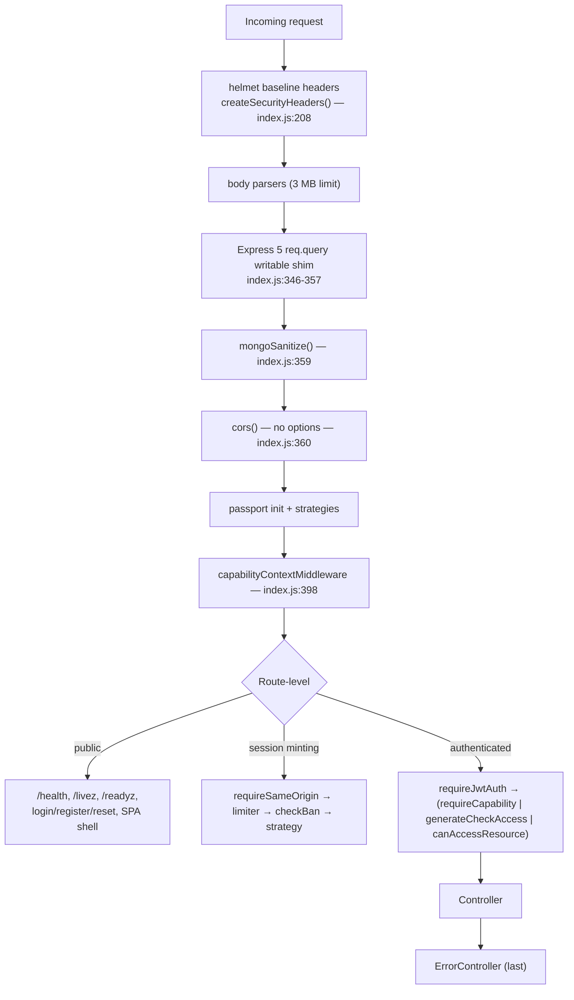
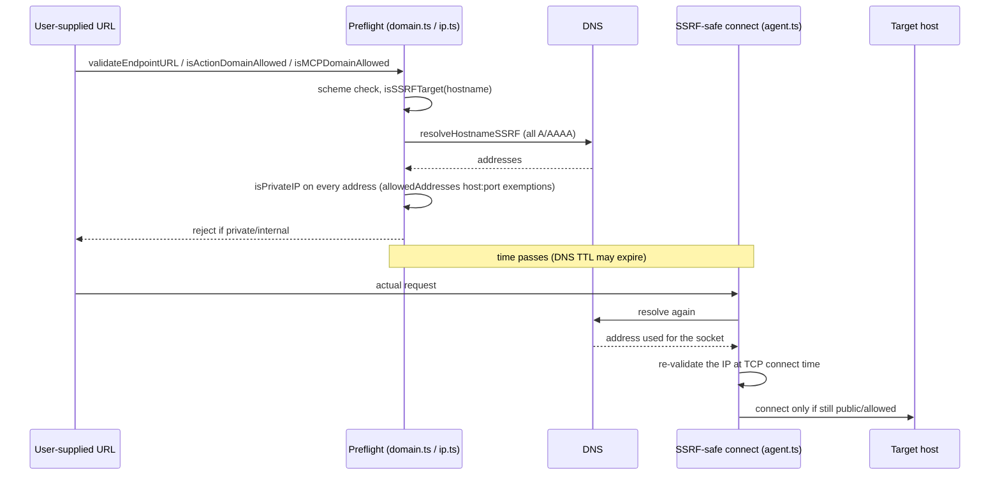

# 08 — Authentication, Authorization & Security Posture

> **Audience:** contributors changing login, sessions, permissions, file handling, outbound
> fetches, or HTTP middleware — and anyone asked "is X protected?"
>
> **Scope:** how the backend authenticates and authorizes requests, plus a lightweight security
> review of the surrounding surface (CORS, CSRF, injection, files, SSRF, rate limits, secrets,
> headers). Documentation only: findings below are **not fixed** by this document.
>
> **Deep source for login/JWT:** [`CRITICAL_FLOWS.md` — Flow 2](../../CRITICAL_FLOWS.md#flow-2-authentication--authorization)
> walks the local-login middleware chain, the controller's race guards, token minting, and the
> per-request JWT check with code excerpts. This document links to it rather than repeating it,
> and **corrects one claim in it** (see [§5.3](#53-correction-checkadmin-is-dead-code)).

**Evidence labels used throughout**

| Label | Meaning |
|---|---|
| **Verified** | Read in current source at the cited `file:line`. |
| **Inferred** | Follows from verified code, but the exact runtime behavior was not exercised. |
| **Unknown** | Could not be established from the repository (deployment-dependent or not traced). |

Paths are repository-relative. Line numbers were accurate at the time of writing; re-check them
before relying on them in a change.

Related docs: [00 — Overview](./00-overview.md) · [01 — Architecture](./01-architecture.md) ·
[02 — Backend](./02-backend.md) · [03 — Frontend](./03-frontend.md) ·
[06 — Business logic](./06-business-logic.md) ·
[13 — Architecture decisions & limitations](./13-architecture-decisions-and-limitations.md)

---

## At a glance

### Implemented and verified protections

| Area | Protection | Where |
|---|---|---|
| Access tokens | Short-lived JWT, **no role in payload**, fresh DB user lookup on every request | `api/strategies/jwtStrategy.js:28-82` |
| Revocation | `credentialsChangedAt` vs `issuedAtMs` retires every outstanding token on password reset / 2FA change | `packages/api/src/auth/twoFactor.ts:237-245` |
| Refresh tokens | `httpOnly` + `secure` + `SameSite=Strict` cookie, tracked in the `sessions` collection | `api/server/services/AuthService.js:705-746` |
| Passwords | bcryptjs, cost 10; reset tokens random 32 bytes, bcrypt-hashed, 15 min TTL | `api/server/services/AuthService.js:249-255,420-428,526-535` |
| 2FA | RFC 6238 TOTP, constant-time compare, secrets encrypted with `encryptV3`, salted backup codes | `api/server/services/twoFactorService.js:41-121` |
| Social login | Cross-provider email collision is **rejected**, not auto-linked; tenant-aware domain allowlist | `api/strategies/socialLogin.js:12-128` |
| Authorization | Capability grants (`requireCapability`), role feature flags (`generateCheckAccess`), per-resource ACL bitmask (`canAccessResource`) | §5 |
| Session-minting endpoints | `requireSameOrigin` on login, 2FA temp verify, passkey login | `api/server/routes/auth.js:73,156,188` |
| OAuth-flow CSRF | HMAC-signed state cookie for Actions and MCP OAuth callbacks | `packages/api/src/oauth/csrf.ts` |
| NoSQL injection | Global `express-mongo-sanitize`, kept working under Express 5 | `api/server/index.js:346-359` |
| File uploads | MIME re-sniff + allowlist (415), server size limit, `path.basename` sanitization | `api/server/routes/files/multer.js:74-145` |
| File downloads | DB-record ACL check (`fileAccess`) before any handler runs | `api/server/routes/files/files.js:594,632` |
| SSRF | Preflight allowlist **and** connect-time IP re-validation (undici) | `packages/api/src/auth/{domain,ip,agent}.ts` |
| Rate limiting | Dedicated limiters for auth, 2FA, passkeys, messages (IP + user), uploads, etc. | `api/server/middleware/limiters/` |
| Baseline headers | helmet: HSTS, `X-Frame-Options`, `Referrer-Policy`, COOP/CORP | `packages/api/src/security/headers.ts` |

### Findings: missing, inconsistent, or uncertain

| # | Finding | Label | Priority* | Section |
|---|---|---|---|---|
| F1 | `checkAdmin` is dead code; `/api/admin/*` is gated by `requireCapability(ACCESS_ADMIN)` — corrects `CRITICAL_FLOWS.md` | Verified | Docs only | [§5.3](#53-correction-checkadmin-is-dead-code) |
| F2 | CORS is default-permissive: `app.use(cors())` with no options | Verified | Low–Medium | [§10](#10-cors-and-origin-validation) |
| F3 | `POST /api/auth/refresh` lacks `requireSameOrigin`, unlike sibling session-minting routes | Verified | Low | [§11](#11-csrf-protection) |
| F4 | Per-user provider API keys use legacy v1 (fixed-IV AES-CBC) encryption; 2FA/admin secrets use v3 | Verified | Medium (defense-in-depth) | [§9](#9-secret-management) |
| F5 | Nonce-based CSP is fully implemented but ships disabled (`CSP_ENABLED` unset ⇒ off) | Verified | Medium | [§17](#17-content-security-policy-csp) |
| F6 | No general CSRF token for the JSON API — consistent with Bearer-token auth, not a flaw | Verified | Informational | [§11](#11-csrf-protection) |
| F7 | Several legacy controllers (and `generateCheckAccess`'s 500 path) forward raw `error.message` to clients | Verified | Low–Medium | [§16](#16-sensitive-data-exposure) |
| F8 | Rate limits are per-process unless `USE_REDIS` is enabled | Verified (behavior) / Unknown (deployment) | Deployment-dependent | [§15](#15-rate-limiting) |

\* Priority is this review's relative ordering for follow-up work, not a CVSS score. None of these
findings was demonstrated as a remotely exploitable bypass.

---

## Request pipeline (where the checks sit)

Global middleware order is documented in `PROJECT_MAP.md` §4; the security-relevant subset is:

Authentication is **applied per route, not globally** (Verified, `PROJECT_MAP.md` §4 and the route
files cited below). A new router that forgets `requireJwtAuth` is unauthenticated — see
[§7](#7-middleware-and-route-protection).

---

## 1. Login and logout flows

**Verified.** Full step-by-step trace, including the controller's "was the password revoked during
login" re-check and the sequence diagram, is in
[CRITICAL_FLOWS.md Flow 2 → Local login flow](../../CRITICAL_FLOWS.md#flow-2-authentication--authorization).

Summary only:

- `POST /api/auth/login` (`api/server/routes/auth.js:70-80`) chains
  `requireSameOrigin → loginLimiter → checkBan → validateEmailLogin → requireLocalAuth | requireLdapAuth → loginController`.
  Rate limit and ban checks run before the password is compared.
- If `twoFactorEnabled`, the controller returns `{ twoFAPending: true, tempToken }` instead of a
  session; the client completes login at `POST /api/auth/2fa/verify-temp` (`auth.js:154-161`,
  also behind `requireSameOrigin`).
- Passkey login: `POST /api/auth/passkey/login/verify` (`auth.js:185-193`, `requireSameOrigin`).
- **Logout:** `POST /api/auth/logout` requires `requireJwtAuth` (`auth.js:69`) and deletes the
  server-side Session record (`logoutController` → `deleteSession`, `AuthService.js`), so the
  refresh cookie stops working even if it was copied.

### Supported strategies — Verified

All files exist under `api/strategies/` with matching registration logic:

| Strategy | File(s) | Enabled by |
|---|---|---|
| Local password | `localStrategy.js` | default (`ALLOW_EMAIL_LOGIN`) |
| JWT bearer | `jwtStrategy.js` | always |
| LDAP | `ldapStrategy.js` | `LDAP_URL` + `LDAP_USER_SEARCH_BASE` |
| SAML | `samlStrategy.js` (`@node-saml/passport-saml`) | SAML env config |
| OpenID Connect | `openidStrategy.js`, `openIdJwtStrategy.js` | OpenID env config; `OPENID_REUSE_TOKENS` optional |
| Google, GitHub, Facebook, Discord, Apple | `<provider>Strategy.js` | `ALLOW_SOCIAL_LOGIN` (+ per-provider client ID/secret) |
| Shared | `socialLogin.js` (callback factory), `process.js` (create/link helpers) | — |

No Azure AD / generic OAuth2 strategy file exists beyond these.

**Social callback behavior** (`api/strategies/socialLogin.js:12-128`, Verified):

1. Checks `isEmailDomainAllowed` against the **base** config (`:23`), then again against the
   **tenant-resolved** config once the existing user's tenant is known (`:41`) — a tenant-scoped
   domain restriction cannot be bypassed by an email that only passes the base check.
2. Looks up the user by provider + provider ID + email (`findSocialUser`, `:35`).
3. If an account with the same email exists **under a different provider**, login is rejected
   with the existing provider named in the error (`:89-96`) — the correct defense against
   account takeover by email collision.
4. New-user creation is separately gated by `ALLOW_SOCIAL_REGISTRATION` (`:100-108`).

`express-session` is mounted only for the OAuth/OIDC/SAML handshakes (state storage), not on the
normal API path — see `PROJECT_MAP.md` §6 "Session management".

---

## 2. Session and token management

**Verified** unless noted.

| Token | Format | Lifetime | Storage | Source |
|---|---|---|---|---|
| Access token | JWT signed with `JWT_SECRET`; payload `{id, username, provider, email, issuedAtMs}` — **no role/permissions** | `SESSION_EXPIRY` (default 15 min per `.env.example:949`) | Client memory (React state + axios default header — see [03-frontend](./03-frontend.md)) | `packages/data-schemas/src/methods/user.ts:781-801` |
| Refresh token | Separate JWT signed with `JWT_REFRESH_SECRET` | `REFRESH_TOKEN_EXPIRY` (default 7 days, `.env.example:950`; read at `AuthService.js:710`) | `httpOnly`, `secure`, `sameSite:'strict'` cookie only (`AuthService.js:730,736`) and a server-side **Session** document | `api/server/services/AuthService.js:705-746` |

Why the JWT carries no role, and why that makes the auth user-document cache security-critical,
is explained in [CRITICAL_FLOWS.md Flow 2 → "Why it's shaped this way"](../../CRITICAL_FLOWS.md#flow-2-authentication--authorization).
The rule from the root `AGENTS.md` follows directly: **any code that mutates a user document must
invalidate the auth user cache**, including bulk role changes.

### Refresh — `POST /api/auth/refresh`

`packages/api/src/auth/localRefresh.ts:111-196` (`createLocalRefreshHandler`):

1. No cookie → `200 'Refresh token not provided'` and no session minted (`:116-118`).
2. Verifies the JWT with `JWT_REFRESH_SECRET` (`:121`), loads the user.
3. **Retirement check before lookup:** if the refresh token predates `credentialsChangedAt` /
   2FA enrollment, clear the cookie and return 401 (`:139-145`).
4. Looks up the Session by `{ userId, refreshToken }` (`:152`); the stored form is a hash
   (`refreshTokenHash`, see `PROJECT_MAP.md` §5).
5. Mints new tokens, then **re-checks retirement after minting** (`recheckMintedCredential`,
   `:175-183`) to catch a password reset that landed between lookup and mint; if so the new
   session is withdrawn (`withdrawMintedSession`) and 401 returned. The comment at `:90-94`
   documents this race.

### Invalidation paths

| Trigger | Mechanism | Source |
|---|---|---|
| Logout | Deletes the Session document | `logoutController` → `deleteSession` |
| Password reset | Stamps `credentialsChangedAt`; deletes all sessions and passkeys; awaits auth-cache eviction before responding | `packages/api/src/auth/passwordResetUpdate.ts:3-21`, `passwordReset.ts:60-96` |
| 2FA enroll/disable | Stamps `twoFactorEnrolledAt`; the later of the two cutoffs wins | `packages/api/src/auth/twoFactor.ts:289-325` |
| Every request | `isTokenRetired({ issuedAt, issuedAtMs }, user)` inside the JWT strategy | `api/strategies/jwtStrategy.js:28-82`, `twoFactor.ts:237-245` |
| Account deletion in progress | JWT strategy rejects with `ACCOUNT_DELETION_IN_PROGRESS` | `jwtStrategy.js` (quoted in CRITICAL_FLOWS Flow 2) |

`issuedAtMs` exists because standard `iat` has one-second resolution — too coarse to order a token
against a reset in the same second (comment in `user.ts:781-801`).

---

## 3. Password handling

**Verified.**

- **Hashing:** `bcryptjs`, `bcrypt.genSaltSync(10)` at registration
  (`api/server/services/AuthService.js:420-428`). Compare via `comparePassword`
  (`packages/api/src/auth/password.ts:11-25`) from `api/strategies/localStrategy.js`.
- **Reset and verification tokens:** 32 random bytes from `webcrypto.getRandomValues`, stored only
  as a bcrypt hash (cost 10) — `createTokenHash`, `AuthService.js:249-255`. Both the
  email-verification token (`:282-289`) and the password-reset token (`:526-535`) have
  `expiresIn: 900` (15 minutes). The `tokens` collection has a TTL index (`PROJECT_MAP.md` §5).
- **Reset commit** (`packages/api/src/auth/passwordReset.ts:144-173`, `commitPasswordReset`):
  reads token and account together and requires both a bcrypt match **and**
  `resetTokenBindsToAccount` (`:105-116`) — a reset link issued before an email change no longer
  applies to the account.
- Pending email-change tokens are swept on reset (`clearPendingEmailChanges`, `:125-134`) so a stale
  change cannot resurrect after the password that gated it changes.
- Unverified-email login is refused unless `ALLOW_UNVERIFIED_EMAIL_LOGIN` (`PROJECT_MAP.md` §6).

---

## 4. Two-factor authentication

**Verified.**

| Aspect | Implementation | Source |
|---|---|---|
| Algorithm | Hand-rolled RFC 4226/6238 TOTP over WebCrypto HMAC-SHA1; 30 s step; 6 digits; ±1 step window. No `otplib`/`speakeasy`. | `api/server/services/twoFactorService.js:41-121` |
| Comparison | `constantTimeEqual`, commented as deliberate | `twoFactorService.js:92-100` |
| Secret at rest | `totpSecret` / `pendingTotpSecret` encrypted with `encryptV3` (AES-256-CTR, random IV) | `api/server/controllers/TwoFactorController.js:1,45` |
| Legacy read path | `getTOTPSecret` also decrypts v2 and plain 16-char legacy secrets — a read-side migration path; new secrets are only written as v3 | `twoFactorService.js:161-174` |
| Backup codes | Salted SHA-256 (`sha256:<salt>:<hash>`), `crypto.timingSafeEqual`; legacy unsalted 64-hex codes still accepted on read | `packages/api/src/auth/recovery.ts:51,64-80` |
| Exposure | JWT strategy projection excludes `totpSecret` and `backupCodes` | `jwtStrategy.js:28` |
| Rate limits | `twoFactorTempLimiter` on temp-token verify; `createTwoFactorManagementLimiter` on `/2fa/enable|verify|confirm|disable|backup/regenerate` | `api/server/routes/auth.js:51-55,118-174` |

Enrollment can be **required** by policy: the refresh handler returns
`TWO_FACTOR_ENROLLMENT_REQUIRED_CODE` with a setup temp token instead of a session
(`localRefresh.ts:154-171`).

---

## 5. Role and permission checks

`CRITICAL_FLOWS.md` Flow 2 describes "two separate systems, both real" plus a blunt admin gate.
Re-checked against current source, there are **three live mechanisms** and the admin gate it names
is unused.

### 5.1 Capability and role-flag checks — Verified

Two related but distinct middleware families sit in this layer:

| Mechanism | What it checks | Backing data | Source |
|---|---|---|---|
| `requireCapability` / `hasCapability` | System capabilities such as `SystemCapabilities.ACCESS_ADMIN` (`'access:admin'`) | `SystemGrant` documents resolved against the user's principals (user, role, groups) | `packages/api/src/middleware/capabilities.ts:147-191`, wired in `api/server/middleware/roles/capabilities.js` |
| `generateCheckAccess` | Role feature flags `role.permissions.<PermissionType>.<Permission>` (e.g. `AGENTS.USE`, `AGENTS.CREATE`) | `Role` document looked up by `user.role` | `packages/api/src/middleware/access.ts:216-256`; e.g. `api/server/routes/agents/v1.js:13-20` |

CRITICAL_FLOWS item 1 groups both under `hasCapability`; the distinction above is a clarification,
not a behavior change.

- `capabilityContextMiddleware` (a per-request AsyncLocalStorage cache of resolved principals and
  results) is registered app-wide at `api/server/index.js:398` and **must precede** any route
  calling `hasCapability`. It is intentionally **not** re-exported from the middleware barrel
  (`api/server/middleware/roles/index.js:1-14` explains the circular-require risk); import
  `roles/capabilities.js` directly.
- **Default admin grant (Verified — resolves an open question in the source review):**
  `seedSystemGrants` (`packages/data-schemas/src/methods/systemGrant.ts:516-540`) upserts **every**
  `SystemCapabilities` value, including `ACCESS_ADMIN`, for principal `ROLE:ADMIN`, and runs at
  startup (`api/models/index.js:25`). Because it uses `$setOnInsert` with `upsert`, a deleted
  default grant is re-created on the next start (**Inferred** from the upsert semantics).
- Capabilities can also be granted to other roles, users, or groups through the admin grants API
  (`api/server/routes/admin/grants.js`) — so "holds `ACCESS_ADMIN`" and "`role === ADMIN`" are
  intentionally not equivalent.

### 5.2 Per-resource ACL bitmask — Verified

`canAccessResource({ resourceType, requiredPermission })`
(`api/server/middleware/accessResources/canAccessResource.js`) checks the `aclEntry` collection.
`PermissionBits` (`packages/data-provider/src/accessPermissions.ts:58-68`):

| Bit | Value |
|---|---|
| `VIEW` | 1 |
| `EDIT` | 2 |
| `DELETE` | 4 |
| `SHARE` | 8 |
| `VIEW_INSIGHTS` | 16 — agent Insights, only meaningful with `VIEW` (not listed in CRITICAL_FLOWS) |

Write-path semantics (role-only sharing, remove-wins-over-add, no dedup of concurrent duplicate ACL
documents, no cross-document atomicity on standalone MongoDB) are documented in
`docs/permissions/acl-write-compatibility.md`. These are documented, intentional behaviors. See
[06-business-logic](./06-business-logic.md) for how agents and prompts use these grants.

### 5.3 Correction: `checkAdmin` is dead code

**Verified. This updates `CRITICAL_FLOWS.md` Flow 2, "Role-based access control" item 3, and the
"Admin-only gate" row of its "Files to touch" table** (and the matching sentence in
`PROJECT_MAP.md` §6).

- `api/server/middleware/roles/admin.js:3-14` defines `checkAdmin` (`req.user.role !== SystemRoles.ADMIN` → 403)
  and `roles/index.js:13,16` exports it.
- A repository search finds **no route that uses it** (`grep -rn checkAdmin api` returns only the
  definition and the barrel export).
- Every admin router instead defines
  `const requireAdminAccess = requireCapability(SystemCapabilities.ACCESS_ADMIN)` and applies it
  after `requireJwtAuth`: `api/server/routes/admin/{audit,auth,code,config,grants,groups,langfuse,roles,skills,users}.js`
  (e.g. `config.js:17`, `users.js:18`, `auth.js:42`).

**Impact:** documentation only. The real gate (§5.1) is at least as strict and is applied
consistently. The risk is a contributor following the stale doc and wiring a new admin route with
`checkAdmin`, which would bypass capability grants given to non-`ADMIN` principals and diverge from
every other admin route.

**Recommendation:** when adding an admin route, copy the `requireAdminAccess` pattern. Update the
CRITICAL_FLOWS/PROJECT_MAP text, and consider removing `checkAdmin` in a separate change.

---

## 6. Session-minting vs. bearer-authenticated endpoints

| Endpoint group | Credential | Guard |
|---|---|---|
| `/login`, `/2fa/verify-temp`, `/passkey/login/verify` | Body credentials / temp token | `requireSameOrigin` + limiter |
| `/refresh` | Refresh cookie | none beyond `SameSite=Strict` (F3) |
| Everything else authenticated | `Authorization: Bearer` | `requireJwtAuth` |

This split is why CSRF ([§11](#11-csrf-protection)) and CORS ([§10](#10-cors-and-origin-validation))
reason differently about the two groups.

---

## 7. Middleware and route protection

**Verified** (representative, not exhaustive — see "Could not verify").

| Middleware | Purpose | Source |
|---|---|---|
| `requireJwtAuth` | Passport JWT strategy; 401 on missing/expired/retired token | `api/server/middleware/requireJwtAuth.js` → `api/strategies/jwtStrategy.js` |
| `optionalJwtAuth` | Populates `req.user` if a valid token is present; otherwise continues | `api/server/middleware/optionalJwtAuth.js` |
| `requireLocalAuth` / `requireLdapAuth` | Credential strategies on login | `auth.js:77` |
| `requireSameOrigin` | `createSameOriginGuard` with `trustedOrigins: [DOMAIN_CLIENT, DOMAIN_SERVER, ADMIN_PANEL_URL]`; checks `Sec-Fetch-Site`/`Origin`; 403 before any cookie is set | `api/server/middleware/requireSameOrigin.js:1-9`, `packages/api/src/middleware/origin.ts`, test `origin.spec.ts:55-59` |
| `checkBan` | Ban list check on login/register | `auth.js` login chain |
| `requireCapability(...)` | System capabilities (§5.1) | `roles/capabilities.js` |
| `generateCheckAccess(...)` | Role feature flags (§5.1) | `packages/api/src/middleware/access.ts:216` |
| `canAccessResource(...)`, `fileAccess` | Per-object ACL (§5.2, §13) | `api/server/middleware/accessResources/` |
| `preAuthTenantMiddleware` | Tenant resolution before auth on auth/config/share routes | per `PROJECT_MAP.md` §4 |

Spot-checked applications of `requireJwtAuth`: `/api/auth/logout`, `/2fa/*` management, `/passkey`
CRUD, `/graph-token`, `/cloudfront/refresh` (`auth.js:69,82,118-174,195-216`), and every
`/api/admin/*` router (`router.use(requireJwtAuth, requireAdminAccess, ...)`).

### Intentionally public routes — Verified

| Route | Why public | Source |
|---|---|---|
| `GET /health`, `/livez`, `/readyz` | Orchestrator health checks | `api/server/index.js:328-335` |
| `POST /api/auth/login`, `/register`, `/requestPasswordReset`, `/resetPassword` | Caller has no session yet; rate-limited and ban-checked | `api/server/routes/auth.js:70-115` |
| `POST /api/auth/refresh` | Authenticated by cookie, not bearer | `auth.js:81` |
| `/index.html` and SPA fallback | Pre-auth client bootstrap | `api/server/index.js:305-369,464` |

**Contributor rule:** auth is per-route. A new router must apply `requireJwtAuth` (or explicitly
document why it is public). See [02-backend](./02-backend.md) for the route-registration pattern.

---

## 8. Frontend route guards

**Verified.** Full detail is in [03-frontend](./03-frontend.md) (auth state section). In short:

- No router-level `loader` guard. `client/src/routes/useAuthRedirect.ts` reads `isAuthenticated`
  from `useAuthContext()` and, after a 300 ms debounce, navigates to
  `buildLoginRedirectUrl(pathname, search, hash)` with `replace: true`.
- `client/src/routes/Root.tsx:174-176` renders nothing (`return null`) until authenticated, so
  protected UI never flashes.
- `client/src/hooks/AuthContext.tsx:371-406` clears client auth state on a failed user fetch and
  redirects unless auth is configured as optional; it also triggers a silent refresh when no token
  is present.
- The access token lives in React state and the axios default header, not `localStorage`
  (per [03-frontend](./03-frontend.md)).

**Client-side role gating is cosmetic.** The JWT has no role; every real decision is server-side
(§5). Do not add client logic that trusts a decoded JWT for authorization.

---

## 9. Secret management

### 9.1 Platform secrets (environment) — Verified

Names only; values live in `.env` (see `.env.example`):

| Variable | Use |
|---|---|
| `JWT_SECRET` | Access-token signing; also keys the OAuth CSRF HMAC (`packages/api/src/oauth/csrf.ts:130`) |
| `JWT_REFRESH_SECRET` | Refresh-token signing |
| `CREDS_KEY` | AES key for all three encryption generations |
| `CREDS_IV` | **Fixed** IV used only by v1 `encrypt`/`decrypt` |
| Provider client IDs/secrets (`GOOGLE_CLIENT_ID`, `OPENID_CLIENT_SECRET`, …) | OAuth/OIDC strategies |

### 9.2 Encryption generations — Verified

`packages/data-schemas/src/crypto/index.ts`:

| Generation | Functions | Cipher | IV | Integrity tag |
|---|---|---|---|---|
| v1 (legacy) | `encrypt` / `decrypt` (`:34-65`) | AES-CBC (WebCrypto) | **Fixed**, from `CREDS_IV` (`:10`) | None |
| v2 | `encryptV2` / `decryptV2` (`:74-112`) | AES-CBC | Random per call, prepended | None |
| v3 (current) | `encryptV3` / `decryptV3` (`:123-148`) | AES-256-CTR | Random per call, `v3:` prefix | None |

Who uses what:

| Data | Generation | Source |
|---|---|---|
| 2FA TOTP secrets | v3 | `TwoFactorController.js:45` |
| Admin-managed secrets | v3 | `packages/api/src/admin/secrets.ts:401,453,596,626,766` |
| **Per-user provider API keys** (`keys` collection, `user_provided` endpoints) | **v1** | `packages/data-schemas/src/methods/key.ts:3,121` |

### 9.3 Finding F4 — per-user API keys on v1 fixed-IV encryption

- **Evidence (Verified):** `key.ts:3` imports `{ encrypt, decrypt }`; `updateUserKey` calls
  `encrypt(value)` at `:121`; `getUserKey` calls `decrypt` at `:46`.
- **Impact:** with a fixed IV, identical plaintexts produce identical ciphertexts — someone with
  read access to the `keys` collection (DB compromise, leaked backup) can tell which users stored
  the same API key. AES-CBC without a MAC is malleable to an attacker with write access. Both
  require database-level access already, so this is a **defense-in-depth gap, not a remotely
  exploitable vulnerability**. Note that v3 (CTR) also lacks authentication; it fixes the
  determinism, not malleability.
- **Mitigating factors (Verified):** the HTTP surface never returns decrypted keys —
  `GET /api/keys` returns only expiry metadata, and all key routes require `requireJwtAuth` and are
  scoped to `req.user.id` (`api/server/routes/keys.js:1-39`).
- **Recommendation:** write new per-user keys with `encryptV3`, with a read-side fallback to
  `decrypt`/`decryptV2` for existing values — the same pattern `getTOTPSecret` already uses
  (`twoFactorService.js:161-174`). Longer term, consider an authenticated mode (e.g. AES-GCM) for a
  future generation. Treat any migration as a stored-data change: keep old values readable.

---

## 10. CORS and origin validation

### Finding F2 — default-permissive CORS

- **Evidence (Verified):** `app.use(cors())` with no options at `api/server/index.js:360`
  (identical in `api/server/experimental.js:595`). No origin allowlist exists anywhere in that
  call.
- **Behavior (Inferred from the `cors` package's documented defaults):**
  `Access-Control-Allow-Origin: *`, credentials not allowed.
- **Impact:** any origin can call any API route and read the response **if it supplies a valid
  bearer token itself**. Browsers do not attach another origin's in-memory bearer token, and they
  refuse `*` together with credentialed requests, so this is not exploitable on its own today. The
  risk is latent: if `credentials: true` is ever added here, or a future route authenticates by
  cookie alone and returns sensitive data, that route becomes readable cross-origin with no
  allowlist to stop it.
- **Existing origin validation:** `requireSameOrigin` (§7) is a real, tested origin check, but it
  covers only three session-minting routes.
- **Recommendation:** configure CORS explicitly, e.g. `{ origin: [DOMAIN_CLIENT, ADMIN_PANEL_URL, …], credentials: false }`,
  ideally from the same trusted-origin list `requireSameOrigin` uses. Per the root `AGENTS.md`,
  a new lever like this should be configurable (via `librechat.yaml`/env) with a default that
  preserves current behavior, or the wildcard should be documented as intentional for a
  Bearer-only API.

---

## 11. CSRF protection

### What exists — Verified

- **OAuth-flow CSRF** (`packages/api/src/oauth/csrf.ts`): `generateOAuthCsrfToken` is an HMAC keyed
  on `JWT_SECRET` (`:130`), set as a 10-minute `httpOnly` cookie (`OAUTH_CSRF_COOKIE`,
  `setOAuthCsrfCookie`, `:7-8,152-160`) and validated on the callback (`validateOAuthCsrf`,
  `:166+`). Wired into Actions OAuth (`api/server/routes/actions.js:9-11,38,85-94`) and MCP OAuth
  (`api/server/routes/mcp.js:21-23,203,250,290-292,353-362`), with a session-cookie fallback
  (`validateOAuthSession`) when the CSRF cookie is absent.
- **Social/OIDC/SAML handshakes** use passport `state` stored via `createOAuthStateStore`
  (`googleStrategy.js`, see CRITICAL_FLOWS Flow 2 "OAuth (Google) flow").
- **`requireSameOrigin`** acts as the CSRF control for the pre-session endpoints (§7).

### Finding F6 — no general CSRF token (informational)

There is no double-submit or synchronizer token on ordinary state-changing JSON routes
(`/api/convos`, `/api/messages`, `/api/agents`, …). **This is consistent with the auth model, not
a flaw:** these routes authenticate with an `Authorization: Bearer` header the browser never
attaches automatically, so a cross-site form, image, or script cannot forge an authenticated
request. Classic CSRF requires an ambient credential (cookie), which these routes do not accept.

### Finding F3 — `/api/auth/refresh` lacks `requireSameOrigin`

- **Evidence (Verified):** `router.post('/refresh', refreshController)` at
  `api/server/routes/auth.js:81`, while `/login` (`:73`), `/2fa/verify-temp` (`:156`) and
  `/passkey/login/verify` (`:188`) all include `middleware.requireSameOrigin`.
  `api/server/routes/auth.cross-site.test.js` covers cross-site rejection for those three but has
  no `/refresh` case.
- **Impact (low):** the refresh cookie is `SameSite=Strict` (`AuthService.js:730,736`), so
  browsers do not send it on cross-site requests; a cross-site POST arrives without a cookie and
  hits the "no token" branch (`localRefresh.ts:116-118`) without minting anything. The response
  body of a same-site-cookie request also could not be read cross-origin without credentialed CORS.
  This is a **defense-in-depth inconsistency, not a demonstrated bypass**.
- **Recommendation:** add `middleware.requireSameOrigin` to `/refresh` for parity (and for
  browsers/webviews with non-standard `SameSite` handling), and add a cross-site case to
  `auth.cross-site.test.js`. Verify first that no legitimate cross-origin caller (e.g. an admin
  panel on another origin) depends on it — `ADMIN_PANEL_URL` is already a trusted origin.

---

## 12. Input validation and NoSQL injection

**Verified — mitigated by design.**

- `app.use(mongoSanitize())` (`express-mongo-sanitize`) at `api/server/index.js:359` runs on every
  request before routes, stripping `$`-prefixed and dotted keys — the standard defense against
  operator injection such as `{ "email": { "$ne": null } }`.
- Express 5 made `req.query` read-only; a shim at `index.js:346-357` restores writability
  specifically so the sanitizer still works. Do not remove or reorder it.
- Targeted search found no user-controlled `$where` (the only hits are Mongoose
  optimistic-concurrency/tenant-isolation predicates in
  `packages/data-schemas/src/models/plugins/tenantIsolation.ts:33-82` and
  `packages/data-schemas/src/methods/user.ts:162,923`), and no `Model.find(req.query)` /
  `Model.find(req.body)` passthrough.
- Request-level validators exist per route (`validateMessageReq`, `validateModel`,
  `validateEmailLogin`, …; see [02-backend](./02-backend.md)), and Mongoose `ValidationError`
  maps to 400 in `ErrorController`.

This was a targeted search, not an exhaustive audit of every controller.

---

## 13. File upload and download security

**Verified.**

| Control | Implementation | Source |
|---|---|---|
| MIME type | `normalizeUploadMimeType` re-infers type from content/extension instead of trusting the client's `Content-Type`; `createFileFilter` checks a per-endpoint allowlist from `librechat.yaml` file config; rejects with **415** | `api/server/routes/files/multer.js:74-132` |
| Size | `multer({ limits: { fileSize: fileConfig.serverFileSizeLimit } })` — server-enforced | `multer.js:140-145` |
| Path traversal (upload) | `sanitizeFilename` calls `path.basename` first, then strips unsafe punctuation, neutralizes leading dots, truncates to NAME_MAX bytes | `packages/api/src/utils/files.ts:129-149`, used at `multer.js:42-46` |
| Storage naming | Local images are stored under a server-generated `file_id` UUID prefix, not the client name | `api/server/services/Files/Local/images.js:48-53` |
| Download authorization | `fileAccess` middleware loads the DB record and checks ownership / ACL / agent grants **before** the handler; the `:userId` path segment is not trusted | `api/server/routes/files/files.js:594,632`; `api/server/middleware/accessResources/fileAccess.js` |
| Agent-attached files | Users with `VIEW` on an agent can read files attached to it, via the same ACL system | `fileAccess.js:9-65` (`checkAgentBasedFileAccess`) |
| Preview | `/:file_id/preview` reuses `fileAccess` so ACL is identical to download | `files.js:479-491` |
| Upload rate limits | `uploadLimiters.js` | §15 |

Files are located by DB `_id`/`file_id`, never by re-joining a client-supplied path. No
unauthenticated or traversal-exploitable file serving was found.

---

## 14. SSRF boundaries

**Verified — a strength of this codebase.** SSRF defense is built as reusable, tested primitives
with **two independent layers**, so an attacker has to beat both.

### Layer 1 — preflight allowlist

- `isPrivateIP` (`packages/api/src/auth/ip.ts:113-153`): IPv4 private/reserved ranges (0/8, 10/8,
  100.64/10, 127/8, 169.254/16, 172.16/12, 192.0.0/24, 192.168/16, 198.18/15, 224+/3), IPv6
  (`::1`, `::`, `fc00::/7`, `fe80::/10`), IPv4-mapped IPv6, and private IPv4 embedded in
  6to4/NAT64/Teredo addresses (`ip.ts:68-107`) — a depth most filters skip.
- `isSSRFTarget` (`packages/api/src/auth/domain.ts:112-174`): `localhost`/`*.localhost`,
  `.internal`/`.local`, and common Docker/Kubernetes service names (`redis`, `mongodb`, `postgres`,
  `vault`, `metadata`, …; `:136-162`).
- `resolveHostnameSSRF` (`domain.ts:68-97`) resolves DNS and checks **every** returned address.
- Applied to: custom/OpenAI-compatible endpoint base URLs (`validateEndpointURL`, `domain.ts:553-581`),
  Agent Action domains (`isActionDomainAllowed`, HTTP/HTTPS only, `:375-384`), MCP server URLs
  (`isMCPDomainAllowed`, HTTP/HTTPS/WS/WSS, `:424-448`). MCP validation **fails closed** on an
  unparseable URL when an allowlist is active, so a placeholder like `{{HOST}}` cannot slip
  through before env substitution (`:416-420`).
- `allowedAddresses` exemptions must be `host:port` — never a bare host or CIDR — so allowing a
  self-hosted Ollama does not trust the whole private segment
  (`packages/api/src/auth/allowedAddresses.ts:1-17`).

### Layer 2 — connect-time re-validation

`createSSRFSafeUndiciConnect` (`packages/api/src/auth/agent.ts:196`) and `createSSRFSafeAgents`
(`:175`) validate the IP actually used for the socket. Wired into MCP connections
(`packages/api/src/mcp/connection.ts:52,1381-1396,1813`), the Anthropic client
(`packages/api/src/endpoints/anthropic/llm.ts:36,464`), the OpenAI/custom client
(`packages/api/src/endpoints/openai/config.ts:8,255`), and MCP OAuth discovery
(`packages/api/src/mcp/oauth/hardenedFetch.ts:5,71`).

### Avatar fetch — third independent instance

`api/server/services/Files/images/avatar.js:9-70` (`fetchAvatarBuffer`, social-login profile
pictures): HTTP/HTTPS only, `createSSRFSafeAgents()` (`:40`), `redirect: 'error'` (`:49`) to block
validate-then-302-to-private, 10 MB cap (`:15`) enforced by option **and** post-read length check,
5 s total timeout (`:50`).

### Honest limitation — DNS rebinding on preflight-only paths

The source documents it itself (`domain.ts:547-551`, on `validateEndpointURL`): validation does a
single DNS lookup, so a hostile DNS server with TTL=0 could answer public at validation time and
private at request time. **Paths covered by Layer 2 close this gap**; any outbound fetch that uses
only the preflight check does not. **Recommendation for contributors:** any new server-side fetch
of a user-influenced URL should use `createSSRFSafeAgents` / `createSSRFSafeUndiciConnect`, not
just the preflight validators. Whether *every* existing outbound fetch uses Layer 2 was not
exhaustively enumerated (**Unknown**).

---

## 15. Rate limiting

**Verified.** All limiters live in `api/server/middleware/limiters/` and are built on
`express-rate-limit` with a shared `limiterCache` store.

| Area | Limiter(s) | Notes |
|---|---|---|
| Login | `loginLimiter.js` | `LOGIN_WINDOW`=5 min, `LOGIN_MAX`=7 (`loginLimiter.js:7-37`); OAuth browser navigations get a redirect, API callers get JSON (`:21-27`) |
| Registration | `registerLimiter.js` | |
| Password reset | `resetPasswordLimiter.js`, `resetPasswordSubmissionLimiter.js` | Request and submission have separate budgets |
| Email change | `emailChangeLimiter.js`, `emailChangeSubmissionLimiter.js`, `emailChangeSubmissionIpLimiter.js` | IP- and account-scoped |
| 2FA | `twoFactorTempLimiter.js`, `createTwoFactorManagementLimiter` | Defaults to `LOGIN_MAX`/`LOGIN_WINDOW` (`.env.example:874`) |
| Passkeys | `passkeyLimiter.js`, `passkeyStepUpLimiter.js` | Login and step-up ceremonies |
| Messages | `messageLimiters.js` | **Per-IP and per-user**, `MESSAGE_IP_MAX`/`MESSAGE_USER_MAX` = 40/min defaults (`:6-20`) |
| Other | `uploadLimiters.js`, `importLimiters.js`, `forkLimiters.js`, `shareLimiters.js`, `toolCallLimiter.js`, `promptUsageLimiter.js`, TTS/STT | |

### Finding F8 — limits are per-process without Redis

`limiterCache` (`packages/api/src/cache/cacheFactory.ts:197-238`) returns a `rate-limit-redis`
store only when `USE_REDIS` is enabled; otherwise it returns `undefined` (`:201-203`) and
`express-rate-limit` falls back to its in-memory store (**Verified**). In a multi-replica deployment
without Redis, each instance enforces its own budget, so the effective limit scales with replica
count. Whether a given deployment sets `USE_REDIS` is **Unknown** from the repository.
**Recommendation:** enable Redis for any horizontally scaled deployment. See
[01-architecture](./01-architecture.md) for the cache layer.

---

## 16. Sensitive data exposure

### What is protected — Verified

- `ErrorController` (`packages/api/src/middleware/error.ts:58-136`) falls back to a fixed 500 body
  with no message or stack for unhandled errors; messages reach the client only through explicit
  `createCustomError` or specific typed errors.
- `getSafeErrorMetadata` / `getSafeErrorText` (`packages/api/src/utils/errors.ts`) provide
  log-safe, secret-redacted error output; the root `AGENTS.md` makes this the required pattern.
- The JWT strategy's user projection excludes `password`, `totpSecret`, `backupCodes`
  (`jwtStrategy.js:28`); auth responses use `sanitizeUserForAuthResponse` (`localRefresh.ts:65,149,183`).
- Decrypted provider keys are never returned over HTTP (§9.3).
- Baseline headers: helmet via `createSecurityHeaders` (`api/server/index.js:208`,
  `packages/api/src/security/headers.ts`) — HSTS on (1-year max-age; subdomains and preload
  opt-in), `X-Frame-Options: sameorigin`, `Referrer-Policy: no-referrer`, COOP/CORP configurable
  via `SECURITY_HEADERS`, `HSTS_*`, `X_FRAME_OPTIONS`, `CROSS_ORIGIN_OPENER_POLICY`,
  `CROSS_ORIGIN_RESOURCE_POLICY`, `REFERRER_POLICY`.

### Finding F7 — raw `error.message` forwarded in legacy paths

The full table of affected controllers (agents v1, assistants v1/v2, plugins, tools, models, MCP,
memories, categories, actions, files) is in [02-backend → error handling](./02-backend.md). One
additional instance in the authorization layer itself (**Verified**):
`generateCheckAccess` returns ``{ message: `Server error: ${error.message}` }`` on an internal
failure (`packages/api/src/middleware/access.ts:253`).

- **Impact:** database, provider, or library error text can reach the client, which the root
  `AGENTS.md` treats as a security boundary (query text, internal hostnames, upstream payloads).
- **Recommendation:** route these through the central error contract — log with
  `getSafeErrorMetadata`, return a stable code and fixed message the UI can localize.

---

## 17. Content Security Policy (CSP)

### Finding F5 — real nonce-based CSP, disabled by default

- **Evidence (Verified):**
  - The helmet baseline always sets `contentSecurityPolicy: false`
    (`packages/api/src/security/headers.ts:34,155`) by design, so the other headers never depend on a
    directive list.
  - A separate nonce-based CSP for the SPA shell lives in `packages/api/src/security/csp.ts`
    (`createCspPolicy`, `issueCsp`, `applyCspNonce`), wired at `api/server/index.js:305-321` for
    `/index.html` and the SPA fallback (`:464`).
  - `createCspPolicy` returns `null` unless `CSP_ENABLED` is truthy (`csp.ts:197-201`), and
    `isEnabled(undefined)` is `false` (`packages/api/src/utils/common.ts:20-28`).
  - `.env.example:114-121` documents it as "Off by default so existing deployments are unaffected."
- **Impact:** deployments that do not opt in get no CSP on the app shell. For an app that renders
  model output, markdown, and artifacts, CSP is a meaningful XSS mitigation layer — and XSS is the
  main way an attacker could read the in-memory bearer token.
- **How to enable (from `.env.example:114-163` and `csp.ts`):**
  1. Set `CSP_ENABLED=true`. `CSP_REPORT_ONLY` defaults to **true** (`csp.ts:59-60`), so this first
     step only reports violations. Optionally set `CSP_REPORT_URI`.
  2. Add deployment-specific sources with `CSP_*_EXTRA` (e.g. `CSP_CONNECT_SRC_EXTRA`,
     `CSP_IMG_SRC_EXTRA`, `CSP_FRAME_SRC_EXTRA`), `CSP_FRAME_ANCESTORS`, or
     `CSP_ADDITIONAL_DIRECTIVES`. These only add sources.
  3. Optionally tighten with `CSP_ALLOW_WASM=false` (no HEIC uploads) and
     `CSP_ALLOW_DATA_WORKERS=false` (no artifact code editor).
  4. Once reports are clean, set `CSP_REPORT_ONLY=false` to enforce. Only an explicit
     `false`/`off`/`0`/`no` enforces; anything unrecognized stays report-only.
  - While CSP is enabled the shell is served `no-store` (a cached shell would pin one nonce).
  - `SECURITY_HEADERS=false` disables CSP as well (`csp.ts:208`).
- **Recommendation:** consider defaulting `CSP_ENABLED` to true in **report-only** mode so operators
  get visibility without breakage risk, then promote to enforcing in a later release. Any default
  change is a behavior change for existing deployments and should be called out in release notes.

---

## Could not verify

Carried forward from the source security review, with updates where this pass resolved an item:

- ~~Whether the `ADMIN` role holds `ACCESS_ADMIN` by default~~ — **resolved, Verified:**
  `seedSystemGrants` seeds every system capability for `ROLE:ADMIN` at startup (§5.1). Still
  **Unknown:** whether a specific deployment has granted `ACCESS_ADMIN` to other principals via
  the grants API — that is runtime data, not code.
- ~~Whether `limiterCache` is Redis-backed~~ — **resolved in code** (Redis iff `USE_REDIS`, §15);
  per-deployment configuration remains **Unknown**.
- SAML and OIDC callback internals (`provisionSamlUser`, `claimSamlIdentity`,
  `resolveSamlSubject`, OIDC equivalents) were confirmed to exist and follow a find-or-provision
  pattern, but were not traced line-by-line to the depth of `socialLogin.js`. Whether they apply
  the same cross-provider email-collision rejection is **Unknown**.
- Whether **every** non-auth, non-admin, non-file route (agents, prompts, conversations, …) applies
  `requireJwtAuth` was not enumerated route-by-route.
- Whether `express-mongo-sanitize` with default options sanitizes `req.params` under Express 5 —
  the compatibility shim addresses `req.query` only; `req.params` behavior was not tested.
- Whether every server-side outbound fetch of a user-influenced URL uses the connect-time SSRF
  layer (§14) rather than preflight validation alone.
- Runtime CORS response headers (§10) were inferred from the `cors` package defaults, not captured
  from a running server.

---

## Files to touch

| Want to change… | Touch |
|---|---|
| Login chain, refresh route, same-origin coverage | `api/server/routes/auth.js`, `api/server/middleware/requireSameOrigin.js`, `packages/api/src/middleware/origin.ts` |
| Login / refresh logic | `packages/api/src/auth/login.ts`, `packages/api/src/auth/localRefresh.ts` |
| Token claims / lifetime | `packages/data-schemas/src/methods/user.ts`, `SESSION_EXPIRY` / `REFRESH_TOKEN_EXPIRY` |
| Cookie flags | `api/server/services/AuthService.js` (`setAuthTokens`) |
| Token retirement | `packages/api/src/auth/twoFactor.ts` (`isTokenRetired`) |
| 2FA | `api/server/services/twoFactorService.js`, `api/server/controllers/TwoFactorController.js`, `packages/api/src/auth/recovery.ts` |
| System capabilities / admin gate | `packages/api/src/middleware/capabilities.ts`, `api/server/middleware/roles/capabilities.js`, `packages/data-schemas/src/admin/capabilities.ts`, `methods/systemGrant.ts` |
| Role feature flags | `packages/api/src/middleware/access.ts`, `packages/data-schemas/src/schema/role.ts` |
| Per-resource ACL | `api/server/middleware/accessResources/`, `packages/data-provider/src/accessPermissions.ts` |
| CORS / sanitizer / header order | `api/server/index.js` |
| Security headers / CSP | `packages/api/src/security/headers.ts`, `packages/api/src/security/csp.ts` |
| Encryption | `packages/data-schemas/src/crypto/index.ts`, `methods/key.ts` |
| SSRF | `packages/api/src/auth/{domain,ip,agent,allowedAddresses}.ts` |
| Rate limits | `api/server/middleware/limiters/`, `packages/api/src/cache/cacheFactory.ts` |
| Upload / download | `api/server/routes/files/multer.js`, `api/server/routes/files/files.js`, `api/server/middleware/accessResources/fileAccess.js`, `packages/api/src/utils/files.ts` |

Per the root `AGENTS.md`: new behavior belongs in `packages/api` (TypeScript), with `/api` keeping
only wiring; new limits/toggles should be configurable with defaults that preserve current
behavior; and any user-document mutation must invalidate the auth user cache. See
[13-architecture-decisions-and-limitations](./13-architecture-decisions-and-limitations.md) for
the broader trade-offs (stateless JWT with per-request DB lookup, legacy/TS split).
