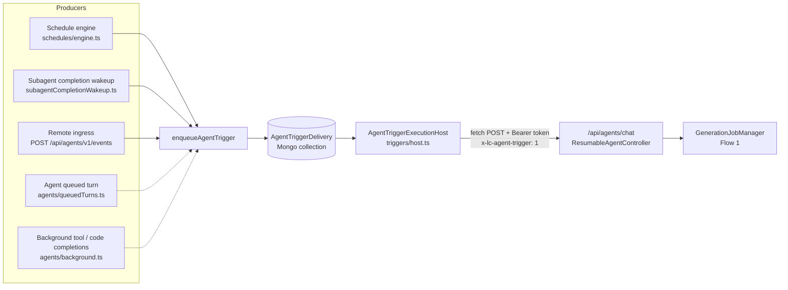
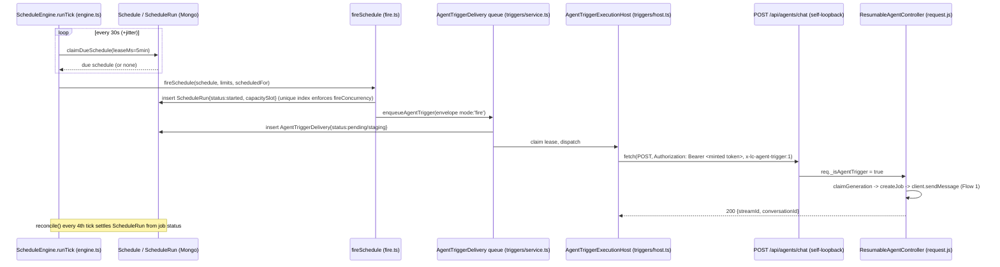
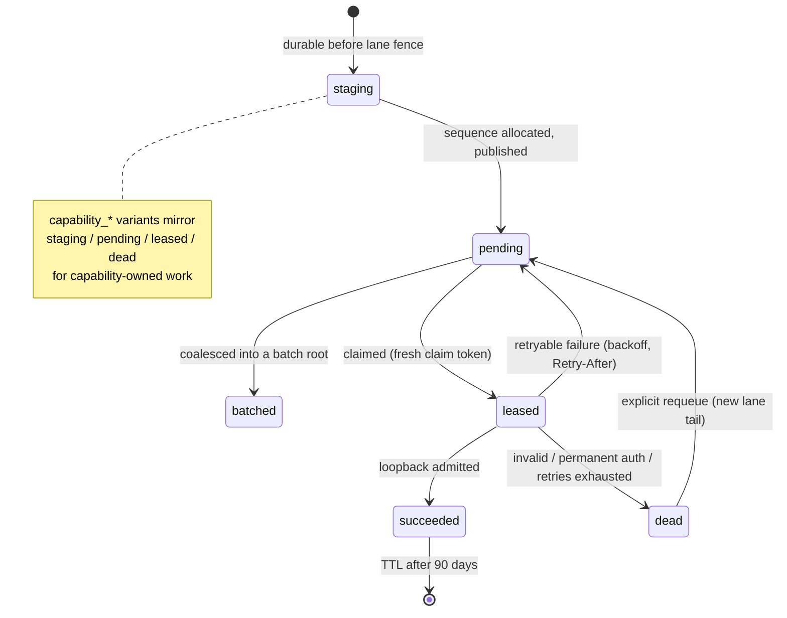
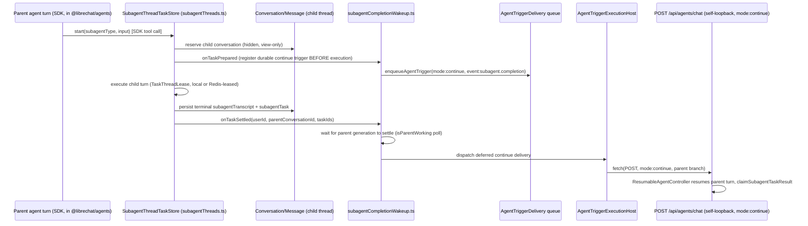
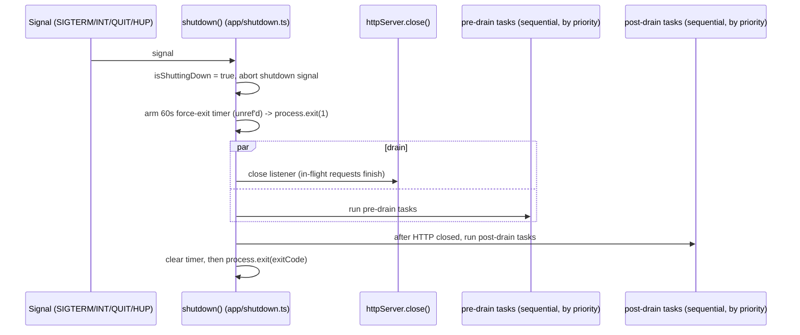

# 09 — Background & Asynchronous Processing

> **Scope.** Everything in Eleven-Chat that runs outside the request/response cycle of a human
> chat message: scheduled agent runs, the durable Agent Trigger Delivery queue underneath them,
> subagents, MCP server lifecycles, and the parts of the resumable SSE job system that
> [CRITICAL_FLOWS.md Flow 1](../../CRITICAL_FLOWS.md#flow-1-message-lifecycle-most-important)
> does not cover (idempotency keys, timeouts, cross-replica behaviour, graceful shutdown).
>
> **Prerequisites.** Read [Flow 1](../../CRITICAL_FLOWS.md#flow-1-message-lifecycle-most-important)
> first. It is the authoritative description of the core job lifecycle
> (`claimGeneration` -> `createJob` -> `subscribe`/`emitChunk` -> `completeJob`/`abortJob`). This
> chapter cites it and does not re-derive it. Vocabulary such as *Scheduled run admission*,
> *Agent queued turn* and *Subagent completion wakeup* comes from [CONTEXT.md](../../CONTEXT.md);
> see also [14-glossary.md](./14-glossary.md).
>
> **Related chapters:** [00-overview](./00-overview.md) ·
> [01-architecture](./01-architecture.md) (process lifecycle and shutdown framing) ·
> [02-backend](./02-backend.md) · [04-redis](./04-redis.md) ·
> [06-business-logic](./06-business-logic.md) ·
> [13-architecture-decisions-and-limitations](./13-architecture-decisions-and-limitations.md) ·
> [MCP Apps reference](../mcp-apps.md)

### Evidence labels used in this chapter

| Label | Meaning |
|---|---|
| **Verified** | Read in the source at the cited `file:line`. |
| **Inferred** | Follows from verified code or comments, but the exact branch was not traced end to end. |
| **Unknown / partially verified** | The code exists, but its internals were not traced. The chapter says so and does not fill the gap. |

Line numbers refer to the tree at the time of writing. If a citation drifts, search for the
named symbol.

---

## The short version

Eleven-Chat has **no queue broker and no separate worker process**. Background work is driven by
**`setTimeout` polling loops inside every API process**. Coordination happens through **MongoDB
leases, compare-and-swap writes and unique partial indexes**, with Redis as an optional
cross-replica accelerator. Each piece of asynchronous agent work ends in **an HTTP POST from the
server to itself**, to the same `/api/agents/chat` route a human uses, so it gets the same
authentication, job manager and persistence as Flow 1.



Solid arrows are **Verified** call paths. Dotted arrows are **Inferred**: the README names these
producers, but their enqueue call sites were not traced line by line for this chapter.

| Mechanism | Driver | Durable state | Cross-replica coordination | Section |
|---|---|---|---|---|
| Scheduled agent runs | `setTimeout` tick, 30 s + jitter | `Schedule`, `ScheduleRun` | Mongo lease + unique partial indexes | [§1](#1-scheduled--cron-agent-triggers) |
| Agent Trigger Delivery | Idle-recovery polling + local wake-ups | `AgentTriggerDelivery` | Mongo lease, fresh claim token per claim | [§2](#2-the-shared-agent-trigger-delivery-system) |
| Subagents | SDK tool call; detached execution | Conversation/Message (+ hidden fields) | Optional Redis owner routing | [§3](#3-subagents) |
| MCP servers | Process-wide singletons | MCP server config DB + cache | Shared cache namespaces | [§4](#4-mcp-servers--apps) |
| Resumable SSE jobs | HTTP request (Flow 1) | Job store (memory or Redis) | `GenerationJobManager.isRedis` | [§5](#5-the-resumable-sse-job-system-beyond-flow-1) |

---

## 1. Scheduled / cron agent triggers

**Status: Verified, extensively.**

A user can schedule an agent to run on a cadence, for example "every weekday at 9:00, summarise
my inbox." Each occurrence becomes an ordinary agent chat generation.

### 1.1 What drives it: a custom polling engine, not a cron library

- The **only** cron library is **`croner`** (`packages/api/package.json:184`,
  `packages/data-provider/package.json:47`). It computes "when is the next occurrence" and never
  drives execution. `computeNextRunAt()` builds a `Cron` instance just to get the next `Date`
  (`packages/api/src/schedules/cadence.ts:1,54`). **Verified.**
- `cadence.ts` also handles DST explicitly (pinned by `cadence.spec.ts`) and adds a deterministic
  per-schedule jitter (`scheduleJitterMs`, `cadence.ts:29-41`). Many users choose "9:00", so
  this jitter spreads their fires over a 120 s window. **Verified** (via E6).
- The scheduler is `startScheduleEngine` (`packages/api/src/schedules/engine.ts:44-704`). It runs
  **one `setTimeout` loop per process**. **Verified:**

| Constant | Value | Where | Purpose |
|---|---|---|---|
| `TICK_MS` | 30 000 ms | `engine.ts:10` | Base tick interval |
| `TICK_JITTER_MS` | 0–2 000 ms random | `engine.ts:11,636` | Stops replicas from ticking in lock-step |
| `LEASE_MS` | 5 min | `engine.ts:12` | Claim lease on a due `Schedule` row |
| `RECONCILE_MIN_RUN_AGE_MS` | 2 min | `engine.ts:13` | Minimum run age before reconciliation looks at it |
| `ORPHAN_RUN_AGE_MS` | 30 min | `engine.ts:14` | A `started` run with no job is declared `interrupted` |
| `ABANDONED_PAUSE_AGE_MS` | 25 h | `engine.ts:15` | Abandoned human-approval (`requires_action`) pause |
| `RECONCILE_BATCH` | 100 | `engine.ts:16` | Reconciliation page size |
| `MISFIRE_GRACE_MS` | 15 min | `engine.ts:19` | Older due occurrences are skipped forward, not fired |

`tick()` (`engine.ts:642-661`) runs `reconcile()` on every 4th tick (`ticks % 4 === 0`,
`engine.ts:648-650`) and then `runTick()`. One extra `reconcile()` runs at startup
(`engine.ts:664`). The timer is `unref`'d, so it never holds the process open (`engine.ts:637`).

### 1.2 Persistence: `Schedule` and `ScheduleRun`

**`Schedule`** (`packages/data-schemas/src/schema/schedule.ts`) is the recurring definition.
**Verified.**

- Fields: `cadence` (structured `hourly|daily|weekdays|weekly`, or raw `cron`; `schedule.ts:50-86`),
  `agent_id`, `prompt`, `nextRunAt`, lease fencing (`leaseUntil`, `leaseBy`, `claimToken`),
  `configRevision` (bumped when the owner edits, used to fence runs built from stale config), and
  a per-user `slot`.
- Indexes (`schedule.ts:309-335`):
  - `{user, slot}` is unique where `deleting:false` (`:320-323`). This enforces `maxPerUser`
    atomically, so concurrent creates collide instead of overshooting the cap.
  - `{user, clientRequestId}` is unique (`:329-332`), so a retried create cannot commit a second
    schedule. It deliberately ignores `deleting`, so a retry that arrives during erasure still
    collides.
  - A TTL on `erasedAt` expires idempotency tombstones after 24 h (`:310-313`).
  - `{enabled, nextRunAt}` serves the due-claim scan (`:315`).
- **Gotcha (Verified, `schedule.ts:7-17`):** `cadence` is a nested path, not a subdocument. Inside
  a `cadence.hour` validator, `this` is the *whole document*. Reading `this.frequency` therefore
  always returned `undefined`, which once rejected every cron write.

**`ScheduleRun`** (`packages/data-schemas/src/schema/scheduleRun.ts`) holds one row per
occurrence. **Verified.**

- `status` is one of `started | requires_action | success | error | interrupted |
  skipped_overlap | skipped_balance`.
- `deliveryKey` links the run to its `AgentTriggerDelivery` row (§2).
- Indexes:
  - `{scheduleId, scheduledFor}` unique (`scheduleRun.ts:157`): one row per occurrence. This is
    the occurrence idempotency key.
  - `{scheduleId}` unique where `status:'started'` (`:171-174`): at most one active run per
    schedule.
  - `{capacitySlot}` unique where `status:'started'` and the slot exists (`:180-186`): the
    **global `fireConcurrency` cap**, enforced by the database rather than a read-then-compare
    count.
  - TTL on `settledAt`, 90 days (`:5,167`). Live rows never expire because only terminal writes
    stamp `settledAt`. The code comment explains that a `$in` partial filter was avoided because
    Amazon DocumentDB 5.0 cannot build it.

### 1.3 Admission pipeline ("Scheduled run admission")

`runTick()` (`engine.ts:461-630`) implements the glossary's **Scheduled run admission**
([CONTEXT.md](../../CONTEXT.md)). **Verified:**

1. **Global kill switch.** If `deps.isGloballyDisabled()` is true, which happens with
   `SCHEDULES_DISABLED` or `interface.schedules: false` in the base config, the tick claims
   nothing (`engine.ts:468-470`). Reconciliation is never gated, so in-flight runs still settle
   and capacity does not leak.
2. **Claim budget.** Up to `limits.admissionConcurrency` claims per tick (default 20,
   `schedules/types.ts:41`). Each claim is
   `claimDueSchedule({instanceId, leaseMs: LEASE_MS})` under `runAsSystem`, because the scan
   covers all tenants (`engine.ts:486-493`).
3. **Each admission starts as soon as its claim lands.** The tick does not wait for one admission
   before claiming the next, because MCP preflight can legitimately wait its full deadline
   (`engine.ts:497-501`).
4. **Misfire check.** The engine derives the DB-side "now" as `leaseUntil - LEASE_MS`, which is
   the claiming worker's clock at claim time. It skips forward any occurrence overdue by more than
   `MISFIRE_GRACE_MS` (`engine.ts:524-564`), so a restart after downtime does not burst stale chats.
5. **`fireSchedule()`** (`packages/api/src/schedules/fire.ts:126`) re-enters the owner's tenant
   context. It then rehydrates the owner, re-resolves the owner's limits, checks agent and project
   access, and runs MCP readiness. It reserves a generation slot **only after that**, through
   `withGlobalCapacitySlot` (`types.ts:275-283`): it inserts `ScheduleRun{status:'started',
   capacitySlot}`, and a duplicate-key error means the slot is taken. A slow or failed readiness
   check therefore never occupies generation capacity, as CONTEXT.md requires.
6. **Enqueue.** `deps.enqueueTrigger(envelope, {orderingKey})` (`fire.ts:108`) hands a `fire`-mode
   envelope to the Agent Trigger Delivery system (§2). Every path through `fireSchedule` advances
   `nextRunAt`, so a schedule can never wedge (`fire.ts:120-124` doc comment).

Default limits (`DEFAULT_SCHEDULE_LIMITS`, `types.ts:36-46`, **Verified**):

| Limit | Default |
|---|---|
| `maxPerUser` | 10 |
| `minIntervalMinutes` | 60 |
| `autoDisableAfterFailures` | 5 |
| `admissionConcurrency` | 20 |
| `fireConcurrency` | 5 |
| `mcpPreflightConcurrency` | 3 |
| `mcpPreflightTimeoutMs` | 5 min |

### 1.4 Dispatch: a real HTTP self-loopback

**Verified.** A scheduled run is **not** an in-process function call into the agent runtime.

1. The trigger execution host resolves a base URL. That is `AGENT_TRIGGERS_SELF_URL` if set,
   otherwise the server's own bound listener address
   (`packages/api/src/agents/triggers/service.ts:369-379`). Detached and capability-owned
   completions always use the local bound origin (`localOnly: true`, `host.ts:631-637`).
2. It mints a short-lived trigger token (`generateAgentTriggerToken`, `service.ts:381-383`).
3. It calls `fetch(fireUrl(baseUrl), {method:'POST', headers:{Authorization: 'Bearer <token>',
   'x-lc-agent-trigger': '1', 'x-request-id': <idempotencyKey>, ...}})`
   (`packages/api/src/agents/triggers/host.ts:651-660`; the continue path repeats this at `:981-990`).
4. The POST lands on the normal agents router. Middleware sets
   `req._isAgentTrigger = isAgentTriggerRequest(req)` (`api/server/routes/agents/index.js:156-158`).
   The predicate requires both the `x-lc-agent-trigger: 1` marker and a valid signed trigger scope
   (`packages/api/src/crypto/jwt.ts:31-36`).
5. `ResumableAgentController` branches on `req._isAgentTrigger` and on
   `isTriggerContinuation` (`api/server/controllers/agents/request.js:983-1107`). From there it is
   exactly Flow 1: `claimGeneration` -> `createJob` -> `client.sendMessage`.

**Why a loopback?** (**Inferred** from the README adapter contract,
`triggers/README.md:1-5`.) Every source of asynchronous work then shares one admission path,
covering authentication, ACLs, balance, the job store and persistence. No second "headless"
execution path can drift from the human one.

### 1.5 Sequence diagram: scheduled run -> chat generation



**Walkthrough.**

1. Every ~30 s, each API process tries to lease due `Schedule` rows. The lease is a Mongo
   compare-and-swap, so two replicas cannot both claim the same occurrence.
2. For a claimed occurrence, `fireSchedule` reserves a global capacity slot by inserting a
   `ScheduleRun`. If every slot in `[0, fireConcurrency)` is taken, the unique index rejects the
   insert.
3. The run is not executed here. A durable `fire` envelope goes into the shared delivery queue.
4. The delivery host leases that row and POSTs to the server's own `/api/agents/chat` with a
   minted bearer token and the trigger header.
5. The controller treats the request like a human chat turn and creates a Flow 1 job. The `200`
   only confirms the job exists; it says nothing about whether the generation succeeds (see
   Flow 1's Gotchas).
6. The schedule engine does not wait for the generation. It learns the outcome later, when
   `reconcile()` reads the job status and settles the `ScheduleRun`.

### 1.6 Reconciliation

`reconcile()` (`engine.ts:57-453`, **Verified**) moves `ScheduleRun` rows out of `started` and
`requires_action` by reading their generation job.

- **Per-row isolation.** Each row has its own try/catch, so one bad row cannot starve the batch.
- **Identity-fenced job lookup.** `jobIdentityMatches` (`engine.ts:28-34`) checks that the job
  currently at the run's `conversationId` is *this occurrence's* job. A later human turn in the
  same conversation is never mistaken for the scheduled generation.
- **Live job** (`running`): leave it alone. **Crashed job** (`aborted`, `error`, or gone): settle
  the run as `interrupted` or `error`. Once no job exists, a `started` run is declared orphaned
  after `ORPHAN_RUN_AGE_MS` = 30 min (`engine.ts:297`). An approval pause is declared abandoned
  after `ABANDONED_PAUSE_AGE_MS` = 25 h (`engine.ts:305`).
- Reconciliation reads job state from `GenerationJobManager`. It is only correct if this process
  can see every replica's jobs, which is why §1.7 exists.

### 1.7 Multi-replica safety gate

`isTopologySafeToArm()` (`packages/api/src/schedules/service.ts:98-100`, **Verified**):

```ts
function isTopologySafeToArm(): boolean {
  return GenerationJobManager.isRedis || isEnabled(process.env.SCHEDULES_SINGLE_PROCESS);
}
```

The standard entrypoint starts the engine in **every** replica. With the in-memory job store,
replica A cannot see replica B's job. A's `reconcile()` would then treat B's healthy generation
as missing and mark it `interrupted`. So the engine **refuses to arm** (`service.ts:1034-1042`)
unless one of these holds:

- the job store is Redis-backed (`USE_REDIS_STREAMS`, see §5.3), or
- the operator sets `SCHEDULES_SINGLE_PROCESS=true` to assert there is exactly one replica.

The same predicate also sets `canInferOwnerDeathFromMissingJob` (`service.ts:1010`).

### 1.8 Configuration

- `interface.schedules` in `librechat.yaml` is resolved by `createScheduleLimitsResolver`
  (`service.ts:493-572`). The feature is **off by default**. `schedules` is deliberately absent
  from the `interface` default object, because Zod would otherwise silently enable billable
  scheduled runs on every deployment that omits `interface`
  (`packages/data-provider/src/config.ts:2973-2977`). **Verified.**
- `SCHEDULES_DISABLED` is a global env kill switch. It wins over any per-principal override
  (`service.ts:529,958`). **Verified.**
- `SCHEDULES_SINGLE_PROCESS`: see §1.7.

### 1.9 Shutdown

The engine registers a **`pre-drain`** shutdown task (`engine.ts:686-700`, **Verified**). The
task stops the timer **and awaits any in-flight tick pass**. Without the await, a tick that had
already claimed an occurrence could lose its loopback POST against a closing listener. That
failure would count against a healthy schedule and walk it toward auto-disable. Occurrences
skipped by stopping early are still due at restart, within the misfire grace. A separate
`schedule erasure sweep` pre-drain task stops the deletion sweeper
(`packages/api/src/schedules/erasure.ts:484`).

### 1.10 Monitoring and debugging

- Logs use the `[schedules]` prefix (`logger.info('[schedules] engine started')`,
  `engine.ts:702`). A failed tick logs `[schedules] tick failed:` (`engine.ts:654`).
- If the engine never starts, check `isTopologySafeToArm()`. The refusal message names
  `SCHEDULES_SINGLE_PROCESS`.
- To see per-occurrence outcomes, query `ScheduleRun` by `scheduleId`, sorted by `firedAt` (an
  index exists, `scheduleRun.ts:187`). `skipped_overlap` and `skipped_balance` explain
  non-fires.
- To trace a run into the delivery queue, follow `ScheduleRun.deliveryKey` to the
  `AgentTriggerDelivery` row (§2.7).
- Test suites worth reading: `engine.spec.ts`, `fire.spec.ts`, and `barriers.integration.spec.ts`
  (real-Mongo barriers) under `packages/api/src/schedules/`.

---

## 2. The shared Agent Trigger Delivery system

**Status: Verified (storage, guarantees, transport). Capability claim arbitration: Unknown / partially verified.**

### 2.1 What it is

`packages/api/src/agents/triggers/README.md:1-5` describes it as *"the trusted, source-neutral
boundary for asynchronous agent work. A schedule, webhook, queue consumer, MCP integration, or
internal event adapter produces the same versioned envelope and calls `enqueueAgentTrigger`; the
adapter does not invoke an agent runtime directly."*

This module is the general-purpose durable queue underneath schedules (§1), subagent completion
wakeups (§3), remote events, and background-task completions. It is also the concrete
implementation behind several [CONTEXT.md](../../CONTEXT.md) terms: **Agent trigger capability
shield**, **Agent event actor mailbox**, **Event actor receipt**, **Subagent completion wakeup**,
and the wakeup half of **Agent queued turn**.

### 2.2 Producers and consumers

| Role | Who | Evidence |
|---|---|---|
| Producer | Schedule engine (`fire` mode) | `schedules/fire.ts:108` — **Verified** |
| Producer | Subagent completion wakeup (`continue` mode) | `subagentCompletionWakeup.ts` — **Verified** |
| Producer | Remote ingress `POST /api/agents/v1/events` (`fire`, `continue`, `steer`) | `triggers/README.md:117-152`, `triggers/ingress.ts` — **Verified** (README) |
| Producer | Background tool/code completion receipts (`background_tool_completion_batch_v3`) | `triggers/README.md` §"Background receipt batches" — **Verified** (README) |
| Producer | Agent queued turn (replayable wakeup only) | CONTEXT.md; `agents/queuedTurns.ts` — **Unknown / partially verified** |
| Consumer | `AgentTriggerExecutionHost` in every replica -> HTTP self-loopback | `triggers/host.ts:651-660` — **Verified** |

### 2.3 Message structure: the envelope

Built with `createAgentTriggerEnvelope` (`triggers/envelope.ts`). Shape, from the README example
(`README.md:23-47`, **Verified**):

```js
createAgentTriggerEnvelope({
  mode: 'fire',                 // 'fire' | 'continue' | 'steer'
  requestId, deliveryId,        // deliveryId stays stable across retries to one target
  receivedAt: Date.now(),
  principal: { id: userId, role, tenantId },
  event: {
    id: eventId,                // stable per source event
    type: 'resource.ready',
    occurredAt,
    source: { id: webhookId, type: 'webhook' },
    payload: sanitizedPayload,  // credentials MUST be stripped by the adapter
  },
  target: { agentId },
  input,
});
// enqueueAgentTrigger(envelope, { orderingKey: resourceId })
```

Adapter rules (`README.md:7-20`):

- `continue` requires a persisted `conversationId` and an exact `parentMessageId`.
- External sources never pick a child conversation, parent message or agent. They address an
  opaque binding id instead.
- Without an `orderingKey` override, ordering is scoped to (user, source, mode, agent,
  conversation).

Limits (`triggers/delivery.ts:5-8`, **Verified**):

| Constant | Value |
|---|---|
| `MAX_AGENT_TRIGGER_ENVELOPE_BYTES` | 1 MiB |
| `AGENT_TRIGGER_COALESCE_WINDOW_MS` | 750 ms |
| `MAX_AGENT_TRIGGER_BATCH_SIZE` | 8 |
| `MAX_AGENT_TRIGGER_BATCH_BYTES` | 512 KiB |

### 2.4 Storage shape: `AgentTriggerDelivery`

One Mongo collection, `packages/data-schemas/src/schema/triggerDelivery.ts`. **Verified.**

Key fields:

- `deliveryKey` is unique (`:245`) and is the idempotency identity.
- `orderingKey` and `laneSequence` form the ordering lane. `laneSequence` 0 is reserved for a
  staging row that is visible before a sequence is allocated (`:120-122`).
- `envelope` (Mixed), `user`, and `tenantId`.
- `status`, with this enum (`:126-142`):

  `staging · capability_staging · batched · pending · capability_pending · leased · capability_leased · succeeded · capability_dead · dead`

- Private capability fields (`:143-148`): `requiredWorkerCapability`, `capabilityStatus`
  (`publishing|pending|leased|dead`), `claimAvailableAt`, `capabilityLeaseBy`,
  `capabilityLeaseUntil`, `capabilityClaimToken`.
- `producerLeaseUntil` has `select: false` (`:150`). It is a private process-owner heartbeat and
  is never projected to legacy consumers.
- `expiresAt` has a TTL index (`:296`) for the 90-day retention of successful records.
- Notable indexes: `{orderingKey, status, laneSequence}` (`:261`) for lanes,
  `{status, availableAt, createdAt}` and `{status, leaseUntil, createdAt}` (`:246-247`) for the
  claim and lease-expiry scans, and sparse indexes for cleanup markers such as
  `stagingRecoveryAt`, `laneCleanupPendingAt` and `backgroundToolResultDeletionPendingAt`
  (`:291-293`).

**How this matches "Agent trigger capability shield"** ([CONTEXT.md](../../CONTEXT.md)). The
glossary describes an old-publishable `staging` shell, a queued shell that old workers can see
but not claim, a private lease only during execution, and a legacy-terminal `capability_dead`
shell. The `capability_*` status values and the private `capability*` fields are exactly that
shape. The `status` field is what a pre-capability replica understands. The private fields carry
current claim, retry and dead-letter truth for capability-aware workers. **Verified at the
storage seam.**

> **Unknown / partially verified:** we did not trace which workers advertise which
> `requiredWorkerCapability`, or the claim-arbitration code that keeps an old worker from
> claiming a `capability_*` row. The README says old replicas "cannot claim, recover, requeue, or
> interpret the new work" (`README.md` §"Event-driven child actors"). This chapter does not
> describe the mechanism further. The Redis-side "versioned fail-closed terminal status and
> recovery index" from the glossary was not traced either; see [04-redis](./04-redis.md).

### 2.5 State transitions

From the status enum and the README (**Inferred** as a lifecycle; each state is Verified to exist):



For a bound `continue` delivery, `succeeded` means **generation admission succeeded, not that
the work finished**. A separate `handling` lifecycle records the outcome: `started`, then exactly
one of `applied | completed_no_action | failed | cancelled` (`README.md:154-160`). This is the
glossary's **Agent event handling outcome**.

### 2.6 Delivery guarantees, retry and idempotency

From `README.md:49-74`, cross-checked against the schema. **Verified** unless marked.

- **Durability.** Mongo owns queue state, leases, retry history and dead letters across restarts
  and replicas.
- **Claim fencing.** Every claim gets a fresh token, including a reclaim by the same process.
- **At-least-once delivery.** `fire`, `continue` and `steer` admission reuse the envelope's stable
  idempotency identity, which becomes `x-request-id` on the loopback (`host.ts:660`). An
  ambiguous retry therefore attaches to the already-admitted generation through Flow 1's
  `claimGeneration` instead of starting a duplicate. (The final join point is **Inferred**.)
- **Retry.** Bounded exponential backoff that honours `Retry-After`. "Waiting" deliveries (parent
  still busy, result not durable yet) recheck after one tenth of their waiting age, clamped to
  between `WAITING_RETRY_FLOOR_MS` = 5 s and `WAITING_RETRY_CAP_MS` = 60 s
  (`triggers/backoff.ts:3-25`).
- **Dead letters.** Invalid envelopes, permanent authorization failures and exhausted retries
  become `dead`. Dead letters are terminal, do not block later work in the lane, and persist until
  requeued or removed. `getAgentTriggerDeadLetters` and `requeueAgentTriggerDelivery` are trusted
  in-process operations only (`service.ts:163-164`). The README warns that exposing them over an
  admin API needs a separate authorization and audit layer.
- **Ordering lanes.** Publication into a lane is serialized behind a Mongo-fenced publisher. A
  staging row is durable before the fence is taken, and any replica can finish an abandoned
  publication. A later delivery therefore cannot overtake an invisible gap.
- **Retention.** Successful records expire after 90 days. A bound actor's active mailbox record
  does not start its TTL until terminal handling is recorded.
- **Account deletion** fences admission, drains active leases, and purges payloads only after the
  user deletion commits (`README.md:64-72`). An abandoned deletion fence is recovered with
  `config/delete-user.js`.

### 2.7 Idle-recovery polling (the "how fast does background work wake up" knob)

Each replica scans Mongo even when it has no local work. A crashed producer or a missed
cross-replica wake-up therefore cannot strand a durable row. **Verified**
(`README.md:76-116`):

- Queued-turn and maintenance scans start at 30 s and **double** after each confirmed-empty
  discovery, up to their cap.
- Delivery claims keep a **separate, shorter cap** (default 15 s) plus immediate wake-ups on local
  enqueue and requeue.
- Local events (a failed publication, unfinished finalization, a purge marker) wake maintenance
  without waiting for the timer. Notifications coalesce behind one active scan.

Configured under `endpoints.agents.eventDriven.idlePolling` (schema at
`packages/data-provider/src/config.ts:1815-1820`):

| Setting | Default | Range |
|---|---:|---:|
| `queuedTurnMaxIntervalMs` | 120 000 | 30 000–300 000 |
| `maintenanceMaxIntervalMs` | 120 000 | 30 000–300 000 |
| `deliveryMaxIntervalMs` | 15 000 | 1 000–300 000 |
| `completionWaitMaxIntervalMs` | 60 000 | 5 000–300 000 |

The cap limits **idle sleep**, not end-to-end recovery time. Scan duration, pagination and
active leases add to it.

### 2.8 Remote ingress API

`POST /api/agents/v1/events` (`README.md:117-160`, **Verified** from the README):

- Auth is a Remote Agents API key, plus the remote-agents permission and the target agent's
  remote-view ACL. Send exactly one `Idempotency-Key` header and keep it stable across retries.
- Returns `202 Accepted`, an opaque delivery `id`, and a `Location` to poll. The status is
  `pending | leased | succeeded | dead`, plus the `handling` lifecycle for bound continuations.
  Status responses never expose the payload, ordering key, retry history or worker identity.
- `POST /api/agents/v1/events/bindings` registers an event-driven child actor once. Later
  `continue` events address the binding id. Each binding is its own ordering lane, which is the
  **Agent event actor mailbox**.
- Bound `continue` events may opt into **coalescing** with `coalesce.key`. Compatible events are
  collected for up to 750 ms, at most 8 events or 512 KiB, into one
  `librechat.agent_event_batch` turn. `fire`, `steer`, unbound `continue`, and deliveries that
  declare `expectedAction` reject coalescing.

### 2.9 Shutdown

The delivery engine registers `'agent trigger delivery engine'` as a **pre-drain, priority 100**
task (`triggers/service.ts:625-628`). It stops the engine and waits for an in-flight purge
recovery (`service.ts:620-621`). **Verified.**

### 2.10 Monitoring and debugging

- Find a row by `deliveryKey`, or by `{user, status}` (indexed, `triggerDelivery.ts:277`). A
  `dead` row's retry history explains why it failed.
- `/metrics` is mounted at `api/server/index.js:456`. `createMetrics` is given an Event Actor
  storage-metrics collector (receipt metrics, pending reconciliations, oldest pending age;
  `index.js:174-185`). **Verified wiring.** The metric names themselves were not catalogued.
- Integration coverage: `triggerDelivery.spec.ts`, which the README says includes real-Mongo
  collecting barriers, crash and lost-reply injection, and rolling-upgrade isolation, plus
  `triggers/delivery.integration.spec.ts`.
- For a rolling upgrade from a release without receipt batching, read the "Rolling upgrades"
  section of the README before deploying.

---

## 3. Subagents

**Status: Verified end to end in this repo. The subagent *tool* itself lives in the external SDK.**

> **Boundary caveat (Verified).** The tool the model calls to delegate to a subagent, and the
> LangGraph-style execution, live in the external `@librechat/agents` package, not in this repo.
> See Flow 1 step 5 in [CRITICAL_FLOWS.md](../../CRITICAL_FLOWS.md#flow-1-message-lifecycle-most-important).
> This repo supplies a durable implementation of the SDK's pluggable task-store interface, and
> nearly all fork-specific logic lives there.

### 3.1 Components

| Component | Location | Role |
|---|---|---|
| `SubagentThreadTaskStore extends InMemorySubagentTaskStore` | `packages/api/src/agents/subagentThreads.ts:631` | Durable task store handed to the SDK |
| `TaskThreadLease` | `subagentThreads.ts:206-234` | Per-process record of one running child (the **Live subagent task owner**) |
| `SubagentActivityStream` | `subagentThreads.ts:684` | Bounded live progress feed |
| Completion wakeup | `packages/api/src/agents/subagentCompletionWakeup.ts` | Durable `continue` trigger that resumes the parent |
| Wiring (CJS) | `api/server/services/Endpoints/agents/subagentThreadStore.js:55-163` | Injects Mongo methods, registers shutdown, optional Redis routing |

### 3.2 Persistence: the subagent thread

A **Subagent thread** ([CONTEXT.md](../../CONTEXT.md)) is an ordinary LibreChat conversation and
message tree that is reserved for the child and hidden from human chat lists. It is view-only.
**Verified.**

- The child transcript is stored on the `IMessage` document in a dedicated `subagentTranscript`
  field. It supports append and replace modes and is capped at `MAX_TRANSCRIPT_BYTES` = 12 MiB
  (`subagentThreads.ts:104`).
- Task state lives in `subagentTask` and `subagentActivityProjection`. These fields are only
  loaded with an explicit select, for example `+subagentTranscript +subagentTask`
  (`subagentThreads.ts:106-108`).
- Mongo persists the logical thread and a **continuation fence**. It does **not** persist the
  executor, which matches the glossary's **Live subagent task owner** entry.

### 3.3 Dispatch and execution

**Verified** from `subagentThreadStore.js:55-85`:

- `createSubagentThreadTaskStore()` runs once at startup. Mongo methods are injected rather than
  imported, consistent with AGENTS.md's dependency rule: `reserveSubagentThread`,
  `acquireSubagentThreadLease`, `renewSubagentThreadLease`, `releaseSubagentThreadLease`,
  `claimSubagentTaskResult`, `recordSubagentTaskControlReceipt`, `saveConvo`, `saveMessage`, and
  others.
- Owner-admission hooks are `isOwnerActive`, `fenceOwnerAdmission`, `renewOwnerAdmission` and
  `releaseOwnerAdmission`. These hooks are what let account deletion fence new child admissions.
- Lifecycle hooks:
  - `onTaskPrepared: completionWakeupHandler` registers the durable wakeup (§3.4).
  - `onTaskSettled: (userId, conversationId, taskIds) => expediteCompletionWakeups(...)`.

Execution of one child:

- `TaskThreadLease` holds the abort controller and execution promise, a bounded queue of control
  invocations, and optionally a shared Redis-backed lease. When present, that lease is renewed
  every `DEFAULT_LEASE_HEARTBEAT_MS` = 10 s against `DEFAULT_LEASE_TTL_MS` = 30 s
  (`subagentThreads.ts:66-67`).
- **Cross-replica routing is optional.** `configureSubagentTaskRouting()`
  (`subagentThreadStore.js:110-160`) wires a `RedisSubagentTaskControlTransport` and a
  `RedisEventTransport` only when `cacheConfig.USE_REDIS` is set (`:112`). **Without Redis, a
  subagent can only be steered, cancelled or observed from the process that started it.** Even
  with Redis, the executor never migrates; Redis only routes envelopes to the owning process.

### 3.4 Completion wakeup: the register-before-execute durability property

This implements the glossary's **Subagent completion wakeup**. **Verified.**

- The wakeup is an Agent Trigger envelope (§2) with `mode: 'continue'`,
  `event.source = {type:'internal', id:'subagent-completion'}`, `event.type =
  'subagent.completion'`, and payload `{taskId, threadId, subagentType}`, each a non-empty string
  of at most 256 characters (`subagentCompletionWakeup.ts:22-23,92-119`). The payload carries task
  metadata, **never child output**.
- **It is enqueued in `onTaskPrepared`, before the child starts executing.** If the process
  crashes mid-child, the durable delivery row still exists. Recovery can then find the child's
  terminal state, or its absence, and resume the parent. This is the central durability property.
- **Deferred until the parent settles.** `isParentWorking(job)` is true while the parent job is
  `running` or `requires_action`. `isParentActive(job)` additionally covers
  `metadata.terminalPersistencePending` (`subagentCompletionWakeup.ts:140-152`). The delivery
  rechecks through the waiting backoff (§2.6), capped by `completionWaitMaxIntervalMs`. It is
  expedited when the child's result becomes durable (`onTaskSettled`) or when the parent
  generation settles.
- Timing constants (`subagentCompletionWakeup.ts:19,21`): `WAKEUP_ADMISSION_DELAY_MS` = 250 ms,
  and `CHILD_READY_WAIT_MS` = 35 min. The code comment explains the 35 min: SDK tasks time out
  after 30 min, plus a grace period for terminal persistence.
- **Dispatch** goes through the same HTTP self-loopback as a schedule (§1.4), against the local
  bound listener. On the receiving side, `ResumableAgentController` sees `req._isAgentTrigger` and
  `isTriggerContinuation` (`request.js:988-1107`), resolves the parent's exact response branch,
  and starts a new parent turn. That turn collects the child's result through
  `claimSubagentTaskResult`.

### 3.5 Sequence diagram: subagent dispatch -> completion wakeup -> parent resume



**Walkthrough.**

1. Inside a parent generation, the model calls the SDK's subagent tool. The SDK asks the task
   store to start a child.
2. The store reserves a hidden child conversation in Mongo.
3. Before running the child, the store registers a durable `continue` delivery that will later
   wake the parent. Registering first means a crash cannot lose the wakeup.
4. The child runs in this process under a `TaskThreadLease`. With Redis configured, other
   replicas can route control commands and activity to it.
5. When the child finishes, its transcript and task state are persisted. `onTaskSettled` then
   expedites the pending wakeup.
6. The wakeup does not fire while the parent generation is still running or paused. It polls with
   backoff until the parent settles.
7. The delivery host POSTs a `continue` request to `/api/agents/chat`. The controller starts a
   new parent turn on the exact branch, and that turn claims the child's result from the task
   store.

### 3.6 Subagent activity stream

`SubagentActivityStream` (`subagentThreads.ts:684`) implements the glossary's **Subagent
activity stream**. **Verified.**

- Transport is `InMemoryEventTransport`, or `RedisEventTransport` when Redis routing is
  configured.
- It is per-task, bounded by `SUBAGENT_ACTIVITY_LIMITS` bytes and items
  (`subagentThreads.ts:51,87,1337`).
- The publisher retries with backoff (`retryActivity`, `subagentThreads.ts:1375-1400`).
- **Observational only.** It never controls or settles execution, and it never carries hidden
  reasoning. If live events are missed, the UI falls back to polling the durable child thread.

### 3.7 Control commands

`steer | queue | interrupt | cancel` go through a **durable receipt ledger**:
`ISubagentTaskControlReceipt`, persisted with `recordSubagentTaskControlReceipt`. A retried
control invocation replays its exact earlier outcome instead of applying twice
(`replayDurableControl`, `subagentThreads.ts:910-1005`; boundary variant at `:1936`).
**Verified.**

### 3.8 Shutdown

Two registered tasks (`subagentThreadStore.js:87-107`, **Verified**):

1. `'subagent activity streams prepare'`, **pre-drain, priority 100**: runs
   `prepareActivityForShutdown()` (`subagentThreads.ts:1249`).
2. `'subagent task store'`, **post-drain, priority 90**: runs `destroyTaskControlTransport()`
   (`subagentThreads.ts:1140-1221`). It synchronously cancels every locally owned running child
   and waits up to `ownerDrainTimeoutMs` for them to settle (45 s default per E6). It then flushes
   durable control receipts with up to `SHUTDOWN_CONTROL_RECEIPT_FLUSH_ATTEMPTS` = 4 attempts
   (`subagentThreads.ts:84`), and finally tears down the Redis transport. The comment at
   `subagentThreadStore.js:96-98` notes this runs even without Redis.

Because the wakeup was registered before execution, a child cancelled at shutdown still has a
durable path back to its parent. Whether that path delivers an "interrupted" result or retries is
decided by the wakeup's readiness logic, which was not traced to that level of detail
(**Inferred**).

### 3.9 Monitoring and debugging

- Logs use the `[subagentThreads]` prefix (the most common prefix in that file), plus
  `[EventChildLease]` for event-bound child leases.
- To inspect a child, load its message with `+subagentTask +subagentTranscript`.
- A "wakeup never fired" symptom usually means the parent job never left `running` or
  `requires_action`. Check the parent's job status first, then the `AgentTriggerDelivery` row
  whose `event.source.id` is `subagent-completion`.

---

## 4. MCP servers & Apps

**Status: Verified (singleton structure, discovery, OAuth file layout). Authority-proof integration: Unknown.**

MCP Apps (interactive `ui://` resources rendered in a sandboxed iframe) are documented in full in
**[docs/mcp-apps.md](../mcp-apps.md)** and are not repeated here. In summary, they use the
official `@modelcontextprotocol/ext-apps` SDK in a cross-origin sandbox proxy, gated by
`mcpSettings.apps`. `maxActiveViews` defaults to 3, operations are bounded to 16 concurrent
slots per process, and every App-initiated tool call or chat message goes through a host-owned
confirmation dialog.

### 4.1 Structure: process-wide singletons

- `MCPManager` has `private static instance` and `static getInstance()`
  (`packages/api/src/mcp/MCPManager.ts:140,204`). **Verified.**
- `MCPServersRegistry.getInstance()` is called from inside `MCPManager` at six or more sites (e.g.
  `MCPManager.ts:462,561,732,790,891,1602`, per E6).
- AGENTS.md names these static singletons as **"the shape to stop extending, not a pattern to
  copy."** New MCP-adjacent code should take its dependencies as arguments. See
  [13-architecture-decisions-and-limitations](./13-architecture-decisions-and-limitations.md).

### 4.2 Server config registry and tool discovery

- `packages/api/src/mcp/registry/MCPServersRegistry.ts` keeps a read-through cache of decrypted
  server configs (`ServerConfigsCacheFactory`, with separate config and app namespaces). If live
  inspection fails, a stub is cached and retried after `CONFIG_STUB_RETRY_MS` = 5 min
  (`MCPServersRegistry.ts:30`). Live discovery goes through `MCPServerInspector`, and persistence
  through `ServerConfigsDB`. **Verified.**
- `packages/api/src/mcp/tools.ts:27` (`createMCPStructuredTool`) wraps each discovered MCP `Tool`
  in a LangChain `DynamicStructuredTool`, normalizing its JSON Schema
  (`normalizeJsonSchema`, `resolveJsonSchemaRefs`). **Verified.**
- `getMCPToolCatalogGeneration` (`packages/api/src/mcp/toolsChanged.ts:58`) is a per-catalog
  generation counter. A config change bumps it, which invalidates cached tool lists.
  `initializeMCPs.js:158-161` wires the renewal and revision handlers. **Verified.**

### 4.3 OAuth and credentials

- `packages/api/src/mcp/oauth/` holds `OAuthReconnectionManager.ts`, `handler.ts`, `tokens.ts`,
  `obo.ts` (on-behalf-of token exchange), `resourceHint.ts`, `detectOAuth.ts`, `pending.ts`, and
  `hardenedFetch.ts` (SSRF hardening; see also `mcp/__tests__/MCPConnectionSSRF.test.ts`).
  **Verified** (file layout).
- **MCP direct OpenID bearer** ([CONTEXT.md](../../CONTEXT.md)): `packages/api/src/mcp/openid.ts:10-11`
  matches `{{LIBRECHAT_OPENID_ACCESS_TOKEN}}` and `{{LIBRECHAT_OPENID_TOKEN}}` in a server's
  `Authorization` header and replaces them with the user's live OpenID access token, via an
  injected provider. **Verified.**
- **MCP OAuth prompt projection**: `projectPendingMCPOAuthPrompts(replayEvents, runSteps)`
  (`packages/api/src/mcp/oauth/resume.ts:50`) builds a client-safe view of pending authorization
  prompts from a resumable generation's replay log. This is what a reconnecting SSE client
  (Flow 1) uses to render "authorize this server" state. **Verified.**

### 4.4 Background aspects of MCP

- **Authorization fence retry worker.** A `setInterval` loop (`unref`'d) drains retries in
  batches and registers `'MCP authorization fence retry worker'` as a shutdown task
  (`packages/api/src/mcp/authorizationRetry.ts:228-236`). **Verified** (registration). Its retry
  semantics were not traced.
- **Shutdown.** `'MCP app connections'` (post-drain, default priority) calls
  `mcpManager.disconnectAppServers()` (`api/server/services/initializeMCPs.js:162`). **Verified.**
- **Scheduled runs and MCP.** Schedule admission runs MCP readiness preflight (bounded by
  `mcpPreflightConcurrency` = 3 and `mcpPreflightTimeoutMs` = 5 min) before reserving capacity
  (§1.3). `ScheduleRun` records an unattended-auth failure as
  `detail: 'unattended_auth_required'`, with a remediation `reason` such as
  `authorize | configure | restore_permission | retry_later` (`scheduleRun.ts:75-79`).
  **Verified.**

### 4.5 Authority-proof substrate (not live)

`packages/api/src/mcp/authority/README.md:1-9` states plainly: *"This module is an additive,
default-off substrate. Existing MCP catalog, OAuth, connection, and tool-call paths do not invoke
it yet."* It is meant to fence stale config and credential generations against MCP tool
execution.

> **Unknown:** where and when it will be wired into the live path. This is a point-in-time read,
> and other branches were not checked. Do not rely on it for any current guarantee.

### 4.6 Debugging

- Logs use the `[MCP]` prefix.
- If tools don't appear after a config change, check whether the catalog generation was bumped
  (`toolsChanged.ts`).
- If a server stays "broken" for about 5 minutes after you fix it, that is the
  `CONFIG_STUB_RETRY_MS` stub at work.

---

## 5. The resumable SSE job system beyond Flow 1

**Status: Verified.** Flow 1 covers the per-token lifecycle. This section covers the operational
mechanics around it. The job manager is `packages/api/src/stream/GenerationJobManager.ts`
(about 9 800 lines).

### 5.1 Idempotency keying

`claimGeneration(userId, clientRequestId, streamId, conversationId, generationProtocolVersion?)`
(`GenerationJobManager.ts:3327`) lets **the first caller win**. A retried POST with the same
`clientRequestId` gets the original stream and attaches to it, so no second billed generation
starts (doc comment, `:3320-3325`). **Verified.**

The claim writes **two keys**:

| Key | Builder | Format |
|---|---|---|
| Legacy (pre-bridge) | `legacyGenerationClaimKey`, `:3522-3524` | `{userId:clientRequestId}`, stored as `stream:idem:{userId:clientRequestId}` |
| Primary | `generationClaimKey`, `:3515-3517` | `{streamId}:userId:clientRequestId` |

**Ordering matters.** The **legacy key is claimed first** (`:3342-3346`). The comment explains why:
*"Old replicas know only this key. Claiming it first means a mixed fleet still has exactly one
admission winner; the primary is a mirror/fence, never an independent chance to start a billed
generation."* `synchronizeLegacyGenerationClaim` (`:3530`) keeps the two keys consistent,
including tombstones. The `{...}` braces are Redis Cluster hash tags. The bridge between the two
keys crosses hash slots, which is why the code carries "proven cross-slot bridge step" CAS logic
(`:3526-3529`). See [04-redis](./04-redis.md).

### 5.2 Timeouts and leases

| Constant | Value | Where | Governs |
|---|---|---|---|
| `PROVIDER_DRAIN_TIMEOUT_MS` | 30 000 | `stream/interfaces/IJobStore.ts:93` | How long `abortJob({awaitProviderDrain:true})` waits for the provider segment to prove it can no longer persist user data |
| `TERMINAL_PERSISTENCE_TIMEOUT_MS` | 30 000 | `GenerationJobManager.ts:157` | How long a resuming client waits on a terminal write before falling back to a fresh refetch |
| `SUBSCRIBER_LEASE_TTL_MS` | 30 000 | `GenerationJobManager.ts:166` | SSE subscriber liveness lease |
| `SUBSCRIBER_LEASE_REFRESH_MS` | 10 000 | `GenerationJobManager.ts:167` | Subscriber lease renewal |
| `EARLY_BUFFER_OVERFLOW_PERSISTENCE_TIMEOUT_MS` | 3 000 | `GenerationJobManager.ts:168` | Terminal-write wait when the early event buffer overflowed |

All values are **Verified**. Each "Governs" description is E6's reading of the surrounding code.

### 5.3 Concurrency across replicas: the `isRedis` switch

- `GenerationJobManager.isRedis` (`:1122-1124`, backed by `_isRedis`, `:962`, set in `configure()`
  at `:1098`) chooses between two stores. **Verified:**
  - an **in-memory, process-local** job store, which is only correct with a single replica;
  - a **Redis-backed** `RedisJobStore` + `RedisEventTransport`, where job and event state are
    shared across replicas.
- The choice is made in `createStreamServices()`
  (`packages/api/src/stream/createStreamServices.ts:72-104`):
  `useRedis = config.useRedis ?? cacheConfig.USE_REDIS_STREAMS`. `USE_REDIS_STREAMS` **defaults to
  `USE_REDIS`** but can be set separately. If no subscriber connection can be created, or Redis
  setup throws, the manager **falls back to in-memory with a log line, not an error**
  (`:91-92,105-110`). **Verified.**
- **Consequence for replay.** With Redis, reconnect replay uses a persisted `durableEventSequence`.
  Without Redis, it uses the in-process `emissionSequence` and a snapshot (E6, e.g. `:5800,5832,
  6041`). **A resumed SSE connection after a replica restart is only reliably recoverable with
  Redis.**
- **Consequence for other subsystems.** The schedule engine refuses to arm without `isRedis`
  (§1.7). Subagent cross-replica routing separately keys on `cacheConfig.USE_REDIS` (§3.3). If an
  operator sets `USE_REDIS=true` and `USE_REDIS_STREAMS=false`, subagent routing is shared but the
  job store is not. (**Inferred** from the two flags. No test was found that pins this
  combination.)
- Job cleanup: `cleanupOnComplete` is on unless `STREAM_KEEP_COMPLETED_JOBS` is set
  (`api/server/index.js:133-136`). **Verified.**

### 5.4 Graceful shutdown: the phased SIGTERM sequence

This is the authoritative mechanism. For how it fits the wider process lifecycle, see
[01-architecture](./01-architecture.md). **Verified** (`packages/api/src/app/shutdown.ts`).

- **Signals:** `SIGTERM, SIGINT, SIGQUIT, SIGHUP` (`shutdown.ts:5`) all go to one `shutdown()`
  (`:163-201`). A repeated signal is ignored once `isShuttingDown` is set.
- **Registration:** `registerShutdownTask(name, fn, {phase, priority})` (`:43-51`). The default
  phase is **post-drain** and the default priority is **0**. Higher priority runs first; ties keep
  registration order (`runShutdownTasks`, `:135-154`).
- **Why one coordinator?** The comment at `:36-42`: competing `process.on('SIGTERM')` handlers race
  the HTTP drain, because Node dispatches listeners in registration order and any one of them can
  `process.exit` early. **Do not add your own signal handler; register a task.**



**Walkthrough.** On the first signal the coordinator arms a **60 s** (`SHUTDOWN_TIMEOUT_MS`,
`:4`) force-exit timer. It then starts closing the HTTP listener and, **at the same time**, runs
the pre-drain tasks. Pre-drain tasks run **one after another** in priority order, not in
parallel with each other. Once the listener has fully closed, the post-drain tasks run, again
sequentially. A task that throws is logged and sets exit code 1, but does not block later tasks
(`:142-151`). Tasks that need a deadline can call `getRemainingShutdownMs()` (`:70`) to spend the
budget they actually have.

**Registered tasks** (grep of `registerShutdownTask`; each line **Verified**):

| Phase | Priority | Task | Registered at | What it does |
|---|---:|---|---|---|
| pre-drain | 110 | background task admission | `packages/api/src/agents/background.ts:2013` | Close admission for background tool/code tasks |
| pre-drain | 100 | agent trigger delivery engine | `agents/triggers/service.ts:625` | Stop delivery engine; await purge recovery |
| pre-drain | 100 | generation job manager prepare | `api/server/index.js:146` | `prepareForShutdown()`: stop accepting jobs, close this process's SSE subscribers |
| pre-drain | 100 | subagent activity streams prepare | `subagentThreadStore.js:87` | Prepare activity streams for drain |
| pre-drain | 0 | schedule engine | `schedules/engine.ts:691` | Stop timer; await in-flight tick |
| pre-drain | 0 | schedule erasure sweep | `schedules/erasure.ts:484` | Stop deletion sweeper |
| post-drain | 100 | generation job manager | `api/server/index.js:166` | `destroy({settlementBudgetMs})` |
| post-drain | 95 | background tasks | `agents/background.ts:2017-2043` | Drain background tasks within budget |
| post-drain | 90 | subagent task store | `subagentThreadStore.js:99` | Cancel local children, flush receipts |
| post-drain | 0 | MCP app connections, flow manager cleanup, cache cleanup, github skill sync scheduler, MCP authorization fence retry worker | `initializeMCPs.js:162`, `flow/manager.ts:229`, `api/cache/getLogStores.js:223`, `skills/sync/scheduler.ts:98`, `mcp/authorizationRetry.ts:235` | Clear intervals and timers, disconnect |
| post-drain | −100 | telemetry | `telemetry/sdk.ts:398-405` | Flush OpenTelemetry last |

> Several of these timer loops were not part of E6's scope: background tasks, GitHub skill sync,
> the flow manager, and the MCP authorization retry. Their **registration** is Verified above;
> their internal scheduling behaviour is not documented in this chapter.

**The job manager's two halves.**

- `prepareForShutdown()` (`GenerationJobManager.ts:9713-9733`) sets `shuttingDown` and cancels
  fenced runtime retirements. It then closes **only this process's** attached SSE subscribers
  with `SHUTDOWN_SUBSCRIBER_ERROR`. It does not finalize jobs; its doc comment says durable
  finalization waits until post-drain.
- `destroy({settlementBudgetMs})` (`:9738`) gets `remaining − SHUTDOWN_TEARDOWN_RESERVE_MS`, where
  the reserve is 10 s (`api/server/index.js:157-170`). The goal is to wait for detached
  generations to **record their own provider drain**. The comment at `index.js:154-156` warns
  that *"abandoning an unrecorded drain fences the next generation permanently."*

**Does the server drain in-flight work on SIGTERM?** Yes, in a specific sense. It stops accepting
new work and waits, within budget, for in-flight generations, schedule ticks and subagents to
reach a **durably persisted terminal state**. It does not try to let every response finish. A
generation still running when the 60 s timer fires is force-exited (`process.exit(1)`). The next
process recovers it as an orphaned job, through the job store's own recovery and the schedule
engine's `reconcile()` (§1.6).

**Clustered entrypoint.** `api/server/experimental.js` runs a Node `cluster` primary
(`:189-277`). It registers the same job-manager tasks (`:374-403`) and has a separate
`CLUSTER_FORCE_EXIT_MS` = 10 s (`:6`). The primary kills workers and force-exits that long after
its own shutdown signal, and the deadline is passed to workers over IPC. **Verified** (constant
and comment). That shorter cluster deadline overrides the 60 s budget in practice (**Inferred**).

### 5.5 Monitoring and debugging

- Startup logs show the selected store: `[StreamServices] Created Redis-backed stream services`,
  or a fallback warning (`createStreamServices.ts:91,98,107`), followed by
  `[GenerationJobManager] Configured with Redis|in-memory stores`
  (`GenerationJobManager.ts:1115`). **Check this first** when diagnosing cross-replica resume
  failures.
- Shutdown logs one line per task: `Running pre-drain shutdown task: <name>` (`shutdown.ts:146`),
  `Graceful shutdown exceeded 60000ms, forcing exit` (`:175`), and
  `Graceful shutdown complete, exiting` (`:199`).
- Set `STREAM_KEEP_COMPLETED_JOBS=true` to keep completed jobs for inspection.

---

## 6. Confirmed-absent mechanisms

These are **findings** about the codebase, verified by search, not gaps in this documentation.

### 6.1 No queue broker or job framework

- No `bull`, `bullmq`, `agenda`, `node-cron` or `bee-queue` dependency appears in the root,
  `api/`, or any `packages/*/package.json`. **Verified.** A case-insensitive source search found
  no usage. Its only "bull" hit was the unrelated word "bullets" in a test file (E6).
- No separate worker process exists. All background work runs inside the API processes, using:
  1. the schedule engine claim loop (§1),
  2. the Agent Trigger Delivery queue (§2),
  3. the `QueuedTurn` collection for **Agent queued turn** (see §6.3),
  4. other `setTimeout`/`setInterval` loops registered with the shutdown coordinator (§5.4 table).
- **Design choice (Inferred):** Mongo compare-and-swap leases plus polling, instead of a broker.
  This trades latency (idle sleep up to the configured caps) for one fewer piece of
  infrastructure, and for DocumentDB compatibility, which the schema comments cite repeatedly.
  See [13-architecture-decisions-and-limitations](./13-architecture-decisions-and-limitations.md).

### 6.2 No WebSockets for chat

- Chat streaming is **Server-Sent Events** (Flow 1, `GET /api/agents/chat/stream/:streamId`).
  `PROJECT_MAP.md:57` says so ("no WebSocket/socket.io for chat"), and the code agrees. **Verified.**
- No `socket.io` dependency exists.
- No application file in `api/`, `packages/` or `client/` contains `require('ws')`, `from 'ws'` or
  `new WebSocket(`. **Verified.**
- **Correction to an earlier exploration note:** `ws` appears in the root `package.json` at line
  264, but **inside the `overrides` block** (which opens at `package.json:207`), not in
  `dependencies`. It pins the version of a transitive dependency. The packages that pull it in
  include provider SDKs (`@google/genai`, `@mistralai/mistralai`) and test/tooling packages
  (`jsdom`, `happy-dom`, `lighthouse`, `puppeteer-core`), per E6's lockfile read.
- **Nuance.** [docs/mcp-apps.md](../mcp-apps.md) describes an MCP **client-side outbound**
  WebSocket connection profile, where LibreChat connects out to a remote MCP server over `ws://`.
  That is MCP transport, not a browser-facing chat socket. App-profile WebSocket connections are
  not supported there.

### 6.3 Glossary terms whose internals were not verified

| CONTEXT.md term | What *is* verified | What is **Unknown / partially verified** |
|---|---|---|
| **Agent queued turn** | `QueuedTurn` schema (`packages/data-schemas/src/schema/queuedTurn.ts:59`, indexes `:120-132`), `queuedTurnSequence.ts`, and `createAgentQueuedTurnLifecycle` (`packages/api/src/agents/queuedTurns.ts:1072`) exist and are wired into live chat. The controller derives `queuedTurnAdmissionSource` from trigger continuations (`request.js:992`). | The FIFO and dedup mechanics, deterministic delivery-identity reservation, admission-indeterminate evidence, and leased reconciliation described in the glossary were **not** traced line by line. |
| **Agent trigger capability shield** | Storage shape (§2.4) matches exactly. | Capability advertisement, claim arbitration, and the Redis fail-closed recovery index. |
| **Event actor head / invocation fork / receipt** | `AgentTriggerDelivery` has `actorReceipt` indexes (`triggerDelivery.ts:289-290`), and metrics collectors exist (`api/server/index.js:174-185`). | LangGraph checkpoint compare-and-swap, fork namespaces, and reconciliation-journal behaviour. Out of scope; not investigated. |
| **Warm terminal steer continuation** | — | Not investigated. |
| **MCP authority proof** | Module exists and is default-off (§4.5). | Integration point. |

Tests were **not run** for this chapter. It reflects a read-only pass over the source.

---

## Quick reference: "where do I look when..."

| Symptom | Start here |
|---|---|
| Schedules never fire | `isTopologySafeToArm()` (`schedules/service.ts:98`); `interface.schedules` enabled?; `SCHEDULES_DISABLED`? |
| A schedule fired late or was skipped after downtime | `MISFIRE_GRACE_MS` (`engine.ts:19`); `ScheduleRun.status` |
| Scheduled run stuck `started` | `reconcile()` (`engine.ts:57`); job status for that conversation; 30 min orphan threshold |
| Background delivery never arrives | `AgentTriggerDelivery` row by `deliveryKey`; `status`/`dead`; `idlePolling` caps |
| Parent never resumes after a subagent | Parent job still `running`/`requires_action`? (`subagentCompletionWakeup.ts:140-152`) |
| Can't steer/cancel a subagent from another replica | `cacheConfig.USE_REDIS` (`subagentThreadStore.js:112`) |
| SSE resume fails after a pod restart | `[StreamServices]` startup log; `USE_REDIS_STREAMS` |
| Duplicate generation on retry | `clientRequestId` stable? `claimGeneration` (`GenerationJobManager.ts:3327`) |
| Work lost on deploy | Shutdown log lines; 60 s / 10 s (cluster) budgets; §5.4 task table |
