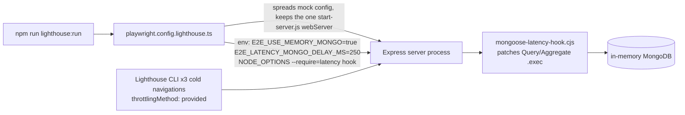
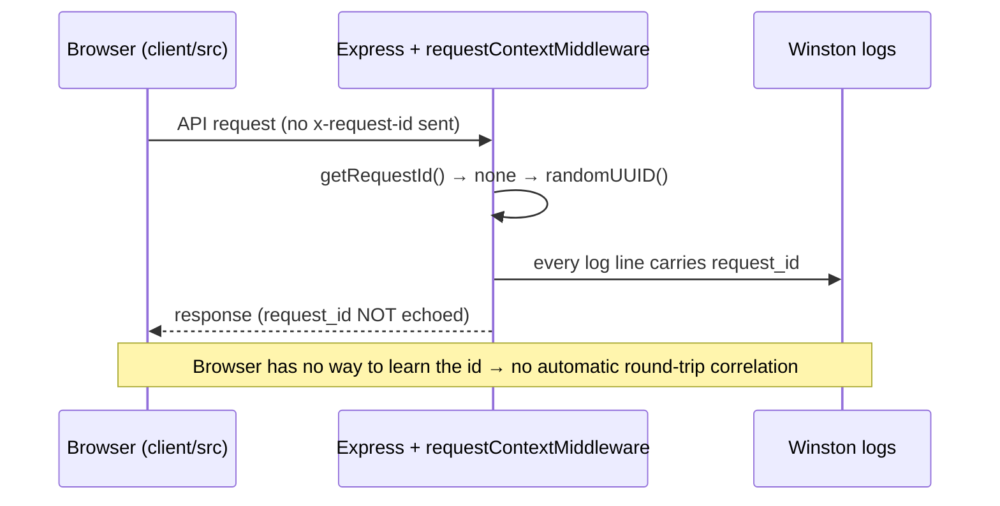

# 11 — Testing and Debugging

This chapter covers how Eleven-Chat's tests are organized and run, how they mock, and which CI
workflows run them. It also covers the debugging tools that exist in the code today, and where
that tooling stops.

Related chapters: [00 Overview](./00-overview.md) · [02 Backend](./02-backend.md) ·
[03 Frontend](./03-frontend.md) · [04 Redis](./04-redis.md) ·
[09 Background processing](./09-background-processing.md) ·
[10 Feature development](./10-feature-development.md) ·
[12 Configuration and deployment](./12-configuration-deployment.md). The rules this chapter puts
into practice are in [`AGENTS.md`](../../AGENTS.md), under "Testing" and "Verification". The
full lighthouse runbook is in [`e2e/lighthouse/README.md`](../../e2e/lighthouse/README.md).

> **How this chapter was produced.** No tests were run to write it. No Jest suite, Playwright
> suite, `mongodb-memory-server` instance or lighthouse run was started. Every claim comes from
> reading config files, `package.json` scripts, source files, `.github/workflows/*.yml` and
> `UPGRADING.md`. Only one command was run, and it executes nothing: `npm run` with no
> arguments, which lists the root scripts. Its observed output included `test:client`,
> `test:api`, `test:packages:api`, `static-checks`, `lighthouse`, `lighthouse:run` and
> `lighthouse:regression`. That confirms the scripts exist, not that they pass.
>
> Labels: **Verified** means the cited file was read directly. **Inferred** means it follows
> from the code but was not traced end to end. **Unknown** means it could not be established.
> Line numbers refer to the working tree when this was written.

---

## 1. Test frameworks and organization per workspace

Every workspace uses **Jest** for unit and integration tests, and **Playwright** drives the e2e
lanes. All Jest configs take their `maxWorkers` from one shared helper,
`config/jest.workers.cjs` (**Verified**). Local runs use `'50%'`. CI uses a floor of **2**
workers so that a leaked handle stays inside a worker that Jest can kill, instead of hanging the
main process. The file's header comment explains this, and `resolveMaxWorkers` implements it.

| Workspace | Config | Environment | Setup files | Timeout | Notes |
| --- | --- | --- | --- | --- | --- |
| `api/` (legacy Express) | `api/jest.config.js` | `node` (`:23`) | `./test/jestSetup.js`, `./test/__mocks__/logger.js` (`:29`) | 30 s (`:28`) | Babel transform; allow-lists ESM-only deps (`openid-client`, `jose`, `@langchain/langgraph*`, …) in `transformIgnorePatterns`. **Verified** |
| `config/` migration tests | `config/jest.config.js` | inherits from `api/` | reuses api setup files, re-rooted (`:16`) | 30 s | Thin wrapper that reuses `api/jest.config.js`; run by `npm run test:config`. **Verified** |
| `client/` (React app) | `client/jest.config.cjs` | `jsdom`, URL `http://localhost:3080` (`:6-7`) | `test/polyfills.js` (`:57`); `jest-dom/extend-expect` + `test/setupTests.js` (`:58`) | default | `workerIdleMemoryLimit: '800MB'` (`:44`) to recycle workers that grow large from coverage maps; custom `jest.resolver.cjs` (`:48`); `librechat-data-provider/react-query` is mapped to that package's **source**. Coverage only when `COVERAGE=true`, and its thresholds are commented out. **Verified** |
| `packages/api` | `packages/api/jest.config.mjs` | node | `jest.setup.cjs` + shared `config/jest.setup.logging.cjs` (`:57`) | 15 s (`:60`) | `testPathIgnorePatterns` (`:22`) leaves `.dev.ts`, helpers, `__tests__/helpers/` and `.manual.spec.*` out of the default run. **Verified** |
| `packages/data-schemas` | `packages/data-schemas/jest.config.mjs` | node | `config/jest.setup.logging.cjs` (`:27`) | 15 s (`:30`) | `globalSetup: jest.globalSetup.mjs` (`:26`) pre-warms the Mongo binary; ignores `/misc/` (`:6`). **Verified** |
| `packages/client` | `packages/client/jest.config.js` | `jsdom` (`:25-26`) | `jest.setup.ts` (`:34`) | 15 s (`:23`) | Custom resolver (`:27`). Its `tsconfig.json` excludes `**/*.test.ts(x)` and `**/*.spec.ts(x)` (`packages/client/tsconfig.json:27-33`), so **`tsc --noEmit` never typechecks test files here**, as `AGENTS.md` warns. **Verified** |
| `packages/data-provider` | `packages/data-provider/jest.config.js` | Jest default | none | default | The simplest config: just an `@src/*` mapper plus `maxWorkers` (`:19`). **Verified** |
| `e2e/` | 19 `e2e/playwright.config*.ts` files | Playwright | per-config `webServer` | per-config | One config per scenario: `.ts` (CI default), `.local`, `.mock`, `.redis`, `.email`, `.bombadil`, `.lighthouse`, `.a11y`, `.deployed`, `.benchmark`, `.navigation-perf`, `.reasoning-perf`, `.mobile-chat-perf`, `.tree-perf`, `.tree-perf-prod`, `.tree-parity`, `.mcp-apps`, `.mermaid`, `.real`. `e2e/screenshots/` and `e2e/byom/` have their own configs too. **Verified** (file listing) |

`AGENTS.md` adds a caveat that matters in practice. `packages/api`, `packages/client` and
`packages/data-schemas` build with `tsdown`, which emits code without checking types, so a green
build is not a typecheck. Run `npx tsc --noEmit` in each workspace you change.

---

## 2. How to run tests

### 2.1 Jest per workspace

`AGENTS.md` says to run focused Jest from the **owning workspace**, not the whole monorepo. The
scripts, quoted verbatim:

| Workspace | `npm test` (watch / local) | `npm run test:ci` | Source |
| --- | --- | --- | --- |
| `api/` | `cross-env NODE_ENV=test jest` | `jest --ci --logHeapUsage` | `api/package.json:8,10` |
| `client/` | `cross-env NODE_ENV=development jest --watch` | `cross-env NODE_ENV=development COVERAGE=true jest --ci --logHeapUsage` | `client/package.json:14-15` |
| `packages/api` | `jest --coverage --watch --testPathIgnorePatterns="\.*integration\.\|\.*helper\.\|__tests__/helpers/\|\.*manual\.spec\."` | same with `--ci` in place of `--watch` | `packages/api/package.json:35-36` |
| `packages/data-schemas` | `jest --coverage --watch` | `jest --coverage --ci` | `packages/data-schemas/package.json:39-40` |
| `packages/client` | `jest` | `jest --ci` | `packages/client/package.json:41-42` |
| `packages/data-provider` | `jest --coverage --watch` | `jest --coverage --ci --logHeapUsage` | `packages/data-provider/package.json:29-30` |

Typical focused runs (**Inferred**: standard Jest CLI passthrough):

```sh
cd packages/api && npx jest src/schedules/service.spec.ts
cd packages/data-schemas && npx jest src/methods/conversation
cd client && npx jest src/components/Chat/Trace
```

`packages/api` integration suites are **excluded** from `test` and `test:ci` and have their own
scripts (`packages/api/package.json:37-44`, **Verified**):

```text
test:cache-integration:core     jest --testPathPatterns="src/(cache|middleware)/.*\.cache_integration\.(spec|test)\.ts$" --coverage=false
test:cache-integration:cluster  jest --testPathPatterns="src/cluster/.*\.cache_integration\.(spec|test)\.ts$" --coverage=false --runInBand
test:cache-integration:mcp      jest --testPathPatterns="src/mcp/.*\.cache_integration\.(spec|test)\.ts$" --coverage=false
test:cache-integration:stream   jest --testPathPatterns="\.stream_integration\.(spec|test)\.ts$" --coverage=false --runInBand --forceExit
test:cache-integration          (runs core, cluster, mcp, stream in sequence)
test:integration                jest --testPathPatterns="\.integration\.(spec|test)\.ts$" --coverage=false --runInBand --forceExit
test:s3-integration             jest --testPathPatterns="src/storage/s3/.*\.integration\.spec\.ts$" --coverage=false --runInBand
test:agents-integration         jest --testPathPatterns="src/agents/.*\.integration\.spec\.ts$" --coverage=false --runInBand --forceExit
```

The cache-integration suites expect a live Redis server, and CI starts one for them (see §6).
Running them locally without Redis is **Unknown** territory. Expect connection failures rather
than skips.

### 2.2 Root-level aggregates

From the root `package.json` (**Verified**, `:105-112`):

```text
test:client                  cd client && npm run test:ci
test:api                     cd api && npm run test:ci
test:packages:api            cd packages/api && npm run test:ci
test:packages:data-provider  cd packages/data-provider && npm run test:ci
test:packages:data-schemas   cd packages/data-schemas && npm run test:ci
test:config                  jest --config config/jest.config.js
test:all                     npm run test:client && npm run test:api && npm run test:packages:api && npm run test:packages:data-provider && npm run test:packages:data-schemas
test:turbo                   turbo run test:ci --concurrency=2 --filter=@librechat/frontend --filter=@librechat/client --filter=@librechat/backend --filter=@librechat/api --filter=librechat-data-provider --filter=@librechat/data-schemas
test:client-build            node --test e2e/client-build.test.mjs        (:69)
```

`test:all` does **not** include `packages/client`, but `test:turbo` does.

### 2.3 Static checks

`package.json:122-123` defines `static-checks` (`node scripts/static-checks.mts`) and
`static-checks:full` (`… --full`). The script's header (`scripts/static-checks.mts:27-30`)
documents `--against origin/dev`, which reproduces the PR's "Static Checks" job, and `--full`,
which adds the slower TypeScript, config-test, i18n and depcheck gates. **Verified.**

```sh
npm run static-checks -- --against origin/dev
npm run static-checks:full
```

### 2.4 Playwright e2e

Most e2e scripts first run `e2e:prepare`, which is `npm run frontend` (a production frontend
build, `package.json:68`). Selected scripts (`package.json:70-114`, **Verified**):

| Script | Command |
| --- | --- |
| `e2e` | `npm run e2e:prepare && playwright test --config=e2e/playwright.config.local.ts` |
| `e2e:ci` | `npm run e2e:prepare && playwright test --config=e2e/playwright.config.ts` |
| `e2e:mock` / `e2e:mock:ci` | `npm run e2e:prepare && playwright test --config=e2e/playwright.config.mock.ts` |
| `e2e:mock:redis` | `npm run e2e:prepare && cross-env E2E_STREAM_STORE=redis playwright test --config=e2e/playwright.config.mock.ts` |
| `e2e:mock:redis:transport` | `npm run e2e:prepare && cross-env E2E_STREAM_STORE=redis playwright test --config=e2e/playwright.config.redis.ts` |
| `e2e:bombadil` | `npm run e2e:prepare && playwright test --config=e2e/playwright.config.bombadil.ts` (plus `:branch-reload`, `:fork-lifecycle`, `:model-lifecycle`, `:hitl`, `:steering` variants that set `BOMBADIL_SPECIFICATION`) |
| `e2e:a11y` | `npm run e2e:prepare && playwright test --config=e2e/playwright.config.a11y.ts --headed` |
| `e2e:debug` | `npm run e2e:prepare && cross-env PWDEBUG=1 playwright test --config=e2e/playwright.config.local.ts` |
| `e2e:deployed` | `playwright test --config=e2e/playwright.config.deployed.ts` (no local build) |
| `e2e:codegen` | `npx playwright codegen --target=playwright-test --test-id-attribute=data-testid --load-storage=e2e/storageState.json http://localhost:3080/c/new` |
| `e2e:report` | `npx playwright show-report e2e/playwright-report` |

### 2.5 Lighthouse lane

`package.json:159-161` (**Verified**):

```text
lighthouse             npm run e2e:prepare && npm run lighthouse:run
lighthouse:run         playwright test --config=e2e/playwright.config.lighthouse.ts
lighthouse:regression  cross-env LIGHTHOUSE_REGRESSION=serial-reads npm run lighthouse:run
```

`AGENTS.md` ("Verification") requires `npm run lighthouse` before completing any startup, auth,
config, file or message-loading change. §5 explains what the lane measures.

---

## 3. Mocking strategy in practice

`AGENTS.md` ("Testing") says to prefer real logic and spies, to use `mongodb-memory-server` for
database queries and the real MCP SDK for MCP behavior, and to mock only external HTTP APIs or
services you cannot control. The test suites mostly follow this. Concrete examples:

**External HTTP mocked (Verified)**

- `packages/api/src/utils/axios.spec.ts:4`: `jest.mock('axios', () => ({ interceptors…, create:
  jest.fn()… }))`. This lets the test assert how `createAxiosInstance` configures proxies
  without making network calls.
- `api/app/clients/tools/structured/specs/StableDiffusion.spec.js:5`:
  `jest.mock('axios', () => ({ post: jest.fn() }), { virtual: true })`. The image-generation
  HTTP call is stubbed.
- `packages/api/src/skills/sync/github.spec.ts`: no module mocking at all. The test injects a
  fake `fetchFn` into the sync runner's dependencies (`fetchFn: githubFetch()` at `:335`;
  overrides at `:390`) and simulates transport failure with `throw new TypeError('fetch
  failed')` (`:179`). This is the preferred shape because it uses the dependency-injection seam
  from `AGENTS.md` ("Modules take their dependencies") rather than patching a module globally.
- `api/server/services/Files/Audio/TTSService.spec.js:1-26` mocks `axios`, the speech-provider
  HTTP client. It **also** mocks internal modules (`@librechat/data-schemas` logger,
  `@librechat/api`, `librechat-data-provider`, `./streamAudio`, `~/server/services/Config`).
  That is older legacy-`api/` style and goes further than the "external HTTP only" rule. Don't
  copy it into new `packages/api` tests.

**Real database through `mongodb-memory-server` (Verified)**

- 60 spec files under `packages/data-schemas/src` reference `MongoMemoryServer`, 49 of them in
  `src/methods/` (counted with `grep -rl`). They exercise the real Mongoose models instead of
  mocking the model layer.
- `packages/api/src/agents/transactions.spec.ts:2,35` and `packages/api/src/schedules/service.spec.ts:2`
  import `MongoMemoryServer` and create it in `beforeAll`.
- `packages/data-schemas/jest.globalSetup.mjs` downloads the Mongo binary **once**, serially,
  before workers fork. Its header comment (`:8-10`) explains why: with a cold cache, parallel
  workers race on `rename('<file>.tgz.downloading', '<file>.tgz')`, and the losers fail with
  `ENOENT … rename …tgz.downloading` plus a `beforeAll` timeout. If you see that error in
  another workspace, this race is the likely cause (**Inferred**). Pre-warm failures are caught
  (`:21`), so the first suite that needs the binary retries the download.

**Real MCP SDK**: **Inferred**, not checked spec by spec. `packages/api/jest.config.mjs`
allow-lists `@modelcontextprotocol/ext-apps` for transformation, which fits real SDK code being
executed. No individual MCP spec was opened to confirm.

---

## 4. Shared test setup and fixtures

| File | What it provides | Status |
| --- | --- | --- |
| `api/test/jestSetup.js` | `globalThis.File` polyfill for undici (`:3-14`). Test env: `MONGO_URI=mongodb://127.0.0.1:27017/dummy-uri` (`:25`), `CI=true` (`:29`), `JWT_SECRET=test` (`:30`), a fixed `CREDS_KEY` (`:33`), `jest.setTimeout(30000)` (`:39`), `OPENAI_API_KEY=test` (`:40`). It also loads `.env.test`. | **Verified** |
| `api/test/__mocks__/logger.js` | Full `winston` mock (`:1`) that keeps `format(fn)` returning a Format with `.transform()`. The comment (`:2-6`) records that a simpler `(fn) => fn` mock broke when `redactFormat()` started calling `.transform` at module load. | **Verified** |
| `config/jest.setup.logging.cjs` | Shared by `packages/api` and `packages/data-schemas`. Unless `TEST_VERBOSE_LOGS=true`, sets `CONSOLE_LOG_LEVEL=silent` and `LOG_TO_FILE=false`. It only sets env vars and never requires the logger, so module state (for example `CREDS_KEY`) is not frozen before a spec sets it. **To see backend logs while debugging a test: `TEST_VERBOSE_LOGS=true npx jest …`.** | **Verified** |
| `config/jest.workers.cjs` | Shared `maxWorkers` (§1). | **Verified** |
| `client/test/setupTests.js` | `@testing-library/jest-dom` matchers (`:8,14`), `jest-canvas-mock` (`:18`), `ResizeObserver` mock (`:20`), `window.matchMedia` mock (`:24`, defined again at `:42`), global `jest.clearAllMocks()` in `beforeEach` (`:39`), and a `react-i18next` mock (`:57-66`) whose `t()` goes through the real `~/locales/i18n`, so localized strings resolve deterministically. | **Verified** |
| `client/test/layout-test-utils.tsx` | The colocated component-test helper that `AGENTS.md` names. Present but not read line by line. | **Verified** (exists) |
| Other `client/test/` helpers | `harness.tsx`, `itemFactories.ts`, `dropdown.ts`, `canvasMock.ts`, `mockMorphIcon.tsx`, `localStorage.mock`, `matchMedia.mock`, `resizeObserver.mock`, `polyfills.js`, `babel-plugin-transform-import-meta-hot.cjs`. | **Verified** (listing) |

---

## 5. The e2e/lighthouse lane

### What it is for

The lighthouse lane is a **regression gate against serial database round trips on the
conversation-load path**. It is not a general performance benchmark. It answers one question:
does opening an existing conversation still render the transcript fast when every database query
is slow?

### How the 250 ms injection works (Verified)



- `e2e/playwright.config.lighthouse.ts:7-12` keeps only the `webServer` entry whose command ends
  in `start-server.js`, and throws unless there is exactly one. The lane needs the isolated
  single-server harness (`E2E_REPLICAS=1`).
- `:29-37` injects `E2E_USE_MEMORY_MONGO=true`, `E2E_LATENCY_MONGO_DELAY_MS=250` and
  `NODE_OPTIONS=--require=<e2e/benchmarks/mongoose-latency-hook.cjs>`. When
  `LIGHTHOUSE_REGRESSION=serial-reads` is set, it also requires `e2e/lighthouse/regression.cjs`.
- `e2e/benchmarks/mongoose-latency-hook.cjs:3-20` wraps `mongoose.Query.prototype.exec` and
  `mongoose.Aggregate.prototype.exec` so that each call waits `delayMs` before running. A
  `Symbol.for(...)` guard keeps it from patching twice. Queries that run in parallel overlap their
  delays, and queries that run in sequence add up. This is how the lane makes serial reads
  visible.
- **Coverage limit** (README `:22-27`): only Mongoose Query/Aggregate execution is delayed.
  Native driver calls, bulk operations and cursor batches are not, and the lane does not
  exercise OpenID or Redis cache priming (README `:75`).

### Budgets

The harness registers a real user, seeds a conversation and makes **three cold navigations** to
it with the production client build. Lighthouse runs with `throttlingMethod: provided`, so the
injected server delay drives the numbers instead of simulated network timing. Budgets are
checked against the **median** of the three runs (`e2e/lighthouse/audit.ts:22-24`):

| Metric | Budget |
| --- | --- |
| Largest Contentful Paint | 4,500 ms |
| Cumulative Layout Shift | 0.1 |
| Total Blocking Time | 500 ms |

These are lab regression limits, not field percentiles, and INP is not measured. The spec also
checks that **the seeded transcript is the LCP element**, so a fast login page, spinner or empty
shell cannot pass (README `:36-37`).

### Reproducing locally

You need Node 24 and Chrome (README `:3-12`):

```sh
npm ci
E2E_CHROMIUM_CHANNEL=chrome npm run lighthouse          # build + run
E2E_CHROMIUM_CHANNEL=chrome npm run lighthouse:run      # reuse existing production build
E2E_CHROMIUM_CHANNEL=chrome npm run lighthouse:regression  # negative control, MUST fail
```

Useful knobs: `E2E_BASE_URL` changes the port. Set `CHROME_PATH` when chrome-launcher picks the
wrong browser; on WSL it prefers the Windows install, whose debug port Linux cannot reach.
`LIGHTHOUSE_CHROME_FLAGS` adds Chrome flags such as `--no-sandbox`. Never point the lane at a
deployed service. Playwright also refuses to reuse a server that is already running.

**Negative control.** `e2e/lighthouse/regression.cjs:3-11` makes every `find` on the `messages`
collection first run 16 sequential `User.findById` reads. With the 250 ms hook loaded first,
that adds at least 4 s. This run is supposed to fail on `largest-contentful-paint`. Check that
the LCP assertion is what failed, because any other process error proves nothing. Run the normal
command again afterwards to restore baseline reports.

### When the gate fails

1. Read the measured median and limit for the failing audit in the budget table, which the
   runner prints just before asserting.
2. Open `.lighthouse/lhr-*.report.html` and read the API request start and end times in the
   console. A request that **starts late** points to a dependency chain in the browser. A
   request that **runs long** points to server work or serial DB reads.
3. Check the code paths the README maps to past regressions before you touch a budget:

| Symptom | Inspect |
| --- | --- |
| Config waits on repeated user lookups | `packages/api/src/app/service.ts`, `api/server/middleware/config/app.js` |
| Message authorization and read run serially | `api/server/routes/messages.js`, `packages/api/src/middleware/messageValidation.ts` |
| Messages wait on the file map | `client/src/data-provider/Messages/queries.ts`, `client/src/components/Chat/ChatView.tsx` |
| Startup repeats auth-user reads | `api/server/controllers/AuthController.js`, `packages/api/src/auth/userDocCache.ts` |

The fix is almost always the same: reuse user and config data that is already loaded, start
independent reads together, keep every read scoped to the user and tenant, and wait for
authorization before returning data. Never raise a threshold to hide extra round trips.

To add a scenario, reuse `auditPage({ url, cookies, runs, budgets })` (`audit.ts:52`). It runs
the Lighthouse CLI once per run, redacts cookies from saved reports (`:120`), prints API timings
and checks medians. Read the LCP node through `lcpElement(report)` (`:32`) instead of a
hard-coded audit id, because Lighthouse renames audit ids between major versions.

Full depth: [`e2e/lighthouse/README.md`](../../e2e/lighthouse/README.md).

---

## 6. CI: which workflow runs which suite

All files are in `.github/workflows/`. **Verified** from the job definitions:

| Workflow (`name:`) | What it runs |
| --- | --- |
| `backend-review.yml` ("Backend Unit Tests") | Builds data-provider, data-schemas and api. OpenAPI `openapi:check` / `openapi:test` (`:314,317`). Type checks and circular-dependency jobs. Then **four test jobs**: `test-api`, the **legacy `api/` workspace** sharded 3 ways (`:353-362`, `cd api` at `:441`, `npm run test:ci -- --shard=N/3` at `:455-461`); `test-data-provider` (`:476`); `test-data-schemas` (`:561`, which caches `~/.cache/mongodb-binaries`); and `test-packages-api`, `@librechat/api` **sharded 4 ways** (`:652-653`, `cd packages/api` at `:727`). A `codegraph_select` job (`:141`) can narrow each job to impact-selected files with `--runTestsByPath`. If the selection is stale, the full suite runs. |
| `frontend-review.yml` ("Frontend Unit Tests") | `npm run test:client-build` (`:59`). Client typecheck (`:266`). `test-packages-client` (`packages/client`, `:269-333`). `test-ubuntu`, the `client/` suite sharded 2 ways (`:347-414`). Also `codegraph_select`-gated. |
| `static-checks.yml` ("Static Checks") | ESLint, Prettier and import order on changed files; eslint-config self-check; JSON validity; suppression counts; circular deps; and tree-wide gates including `npm run test:config` (`:376`) and depcheck (`:400`). Mirrored locally by `npm run static-checks -- --against origin/dev`. |
| `lighthouse.yml` ("Lighthouse CI") | Triggered by PRs that touch `api/`, `client/`, `config/`, `packages/`, `e2e/` or package manifests (`:5-15`). Runs `npm run e2e:prepare`, then `npm run lighthouse:run 2>&1 \| tee lighthouse-ci.log` (`:38,45`). On failure in a same-repo PR it comments the last 80 log lines (`:47-60`). |
| `playwright-mock.yml` ("Playwright E2E Tests") | The main e2e gate. Builds every package and the client (`:222-280`), then runs a matrix of `npx playwright test --config=e2e/playwright.config.mock.ts --shard=…` (`:368`). The PR matrix has memory and Redis lanes; the full matrix (`:73`) has 6 memory shards plus 2 Redis-transport shards that run `playwright.config.redis.ts` (`:372`) against a `redis:7-alpine` service. Email-change specs run on one shard (`:378-384`). A codegraph gate can drop the Redis-transport lanes or graduated specs. Its note says the kill switch is the repo variable `CODEGRAPH_GATING=off` (`:156`). |
| `playwright-bombadil.yml` ("Bombadil Property Exploration") | Property-based exploration with `playwright.config.bombadil.ts` (`:137`), limited to PRs from owners, members and collaborators (`:32-34`). The step is `continue-on-error` and reports violations as warnings with reproduction artifacts (`:174-180`), so it is **not** a blocking gate. |
| `cache-integration-tests.yml` ("Cache Integration Tests") | Installs `redis-server`, starts a single node (`:70-74`) and a 3-node cluster (`:82-88`), then runs `npm run test:cache-integration` in `packages/api` twice: single-node `REDIS_URI=redis://127.0.0.1:6379` (`:140-146`) and `USE_REDIS_CLUSTER=true` against ports 7001-7003 (`:148-155`). |
| `agents-integration-tests.yml` ("Integration Tests") | `redis:7-alpine` service (`:43-45`). Runs `npm run test:integration` in `packages/api` with `NODE_ENV=test`, `REDIS_URI=redis://127.0.0.1:6379` (`:112-117`). |

**Unknown**: how the `codegraph_select` steps decide what to skip. They were located but not
traced. Other workflows (`a11y.yml`, `promotion-tests.yml`, `workspace-acceptance.yml`,
`docker-*.yml`, `codegraph-*.yml`, …) were not opened. Some of them may also run tests.

---

## 7. Debugging guide

### 7.1 Backend request debugging: the logger

There is one Winston logger, configured in `packages/data-schemas/src/config/winston.ts` and
imported as `logger` from `@librechat/data-schemas` (**Verified**).

- **Default level**: `debug` when `NODE_ENV` is unset or `development`, otherwise `warn`
  (`winston.ts:32-35`).
- **Env toggles** (parsed at `winston.ts:13-21`; defaults in `.env.example:180-203`):

| Variable | Effect |
| --- | --- |
| `DEBUG_LOGGING=true` | Adds a `debug-%DATE%.log` daily-rotated file transport (`winston.ts:64-74`). `.env.example` ships it as `true`. |
| `DEBUG_CONSOLE=true` | Console defaults to `debug` level with the verbose debug format (`winston.ts:90-106`). |
| `CONSOLE_LOG_LEVEL` | Explicit console level: `error` … `silly`, or `silent`. It takes precedence over the default `DEBUG_CONSOLE` picks (comment at `winston.ts:90-91`). |
| `CONSOLE_JSON=true` | Structured JSON console output for cloud log collectors (`winston.ts:107-114`). `CONSOLE_JSON_STRING_LENGTH` bounds string length (default 255). |
| `LOG_TO_FILE=false` | Disables all file transports (`winston.ts:21`). File logging is on unless this is exactly `false`. |
| `AGENT_DEBUG_LOGGING=true` | Agent-specific debug logging (`.env.example:203`). Not traced further. |
| `LIBRECHAT_LOG_DIR` | Log directory override (`packages/data-schemas/src/config/utils.ts:15-17`). Otherwise `getLogDirectory()` falls back to the monorepo `api/logs`, or `<cwd>/logs`. |

- **Files**: `error-%DATE%.log` (JSON, `winston.ts:52-60`) whenever file logging is on, plus
  `debug-%DATE%.log` with `DEBUG_LOGGING`. Both rotate daily, are gzipped, and are capped at
  `20m` / `14d`.
- **Redaction**: file and console formats both run `redactFormat()`, and console error lines go
  through `redactMessage` (`winston.ts:37-44,79-87`). Some sensitive values will therefore show
  up redacted in the logs on purpose.
- **What reaches the client**: `packages/api/src/middleware/error.ts` maps Mongo duplicate-key
  errors (`code === 11000`, `:38`) to 409 and logs `Duplicate key error: …` (`:10`). It maps
  Mongoose `ValidationError` (`:32`) to 400 and logs `Validation error:` (`:19`). Coded
  `CustomError`s keep their status. Anything else becomes a bare 500, and the real message stays
  **only** in the server log (`:48`). If the client shows only "500", the explanation is in the
  logs. For bounded diagnostics, `getSafeErrorMetadata` (`packages/api/src/utils/errors.ts:18`)
  is the sanctioned helper.

**Typical loop**: restart with `DEBUG_CONSOLE=true` (and keep `DEBUG_LOGGING=true`), reproduce
the request, then follow the console or `api/logs/debug-*.log` and filter on the request's
`request_id`, as described next.

### 7.2 Request correlation: what exists and what doesn't

There **is** a request-correlation mechanism, but it is backend-only and partial. Know its
limits before you assume end-to-end tracing exists.

**What exists (Verified):**

- `packages/data-schemas/src/config/tenantContext.ts:1,19-20` defines `tenantStorage`, an
  `AsyncLocalStorage<TenantContext>`.
- `requestContextMiddleware` (`packages/api/src/middleware/tenant.ts:91-102`) builds a context
  for each request **before authentication**. If the request carries no usable id, it generates
  one with `randomUUID()` (`:97-98`), sets `req.requestId`, and runs the rest of the request
  inside `runWithTenantContext`. After authentication, `buildTenantContext` (`:66-75`) adds
  `tenantId` and `userId`.
- The incoming id comes from `getRequestId` (`packages/api/src/middleware/auth.ts:131-150`). It
  checks `req.requestId`, `req.id`, the **`x-request-id`** header and the
  **`x-correlation-id`** header in that order. A value is accepted only if it is at most 128 characters (`MAX_REQUEST_ID_LENGTH`, `:12`),
  matches `/^[A-Za-z0-9_.:-]+$/`, and does not look like a compact JWT. The JWT check
  stops a bearer token from being logged by accident when it is passed as a request id.
- `attachRequestContext` (`packages/data-schemas/src/config/requestLogContext.ts:152-166`) stamps
  `tenantId`, `userId`, `requestId` and `request_id` onto log lines. Identity fields are left out
  of sensitive auth and tenant-isolation events (`:128`), but `requestId` is kept.

**What does not exist (searched explicitly):**

- **No echo back to the client.** No code sets `x-request-id` on the **response**. A search of
  `api/` and `packages/api/src` for setting that header on responses found nothing. The only
  outgoing uses of `x-request-id` are server-to-server calls from the agent-trigger host
  (`packages/api/src/agents/triggers/host.ts:660,990`), which send an idempotency key.
- **The frontend never sends one.** Searching `client/src`, `packages/client/src` and
  `packages/data-provider/src` for `x-request-id` or `x-correlation-id` returns **no matches**.



**Practical consequence.** The id correlates all the backend log lines for **one** request, and
it honors ids injected by an upstream proxy or load balancer. It does **not** link a click in the
browser to a backend log line. To trace one request on purpose, send it yourself with an
`x-request-id` header from DevTools ("Copy as fetch" or cURL, then add the header) or from a test
script. Then search the logs for that value in `request_id`.

### 7.3 Frontend state and API debugging

- **React Query Devtools** (**Verified**, `client/src/components/QueryDevtoolsGate.tsx:19-33`):
  the panel lazy-loads `@tanstack/react-query-devtools/production` and renders top-right,
  closed by default. It is enabled when `import.meta.env.DEV` is true (Vite dev server) **or**
  the runtime startup config sets `enableQueryDevtools: true`
  (`window.__LIBRECHAT_CONFIG__`). A deployed build can therefore turn it on without a rebuild.
  Where the server populates `enableQueryDevtools` was not traced (**Unknown**). See
  [12 Configuration](./12-configuration-deployment.md).
- **State**: there is no Redux. The client is moving from Recoil to Jotai (`AGENTS.md`, "Client
  state ownership"), and no custom state devtools are wired into the app (**Inferred**: none
  found). Generic browser extensions for Recoil or Jotai are the option.
- **In-app Trace Viewer** (**Verified**, `client/src/components/Chat/Trace/`): `Viewer.tsx`
  loads per-conversation execution trace records with
  `useConversationTraceRecordsQuery(conversationId, true)` (`:108`) and a Langfuse session link
  with `useGetLangfuseSessionLinkQuery` (`:109`). `Timeline.tsx`, `Inspector.tsx` and
  `Ledger.tsx` render the steps. This is the most direct tool for "what did the agent actually do
  for this message?", and it is a **per-message agent-run trace**, not an HTTP request id. Agent
  envelope and trigger tracing lives server-side in `packages/api/src/agents/envelope.ts` and
  `packages/api/src/agents/triggers/envelope.ts` (**Inferred** relationship).
- **Wrong or generic error in a chat bubble**: check
  `client/src/components/Messages/Content/Error/registry.ts`. `errorCopy` (`:20`) maps stable
  backend codes to localized strings, and a component map routes others to dedicated renderers
  (for example `UserKeyError` for `INVALID_API_KEY`, `:58`). An unmapped code falls through to
  generic copy.

### 7.4 Investigating failed or slow DB queries

- **Failures**: start with `error-*.log`, which is on unless `LOG_TO_FILE=false`. Duplicate-key
  and validation errors reaching the HTTP boundary are logged there by
  `packages/api/src/middleware/error.ts` (§7.1). Filter by the request's `request_id`.
- **Slowness**: **no slow-query logger exists in application code.** Searches for `slowQuery`,
  `queryTime` and `explain(` found nothing in `packages/api` or `packages/data-schemas`. Driver
  hooks such as `monitorCommands` were not checked exhaustively (**Unknown**). The only latency
  instrumentation is the **test-only** `e2e/benchmarks/mongoose-latency-hook.cjs` (§5). For real
  slow-query work, use MongoDB's own profiler (`db.setProfilingLevel(...)`, `system.profile`)
  (**Inferred** recommendation). To find serial-read *patterns*, the lighthouse lane's API timing
  output is the tool designed for that.
- **Startup index errors**: see failure scenario 3 in §8.

### 7.5 Inspecting Redis

Key names, prefixes, TTLs and suggested `redis-cli` commands are documented in
**[04 Redis](./04-redis.md)**. Use that chapter rather than guessing key patterns. Code to start
from: `packages/api/src/stream/implementations/RedisEventTransport.ts` (stream transport) and
`packages/api/src/cache/redisScript.ts` / `redisTelemetry.ts` (Lua scripts and telemetry)
(**Verified** to exist). To reproduce Redis-specific streaming bugs end to end, use
`npm run e2e:mock:redis` or `npm run e2e:mock:redis:transport` (§2.4). To reproduce cache bugs at
unit level, use `test:cache-integration*` against a local Redis (§2.1).

### 7.6 Background jobs, subagents and schedules

Scheduling, agent triggers and subagent execution are covered in
**[09 Background processing](./09-background-processing.md)**. For tests, the schedules service
has a real-DB spec (`packages/api/src/schedules/service.spec.ts`), and agent integration
coverage runs through `npm run test:agents-integration` / `test:integration` (§2.1). At runtime,
the in-app Trace Viewer (§7.3) is the per-message view of what an agent run did.

### 7.7 Tracing one error across the frontend and backend

**No full round-trip correlation id exists today** (§7.2). The paths that work:

1. **From the UI**: open the Trace Viewer for the affected message, and follow the Langfuse link
   if one is configured.
2. **From the network tab**: note the failing request's method, path and timestamp, then match
   `request_method`, `request_path` and the time in the backend logs. For exact matching,
   **replay** the request with your own `x-request-id` header and search for it.
3. **From the error code**: if the response carries a stable error code, look it up in the
   client registry (§7.3) and search the backend for where that code is produced.

---

## 8. Documented failure scenarios

All three come from `UPGRADING.md` at the repo root (**Verified**). No other scenarios were
added, because none could be checked against source with the same confidence.

| # | Symptom | Investigation steps | Likely cause | Verification |
| --- | --- | --- | --- | --- |
| 1 | After upgrading, provider-native web search (for example OpenAI's built-in search) stops working. Or an old pinned "Search" chip stays visible after external search is disabled. | Check `interface.webSearch` in `librechat.yaml`. Check the effective `WEB_SEARCH.USE` grant per role in the permissions editor. Check `endpoints.agents.capabilities` for an explicit list. Check model specs for `webSearch` vs `preset.web_search` / `preset.useResponsesApi`. Check each saved agent's own model parameters. | Since v0.8.8-rc3 (#15875), `WEB_SEARCH.USE` authorizes **both** the external pipeline and native search. `interface.webSearch: false` writes a denial for `USER` and `ADMIN`. **Removing the field keeps the stored denial** and does not restore the default (`UPGRADING.md:5-8`). The leftover chip is a known v0.8.8 client artifact, and the backend still refuses to load the tool (`:41-43`, #16673). | Set `interface.webSearch: true` and restart, or grant per role. Remove only `web_search` from an explicit capabilities list. Reload the client and confirm both the role permission and the provider search request (`:12-24`). "Responses API enabled" alone does not mean search is allowed. |
| 2 | After upgrading on Redis-backed streams, deltas look slightly delayed or bunched. Unflushed deltas may be lost if a process crashes. Or a subscriber built before batch frames fails to decode output from an opt-in batching producer. | Check `STREAM_DELTA_COALESCE_MS` and `USE_REDIS_STREAMS`. Find out whether any producer explicitly opted into `chunk_batch` frames, and whether any subscriber predates batch-frame support. | Redis streams now coalesce model and tool-argument deltas in a **25 ms** window by default when `STREAM_DELTA_COALESCE_MS` is unset (`UPGRADING.md:47-50`). That means up to one window of buffering and possible loss of unflushed deltas on a crash (`:52-55`). The default still publishes individually sequenced `chunk` frames, so old subscribers keep working. The decode hazard applies only to producers that **explicitly** emit `chunk_batch` (`:57-67`). In-memory streams are unaffected. | Set `STREAM_DELTA_COALESCE_MS=0` to restore per-delta publication and compare. Keep old subscribers away from opt-in batching producers, or disable coalescing on those producers first. Reproduce with `npm run e2e:mock:redis:transport`. |
| 3 | On startup after upgrading a v0.8.7-or-earlier database, logs show `Index build failed` for User, Role, Preset, AccessRole, MCPServer, AgentCategory, Message or Conversation. Single-tenant deployments are affected too. | Read `error-*.log` / console for the index names (for example `email_1`, `name_1`). Run `npm run migrate:tenant-indexes:dry-run` (`package.json:141`) to list the legacy unique indexes it would drop. | Old unique indexes conflict with current non-unique indexes of the same name. Uniqueness now lives in tenant-scoped compound indexes (`UPGRADING.md:71-75`, #15759, successor to #14826). **Startup does not migrate automatically** (`:77`). | Back up MongoDB, **stop all API replicas and workers**, keep Mongo running, then run `npm run migrate:tenant-indexes` (`package.json:140`). In Docker Compose: `docker compose run --rm --no-deps -w /app api npm run migrate:tenant-indexes` (`-w /app`, because the image defaults to `/app/api`; `:97-107`). Restart only after exit status 0 and confirm the errors are gone (`:110-111`). The command never deletes documents and is safe to rerun after a partial failure (`:113-126`). Never "fix" this by dropping all indexes. |

Deployment and configuration details for these settings are in
[12 Configuration and deployment](./12-configuration-deployment.md).

---

## 9. Before you call a change done

This summarizes `AGENTS.md` and the scripts above. Use [10 Feature development](./10-feature-development.md)
for the full workflow.

1. Run focused Jest in each owning workspace (§2.1). Use `mongodb-memory-server` for DB
   behavior, and mock only external HTTP.
2. Run `npx tsc --noEmit` in each workspace you changed. A `tsdown` build does not typecheck, and
   `packages/client` never typechecks its spec files.
3. `npm run static-checks -- --against origin/dev`, and `npm run sort-imports -- <paths you touched>`.
4. For startup, auth, config, file or message-loading changes, run `npm run lighthouse` (§5).
5. When you report, name the commands you ran and what you observed. Don't claim a check passed
   unless you ran it.
