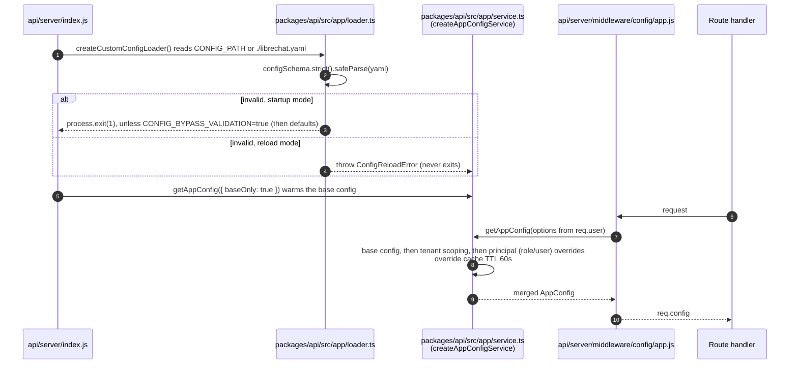
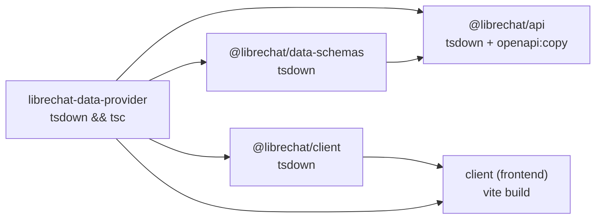
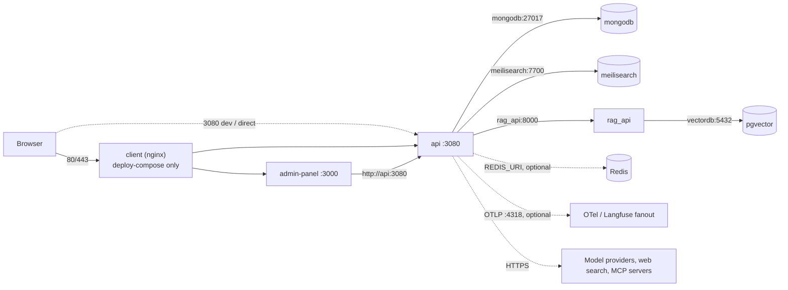
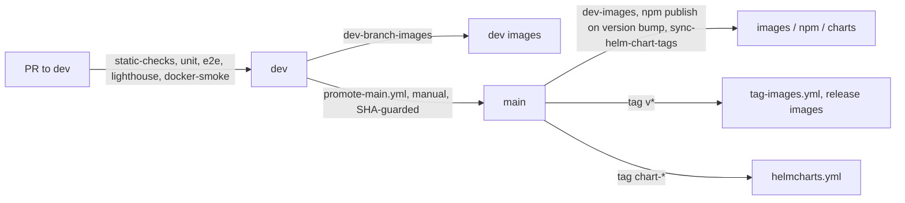

# 12 — Configuration & Deployment

> **Scope.** Environment variables, how `librechat.yaml` is loaded, validated and cached, the
> build pipeline, Docker/Compose/Helm deployment, health checks, CI/CD, migrations and backups.
>
> **Evidence labels.** **Verified**: read directly in source at the cited `file:line`.
> **Inferred**: a reasonable reading that was not fully traced. **Unknown**: not determined; we
> don't guess. Line numbers are from commit `f28809c` (2026-10-09) and will drift.
>
> **Secrets.** This page gives variable names and the example/default values from
> `.env.example`. It never contains real credentials.

Related: [00 Overview](./00-overview.md) · [01 Architecture](./01-architecture.md) ·
[05 Database](./05-database.md) · [09 Background Processing](./09-background-processing.md) ·
[11 Testing & Debugging](./11-testing-debugging.md) ·
[13 Architecture Decisions & Limitations](./13-architecture-decisions-and-limitations.md)

---

## Contents

1. [Environment variables](#1-environment-variables)
2. [Configuration loading, validation and caching](#2-configuration-loading-validation-and-caching)
3. [`librechat.yaml` and `configSchema`](#3-librechatyaml-and-configschema)
4. [Development and production](#4-development-and-production)
5. [Build pipeline](#5-build-pipeline)
6. [Docker and deployment](#6-docker-and-deployment)
7. [Network dependencies and service ports](#7-network-dependencies-and-service-ports)
8. [Health checks](#8-health-checks)
9. [Graceful startup and shutdown](#9-graceful-startup-and-shutdown)
10. [CI/CD workflows](#10-cicd-workflows)
11. [Data migrations](#11-data-migrations)
12. [Backup and recovery](#12-backup-and-recovery)
13. [Open questions](#13-open-questions)

---

## 1. Environment variables

`.env.example` is the template you copy to `.env`. It has about 1,525 lines (`wc -l`) and is split
into commented sections: Server, Security Headers, CSP, Logging, Endpoints, provider keys, Search,
RAG, User System, Balance, Registration/Login, file storage (Firebase, S3, Azure Blob), Shared
Links, Redis, Web Search, MCP and others. The table below covers about 55 variables that matter
most in day-to-day operation. It is not a complete list. Read `.env.example` for the rest, such as
the roughly 20 `LANGFUSE_FANOUT_*` variables and the per-provider model lists.

**How to read "Used by".** A `file:line` entry is a `process.env.<VAR>` read that we confirmed in
source. An `.env.example:N` entry means we found only the documentation comment and did not trace
a call site, so treat its runtime behavior as **Inferred**.

### 1.1 Server and process

| Variable | Purpose | Required | Default | Used by |
|---|---|---|---|---|
| `PORT` | HTTP listen port. `PORT=0` picks a free port automatically. | No | `3080` (code fallback, also `.env.example:15`) | **Verified** `api/server/index.js:99-102` |
| `HOST` | HTTP bind host | No | `localhost` (code); the Dockerfiles set `0.0.0.0` | **Verified** `api/server/index.js:99,103` |
| `TRUST_PROXY` | Express trust-proxy hop count | No | `1` | **Verified** `api/server/index.js:99,104` |
| `DOMAIN_CLIENT` / `DOMAIN_SERVER` | Public base URLs, used for OAuth redirects, CORS and the cookie `Secure` heuristic | Yes, if you use OAuth or need correct cookies | `http://localhost:3080` (both) | `.env.example:48-49`. **Inferred**: used widely across OAuth strategies (call sites not listed). |
| `ADMIN_PANEL_URL` | Link to the external admin panel from Settings and OAuth redirects | No | unset (`deploy-compose.yml` sets `http://admin.localhost`) | `.env.example:51-56` |
| `ADMIN_PANEL_SESSION_SECRET` | Session secret for the bundled admin-panel container | Yes, when that container runs. The panel refuses to start without it. | unset | **Verified** passed through by the compose files (`deploy-compose.yml:55`) |
| `CONTINUE_ON_UNCAUGHT_EXCEPTION` | Log uncaught exceptions and keep running instead of exiting | No | `false` | **Verified** `api/server/index.js:605` |
| `CONSOLE_JSON` / `CONSOLE_LOG_LEVEL` / `DEBUG_LOGGING` / `LOG_TO_FILE` | Log format, level and file transports | No | `false` / `info` / `true` / `true` | **Inferred**: the Winston logger in `packages/data-schemas`. Not grepped variable by variable. |
| `NODE_MAX_OLD_SPACE_SIZE` | Heap size passed as a **Docker/CI build argument**. Node does **not** read it at runtime; that is `NODE_OPTIONS`. | No | `6144` | `.env.example:219-225` (with an explicit warning comment). Used by `Dockerfile`'s build step. |
| `STATIC_CACHE_MAX_AGE` / `STATIC_CACHE_S_MAX_AGE` | Cache headers for static assets (production only) | No | `172800` / `86400` | `.env.example:1252-1255` |
| `CLUSTER_WORKERS` | Worker count for the **experimental** cluster entry point only (§4.3) | No | `4` | **Verified** `api/server/experimental.js:104` |

### 1.2 MongoDB

| Variable | Purpose | Required | Default | Used by |
|---|---|---|---|---|
| `MONGO_URI` | MongoDB connection string | **Yes** | `mongodb://127.0.0.1:27017/LibreChat` (`.env.example:30`). Compose overrides it to `mongodb://mongodb:27017/LibreChat`. | `api/db/connect.js` (**Inferred** exact line) |
| `MONGO_MAX_POOL_SIZE` / `MONGO_MIN_POOL_SIZE` / `MONGO_MAX_CONNECTING` / `MONGO_MAX_IDLE_TIME_MS` / `MONGO_WAIT_QUEUE_TIMEOUT_MS` | Connection-pool tuning | No | unset, so Mongoose defaults apply | **Verified** for `MONGO_MAX_POOL_SIZE` at `api/db/connect.js:14`. **Inferred** for the others, which sit in the same file. |
| `MONGO_AUTO_INDEX` / `MONGO_AUTO_CREATE` | Turn off automatic creation of indexes and collections | No | unset (Mongoose default) | **Verified** `MONGO_AUTO_INDEX` at `api/db/connect.js:24`. Source comments elsewhere call `false` "the production default" (`packages/api/src/schedules/service.ts:1030`), which matters for migrations (§11). |

### 1.3 Configuration files and deployment directories

| Variable | Purpose | Required | Default | Used by |
|---|---|---|---|---|
| `CONFIG_PATH` | Path or URL of `librechat.yaml` | No | `librechat.yaml` at the repo root | **Verified** `packages/api/src/app/loader.ts:190` |
| `CONFIG_BYPASS_VALIDATION` | If the config fails validation at startup, continue with defaults instead of exiting | No | unset (validation failure means `process.exit(1)`) | **Verified** `packages/api/src/app/loader.ts:298-314` |
| `DEPLOYMENT_SKILLS_DIR` | Read-only directory of skill definitions | No | `./skill` | `.env.example:234-236` |
| `DEPLOYMENT_PLUGINS_DIR` / `DEPLOYMENT_PLUGIN_DATA_DIR` | Load and data directories for agent plugins | No | `./plugin` / `./data/plugins` | `.env.example:238-241` |
| `DEPLOYMENT_PLUGIN_HOOKS` | Let plugins run `command` hooks as child processes. **This is a security-relevant opt-in.** | No | unset, so hooks are parsed but not run | `.env.example:243-248` |

### 1.4 Authentication, sessions and encryption

| Variable | Purpose | Required | Default | Used by |
|---|---|---|---|---|
| `JWT_SECRET` | Signs access tokens | **Yes** in production. Without it, a temporary secret is generated into `.env.temp`. | empty in `.env.example:958` | **Verified** `api/strategies/jwtStrategy.js:32` |
| `JWT_REFRESH_SECRET` | Paired with `JWT_SECRET`. Live uses include the OpenID marker/CSRF cookie and OpenID reuse credentials. | Yes for OpenID marker cookies (the code throws if it is missing) | empty in `.env.example:959` | **Verified** `packages/api/src/oauth/csrf.ts:106-108`, `api/server/controllers/AuthController.js:340,392,529`. See §13 for what remains unclear. |
| `SESSION_EXPIRY` | Access-token TTL in ms. Arithmetic expressions are allowed. | No | `1000 * 60 * 15` (15 min) | **Verified** `api/server/services/AuthService.js`, `api/server/controllers/auth/oauth.js`, `api/server/socialLogins.js` |
| `REFRESH_TOKEN_EXPIRY` | Refresh-token/session TTL in ms | No | `(1000 * 60 * 60 * 24) * 7` (7 days) | **Verified** `api/server/services/AuthService.js`, `api/server/controllers/auth/LogoutController.js` |
| `SESSION_COOKIE_SECURE` | Force the cookie `Secure` flag on or off | No | unset, so it is decided from `NODE_ENV`/`DOMAIN_SERVER` | `.env.example:951-954` |
| `ALLOW_EMAIL_LOGIN` / `ALLOW_REGISTRATION` / `ALLOW_SOCIAL_LOGIN` / `ALLOW_SOCIAL_REGISTRATION` | Turn auth methods on or off | No | `true` / `true` / `false` / `false` | **Verified** `ALLOW_REGISTRATION` in `api/server/middleware/validateRegistration.js` and `api/server/routes/config.js`. **Verified** `ALLOW_SOCIAL_LOGIN` at `api/server/index.js:99`. |
| `ALLOW_UNVERIFIED_EMAIL_LOGIN` | Allow login before the email address is verified | No | `true` | `.env.example:930-933`, which includes a caveat for multi-node rollouts |
| `ENFORCE_TWO_FACTOR_AUTHENTICATION` | Require 2FA enrollment for local and LDAP users | No | `false` | `.env.example:938` |
| `MIN_PASSWORD_LENGTH` | Minimum length for local passwords | No | `8` | `.env.example:169-174` |
| `CREDS_KEY` / `CREDS_IV` | AES key and IV, as hex, for stored user API keys and secrets. The key must be 64 hex characters. | **Yes**, if any user-provided keys are stored | no usable default. Generate your own. | **Verified** `packages/data-schemas/src/crypto/index.ts:9-10,119`; also read in `api/server/routes/agents/index.js` and `api/server/routes/messages.js` |

### 1.5 Rate limiting, abuse and balance

| Variable | Purpose | Required | Default | Used by |
|---|---|---|---|---|
| `LOGIN_MAX` / `LOGIN_WINDOW` | Login rate limit | No | `7` per `5` min | `.env.example:870-873`. Limiters live in `api/server/middleware/limiters/` (**Inferred**). |
| `REGISTER_MAX` / `REGISTER_WINDOW` | Registration rate limit | No | `5` per `60` min | same |
| `LIMIT_CONCURRENT_MESSAGES` / `CONCURRENT_MESSAGE_MAX` | Maximum concurrent generations per user | No | `true` / `2` | `.env.example:896-897` |
| `LIMIT_MESSAGE_IP` / `MESSAGE_IP_MAX` / `MESSAGE_IP_WINDOW` | Message rate limit per IP | No | `true` / `40` / `1` min | `.env.example:899-901` |
| `BAN_VIOLATIONS` / `BAN_DURATION` / `BAN_INTERVAL` | Ban policy for abuse | No | `true` / 2 h / `20` | `.env.example:835-837` |
| `CHECK_BALANCE` / `START_BALANCE` | Enforce token-credit balances, and the credit a new account starts with. `CHECK_BALANCE` is the legacy switch; `balance` in `librechat.yaml` is the newer one. | No | `false` / `20000` | **Verified** `packages/api/src/app/config.ts:21` (`isLegacyEnabled`), `packages/data-schemas/src/app/service.ts:180` |

### 1.6 Model providers

| Variable | Purpose | Required | Default | Used by |
|---|---|---|---|---|
| `ANTHROPIC_API_KEY` | Server-wide Anthropic key. The value `user_provided` makes each user supply their own key, which is stored encrypted with `CREDS_KEY`. | No | `user_provided` | **Inferred**: endpoint init in `packages/api/src/endpoints/anthropic/` |
| `OPENAI_API_KEY` / `ASSISTANTS_API_KEY` | Same pattern for OpenAI and the Assistants API | No | `user_provided` | **Inferred**: same pattern |
| `ANTHROPIC_USE_VERTEX` / `ANTHROPIC_VERTEX_REGION` | Send Anthropic traffic through Vertex AI | No | unset / `us-east5` | **Inferred**: `packages/api/src/endpoints/config/providers.ts` |

### 1.7 Search, RAG and Redis

| Variable | Purpose | Required | Default | Used by |
|---|---|---|---|---|
| `SEARCH` | Turn on Meilisearch conversation search | No | `false` (`.env.example:736`) | **Verified** `api/server/routes/search.js:11`, `api/db/indexSync.js:9` |
| `MEILI_HOST` / `MEILI_MASTER_KEY` | Meilisearch endpoint and key | Required when `SEARCH=true` | `http://0.0.0.0:7700` / unset | **Verified** `api/server/routes/search.js:17` |
| `MEILI_NO_SYNC` | Turn off index sync on this node, for multi-node deployments | No | unset | `.env.example:742-744` |
| `RAG_API_URL` | Base URL of the external RAG service | No (RAG is optional) | commented out in `.env.example:806`. Compose sets `http://rag_api:${RAG_PORT:-8000}`. | **Verified** `api/server/services/Files/VectorDB/crud.js:21`, `api/server/services/Files/process.js` |
| `RAG_OPENAI_API_KEY` / `EMBEDDINGS_PROVIDER` / `EMBEDDINGS_MODEL` | Embeddings settings, read by the RAG container | No | unset / `openai` / `text-embedding-3-small` | `.env.example:806-811` |
| `USE_REDIS` | Use Redis for caches, sessions and stream state | No | unset, so everything is in memory | **Verified** `api/server/middleware/checkBan.js`, `api/server/experimental.js:117`, `packages/api/src/cache/cacheConfig.ts` |
| `REDIS_URI` | Redis connection string. A comma-separated list means cluster. | **Yes** when `USE_REDIS=true`. Startup throws without it. | unset | **Verified** `packages/api/src/cache/cacheConfig.ts:16-17` |
| `USE_REDIS_CLUSTER` | Use cluster mode with a single URI | No | unset | `.env.example:1330-1331`; **Verified** `api/server/experimental.js:132` |
| `USE_REDIS_STREAMS` | Use Redis for the resumable-SSE job store | No | same as `USE_REDIS` | `.env.example:1297-1299`. **Inferred**: `packages/api/src/stream/` (`RedisJobStore`). |
| `FORCED_IN_MEMORY_CACHE_NAMESPACES` | Cache namespaces that stay in process memory even when Redis is on. See §2.4. | No | `CONFIG_STORE,APP_CONFIG` | **Verified** `packages/api/src/cache/cacheConfig.ts:28-37`, `packages/api/src/cache/cacheFactory.ts:99`, `.env.example:1379-1383` |
| `STREAM_DELTA_COALESCE_MS` | Batching window for stream deltas published to Redis | No | `25` (maximum 1000) | `.env.example:1309-1323` |
| `SCHEDULES_SINGLE_PROCESS` / `SCHEDULES_DISABLED` | Concurrency control and kill switch for scheduled agent runs | No | unset / `false` | `.env.example:1300-1307` (see [09](./09-background-processing.md)) |

### 1.8 File storage, sharing and integrations

| Variable | Purpose | Required | Default | Used by |
|---|---|---|---|---|
| `FIREBASE_*` (6 variables) | Credentials for Firebase storage | Only if `fileStrategy: firebase` | unset | `.env.example:1205-1210` |
| `AWS_ACCESS_KEY_ID` / `AWS_SECRET_ACCESS_KEY` / `AWS_BUCKET_NAME` / `AWS_REGION` / `AWS_ENDPOINT_URL` / `AWS_FORCE_PATH_STYLE` | S3-compatible storage. `AWS_FORCE_PATH_STYLE` is for MinIO, Hetzner, B2 and similar endpoints. | Only if `fileStrategy: s3` | unset | `.env.example:1216-1226` |
| `AZURE_STORAGE_CONNECTION_STRING` / `AZURE_CONTAINER_NAME` | Azure Blob storage | Only if `fileStrategy: azure_blob` | unset / `files` | `.env.example:1232-1234` |
| `ALLOW_SHARED_LINKS` / `ALLOW_SHARED_LINKS_PUBLIC` | Shared conversation links, and whether they can be opened without logging in | No | `true` / `false` | `.env.example:1240-1242` |
| `SERPER_API_KEY` / `TAVILY_API_KEY` / `FIRECRAWL_API_KEY` / `JINA_API_KEY` | Keys for web-search providers, scrapers and rerankers. You can rename these in `librechat.yaml`. | No | unset | `.env.example:1441-1474` |
| `MCP_OAUTH_ON_AUTH_ERROR` / `MCP_OAUTH_DETECTION_TIMEOUT` / `MCP_OAUTH_HANDLING_TIMEOUT` / `MCP_OAUTH_FLOW_TTL` | Tuning for the MCP server OAuth handshake | No | `true` / `5000` / `600000` / `900000` | `.env.example:1479-1489` |
| `MCP_STREAMABLE_HTTP_MAX_RESPONSE_BYTES` / `MCP_STREAMABLE_HTTP_MAX_LINE_BYTES` | Size caps for MCP streamable-HTTP responses | No | `16777216` (16 MiB) / `5242880` (5 MiB) | `.env.example:1494-1500` |
| `LANGFUSE_PUBLIC_KEY` / `LANGFUSE_SECRET_KEY` / `LANGFUSE_BASE_URL` / `LANGFUSE_TRACING_ENABLED` | LLM trace export to Langfuse | No | unset / unset / unset / `true` | `.env.example:254-264` |
| `OTEL_TRACING_ENABLED` / `OTEL_EXPORTER_OTLP_ENDPOINT` | Backend OpenTelemetry tracing | No | `false` / `http://localhost:4318` | `.env.example:335-347` |

**Which storage backend is used is not an environment setting.** **Verified**: `configSchema`
declares `fileStrategy: fileStorageSchema.default(FileSources.local)`
(`packages/data-provider/src/config.ts:4019`). You choose the backend in `librechat.yaml`, and the
credentials come from the env groups above. `getStrategyFunctions(fileSource)` in
`api/server/services/Files/strategies.js:310` maps a `FileSources` value (local, firebase, s3,
cloudfront, azure_blob, openai, vectordb, and others) to its handlers. **Inferred**: how
`fileStrategy` (and any per-type overrides) is resolved before that call was not traced end to end.

---

## 2. Configuration loading, validation and caching

### 2.1 The pipeline

**Verified details:**

- **Loader** (`packages/api/src/app/loader.ts`). It has two modes,
  `CustomConfigLoadMode = 'startup' | 'reload'` (line 22). `ConfigReloadError` (line 35) is thrown
  when a reload fails, so a bad hot reload never kills the process. The factory is
  `createCustomConfigLoader` (line 174). It resolves the path at line 190, validates with
  `configSchema.strict().safeParse(...)` at line 266, honors the bypass at line 298, and exits at
  lines 312-314.
- **Service** (`packages/api/src/app/service.ts`). `createAppConfigService(deps)` (line 350) is a
  dependency-injected factory, the pattern `AGENTS.md` asks for. It is instantiated once in
  `api/server/services/Config/app.js:48`. Its closure holds `getAppConfig(options)` (about line
  479). That function builds the base config, scopes it to the tenant, builds the principals
  (role, user), then merges overrides stored in the database.
- **Override cache TTL.** `DEFAULT_OVERRIDE_CACHE_TTL = 60_000` (line 203) is passed in as
  `overrideCacheTtl` (line 363). Per-tenant and per-principal overrides are cached for 60 seconds.
  Admin edits do not wait for that TTL. They clear the caches directly (§2.3).

### 2.2 Fail-open and fail-closed middleware

`api/server/middleware/config/app.js` exports two middlewares. Both set `req.config`. They differ
only in what happens when part of the resolution fails.

| | `configMiddleware` (default) | `strictConfigMiddleware` |
|---|---|---|
| Source | `app.js:5-25` | `app.js:28-40` |
| Call | `getAppConfig(getAppConfigOptionsFromUser(req.user))` | `resolveStrictAppConfig(getAppConfig, req.user)` → `getAppConfig({..., failClosed: true })` (`service.ts:292-296`) |
| If building principals fails | log, then fall back to the **base** config (`service.ts:510-514`) | **throw** |
| If augmenting principal config fails | log, then return the tenant-scoped config without principal augmentation (`service.ts:551-554`) | **throw** |
| If resolving DB overrides fails | log, then fall back to the **base** config (`service.ts:592-595`) | **throw** |
| If the whole call throws | retry once with `getAppConfig({ tenantId })` (`app.js:17-19`). If that fails too, `next(error)`. | `next(error)` straight away (`app.js:38`) |
| Effect | The request continues, possibly **without the user's role or group overrides**. | The request fails, and no handler runs on a partly resolved config. |

**Why there are two.** Most reads, such as listing endpoints, rendering the UI config or
starting a chat, are better served with base config during a brief database or cache problem than
with a 500 on every page. That is the fail-open default. Some operations are unsafe with a
fallback, though. If a role override is what restricts or disables a capability, falling back to
base config would quietly *remove* the restriction. Those routes must refuse to run.
`resolveStrictAppConfig` makes that choice in one place (`app.js:27` comment: "the same
resolution, without the fallback").

**Where strict mode is used.** **Verified** by grep. Outside tests, the only route that uses
`strictConfigMiddleware` is `POST /api/user/email/change` (`api/server/routes/user.js:46`). Every
other route that loads config uses the lenient middleware. If you add a route whose config
controls an authorization, policy or security limit, use the strict variant. Shutdown also has a
fail-closed side: `packages/api/src/app/shutdown.ts:27` cancels "fail-closed dependency waits" when
shutdown starts.

### 2.3 Cache invalidation

**Verified.** Admin writes call `invalidateConfigCaches(tenantId)`
(`api/server/services/Config/app.js:80`), which clears the base, override, tool and MCP config
caches together:

- `api/server/routes/admin/config.js:11,33`
- `api/server/routes/admin/langfuse.js:8,43`
- `packages/api/src/admin/config.ts:253,483,800`, where it is an optional typed dependency called
  after a config write

### 2.4 Blue/green safety: `FORCED_IN_MEMORY_CACHE_NAMESPACES`

**Verified** at `packages/api/src/cache/cacheConfig.ts:28-37`. Even when `USE_REDIS=true`, the
`CONFIG_STORE` and `APP_CONFIG` namespaces stay **in process memory** by default.
`cacheFactory.ts:99` only uses Redis for a namespace that is not on this list. The code comment
and `.env.example:1381` give the reason: *"so YAML-derived config stays per-container (safe for
blue/green deployments)"*.

This matters because in a blue/green or rolling deploy, the old and new replicas run different
`librechat.yaml` files or images at the same time. A shared Redis config cache would let one
color's parsed config feed the other. Keeping it per container avoids that.

Consequences:

- **Multi-replica deployments.** Each replica parses and caches its own YAML-derived config.
  A cache clear from an admin edit runs on the replica that served the request. Whether other
  replicas see the change before the 60 s override TTL expires depends on a propagation path we did
  not trace. That is **Unknown**.
- **Opting out.** Setting `FORCED_IN_MEMORY_CACHE_NAMESPACES=` (empty) sends every namespace,
  config included, through Redis. This undoes the blue/green protection. Values are validated
  against the `CacheKeys` enum (`cacheConfig.ts:39` onwards).
- The same list also controls whether the auth user-document cache uses Redis
  (`packages/api/src/auth/userDocCache.ts:56`).

---

## 3. `librechat.yaml` and `configSchema`

- **Schema.** **Verified**: `export const configSchema = z.object({...})` at
  `packages/data-provider/src/config.ts:3841`. The file is 5,557 lines. The schema is shared by
  frontend and backend, which is why it lives in `librechat-data-provider`.
- **Validation is strict.** The loader uses `.strict()` (`loader.ts:266`), so an **unknown key**
  is a validation error, not a warning. At startup that error exits the process unless
  `CONFIG_BYPASS_VALIDATION=true`.
- **Template.** `librechat.example.yaml` (about 92 KB) is the file admins copy to `librechat.yaml`.
  The real `librechat.yaml` is git-ignored. `deploy-compose.yml:36-38` bind-mounts it at
  `/app/librechat.yaml`.
- **New settings go in the schema.** `AGENTS.md` asks that every new limit, timeout or toggle get
  a `configSchema` field whose default reproduces today's behavior.
- **Parity gap (Unknown).** Nobody has diffed `librechat.example.yaml` against `configSchema` key
  by key. Because validation is strict, an example key that has drifted from the schema would fail
  for anyone who copies it. A scripted Zod-walk against a YAML-walk would settle this. Tracked in
  [13](./13-architecture-decisions-and-limitations.md).

How the resolved config feeds the rest of the system is covered in
[01 Architecture](./01-architecture.md).

---

## 4. Development and production

### 4.1 Root scripts (`package.json`, **Verified**)

| Script | Line | Command | Use |
|---|---|---|---|
| `backend:dev` | 47 | `cross-env NODE_ENV=development npx nodemon api/server/index.js` | Backend in development, restarts on changes |
| `frontend:dev` | 67 | `cd client && npm run dev` → `vite` (`client/package.json:12`) | Vite dev server |
| `backend` | 45 | `cross-env NODE_ENV=production node api/server/index.js` | Production backend (what `Dockerfile` runs) |
| `backend:inspect` | 46 | production, plus `--inspect --expose-gc` | Heap and CPU debugging |
| `backend:redis:single` / `:cluster` | 51-52 | `backend` with `USE_REDIS=true` and a local Redis URI or cluster URIs | Local multi-store testing |
| `backend:dev:redis:single` / `:cluster` | 53-54 | the same, in development mode | |
| `backend:experimental` | 55 | `cross-env NODE_ENV=production node api/server/experimental.js` | Cluster harness (§4.3) |
| `backend:stop` | 56 | `node config/stop-backend.js` | |
| `frontend` | 65 | `build:data-provider && build:data-schemas && build:api && build:client-package && cd client && npm run build` | Full production build (used by `Dockerfile`) |
| `frontend:ci` | 66 | `build:data-provider && build:client-package && cd client && npm run build:ci` | Lighter CI build that skips data-schemas and api |
| `build` / `build:safe` | 63-64 | `npx turbo run build` (`--no-daemon` for `:safe`) | Turbo build of all packages |
| `start:deployed` / `stop:deployed` | 32-33 | `docker compose -f ./deploy-compose.yml up -d` / `down` | Production-style Compose stack |
| `update` / `update:deployed` | 16, 30 | `node config/update.js` / `node config/deployed-update.js` | Pull and rebuild helpers |

Every main script also has a Bun twin with a `b:` prefix (`b:api`, `b:client`, ...).

### 4.2 What changes between modes

| Aspect | Development | Production |
|---|---|---|
| `NODE_ENV` | `development` | `production` (set by the script, the Dockerfiles and `deploy-compose.yml`) |
| Frontend | Vite dev server with HMR | Static `client/dist` built by `vite build`, served by Express or by nginx (`deploy-compose.yml` `client` service) |
| Process supervisor | `nodemon` | Plain `node`, restarted by Docker or Kubernetes |
| Static cache headers | off | `STATIC_CACHE_MAX_AGE` / `STATIC_CACHE_S_MAX_AGE` apply |
| Cookie `Secure` | **Inferred** off (heuristic) | **Inferred** on (heuristic), unless `SESSION_COOKIE_SECURE` is set |
| Secrets | Can fall back to a generated `.env.temp` (`LIBRECHAT_TEMP_CREDENTIALS_PATH`; compose sets `/app/data/.env.temp`) | Set `JWT_SECRET`, `JWT_REFRESH_SECRET`, `CREDS_KEY` and `CREDS_IV` yourself |

### 4.3 `api/server/experimental.js`

**Verified**, partly. It is an 816-line, separate entry point (`index.js` is 644 lines) built on
Node's `cluster` module. It forks `CLUSTER_WORKERS` workers (default 4, line 104). The primary
force-exits the cluster `CLUSTER_FORCE_EXIT_MS = 10_000` ms after its own shutdown signal (lines
2-6). If `USE_REDIS` is on, it **flushes the Redis cache at startup** (lines 112-125). The comment
calls this "a clean state for testing multi-pod MCP connection issues", and the worker comment says
"simulating multiple pods". It also registers its own `SIGTERM`/`SIGINT` handlers (lines 354-355).

**Inferred**: this is a harness for reproducing multi-pod behavior on one machine, not a
supported production entry point. No Dockerfile or compose file uses it. We did not diff its
startup sequence against `index.js`, and it may lag behind. Do not run it against a shared Redis
you care about, because of the flush at startup.

---

## 5. Build pipeline

### 5.1 Turbo graph (`turbo.json`, 75 lines, **Verified**)

- `globalDependencies: ["package-lock.json"]` (line 3). Any lockfile change invalidates the whole
  Turbo cache.
- The generic `build` task's `inputs` exclude `__tests__/`, `__mocks__/`, `*.test.*` and
  `*.spec.*` (lines 7-12), so test files never affect the build cache hash.
- There are 7 tasks: `build`, `test:ci`, `@librechat/data-schemas#test:ci`,
  `@librechat/api#test:ci`, `@librechat/data-schemas#build`, `@librechat/api#build` and
  `@librechat/client#build` (lines 5-63). Each package-specific task adds explicit dependencies on
  `librechat-data-provider#build`. The `api` tasks also depend on
  `@librechat/data-schemas#build`.
- `@librechat/client#build` passes `NODE_ENV`, `VITE_ENABLE_LOGGER` and `VITE_LOGGER_FILTER`
  through.

### 5.2 Which packages type-check during build

| Package | `build` script | Type-checks? |
|---|---|---|
| `packages/api` | `npm run clean && tsdown && npm run openapi:copy` (`packages/api/package.json:30`) | **No** |
| `packages/data-schemas` | `npm run clean && tsdown` (`packages/data-schemas/package.json:37`) | **No** |
| `packages/client` | `npm run clean && tsdown` (`packages/client/package.json:36`) | **No** |
| `packages/data-provider` | `npm run clean && tsdown && tsc -p tsconfig.build.json` (`packages/data-provider/package.json:26`) | **Yes**, as a side effect. `tsc` runs after `tsdown`, so a type error fails the build. |
| `client` | `cross-env NODE_ENV=production NODE_OPTIONS=--max-old-space-size=8192 vite build` (`client/package.json:10`) | **No.** Vite/esbuild strips types. |

**What this means for you.** `AGENTS.md` says a green build is not a typecheck, and that holds
for `packages/api`, `packages/data-schemas`, `packages/client` and `client`. Run
`npx tsc --noEmit` in each of those you change. **`packages/data-provider` is the one exception.**
Its build already runs `tsc` with `tsconfig.build.json`, so `npm run build:data-provider` fails on
type errors in non-test sources. Two caveats:

1. `tsconfig.build.json` may exclude files that `tsconfig.json` includes. **Inferred**; we did not
   diff them. Running `npx tsc --noEmit` there is still cheap insurance.
2. `packages/client` leaves `*.spec.ts(x)` and `*.test.ts(x)` out of typechecking entirely
   (`AGENTS.md`), so test type errors there are never caught.

### 5.3 Static checks

`npm run static-checks` (`package.json:122`, `scripts/static-checks.mts`) reproduces the PR
`static-checks.yml` gate. Use `-- --against origin/dev` to compare with dev, and
`static-checks:full` for the slower gates. `npm run lint` (line 116) builds `@librechat/client`
first so ESLint can resolve its types. For testing commands, see
[11 Testing & Debugging](./11-testing-debugging.md).

---

## 6. Docker and deployment

### 6.1 `Dockerfile` vs `Dockerfile.multi`

| | `Dockerfile` (88 lines) | `Dockerfile.multi` (136 lines) |
|---|---|---|
| Layout | Single stage, `FROM node:24.16.0-alpine AS node` (line 4) | Stages `base-min` → `base` → `data-provider-build` → `data-schemas-build` → `api-package-build` → `client-package-build` → `client-build` → `api-build` (lines 13-96) |
| Build | `npm ci` in a retry loop (`NPM_CI_ATTEMPTS=2`, `NPM_CI_TIMEOUT_SECONDS=1500`), then `NODE_OPTIONS=--max-old-space-size=${NODE_MAX_OLD_SPACE_SIZE} npm run frontend`, then `npm prune --production` | Each package built in its own cacheable stage. The final stage is built on `base-min` with `npm ci --omit=dev` and copies only the built `dist/` outputs plus `api/`, `config/` and `skill/`. |
| `uv` / `uvx` (MCP stdio servers) | `ghcr.io/astral-sh/uv:0.9.5-python3.12-alpine` (line 16) | `ghcr.io/astral-sh/uv:0.6.13` (line 101) |
| Runtime | `EXPOSE 3080`, `ENV HOST=0.0.0.0`, `CMD ["npm", "run", "backend"]` (lines 79-81) | `EXPOSE 3080`, `ENV HOST=0.0.0.0`, `WORKDIR /app/api`, `CMD ["node", "server/index.js"]` (lines 134-136) |
| Other | jemalloc through `LD_PRELOAD`. Runs as non-root `node`. `SCARF_ANALYTICS=false`. Build metadata (`BUILD_COMMIT`/`BUILD_BRANCH`/`BUILD_DATE`) is declared *after* the heavy steps so it does not bust the layer cache. There is a commented-out `nginx-client` stage. | `deploy-compose.yml` has a commented-out `build:` that points at target `api-build`. |
| `HEALTHCHECK` | **None** | **None** |

The two runtime commands behave the same: both end up running `node api/server/index.js` with
`NODE_ENV=production`. `Dockerfile.multi` sets `NODE_ENV` through the environment or compose, not
through an npm script. **Inferred**.

> **Finding: `uv` version drift (Verified).** `Dockerfile` pins `uv` 0.9.5. `Dockerfile.multi`
> pins 0.6.13. MCP servers launched through `uvx` can therefore behave differently depending on
> which image you deploy.
> *Suggested fix (not applied):* pin both files to one version, ideally the same tag with a digest,
> and add a CI grep that fails when the two pins differ. Tracked in
> [13](./13-architecture-decisions-and-limitations.md).

### 6.2 Compose files

**`docker-compose.yml`** (99 lines, local/dev stack, **Verified**):

| Service | Image | Notes |
|---|---|---|
| `api` (container `LibreChat`) | `registry.librechat.ai/librechat-ai/librechat-dev:latest` | Port `${PORT}:${PORT}`. Mounts `.env`, images, uploads, logs, skill, and the named volume `librechat-data`. |
| `admin-panel` | `registry.librechat.ai/clickhouse/librechat-admin-panel:latest` | Port `${ADMIN_PANEL_PORT:-3000}:3000`. Depends on `api`. |
| `mongodb` (`chat-mongodb`) | `mongo:8.0.20` | `command: mongod --noauth` (line 63). Data in `./data-node`. |
| `meilisearch` (`chat-meilisearch`) | `getmeili/meilisearch:v1.35.1` | `MEILI_NO_ANALYTICS=true`. Data in `./meili_data_v1.35.1`. |
| `vectordb` | `pgvector/pgvector:0.8.0-pg15-trixie` | **Default credentials are hard-coded in the compose file** (lines 78-82). Volume `pgdata2`. |
| `rag_api` | `registry.librechat.ai/librechat-ai/librechat-rag-api-dev-lite:latest` | `DB_HOST=vectordb`, `RAG_PORT=${RAG_PORT:-8000}`. Depends on `vectordb`. Reads `.env`. |

**`deploy-compose.yml`** (116 lines, production-style, **Verified**). It has the same backing
services, plus these differences:

- `api` uses the image `librechat-dev-api:latest` (line 7), not `librechat-dev:latest`. It sets
  `NODE_ENV=production`, `HOST=0.0.0.0` and `LIBRECHAT_TEMP_CREDENTIALS_PATH`, passes proxy env
  through, and bind-mounts `./librechat.yaml` (lines 11-44).
- A **`client`** service (`nginx:1.27.0-alpine`, container `LibreChat-NGINX`) publishes `80`
  and `443`, mounts `./client/nginx.conf`, and depends on `api` and `admin-panel`.
- `admin-panel` has **no published port**. It reaches `api` at `http://api:3080` (lines 45-58).
  **Inferred**: nginx is meant to front it.
- MongoDB and Meilisearch host ports are commented out, with warnings ("not safe in deployment").

> **Security defaults to change before real deployment.** Both compose files run MongoDB with
> `--noauth` and ship static pgvector credentials. On the internal Docker network that is
> acceptable for a demo. If you publish those ports or reuse the stack for production, you must
> change them.

**Other deployment files** (present, **not read** in detail): `docker-compose.override.yml.example`
(override template), `rag.yml` (RAG-only stack), `docker-compose.langfuse-fanout.yml` and
`deploy-compose.langfuse-fanout.yml` (opt-in Langfuse fanout overlay, see `.env.example:270-272`).

### 6.3 Helm

**Verified**, structure only. `helm/librechat/` (chart version `2.0.17`) has templates for the
deployment, service, HPA (`maxReplicas: 100`, 80% CPU target in `values.yaml`), ingress, configmaps,
PVC, service account, an optional `langfuse-fanout-*` sidecar set, and Helm tests.
`helm/librechat-rag-api/` deploys the RAG service. Workflows `helmcharts.yml` and
`sync-helm-chart-tags.yml` release the charts (§10).

---

## 7. Network dependencies and service ports

| Service | Internal port | Published on host | Source |
|---|---|---|---|
| `api` | `3080` (`PORT`) | `${PORT}` (dev), `3080` (deploy) | `docker-compose.yml:8`, `deploy-compose.yml:10` |
| `admin-panel` | `3000` | `${ADMIN_PANEL_PORT:-3000}` (dev). Not published in deploy. | `docker-compose.yml:44` |
| `client` (nginx) | 80 / 443 | 80 / 443 (deploy only) | `deploy-compose.yml:64-65` |
| `mongodb` | 27017 | none (`27018:27017` commented out in deploy) | `deploy-compose.yml:74-75` |
| `meilisearch` | 7700 | none (commented out) | `deploy-compose.yml:85-86` |
| `rag_api` | `${RAG_PORT:-8000}` | none | `docker-compose.yml:22-23` |
| `vectordb` | 5432 (**Inferred**, Postgres default) | none | — |
| Redis | 6379 (or 7001-7003 for a cluster) | not part of compose. You bring your own. | `package.json:51-54` |
| Langfuse-fanout sidecar | 4318 | Helm only | `helm/librechat/values.yaml:347-354` |

`deploy-compose.yml` adds every internal service name to `NO_PROXY` so outbound-proxy settings
don't capture traffic between containers. It also maps `host.docker.internal` to the host gateway
so containers can reach services on the host, such as local MCP servers or Ollama.

---

## 8. Health checks

**The Dockerfiles have no `HEALTHCHECK`.** **Verified**: grepping both Dockerfiles and both compose
files finds no `healthcheck`. That does **not** mean nothing checks health. The checks live
outside the image.

### 8.1 Endpoints the app exposes (`api/server/index.js`, **Verified**)

| Path | Line | Behavior |
|---|---|---|
| `/health` | 328 | Always `200 OK` once Express is listening |
| `/livez` | 329 | Always `200 OK` (liveness) |
| `/readyz` | 330-334 | `503 NOT_READY` until `serverReady === true`, then `200 OK`. That flag is set at line 527, after post-listen initialization finishes. If that initialization fails, the flag is set back to `false` and the process exits (lines 530-532). |

These routes are registered before the heavy middleware, so they answer cheaply. **Inferred**:
see [01 Architecture](./01-architecture.md) for the startup order.

### 8.2 Who calls them

| Caller | Probe | Source |
|---|---|---|
| Helm `livenessProbe` | `GET /health :3080` | `helm/librechat/values.yaml:222-225` |
| Helm `readinessProbe` | `GET /health :3080` | `helm/librechat/values.yaml:226-229` |
| Helm Langfuse-fanout sidecar | `GET /healthz :4318` (liveness and readiness) | `helm/librechat/values.yaml:347-354` |
| CI `docker-smoke.yml` | Boots the production image against a real MongoDB and polls `/readyz` until it returns `200` | `.github/workflows/docker-smoke.yml:214-243` |
| Compose | none | — |

> **Finding: the Helm readiness probe uses `/health`, not `/readyz` (Verified).** Because
> `/health` returns 200 as soon as the server listens, Kubernetes can send traffic to a pod before
> post-listen initialization has finished. Only `/readyz` waits for that. The only place we found
> `/readyz` used as a gate is CI. *Suggested fix (not applied):* set `readinessProbe.httpGet.path`
> to `/readyz`, keep liveness on `/livez` or `/health`, and add a `HEALTHCHECK` against `/readyz`
> to the Dockerfiles for plain Docker and Compose users. Tracked in
> [13](./13-architecture-decisions-and-limitations.md).

---

## 9. Graceful startup and shutdown

This is a summary. For the mechanics, see [01 Architecture](./01-architecture.md) and
[09 Background Processing](./09-background-processing.md).

- **Startup** (`api/server/index.js`, **Verified** in part). Load and validate config, which
  exits on invalid YAML unless bypassed. Wait for the Redis client (`waitForKeyvRedisClient()`,
  line 173). Register routes and listen. Then run post-listen initialization and set
  `serverReady`. A post-listen failure calls `process.exit(1)`. If the schedule engine fails to
  arm, schedule *writes* are refused for the rest of the process's life with 503s, while every
  health signal stays green (comment at lines 520-526). The only sign is the error-level log line.
- **Shutdown** (`packages/api/src/app/shutdown.ts`, **Verified**). There is one coordinator with a
  `SHUTDOWN_TIMEOUT_MS = 60_000` budget (line 4). Tasks register through
  `registerShutdownTask(name, fn, { phase, priority })`. Phases are `pre-drain` and `post-drain`
  (the default). Higher priority runs first, and a task that throws does not block the rest. The
  file warns against adding your own `process.on('SIGTERM')` handlers, because competing handlers
  race the HTTP drain (lines 35-42). One example: the generation job manager stops active streams
  in `pre-drain`, then spends whatever budget remains, minus a 10 s teardown reserve, settling
  detached generations (`index.js:144-170`).
- **Exceptions.** `packages/api/src/cluster/LeaderElection.ts:44-45` and
  `api/server/experimental.js:354-355` still attach their own signal handlers.
- **Kubernetes.** **Verified**: `terminationGracePeriodSeconds` appears nowhere under
  `helm/librechat/`, so the Kubernetes default of 30 s applies. That is **shorter than the app's
  60 s shutdown budget**, which means the kubelet can `SIGKILL` a pod while it is still draining
  long generations. *Suggested fix (not applied):* add a `terminationGracePeriodSeconds` value of
  at least 70 to the chart.

---

## 10. CI/CD workflows

There are **31** workflow files in `.github/workflows/` (`ls | wc -l`; an earlier count said 30).
Triggers were read from each file's `on:` block. Branch policy (`dev` is the default target,
`main` is a fast-forward, `canary` is opt-in) is described in `AGENTS.md`.

### 10.1 Static checks and lint

| Workflow | Trigger | Purpose |
|---|---|---|
| `static-checks.yml` | PR touching `api/`, `client/`, `config/`, `packages/`, `scripts/`, `package*.json`, `eslint.config.mjs` | Lint, format, typecheck and import-sort gate. Same as `npm run static-checks`. |
| `a11y.yml` | PR touching `client/src/**`, gated on a `workflow_dispatch` `run_workflow: true` input | axe accessibility lint |

### 10.2 Unit and integration tests

| Workflow | Trigger | Purpose |
|---|---|---|
| `backend-review.yml` | push to `dev` (`api/**`), PR (`api/**`), manual | Backend unit tests. The push-to-dev run is the "post-merge safety net". |
| `frontend-review.yml` | PR touching `client/`, `packages/client/`, `packages/data-provider/`, plus pushes | Frontend unit tests |
| `frontend-windows-nightly.yml` | cron `17 3 * * *`, manual | Frontend tests on Windows runners |
| `agents-integration-tests.yml` | PR to `main` touching `packages/api/src/**` | Integration tests against a real MongoDB and `redis:7-alpine` |
| `cache-integration-tests.yml` | PR to `main` touching `packages/api/src/**` | Integration tests for Redis cache behavior |
| `workspace-acceptance.yml` | PR to `dev` touching `e2e/byom/**` | Native workspace acceptance |
| `langfuse-fanout.yml` | PR touching `otel/langfuse-fanout/**`, manual | CI for the Go Langfuse-fanout sidecar |

Two integration workflows trigger on PRs to **`main`**. Since PRs are normally retargeted to
`dev`, they may seldom run in the usual flow. **Inferred**; verify before you rely on them.

### 10.3 End-to-end and performance

| Workflow | Trigger | Purpose |
|---|---|---|
| `playwright-mock.yml` | every PR, cron `0 5 * * *`, manual | Main Playwright suite against a mocked backend |
| `playwright-bombadil.yml` | PR (excluding `.md` and workflow files), manual | Property-based exploratory E2E ("Bombadil") |
| `lighthouse.yml` | PR touching `api/`, `client/`, `e2e/`, manual | Lighthouse LCP lane. It adds 250 ms per Mongo query (`e2e/lighthouse/README.md`). Run it locally with `npm run lighthouse` (`package.json:159`). |
| `docker-smoke.yml` | PR touching the Dockerfiles, `.dockerignore`, `api/`, `client/`, `packages/api/`, manual | Boots the production image and waits for `/readyz` (§8) |

There are 19 Playwright configs under `e2e/`. They are listed in
[11 Testing & Debugging](./11-testing-debugging.md).

### 10.4 Test selection (codegraph)

| Workflow | Trigger | Purpose |
|---|---|---|
| `codegraph-select.yml` | PR opened, synchronized or reopened | Shadow mode: asks an external `/v1/select` service which tests to run and reports the answer. It never fails the build. |
| `codegraph-e2e-votes.yml` | push to `dev` | Runs the full suite (45 min timeout) to give the selector ground-truth "votes" |

### 10.5 Docker images

| Workflow | Trigger | Purpose |
|---|---|---|
| `docker-publish.yml` | `workflow_call` | Reusable build-and-publish job. Inputs are `images` (target, file, name) and `tag_suffixes`. |
| `dev-branch-images.yml` | push to `dev` touching runtime paths or `Dockerfile*`, manual | Images built from the dev branch |
| `dev-images.yml` | push to `main`, same paths, manual | Dev images from main |
| `dev-staging-images.yml` | manual | Staging images |
| `main-image-workflow.yml` | manual | "Latest main" Compose image tag |
| `tag-images.yml` | push of a `v*` tag | Release images |
| `retry-docker-builds.yml` | `workflow_run` completed on the image workflows | Retries failed image builds automatically |

### 10.6 Helm and npm packages

| Workflow | Trigger | Purpose |
|---|---|---|
| `helmcharts.yml` | push of a `chart-*` tag, manual (`chart_tag`) | Release Helm charts |
| `sync-helm-chart-tags.yml` | push to `main` (ignoring `**.md`), manual | Keep chart tags in step with main |
| `client.yml` | push to `main` touching `packages/client/package.json`, manual | Publish `@librechat/client` to npm |
| `data-provider.yml` | the same, for `packages/data-provider/package.json` | Publish `librechat-data-provider` |
| `data-schemas.yml` | the same, for `packages/data-schemas/package.json` | Publish `@librechat/data-schemas` |

npm publishing is triggered by a **version bump in `package.json`** landing on `main`.

### 10.7 Branch governance, release and i18n

| Workflow | Trigger | Purpose |
|---|---|---|
| `pr-retarget-dev.yml` | `pull_request_target` against `main`, manual (`dry_run`) | Retargets PRs from `main` to `dev`. It never moves a deliberate `canary` base or the `target: main` label. |
| `promote-main.yml` | manual, with required `dev_sha` and `expected_main_sha` | Controlled fast-forward of `main` to a `dev` commit. The two SHAs guard against a race. |
| `promotion-tests.yml` | PR or push to `dev` touching the promotion workflows or `CODEOWNERS` | Tests for the promotion policy itself |
| `locize-i18n-sync.yml` | push to `dev` touching `client/src/locales/en/**`, `repository_dispatch` `locize/versionPublished`, manual | Syncs English keys to Locize and opens translation PRs |

### 10.8 Release flow

---

## 11. Data migrations

There is no automatic, versioned schema migration on deploy. Migrations are **explicit scripts
that an operator runs**, and most have a dry-run mode. **Verified** in `package.json:140-158`:

| Script | Purpose (from its name) |
|---|---|
| `migrate:tenant-indexes` (`:dry-run`) | Create the current tenant-scoped indexes (`packages/data-schemas/src/migrations/tenantIndexes.ts`) |
| `migrate:terms-timestamp` | Backfill terms-acceptance timestamps |
| `migrate:agent-permissions` (`:dry-run`, `:batch`) | Move agents onto the ACL/permission model |
| `migrate:prompt-permissions` (`:dry-run`, `:batch`) | Same for prompts |
| `migrate:shared-link-permissions` (`:dry-run`, `:batch`) | Same for shared links |
| `migrate:orphaned-agent-files` (`:dry-run`, `:batch`) | Clean up agent files with no owner |
| `migrate:code-file-duplicates` (`:dry-run`, `:batch`) | Remove duplicate code-execution files |

`packages/data-schemas/src/migrations/` also contains index migrations for MCP authority, MCP
server names, prompt groups and tenants.

**Deployment notes:**

- Run the dry-run first. Use `:batch` (`--batch-size=50`) on large collections.
- When `MONGO_AUTO_INDEX=false`, Mongoose will not create new indexes. Index migrations such as
  `tenantIndexes.ts:173` create them explicitly. Run these after any upgrade that adds indexes.
- A blue/green rollout runs old and new code against the same database. Write migrations so they
  are additive and safe for both versions (see `AGENTS.md`, "mixed-version behavior").
- Other operator scripts in `config/` include `reset-meili-sync.js`, `flush-cache.js`,
  `create-user.js`, `ban-user.js`, `set-balance.js` and `user-stats.js`.

For mechanisms and ordering, see [05 Database](./05-database.md).

---

## 12. Backup and recovery

**No backup or restore configuration was found.** We searched the repository (excluding
`node_modules`) for `mongodump`, `mongorestore` and `backup` in YAML. The only matches were a
FerretDB planning document and spec under `packages/data-schemas/misc/ferretdb/`, and a "Backup
DNS server" comment in a Helm example. There is no backup CronJob, sidecar, compose service or npm
script.

What exists is **where the state lives**, which is what you would need to back up:

| State | Location in Compose | Notes |
|---|---|---|
| MongoDB (everything app-level) | `./data-node` bind mount | Primary system of record |
| Meilisearch index | `./meili_data_v1.35.1` | Rebuildable from Mongo (`config/reset-meili-sync.js`) |
| pgvector embeddings | named volume `pgdata2` | Rebuildable by re-embedding files, which costs money and time |
| Uploaded files and images (local strategy) | `./uploads`, `./images` | Not needed with s3, azure_blob or firebase |
| Generated temp credentials | `librechat-data:/app/data` (`.env.temp`) | If this is lost, tokens signed with a generated secret stop being valid |
| Config | `.env`, `librechat.yaml` | Not in git, so keep your own copy |

Use whatever backup your platform provides, such as `mongodump`, volume snapshots or a managed
MongoDB. **Keep `CREDS_KEY`/`CREDS_IV` with your backups but stored separately.** A restored
database whose user API keys were encrypted under a lost key cannot be decrypted.

---

## 13. Open questions

| # | Question | Status |
|---|---|---|
| 1 | `JWT_REFRESH_SECRET`: it is **Verified** live for OpenID marker/CSRF cookies (`csrf.ts:106`) and OpenID reuse credentials (`AuthController.js:340,392,529`). Whether it still signs a refresh JWT for local login, now that refresh state is tracked on the Session model, was **not** confirmed. | Partly resolved |
| 2 | `api/server/experimental.js`: it is **Verified** as a Node `cluster` harness that flushes Redis at startup (§4.3). We did not check whether its startup sequence matches `index.js` today. | Partly resolved |
| 3 | Mongo pool variables: `MONGO_MAX_POOL_SIZE` and `MONGO_AUTO_INDEX` are **Verified** in `api/db/connect.js:14,24`. The other pool variables were not grepped one by one. | Partly resolved |
| 4 | File-storage selection: it is **Verified** to come from `librechat.yaml` `fileStrategy` (`config.ts:4019`), and the dispatch map is `strategies.js:310`. How per-type overrides are resolved was not traced. | Partly resolved |
| 5 | Key-by-key parity between `librechat.example.yaml` and `configSchema` | **Unknown** |
| 6 | Contents of `docker-compose.override.yml.example`, `rag.yml` and the Langfuse-fanout compose overlays | **Unknown** (not read) |
| 7 | What the less obvious Playwright configs do (`tree-perf`, `tree-parity`, `mcp-apps`, `mermaid`, `real`) | **Unknown** (filenames only). See [11](./11-testing-debugging.md). |
| 8 | How config-cache clears reach other replicas when config namespaces are in memory | **Unknown** |
| 9 | Helm `terminationGracePeriodSeconds` vs the 60 s shutdown budget | **Resolved.** It is not set, so the 30 s Kubernetes default applies (§9). That is a gap. |
| 10 | Logging variables (`CONSOLE_JSON`, `DEBUG_LOGGING`, etc.): exact call sites | **Inferred** |
